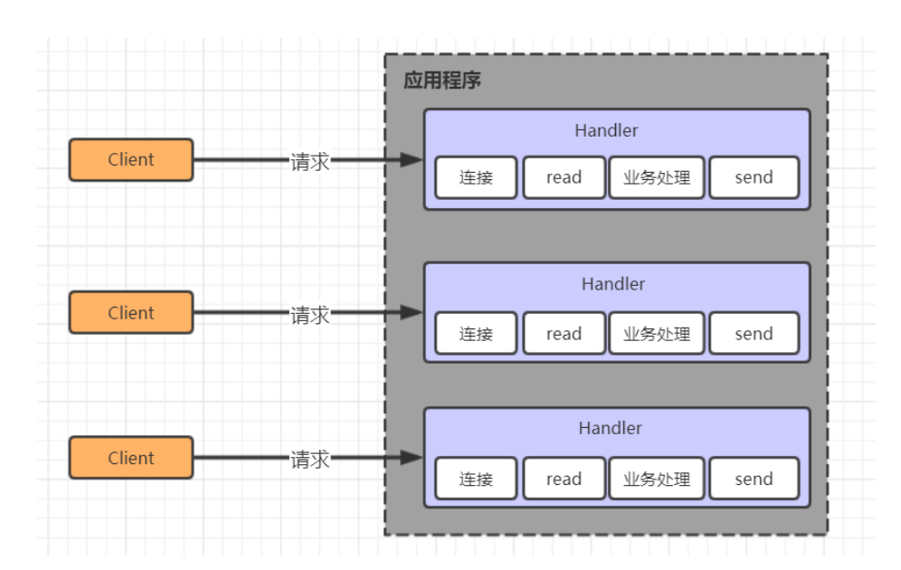
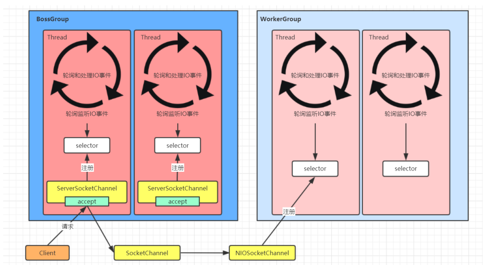

## **3.Netty 核心原理** 

### **3.1 Netty** **介绍** 

#### **3.1.1** **原生** **NIO** **存在的问题** 

1. NIO 的类库和 API 繁杂，使用麻烦：需要熟练掌握 Selector、ServerSocketChannel、SocketChannel、ByteBuffer等。 
2. 需要具备其他的额外技能：要熟悉 Java 多线程编程，因为 NIO 编程涉及到 Reactor 模式，你必须对多线程和网络编程非常熟悉，才能编写出高质量的 NIO 程序。 
3. 开发工作量和难度都非常大：例如客户端面临断连重连、网络闪断、半包读写、失败缓存、网络拥塞和异常流的处理等等。 
4. JDK NIO 的 Bug：臭名昭著的 Epoll Bug，它会导致 Selector 空轮询，最终导致 CPU 100%。直到 JDK 1.7版本该问题仍旧存在，没有被根本解决。 

> 在NIO中通过Selector的轮询当前是否有IO事件，根据JDK NIO api描述，Selector的select方法会一直阻塞，直到IO事件达到或超时，但是在Linux平台上这里有时会出现问题，在某些场景下select方法会直接返回，即使没有超时并且也没有IO事件到达，这就是著名的epoll bug，这是一个比较严重的bug，它会导致线程陷入死循环，会让CPU飙到100%，极大地影响系统的可靠性，到目前为止，JDK都没有完全解决这个问题。 

#### **3.1.2** **概述** 

​	Netty 是由 JBOSS 提供的一个 Java 开源框架。Netty 提供异步的、基于事件驱动的网络应用程序框架，用以快速开发高性能、高可靠性的网络 IO 程序。 Netty 是一个基于 NIO 的网络编程框架，使用 Netty 可以帮助你快速、简单的开发出一 个网络应用，相当于简化和流程化了 NIO 的开发过程。 作为当前最流行的 NIO 框架，Netty 在互联网领域、大数据分布式计算领域、游戏行业、 通信行业等获得了广泛的应用，知名的 Elasticsearch 、Dubbo 框架内部都采用了 Netty。 


​	从图中就能看出 Netty 的强大之处：零拷贝、可拓展事件模型；支持TCP、UDP、HTTP、WebSocket等协议；提供安全传输、压缩、大文件传输、编解码支持等等。

**具备如下优点**： 

1. 设计优雅，提供阻塞和非阻塞的Socket ；提供灵活可拓展的事件模型；提供高度可定制的线程模型。 
2. 具备更高的性能和更大的吞吐量，使用零拷贝技术最小化不必要的内存复制，减少资源的消耗。 
3. 提供安全传输特性。 
4. 支持多种主流协议；预置多种编解码功能，支持用户开发私有协议。 

### **3.2线程模型** 

#### **3.2.1 线程模型基本介绍** 

​	不同的线程模式，对程序的性能有很大影响，在学习Netty线程模式之前，首先讲解下各个线程模式， 最后看看Netty线程模型有什么优越性，目前存在的线程模型有： 

- 传统阻塞I/O服务模型 
- Reactor 模型 

根据Reactor 的数量和处理资源池线程的数量不同，有3 种典型的实现 :

1. 单Reactor 单线程 
2. 单Reactor 多线程 
3. 主从Reactor 多线程

#### **3.2.2 传统阻塞I/O 服务模型**

​	采用阻塞I/O模式获取输入的数据，每个连接都需要独立的线程完成数据的输入， 业务处理和数据返回工作。



**存在问题**:

1. 当并发数很大，就会创建大量的线程，占用很大系统资源 
2. 连接创建后，如果当前线程暂时没有数据可读，该线程会阻塞在 read 操作，造成线程资源浪费

#### **3.2.3 Reactor 模型** 

​	Reactor 模式，通过一个或多个输入同时传递给服务处理器的模式 , 服务器端程序处理传入的多个请求,并将它们同步分派到相应的处理线程， 因此 Reactor 模式也叫 Dispatcher模式。**Reactor模式使用IO复用监听事件,收到事件后，分发给某个线程(进程), 这点就是网络服务器高并发处理关键**. 

1. **单Reactor 单线程**


- Selector是可以实现应用程序通过一个阻塞对象监听多路连接请求
- Reactor 对象通过 Selector监控客户端请求事件，收到事件后通过 Dispatch 进行分发 
- 是建立连接请求事件，则由 Acceptor 通过 Accept 处理连接请求，然后创建一个 Handler 对象处理连接完成后的后续业务处理 
- Handler 会完成 Read→业务处理→Send 的完整业务流程 

**优点**:

 	模型简单，没有多线程、进程通信、竞争的问题，全部都在一个线程中完成 。

**缺点:** 

1. 性能问题: 只有一个线程，无法完全发挥多核 CPU 的性能。Handler 在处理某个连接上的业务时，整个进程无法处理其他连接事件，很容易导致性能瓶颈。 
2. 可靠性问题: 线程意外终止或者进入死循环，会导致整个系统通信模块不可用，不能接收和处理外部消息，造成节点故障 。
3. **单** **Reactor 多线程**


- Reactor 对象通过 selector 监控客户端请求事件, 收到事件后，通过 dispatch 进行分发 
- 如果建立连接请求, 则右 Acceptor 通过accept 处理连接请求 
- 如果不是连接请求，则由 reactor 分发调用连接对应的 handler 来处理 
- handler 只负责响应事件，不做具体的业务处理, 通过 read 读取数据后，会分发给后面的 worker 线程池的某个线程处理业务 
- worker 线程池会分配独立线程完成真正的业务，并将结果返回给 handler 
- handler 收到响应后，通过 send 将结果返回给 client 

**优点**:

​	 可以充分的利用多核 cpu 的处理能力 

**缺点:** 

​	多线程数据共享和访问比较复杂， reactor 处理所有的事件的监听和响应，在单线程运行， 在高并发场景容易出现性能瓶颈。

3. **主从** **Reactor 多线程**


- Reactor 主线程 MainReactor 对象通过 select 监听客户端连接事件，收到事件后，通过 Acceptor 处理客户端连接事件 
- 当 Acceptor 处理完客户端连接事件之后（与客户端建立好 Socket 连接），MainReactor 将连接分配给 SubReactor。（即：MainReactor 只负责监听客户端连接请求，和客户端建立连接之后将连接交由 SubReactor 监听后面的 IO 事件。) 
- SubReactor 将连接加入到自己的连接队列进行监听，并创建 Handler 对各种事件进行处理 
- 当连接上有新事件发生的时候，SubReactor 就会调用对应的 Handler 处理 
- Handler 通过 read 从连接上读取请求数据，将请求数据分发给 Worker 线程池进行业务处理 
- Worker 线程池会分配独立线程来完成真正的业务处理，并将处理结果返回给 Handler。 
- Handler 通过 send 向客户端发送响应数据 
- 一个 MainReactor 可以对应多个 SubReactor，即一个 MainReactor 线程可以对应多个SubReactor 线程 

**优点**:

1. MainReactor 线程与 SubReactor 线程的数据交互简单职责明确，MainReactor 线程只需要接收新连接，SubReactor 线程完成后续的业务处理 
2. MainReactor 线程与 SubReactor 线程的数据交互简单， MainReactor 线程只需要把新连接传给 SubReactor 线程，SubReactor 线程无需返回数据 
3. 多个 SubReactor 线程能够应对更高的并发请求 

**缺点**:

​	这种模式的缺点是编程复杂度较高。但是由于其优点明显，在许多项目中被广泛使用，包括 Nginx、Memcached、Netty 等。这种模式也被叫做服务器的 1+M+N 线程模式，即使用该模式开发的服务器包含一个（或多个，1 只是表示相对较少）连接建立线程+M 个 IO 线程+N 个业务处理线程。这是业界成熟的服务器程序设计模式。

#### **3.2.4 Netty 线程模型** 

Netty 的设计主要基于主从 Reactor 多线程模式，并做了一定的改进。 

**1.简单版Netty模型** 


- BossGroup 线程维护 Selector，ServerSocketChannel 注册到这个 Selector 上，只关注连接建立请求事件（主 Reactor） 
- 当接收到来自客户端的连接建立请求事件的时候，通过 ServerSocketChannel.accept 方法获得对应的 SocketChannel，并封装成 NioSocketChannel 注册到 WorkerGroup 线程中的 Selector，每个 Selector 运行在一个线程中（从 Reactor） 
- 当 WorkerGroup 线程中的 Selector 监听到自己感兴趣的 IO 事件后，就调用 Handler 进行处理 

**2.进阶版Netty模型**



- 有两组线程池：BossGroup 和 WorkerGroup，BossGroup 中的线程专门负责和客户端建立连接，WorkerGroup 中的线程专门负责处理连接上的读写 

- BossGroup 和 WorkerGroup 含有多个不断循环的执行事件处理的线程，每个线程都包含一个 Selector，用于监听注册在其上的 Channel 

- 每个 BossGroup 中的线程循环执行以下三个步骤 

  1. 轮训注册在其上的 ServerSocketChannel 的 accept 事件（OP_ACCEPT 事件） 

     2.处理 accept 事件，与客户端建立连接，生成一个 NioSocketChannel，并将其注册到 WorkerGroup 中某个线程上的 Selector 上 

     3.再去以此循环处理任务队列中的下一个事件 

- 每个 WorkerGroup 中的线程循环执行以下三个步骤

1. 轮训注册在其上的 NioSocketChannel 的 read/write 事件（OP_READ/OP_WRITE 事件） 
2. 在对应的 NioSocketChannel 上处理 read/write 事件 
3. 再去以此循环处理任务队列中的下一个事件 


**3. 详细版Netty模型**


- Netty 抽象出两组线程池：BossGroup 和 WorkerGroup，也可以叫做 BossNioEventLoopGroup 和 WorkerNioEventLoopGroup。每个线程池中都有 NioEventLoop 线程。BossGroup 中的线程专门负责和客户端建立连接，WorkerGroup 中的线程专门负责处理连接上的读写。BossGroup 和 WorkerGroup 的类型都是 NioEventLoopGroup 
- NioEventLoopGroup 相当于一个事件循环组，这个组中含有多个事件循环，每个事件循环就是一个 NioEventLoop 
- NioEventLoop 表示一个不断循环的执行事件处理的线程，每个 NioEventLoop 都包含一个 Selector，用于监听注册在其上的 Socket 网络连接（Channel） 
- NioEventLoopGroup 可以含有多个线程，即可以含有多个 NioEventLoop 
- 每个 BossNioEventLoop 中循环执行以下三个步骤 ：

1. select：轮训注册在其上的 ServerSocketChannel 的 accept 事件（OP_ACCEPT 事件） 
2. processSelectedKeys：处理 accept 事件，与客户端建立连接，生成一个 
3. NioSocketChannel，并将其注册到某个 WorkerNioEventLoop 上的 Selector 上 
4. runAllTasks：再去以此循环处理任务队列中的其他任务 

- 每个 WorkerNioEventLoop 中循环执行以下三个步骤

1. select：轮训注册在其上的 NioSocketChannel 的 read/write 事件 （OP_READ/OP_WRITE 事件） 
2. processSelectedKeys：在对应的 NioSocketChannel 上处理 read/write 事件 
3. runAllTasks：再去以此循环处理任务队列中的其他任务 

在以上两个**processSelectedKeys**步骤中，会使用 Pipeline（管道），Pipeline 中引用了 Channel，即通过 Pipeline 可以获取到对应的 Channel，Pipeline 中维护了很多的处理器 （拦截处理器、过滤处理器、自定义处理器等）。

### **3.3 核心 API 介绍** 

#### **3.3.1 ChannelHandler 及其实现类** 

​	ChannelHandler 接口定义了许多事件处理的方法，我们可以通过重写这些方法去实现具 体的业务逻辑。API 关系如下图所示：


​	Netty开发中需要自定义一个 Handler 类去实现 ChannelHandle接口或其子接口或其实现类，然后通过重写相应方法实现业务逻辑，我们接下来看看一般都需要重写哪些方法 

- public void channelActive(ChannelHandlerContext ctx)，通道就绪事件 
- public void channelRead(ChannelHandlerContext ctx, Object msg)，通道读取数据事件 
- public void channelReadComplete(ChannelHandlerContext ctx) ，数据读取完毕事件 
- public void exceptionCaught(ChannelHandlerContext ctx, Throwable cause)，通道发生异常事件 

#### **3.3.2 ChannelPipeline** 

​	ChannelPipeline 是一个 Handler 的集合，它负责处理和拦截 inbound 或者 outbound 的事件和操作，相当于一个贯穿 Netty 的责任链. 


​	如果客户端和服务器的Handler是一样的，消息从客户端到服务端或者反过来，每个Inbound类型或Outbound类型的Handler只会经过一次，混合类型的Handler（实现了Inbound和Outbound的 Handler）会经过两次。准确的说ChannelPipeline中是一个ChannelHandlerContext,每个上下文对象中有ChannelHandler. **InboundHandler是按照Pipleline的加载顺序的顺序执行, OutboundHandler是按照Pipeline的加载顺序，逆序执行。**

#### **3.3.3 ChannelHandlerContext** 

​	这 是 事 件 处 理 器 上 下 文 对 象 ， Pipeline 链 中 的 实 际 处 理 节 点 。 每 个 处 理 节 点 ChannelHandlerContext 中 包 含 一 个 具 体 的 事 件 处 理 器 ChannelHandler ,同时ChannelHandlerContext 中也绑定了对应的 ChannelPipeline和 Channel 的信息，方便对 ChannelHandler 进行调用。常用方法如下所示： 

- ChannelFuture close()，关闭通道 
- ChannelOutboundInvoker flush()，刷新 
- ChannelFuture writeAndFlush(Object msg) ， 将 数 据 写 到 ChannelPipeline 中 当 前 
- ChannelHandler 的下一个 ChannelHandler 开始处理（出站） 

#### **3.3.4 ChannelOption** 

​	Netty 在创建 Channel 实例后,一般都需要设置 ChannelOption 参数。ChannelOption 是 Socket 的标 

准参数，而非 Netty 独创的。常用的参数配置有： 

- ChannelOption.SO_BACKLOG 

  对应 TCP/IP 协议 listen 函数中的 backlog 参数，用来初始化服务器可连接队列大小。服务端处理客户端连接请求是顺序处理的，所以同一时间只能处理一个客户端连接。多个客户 端来的时候，服务端将不能处理的客户端连接请求放在队列中等待处理，backlog 参数指定 了队列的大小。 

- ChannelOption.SO_KEEPALIVE ，一直保持连接活动状态。该参数用于设置TCP连接，当设置该选项以后，连接会测试链接的状态，这个选项用于可能长时间没有数据交流的连接。当设置该选项以后，如果在两小时内没有数据的通信时，TCP会自动发送一个活动探测数据报文。 

#### **3.3.5 ChannelFuture** 

​	表示 Channel 中异步 I/O 操作的结果，在 Netty 中所有的 I/O 操作都是异步的，I/O 的调用会直接返回，调用者并不能立刻获得结果，但是可以通过 ChannelFuture 来获取 I/O 操作 的处理状态。常用方法如下所示： 

- Channel channel()，返回当前正在进行 IO 操作的通道 
- ChannelFuture sync()，等待异步操作执行完毕,将异步改为同步 

#### **3.3.6 EventLoopGroup 和实现类NioEventLoopGroup** 

​	EventLoopGroup 是一组 EventLoop 的抽象，Netty 为了更好的利用多核 CPU 资源，一般 会有多个 EventLoop 同时工作，每个 EventLoop 维护着一个 Selector 实例。 EventLoopGroup 提供 next 接口，可以从组里面按照一定规则获取其中一个 EventLoop 来处理任务。在 Netty 服务器端编程中，我们一般都需要提供两个 EventLoopGroup，例如： 

BossEventLoopGroup 和 WorkerEventLoopGroup。 通常一个服务端口即一个 ServerSocketChannel 对应一个Selector 和一个EventLoop线程。 BossEventLoop 负责接收客户端的连接并将SocketChannel 交给WorkerEventLoopGroup 来进 行 IO 处理，如下图所示：


BossEventLoopGroup 通常是一个单线程的 EventLoop，EventLoop 维护着一个注册了 ServerSocketChannel 的 Selector 实例，BossEventLoop 不断轮询 Selector 将连接事件分离出来， 通常是 OP_ACCEPT 事件，然后将接收到的 SocketChannel 交给 WorkerEventLoopGroup，WorkerEventLoopGroup 会由 next 选择其中一个 EventLoopGroup 来将这个 SocketChannel 注册到其维护的 Selector 并对其后续的 IO 事件进行处理。 

一般情况下我们都是用实现类NioEventLoopGroup. 

常用方法如下所示： 

- public NioEventLoopGroup()，构造方法,创建线程组 
- public Future<?> shutdownGracefully()，断开连接，关闭线程 

#### **3.3.7 ServerBootstrap和Bootstrap** 

​	ServerBootstrap 是 Netty 中的服务器端启动助手，通过它可以完成服务器端的各种配置； 

Bootstrap 是 Netty 中的客户端启动助手，通过它可以完成客户端的各种配置。常用方法如下 所示： 

- public ServerBootstrap group(EventLoopGroup parentGroup, EventLoopGroup childGroup)， 该方法用于服务器端，用来设置两个 EventLoop 
- public B group(EventLoopGroup group) ，该方法用于客户端，用来设置一个 EventLoop 
- public B channel(Class<? extends C> channelClass)，该方法用来设置一个服务器端的通道 实现 
- public B option(ChannelOption option, T value)，用来给 ServerChannel 添加配置 
- public ServerBootstrap childOption(ChannelOption childOption, T value)，用来给接收到的通道添加配置 
- public ServerBootstrap childHandler(ChannelHandler childHandler)，该方法用来设置业务处理类（自定义的 handler) 
- public ChannelFuture bind(int inetPort) ，该方法用于服务器端，用来设置占用的端口号 
- public ChannelFuture connect(String inetHost, int inetPort) ，该方法用于客户端，用来连接服务器端 

#### **3.3.8 Unpooled 类** 

​	这是 Netty 提供的一个专门用来操作缓冲区的工具类，常用方法如下所示： 

- public static ByteBuf copiedBuffer(CharSequence string, Charset charset)，通过给定的数据和字符编码返回一个 ByteBuf 对象（类似于 NIO 中的 ByteBuffer 对象）

------

### 3.4 Netty 入门案例

​	Netty 是由 JBOSS 提供的一个 Java 开源框架,所以在使用得时候首先得导入Netty的maven坐标。

```xml
<dependency>
 <groupId>io.netty</groupId>
 <artifactId>netty-all</artifactId>
 <version>4.1.42.Final</version>
</dependency>
```

#### **3.4.1 Netty 服务端编写** 

**服务端实现步骤**: 

1. 创建bossGroup线程组: 处理网络事件--连接事件 
2. 创建workerGroup线程组: 处理网络事件--读写事件 
3. 创建服务端启动助手 
4. 设置bossGroup线程组和workerGroup线程组 
5. 设置服务端通道实现为NIO 
6. 参数设置 
7. 创建一个通道初始化对象 
8. 向pipeline中添加自定义业务处理handler 
9. 启动服务端并绑定端口,同时将异步改为同步 
10. 关闭通道和关闭连接池

**代码实现:**

```java
package com.lagou.demo;
import io.netty.bootstrap.ServerBootstrap;
import io.netty.channel.ChannelFuture;
import io.netty.channel.ChannelInitializer;
import io.netty.channel.ChannelOption;
import io.netty.channel.EventLoopGroup;
import io.netty.channel.nio.NioEventLoopGroup;
import io.netty.channel.socket.SocketChannel;
import io.netty.channel.socket.nio.NioServerSocketChannel;
/**
 * Netty服务端
 */
public class NettyServer {
    public static void main(String[] args) throws InterruptedException {
        //1.创建bossGroup线程组: 处理网络事件--连接事件 线程数默认为: 2 * 处理器线程数
        EventLoopGroup bossGroup = new NioEventLoopGroup(1);
        //2.创建workerGroup线程组: 处理网络事件--读写事件 2 * 处理器线程数
        EventLoopGroup workerGroup = new NioEventLoopGroup();
        //3.创建服务端启动助手
        ServerBootstrap bootstrap = new ServerBootstrap();
        //4.设置线程组
        bootstrap.group(bossGroup, workerGroup)
                .channel(NioServerSocketChannel.class)//5.设置服务端通道实现;
                .option(ChannelOption.SO_BACKLOG, 128)//6.参数设置-设置线程队列中等待连接个数
                .childOption(ChannelOption.SO_KEEPALIVE, Boolean.TRUE)//7.参数设置-设置活跃状态,child是设置workerGroup
                .childHandler(new ChannelInitializer<SocketChannel>() {//8.创建一个通道初始化对象
                    @Override
                    protected void initChannel(SocketChannel ch) throws
                            Exception {
                        //9.向pipeline中添加自定义业务处理handler
                        ch.pipeline().addLast(new NettyServerHandle());
                    }
                });
        //10.启动服务端并绑定端口,同时将异步改为同步
        ChannelFuture future = bootstrap.bind(9999).sync();
        System.out.println("服务器启动成功....");
        //11.关闭通道(并不是真正意义上的关闭,而是监听通道关闭状态)和关闭连接池
        future.channel().closeFuture().sync();
        bossGroup.shutdownGracefully();
        workerGroup.shutdownGracefully();
    }
}
```

**自定义服务端handle**

```java
package com.lagou.demo;
import io.netty.buffer.ByteBuf;
import io.netty.buffer.Unpooled;
import io.netty.channel.ChannelHandlerContext;
import io.netty.channel.ChannelInboundHandler;
import io.netty.util.CharsetUtil;

public class NettyServerHandle implements ChannelInboundHandler {
    /**
     * 通道读取事件
     * @param ctx 通道上下文对象
     * @param msg 消息
     * @throws Exception
     */
    @Override
    public void channelRead(ChannelHandlerContext ctx, Object msg) throws Exception {
        ByteBuf byteBuf = (ByteBuf) msg;
        System.out.println("客户端发来消息:" + byteBuf.toString(CharsetUtil.UTF_8));
    }
    
    /**
     * 读取完毕事件
     * @param ctx
     * @throws Exception
     */
    @Override
    public void channelReadComplete(ChannelHandlerContext ctx) throws Exception {
        ctx.writeAndFlush(Unpooled.copiedBuffer("你好,我是Netty服务端.", CharsetUtil.UTF_8));
    }
    
    /**
     * 异常发生事件
     * @param ctx
     * @param cause
     * @throws Exception
     */
    @Override
    public void exceptionCaught(ChannelHandlerContext ctx, Throwable cause) throws Exception {
        cause.printStackTrace();
        ctx.close();
    }
    
    @Override
    public void channelRegistered(ChannelHandlerContext ctx) throws Exception {
    }
    
    @Override
    public void channelUnregistered(ChannelHandlerContext ctx) throws Exception {
    }
    
    /**
     * 通道就绪事件
     * @param ctx
     * @throws Exception
     */
    @Override
    public void channelActive(ChannelHandlerContext ctx) throws Exception {
    }
    
    @Override
    public void channelInactive(ChannelHandlerContext ctx) throws Exception {
    }
    
    @Override
    public void userEventTriggered(ChannelHandlerContext ctx, Object evt) throws Exception {
    }
    
    @Override
    public void channelWritabilityChanged(ChannelHandlerContext ctx) throws Exception {
    }
    
    @Override
    public void handlerAdded(ChannelHandlerContext ctx) throws Exception {
    }
    
    @Override
    public void handlerRemoved(ChannelHandlerContext ctx) throws Exception {
    }
    
}
```

#### **3.4.2 Netty 客户端编写** 

**客户端实现步骤**: 

1. 创建线程组 
2. 创建客户端启动助手 
3. 设置线程组 
4. 设置客户端通道实现为NIO 
5. 创建一个通道初始化对象 
6. 向pipeline中添加自定义业务处理handler 
7. 启动客户端,等待连接服务端,同时将异步改为同步 
8. 关闭通道和关闭连接池 

**代码实现:**

```java
package com.lagou.demo;
import io.netty.bootstrap.Bootstrap;
import io.netty.channel.ChannelFuture;
import io.netty.channel.ChannelInitializer;
import io.netty.channel.EventLoopGroup;
import io.netty.channel.nio.NioEventLoopGroup;
import io.netty.channel.socket.SocketChannel;
import io.netty.channel.socket.nio.NioSocketChannel;

/**
 * Netty客户端
 */
public class NettyClient {
    public static void main(String[] args) throws InterruptedException {
        //1. 创建线程组
        EventLoopGroup group = new NioEventLoopGroup();
        //2. 创建客户端启动助手
        Bootstrap bootstrap = new Bootstrap();
        //3. 设置线程组
        bootstrap.group(group)
                .channel(NioSocketChannel.class)//4. 设置服务端通道实现为NIO
                .handler(new ChannelInitializer<SocketChannel>() { //5. 创建一个通道初始化对象
                    @Override
                    protected void initChannel(SocketChannel ch) throws Exception {
                        //6. 向pipeline中添加自定义业务处理handler
                        ch.pipeline().addLast(new NettyClientHandle());
                    }});
        //7. 启动客户端, 等待连接服务端, 同时将异步改为同步
        ChannelFuture future = bootstrap.connect("127.0.0.1", 9999).sync();
        //8. 关闭通道和关闭连接池
        future.channel().closeFuture().sync();
        group.shutdownGracefully();
    }
}
```

**自定义客户端handle**

```java
package com.lagou.demo;
import io.netty.buffer.ByteBuf;
import io.netty.buffer.Unpooled;
import io.netty.channel.ChannelHandlerContext;
import io.netty.channel.ChannelInboundHandler;
import io.netty.util.CharsetUtil;

/**
 * 客户端处理类
 */
public class NettyClientHandle implements ChannelInboundHandler {
    /**
     * 通道就绪事件
     * @param ctx
     * @throws Exception
     */
    @Override
    public void channelActive(ChannelHandlerContext ctx) throws Exception {
        ctx.writeAndFlush(Unpooled.copiedBuffer("你好呀,我是Netty客户端", CharsetUtil.UTF_8));
    }
    
    @Override
    public void channelRead(ChannelHandlerContext ctx, Object msg) throws Exception {
        ByteBuf byteBuf = (ByteBuf) msg;
        System.out.println("服务端发来消息:" + byteBuf.toString(CharsetUtil.UTF_8));
    }
    
    @Override
    public void exceptionCaught(ChannelHandlerContext ctx, Throwable cause) throws Exception {
    }
    
    @Override
    public void channelRegistered(ChannelHandlerContext ctx) throws Exception {
    }
    
    @Override
    public void channelUnregistered(ChannelHandlerContext ctx) throws Exception {
    }
    
    @Override
    public void channelInactive(ChannelHandlerContext ctx) throws Exception {
    }
    
    @Override
    public void channelReadComplete(ChannelHandlerContext ctx) throws Exception {
    }
    
    @Override
    public void userEventTriggered(ChannelHandlerContext ctx, Object evt) throws Exception {
    }
    
    @Override
    public void channelWritabilityChanged(ChannelHandlerContext ctx) throws Exception {
    }
    
    @Override
    public void handlerAdded(ChannelHandlerContext ctx) throws Exception {
    }
    
    @Override
    public void handlerRemoved(ChannelHandlerContext ctx) throws Exception {
    }
}
```

### **3.5 Netty 异步模型** 

#### **3.5.1** **基本介绍** 

​	异步的概念和同步相对。当一个异步过程调用发出后，调用者不能立刻得到结果。实际处理这个调用的组件在完成后，通过状态、通知和回调来通知调用者。 


​	Netty 中的 I/O 操作是异步的，包括 Bind、Write、Connect 等操作会简单的返回一个 ChannelFuture。调用者并不能立刻获得结果，而是通过 Future-Listener 机制，用户可以方便的主动获取或者通过通知机制获得IO 操作结果. Netty 的异步模型是建立在 future 和 callback 的之上的。 

callback 就是回调。重点说 Future，它的核心思想是：假设一个方法 fun，计算过程可能非常耗时，等待 fun 返回显然不合适。那么可以在调用 fun 的时候，立马返回一个 Future，后续可以通过 Future 去监控方法 fun 的处理过程(即 ： Future-Listener 机制) 

#### **3.5.2 Future 和 Future-Listener** 

1. Future 

​         表示异步的执行结果, 可以通过它提供的方法来检测执行是否完成，ChannelFuture 是他的一个子接口. ChannelFuture 是一个接口 ,可以添加监听器，当监听的事件发生时，就会通知到监听器当 Future 对象刚刚创建时，处于非完成状态，调用者可以通过返回的 ChannelFuture 来获取操作执行的状态， 注册监听函数来执行完成后的操作。 

**常用方法有:** 

sync 方法, 阻塞等待程序结果反回 

isDone 方法来判断当前操作是否完成； 

isSuccess 方法来判断已完成的当前操作是否成功； 

getCause 方法来获取已完成的当前操作失败的原因； 

isCancelled 方法来判断已完成的当前操作是否被取消；

addListener 方法来注册监听器，当操作已完成(isDone 方法返回完成)，将会通知指定的监听 

器；如果Future 对象已完成，则通知指定的监听器 

2. Future-Listener 机制 

   给Future添加监听器,监听操作结果 

代码实现:

```java
ChannelFuture future = bootstrap.bind(9999);
future.addListener(new ChannelFutureListener() {
@Override
public void operationComplete(ChannelFuture future) throws Exception {
          if (future.isSuccess()) {
            System.out.println("端口绑定成功!");
        } else {
            System.out.println("端口绑定失败!");
        }
     }
});
```

```java
ChannelFuture channelFuture = ctx.writeAndFlush(Unpooled.copiedBuffer("你好呀,我是Netty客户端", CharsetUtil.UTF_8));
channelFuture.addListener(new ChannelFutureListener() {
@Override
public void operationComplete(ChannelFuture future) throws Exception {
        if (future.isSuccess()) {
            System.out.println("数据发送成功.");
        } else {
            System.out.println("数据发送失败.");
        }
     }
});
```

