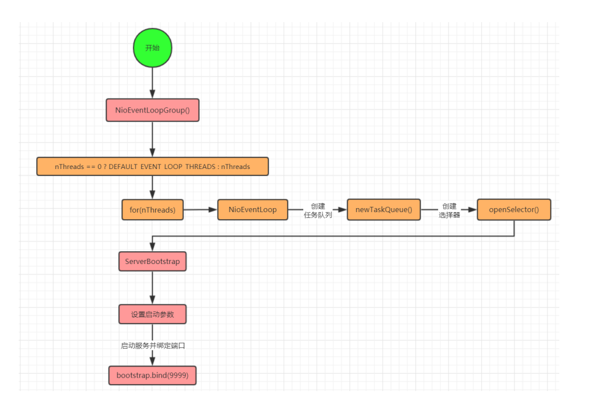
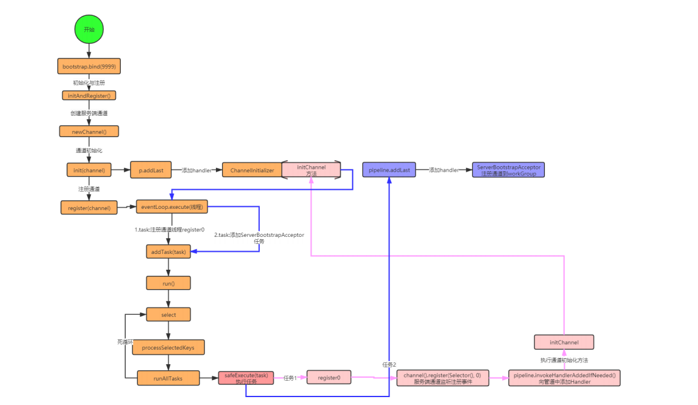

## 5.Netty 核心源码剖析

### **5.1 EventLoopGroup 事件循环组（线程组）源码** 

​	EventLoopGroup 是一组 EventLoop 的抽象，Netty 为了更好的利用多核 CPU 资源，一般会有多个 EventLoop 同时工作，每个 EventLoop 维护着一个 Selector 实例。 

#### **5.1.1** **线程组源码流程分析**



#### **5.1.2** **线程组源码主要源码跟踪** 

1. NioEventLoopGroup线程组的创建 

```
static {
//默认线程数量为处理器数*2
        DEFAULT_EVENT_LOOP_THREADS = Math.max(1, SystemPropertyUtil.getInt(
        "io.netty.eventLoopThreads", NettyRuntime.availableProcessors()* 2));
        if (logger.isDebugEnabled()) {
        logger.debug("-Dio.netty.eventLoopThreads: {}",DEFAULT_EVENT_LOOP_THREADS);
    }
}

/**
 * @see MultithreadEventExecutorGroup#MultithreadEventExecutorGroup(int,
        Executor, Object...)
 */
protected MultithreadEventLoopGroup(int nThreads, Executor executor,Object... args) {
        super(nThreads == 0 ? DEFAULT_EVENT_LOOP_THREADS : nThreads, executor,args);
}
```

2. NioEventLoop的创建

```java
protected MultithreadEventExecutorGroup(
        int nThreads, Executor executor,EventExecutorChooserFactory chooserFactory, Object... args) {
                if (nThreads <= 0) {
                    throw new IllegalArgumentException(String.format("nThreads: %d (expected: > 0)", nThreads));
                }
                if (executor == null) {
                    executor = new ThreadPerTaskExecutor(newDefaultThreadFactory());
                }
            //根据线程数量创建
            children = new EventExecutor[nThreads];
            for (int i = 0; i < nThreads; i ++) {
                    boolean success = false;
                    try {
                        //循环创建线程NioEventLoop
                        children[i] = newChild(executor, args);
                        success = true;
                        } catch (Exception e) {
                        // TODO: Think about if this is a good exception type
                      throw new IllegalStateException("failed to create a child eventloop", e);
                        } finally {
                       ...
                      }
        }
              ......
}
```

newChild方法

```java
@Override
protected EventLoop newChild(Executor executor, Object... args) throws Exception {
        EventLoopTaskQueueFactory queueFactory = args.length == 4 ? (EventLoopTaskQueueFactory) args[3] : null;
        //创建NioEventLoop
        return new NioEventLoop(this, executor, (SelectorProvider) args[0],
        ((SelectStrategyFactory) args[1]).newSelectStrategy(),
        (RejectedExecutionHandler) args[2], queueFactory);
}
```

NioEventLoop

```java
NioEventLoop(NioEventLoopGroup parent, Executor executor, SelectorProvider
        selectorProvider,
        SelectStrategy strategy, RejectedExecutionHandler
        rejectedExecutionHandler,
        EventLoopTaskQueueFactory queueFactory) {
        super(parent, executor, false, newTaskQueue(queueFactory),newTaskQueue(queueFactory),rejectedExecutionHandler);
        if (selectorProvider == null) {
                throw new NullPointerException("selectorProvider");
        }
        if (strategy == null) {
            throw new NullPointerException("selectStrategy");
        }
        provider = selectorProvider;
        //创建选择器
        final SelectorTuple selectorTuple = openSelector();
        selector = selectorTuple.selector;
        unwrappedSelector = selectorTuple.unwrappedSelector;
        selectStrategy = strategy;
}
```

### **5.2 Netty 启动源码** 

#### **5.2.1 启动流程分析** 



**5.2.1** **主要源码跟踪** 

1. initAndRegister方法 

```java
final ChannelFuture initAndRegister() {
        Channel channel = null;
        try {
            //创建通道
            channel = channelFactory.newChannel();
            //通道初始化
            init(channel);
        } catch (Throwable t) {
            if (channel != null) {
            // channel can be null if newChannel crashed (eg
            SocketException("too many open files"))
            channel.unsafe().closeForcibly();
            // as the Channel is not registered yet we need to force the usage of the GlobalEventExecutor
        return new DefaultChannelPromise(channel,GlobalEventExecutor.INSTANCE).setFailure(t);
        }
        // as the Channel is not registered yet we need to force the usage of the GlobalEventExecutor
        return new DefaultChannelPromise(new FailedChannel(),
        GlobalEventExecutor.INSTANCE).setFailure(t);
        }
        //注册通道
        ChannelFuture regFuture = config().group().register(channel);
        if (regFuture.cause() != null) {
                if (channel.isRegistered()) {
                    channel.close();
                } else {
                    channel.unsafe().closeForcibly();
                }
        }
        return regFuture;
}
```

2. init方法

```java
    void init(Channel channel) {
        setChannelOptions(channel, this.newOptionsArray(), logger);
        setAttributes(channel, (Entry[])this.attrs0().entrySet().toArray(EMPTY_ATTRIBUTE_ARRAY));
        //得到通道pipeline
        ChannelPipeline p = channel.pipeline();
        //赋值workGroup与服务端handler
        final EventLoopGroup currentChildGroup = this.childGroup;
        final ChannelHandler currentChildHandler = this.childHandler;
        final Entry[] currentChildOptions;
        synchronized(this.childOptions) {
            currentChildOptions = (Entry[])this.childOptions.entrySet().toArray(EMPTY_OPTION_ARRAY);
        }

        final Entry<AttributeKey<?>, Object>[] currentChildAttrs = (Entry[])this.childAttrs.entrySet().toArray(EMPTY_ATTRIBUTE_ARRAY);
       //添加通道初始化handler
        p.addLast(new ChannelHandler[]{new ChannelInitializer<Channel>() {
            public void initChannel(final Channel ch) {
                final ChannelPipeline pipeline = ch.pipeline();
                ChannelHandler handler = ServerBootstrap.this.config.handler();
                if (handler != null) {
                    pipeline.addLast(new ChannelHandler[]{handler});
                }

                ch.eventLoop().execute(new Runnable() {
                    public void run() {
                        //在initChannel方法中添加ServerBootstrapAcceptor的handler
                        pipeline.addLast(new ChannelHandler[]{new ServerBootstrap.ServerBootstrapAcceptor(ch, currentChildGroup, currentChildHandler, currentChildOptions, currentChildAttrs)});
                    }
                });
            }
        }});
    }
```

3. register方法

```java
public final void register(EventLoop eventLoop, final ChannelPromise promise) {
        if (eventLoop == null) {
            throw new NullPointerException("eventLoop");
         }
         if (isRegistered()) {
             promise.setFailure(new IllegalStateException("registered to an event loop already"));
            return;
        }
        if (!isCompatible(eventLoop)) {
            promise.setFailure(new IllegalStateException("incompatible event loop type: " +
            eventLoop.getClass().getName()));
            return;
        }
        AbstractChannel.this.eventLoop = eventLoop;
        if (eventLoop.inEventLoop()) {
        register0(promise);
        } else {
            try {
            //执行NioEventLoop
            eventLoop.execute(new Runnable() {
                     @Override
                    public void run() {
                    //注册通道
                     register0(promise);
                    }
            });
         } catch (Throwable t) {
            logger.warn("Force-closing a channel whose registration task was not accepted by an event loop: {}",AbstractChannel.this, t);
            closeForcibly();
            closeFuture.setClosed();
            safeSetFailure(promise, t);
        }
    }
}
```

4. execute方法

```java
public void execute(Runnable task) {
            if (task == null) {
                    throw new NullPointerException("task");
            }
            boolean inEventLoop = inEventLoop();
            //添加到任务队列
            addTask(task);
            if (!inEventLoop) {
                    //启动线程
                    startThread();
                    if (isShutdown()) {
                            boolean reject = false;
                            try {
                            if (removeTask(task)) {
                                    reject = true;
                                  }
                            } catch (UnsupportedOperationException e) {
                        // The task queue does not support removal so the best thing we can do is to just move on and
                        // hope we will be able to pick-up the task before its completely terminated.
                        // In worst case we will log on termination.
                            }
                    if (reject) {
                        reject();
                    }
                }
            }
if (!addTaskWakesUp && wakesUpForTask(task)) {
            wakeup(inEventLoop);
    }
}
```

5. startThread-->run方法

```java
protected void run() {
            for (;;) {
                try {
                    try {
                        switch (selectStrategy.calculateStrategy(selectNowSupplier, hasTasks())) {
                        case SelectStrategy.CONTINUE:
                            continue;
    
                        case SelectStrategy.BUSY_WAIT:
                            // fall-through to SELECT since the busy-wait is not supported with NIO
    
                        case SelectStrategy.SELECT:
                            select(wakenUp.getAndSet(false));
    
                            // 'wakenUp.compareAndSet(false, true)' is always evaluated
                            // before calling 'selector.wakeup()' to reduce the wake-up
                            // overhead. (Selector.wakeup() is an expensive operation.)
                            //
                            // However, there is a race condition in this approach.
                            // The race condition is triggered when 'wakenUp' is set to
                            // true too early.
                            //
                            // 'wakenUp' is set to true too early if:
                            // 1) Selector is waken up between 'wakenUp.set(false)' and
                            //    'selector.select(...)'. (BAD)
                            // 2) Selector is waken up between 'selector.select(...)' and
                            //    'if (wakenUp.get()) { ... }'. (OK)
                            //
                            // In the first case, 'wakenUp' is set to true and the
                            // following 'selector.select(...)' will wake up immediately.
                            // Until 'wakenUp' is set to false again in the next round,
                            // 'wakenUp.compareAndSet(false, true)' will fail, and therefore
                            // any attempt to wake up the Selector will fail, too, causing
                            // the following 'selector.select(...)' call to block
                            // unnecessarily.
                            //
                            // To fix this problem, we wake up the selector again if wakenUp
                            // is true immediately after selector.select(...).
                            // It is inefficient in that it wakes up the selector for both
                            // the first case (BAD - wake-up required) and the second case
                            // (OK - no wake-up required).
    
                            if (wakenUp.get()) {
                                selector.wakeup();
                            }
                            // fall through
                        default:
                        }
                    } catch (IOException e) {
                        // If we receive an IOException here its because the Selector is messed up. Let's rebuild
                        // the selector and retry. https://github.com/netty/netty/issues/8566
                        rebuildSelector0();
                        handleLoopException(e);
                        continue;
                    }
    
                    cancelledKeys = 0;
                    needsToSelectAgain = false;
                    final int ioRatio = this.ioRatio;
                    if (ioRatio == 100) {
                        try {
                            processSelectedKeys();
                        } finally {
                            // Ensure we always run tasks.
                            runAllTasks();
                        }
                    } else {
                        final long ioStartTime = System.nanoTime();
                        try {
                            processSelectedKeys();
                        } finally {
                            // Ensure we always run tasks.
                            final long ioTime = System.nanoTime() - ioStartTime;
                            runAllTasks(ioTime * (100 - ioRatio) / ioRatio);
                        }
                    }
                } catch (Throwable t) {
                    handleLoopException(t);
                }
                // Always handle shutdown even if the loop processing threw an exception.
                try {
                    if (isShuttingDown()) {
                        closeAll();
                        if (confirmShutdown()) {
                            return;
                        }
                    }
                } catch (Throwable t) {
                    handleLoopException(t);
                }
            }
        }
```

  6.runAllTasks方法

```java
protected boolean runAllTasks(long timeoutNanos) {
	fetchFromScheduledTaskQueue();
	//轮询任务
	Runnable task = pollTask();
	if (task == null) {
		afterRunningAllTasks();
		return false;
		}
	final long deadline = ScheduledFutureTask.nanoTime() + timeoutNanos;
	long runTasks = 0;
	long lastExecutionTime;
	for (;;) {
	//执行任务
	safeExecute(task);  
    runTasks ++;
	// Check timeout every 64 tasks because nanoTime() is relatively expensive.
	// XXX: Hard-coded value - will make it configurable if it is really a problem.
	if ((runTasks & 0x3F) == 0) {
		lastExecutionTime = ScheduledFutureTask.nanoTime();
		if (lastExecutionTime >= deadline) {
			break;
			}
		}
		task = pollTask();
		if (task == null) {
			lastExecutionTime = ScheduledFutureTask.nanoTime();
			break;
			}
		}
		afterRunningAllTasks();
		this.lastExecutionTime = lastExecutionTime;
	return true;
}
```

   7.register0方法

```
// io.netty.channel.AbstractChannel.AbstractUnsafe#register0
        private void register0(ChannelPromise promise) {
            try {
                // check if the channel is still open as it could be closed in the mean time when the register
                // call was outside of the eventLoop
                if (!promise.setUncancellable() || !ensureOpen(promise)) {
                    return;
                }
                boolean firstRegistration = neverRegistered;
				
				// 这源码套娃一直可以的,不深入了，东西并不多
				// io.netty.channel.nio.AbstractNioChannel#doRegister
				// selectionKey = javaChannel().register(eventLoop().unwrappedSelector(), 0, this);
				// 这里register的参数0表示不监听任何事件
				// 将入参的channel 注册到 eventLoop的selector上
                doRegister();
                neverRegistered = false;
                registered = true;

				// 刚发现，下面俩行的注释可以的，确实是重点
				// 该方法将回调我们 用于插入pipeline的自定义handler 的方法
				// 我有个想法:要不我们致敬一下这个注释——一路快进到 handlerAdded()
				// step into ！！！
                // Ensure we call handlerAdded(...) before we actually notify the promise. This is needed as the
                // user may already fire events through the pipeline in the ChannelFutureListener.
                pipeline.invokeHandlerAddedIfNeeded();

				// promise.trySuccess(),修改注册事件状态
                safeSetSuccess(promise);

				// 这里才真正的触发注册事件完成的回调
				// 之前完成了注册+pipeline组装，就为了这一刻好吧
                pipeline.fireChannelRegistered();
                // Only fire a channelActive if the channel has never been registered. This prevents firing
                // multiple channel actives if the channel is deregistered and re-registered.
                if (isActive()) {
                    if (firstRegistration) {
                        pipeline.fireChannelActive();
                    } else if (config().isAutoRead()) {
                        // This channel was registered before and autoRead() is set. This means we need to begin read
                        // again so that we process inbound data.
                        //
                        // See https://github.com/netty/netty/issues/4805
                        beginRead();
                    }
                }
            } catch (Throwable t) {
                // Close the channel directly to avoid FD leak.
                closeForcibly();
                closeFuture.setClosed();
                safeSetFailure(promise, t);
            }
        }

```

doRegister()

```java
protected void doRegister() throws Exception {
        boolean selected = false;
        for (;;) {
                try {
                //将channel注册到Selector上
                selectionKey = javaChannel().register(eventLoop().unwrappedSelector(), 0, this);
                return;
                } catch (CancelledKeyException e) {
                    if (!selected) {
                        // Force the Selector to select now as the "canceled" SelectionKey may still be
                        // cached and not removed because no Select.select(..) operation was called yet.
                        eventLoop().selectNow();
                        selected = true;
                    } else {
                    // We forced a select operation on the selector before but the SelectionKey is still cached
                    // for whatever reason. JDK bug ?
                    throw e;
                    }
                }
        }
}
```

invokeHandlerAddedIfNeeded-->initChannel方法

```java
p.addLast(new ChannelInitializer<Channel>() {
            @Override
            public void initChannel(final Channel ch) {
            final ChannelPipeline pipeline = ch.pipeline();
            ChannelHandler handler = config.handler();
            if (handler != null) {
                pipeline.addLast(handler);
             }
        ch.eventLoop().execute(new Runnable() {
        @Override
         public void run() {
        //在initChannel方法中添加ServerBootstrapAcceptor的handler
             
                pipeline.addLast(new ServerBootstrapAcceptor(
                    ch, currentChildGroup, currentChildHandler,currentChildOptions, currentChildAttrs));
            }
        });
    }
});
```

### **5.3 BossGroup/WorkGroup/消息入站源码** 

​	BossGroup主要负责监听. workGroup负责消息处理. 主要看下BossGroup如何将通道交给workGroup的,和如何处理消息读取的.即入站 

#### **5.3.1 BossGroup/WorkGroup 源码分析** 


#### **5.3.2** **主要流程源码** 

1. processSelectedKeysOptimized

```java
private void processSelectedKeysOptimized() {
    for (int i = 0; i < selectedKeys.size; ++i) {
        final SelectionKey k = selectedKeys.keys[i];
        // null out entry in the array to allow to have it GC'ed once the Channel close
        // See https://github.com/netty/netty/issues/2363
        selectedKeys.keys[i] = null;
        final Object a = k.attachment();
        if (a instanceof AbstractNioChannel) {
            //处理SelectedKey
            processSelectedKey(k, (AbstractNioChannel) a);
        } else {
            @SuppressWarnings("unchecked")
            NioTask<SelectableChannel> task = (NioTask<SelectableChannel>) a;
            processSelectedKey(k, task);
        }
        if (needsToSelectAgain) {
        // null out entries in the array to allow to have it GC'ed once the Channel close
        // See https://github.com/netty/netty/issues/2363
        selectedKeys.reset(i + 1);
        selectAgain();
        i = -1;
        }
    }
}
```

2. processSelectedKey

```java
    private void processSelectedKey(SelectionKey k, AbstractNioChannel ch) {
        NioUnsafe unsafe = ch.unsafe();
        if (!k.isValid()) {
            NioEventLoop eventLoop;
            try {
                eventLoop = ch.eventLoop();
            } catch (Throwable var6) {
                return;
            }

            if (eventLoop == this) {
                unsafe.close(unsafe.voidPromise());
            }

        } else {
            try {
                int readyOps = k.readyOps();
                if ((readyOps & 8) != 0) {
                    int ops = k.interestOps();
                    ops &= -9;
                    k.interestOps(ops);
                    unsafe.finishConnect();
                }

                if ((readyOps & 4) != 0) {
                    ch.unsafe().forceFlush();
                }

                if ((readyOps & 17) != 0 || readyOps == 0) {
                    unsafe.read();
                }
            } catch (CancelledKeyException var7) {
                unsafe.close(unsafe.voidPromise());
            }

        }
    }
```

3. unsafe.read()

```java
    private static class ServerBootstrapAcceptor extends ChannelInboundHandlerAdapter {
        private final EventLoopGroup childGroup;
        private final ChannelHandler childHandler;
        private final Entry<ChannelOption<?>, Object>[] childOptions;
        private final Entry<AttributeKey<?>, Object>[] childAttrs;
        private final Runnable enableAutoReadTask;

        ServerBootstrapAcceptor(final Channel channel, EventLoopGroup childGroup, ChannelHandler childHandler, Entry<ChannelOption<?>, Object>[] childOptions, Entry<AttributeKey<?>, Object>[] childAttrs) {
            this.childGroup = childGroup;
            this.childHandler = childHandler;
            this.childOptions = childOptions;
            this.childAttrs = childAttrs;
            this.enableAutoReadTask = new Runnable() {
                public void run() {
                    channel.config().setAutoRead(true);
                }
            };
        }

        public void channelRead(ChannelHandlerContext ctx, Object msg) {
            //获得通道信息
            final Channel child = (Channel)msg;
            //将服务端处理器添加到pipeline中
            child.pipeline().addLast(new ChannelHandler[]{this.childHandler});
            AbstractBootstrap.setChannelOptions(child, this.childOptions, ServerBootstrap.logger);
            AbstractBootstrap.setAttributes(child, this.childAttrs);

            try {
                //将通道注册到workGroup线程组上
                this.childGroup.register(child).addListener(new ChannelFutureListener() {
                    public void operationComplete(ChannelFuture future) throws Exception {
                        if (!future.isSuccess()) {
                            ServerBootstrap.ServerBootstrapAcceptor.forceClose(child, future.cause());
                        }

                    }
                });
            } catch (Throwable var5) {
                forceClose(child, var5);
            }

        }

        private static void forceClose(Channel child, Throwable t) {
            child.unsafe().closeForcibly();
            ServerBootstrap.logger.warn("Failed to register an accepted channel: {}", child, t);
        }

        public void exceptionCaught(ChannelHandlerContext ctx, Throwable cause) throws Exception {
            ChannelConfig config = ctx.channel().config();
            if (config.isAutoRead()) {
                config.setAutoRead(false);
                ctx.channel().eventLoop().schedule(this.enableAutoReadTask, 1L, TimeUnit.SECONDS);
            }

            ctx.fireExceptionCaught(cause);
        }
    }
}
```

### **5.4** **消息出站源码**

```java
private void write(Object msg, boolean flush, ChannelPromise promise) {
        ObjectUtil.checkNotNull(msg, "msg");

        try {
            if (this.isNotValidPromise(promise, true)) {
                ReferenceCountUtil.release(msg);
                // cancelled
                return;
            }
        } catch (RuntimeException var8) {
            ReferenceCountUtil.release(msg);
            throw var8;
        }
		//得到上下文出站handler-从后往前查找
        AbstractChannelHandlerContext next = this.findContextOutbound(flush ? 98304 : '耀');
        Object m = this.pipeline.touch(msg, next);
        EventExecutor executor = next.executor();
        if (executor.inEventLoop()) {
            if (flush) {
                //调用写入和刷新方法
                next.invokeWriteAndFlush(m, promise);
            } else {
                next.invokeWrite(m, promise);
            }
        } else {
            AbstractChannelHandlerContext.WriteTask task = AbstractChannelHandlerContext.WriteTask.newInstance(next, m, promise, flush);
            if (!safeExecute(executor, task, promise, m, !flush)) {
                task.cancel();
            }
        }

    }
```

