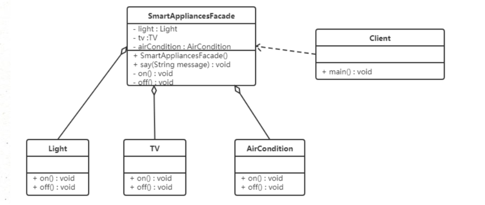
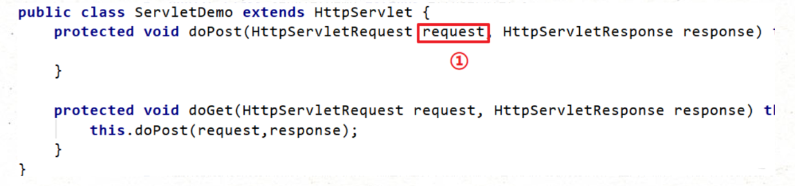
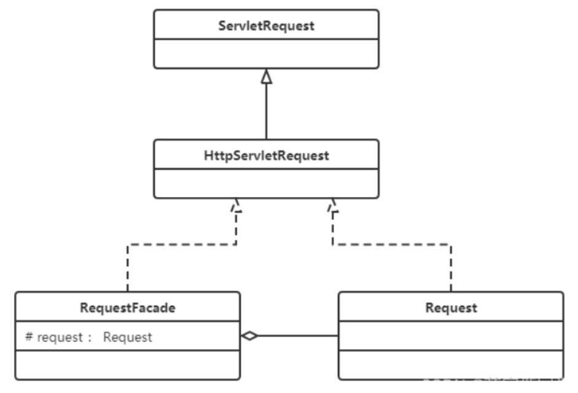

# **外观模式（Facade Pattern）**

## **1.概述**

有些人可能炒过股票，但其实大部分人都不太懂，这种没有足够了解证券知识的情况下做股票是很容易亏钱的，刚开始炒股肯定都会想，如果有个懂行的帮帮手就好，其实基金就是个好帮手，支付宝里就有许多的基金，它将投资者分散的资金集中起来，交由专业的经理人进行管理，投资于股票、债券、外汇等领域，而基金投资的收益归持有者所有，管理机构收取一定比例的托管管理费用。


外观模式：又名**门面模式**，是一种通过为多个复杂的子系统提供一个一致的接口，而使这些子系统更加容易被访问的模式。该模式对外有一个统一接口，外部应用程序不用关心内部子系统的具体的细节，这样会大大降低应用程序的复杂度，提高了程序的可维护性。


**外观模式是 “迪米特法则” 的典型应用**

------


## **2.结构**

外观（Facade）模式包含以下主要角色：

- 外观（Facade）角色：为多个子系统对外提供一个共同的接口。
- 子系统（Sub System）角色：实现系统的部分功能，客户可以通过外观角色访问它。

------


## **3.案例**

【例】智能家电控制

小明的爷爷已经 60 岁了，一个人在家生活。每次早上起来都需要打开灯、打开电视、打开空调，睡觉时关闭灯、关闭电视、关闭空调，操作起来比较麻烦。所以小明给爷爷买了智能音箱，可以通过语音直接控制这些智能家电的开启和关闭。类图如下：



```java
//子系统角色：电灯、电视、空调
public class Light {
    public void on() {
        System.out.println("打开电灯。。。。");
    }
    public void off() {
        System.out.println("关闭电灯。。。。");
    }
}

public class TV {
    public void on() {
        System.out.println("打开电视机。。。。");
    }
    public void off() {
        System.out.println("关闭电视机。。。。");
    }
}

public class AirCondition {
    public void on() {
        System.out.println("打开空调。。。。");
    }
    public void off() {
        System.out.println("关闭空调。。。。");
    }
}
```

```java
//外观角色：智能音箱，用于控制各个子系统，用户主要和该对象进行交互
public class SmartAppliancesFacade {
    // 聚合电灯对象，电视机对象，空调对象
    private Light light;
    private TV tv;
    private AirCondition airCondition;


    public SmartAppliancesFacade() {
        light = new Light();
        tv = new TV();
        airCondition = new AirCondition();
    }
    // 通过语言控制
    public void say(String message) {
        if (message.contains("打开")) {
            on();
        } else if (message.contains("关闭")) {
            off();
        } else {
            System.out.println("我还听不懂你说的！！！");
        }
    }
    // 一键打开功能
    private void on() {
        light.on();
        tv.on();
        airCondition.on();
    }
    // 一键关闭功能
    private void off() {
        light.off();
        tv.off();
        airCondition.off();
    }
}
```

```java
//测试类
public class Client {
    public static void main(String[] args) {
        // 创建智能音箱对象
        SmartAppliancesFacade facade = new SmartAppliancesFacade();
        // 控制家电
        facade.say("打开家电");
        facade.say("关闭家电");
    }
}

```

**优点：**

- 降低了子系统与客户端之间的耦合度，使得子系统的变化不会影响调用它的客户类。
- 对客户屏蔽了子系统组件，减少了客户处理的对象数目，并使得子系统使用起来更加容易。

**缺点：**

- 不符合开闭原则，修改很麻烦

------


## **4.使用场景**

- 对分层结构系统构建时，使用外观模式定义子系统中每层的入口点可以简化子系统之间的依赖关系。
- 当一个复杂系统的子系统很多时，外观模式可以为系统设计一个简单的接口供外界访问。
- 当客户端与多个子系统之间存在很大的联系时，引入外观模式可将它们分离，从而提高子系统的独立性和可移植性。


## **5.Tomcat 源码**

使用 Tomcat 作为 web 容器时，接收浏览器发送过来的请求，Tomcat 会将请求信息封装成 ServletRequest 对象，如下图①处对象。



思考一下，ServletRequest 是一个接口，它还有一个子接口 HttpServletRequest，我们知道该 request 对象肯定是一个 HttpServletRequest 对象的子实现类对象，到底是哪个类的对象呢？通过输出 request 对象，就会发现是一个名为 RequestFacade 的类的对象。

RequestFacade 类就使用了外观模式，先看结构图：



**为什么在此处使用外观模式？**

> 定义 RequestFacade 类，实现 ServletRequest ，同时定义私有成员变量 Request ，并且方法的实现调用 Request 的实现。然后将 RequestFacade 上转为 ServletRequest 传给 servlet 的 service 方法，这样即使在 servlet 中被下转为 RequestFacade ，也不能访问私有成员变量对象中的方法。既用了 Request，又防止其中方法被不合理的访问。


