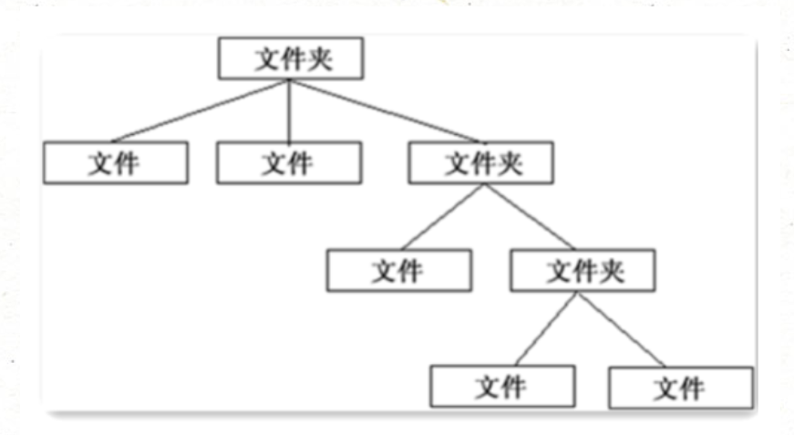
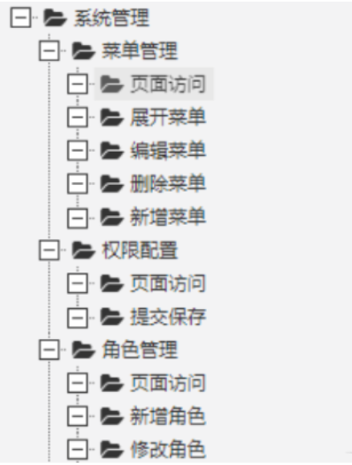
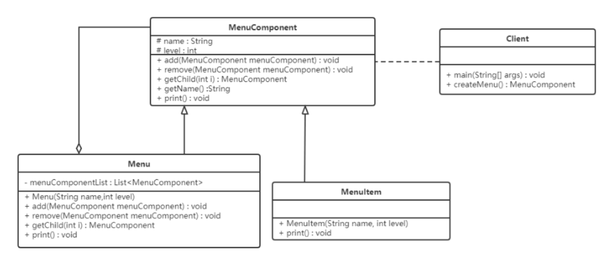
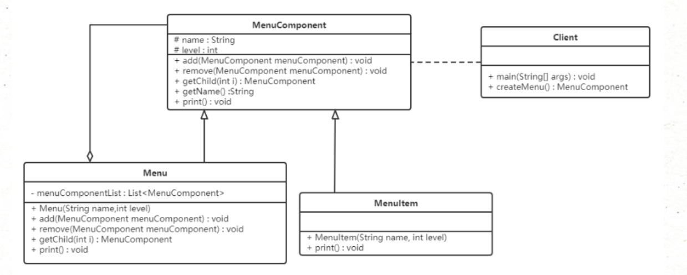

# **组合模式（Composite Pattern）**

## **1.概述**

又名部分**整体模式**，是用于把一组相似的对象当作一个单一的对象。组合模式依据树形结构来组合对象，用来表示部分以及整体层次。这种类型的设计模式属于结构型模式，它创建了对象组的树形结构。



上图可以看做是一个文件系统，这样的结构称之为树形结构。在树形结构中可以通过调用某个方法来遍历整个树，当找到某个叶子节点后，就可以对叶子节点进行相关的操作。可以将这颗树理解成一个大的容器，容器里面包含很多的成员对象，这些成员对象即可是容器对象也可以是叶子对象。但是由于容器对象和叶子对象在功能上面的区别，使得在使用的过程中必须要区分容器对象和叶子对象，但是这样就会给客户带来不必要的麻烦，作为客户，始终希望能够一致的对待容器对象和叶子对象。

------

## **2.结构**

组合模式主要包含三种角色：

- 抽象根节点（Component）：定义系统各层次对象的共有方法和属性，可以预先定义一些默认行为和属性。
- 树枝节点（Composite）：定义树枝节点的行为，存储子节点，组合树枝节点和叶子节点形成一个树形结构。
- 叶子节点（Leaf）：叶子节点对象，其下再无分支，是系统层次遍历的最小单位。

------

## **3.案例实现**

【例】软件菜单

如下图，我们在访问别的一些管理系统时，经常可以看到类似的菜单。一个菜单可以包含菜单项（菜单项是指不再包含其他内容的菜单条目），也可以包含带有其他菜单项的菜单，因此使用组合模式描述菜单就很恰当，我们的需求是针对一个菜单，打印出其包含的所有菜单以及菜单项的名称。



类图如下：



不管是菜单还是菜单项，都应该继承自统一的接口，这里将这个统一的接口称为菜单组件。

这里的 MenuComponent 定义为抽象类，因为有一些共有的属性和行为要在该类中实现，Menu 和 MenuItem 类就可以只覆盖自己感兴趣的方法，而不用搭理不需要或者不感兴趣的方法，举例来说，Menu 类可以包含子菜单，因此需要覆盖 add()、remove()、getChild() 方法，但是MenuItem 就不应该有这些方法。这里给出的默认实现是抛出异常，可以根据自己的需要改写默认实现。

```java
/**
 * 菜单组件：属于抽象根节点
 */
public abstract class MenuComponent {
    // 菜单组件的名称
    protected String name;
    // 菜单组件的层级
    protected int level;
    // 添加子菜单
    public void add(MenuComponent menuComponent) {
        throw new UnsupportedOperationException();
    }
    // 移除子菜单
    public void remove(MenuComponent menuComponent) {
        throw new UnsupportedOperationException();
    }
    // 获取指定的子菜单
    public MenuComponent getChild(int index) {
        throw new UnsupportedOperationException();
    }
    // 获取菜单或者菜单项的名称
    public String getName() {
        return name;
    }
    // 打印菜单名称的方法（包含子菜单和字菜单项）
    public abstract void print();
}

```

```java
//Menu 类实现了除了getName方法的其他所有方法，因为Menu类具有添加菜单，移除菜单和获取子菜单的功能。

/**
 * 菜单类：属于树枝节点
 */
public class Menu extends MenuComponent {
    // 菜单可以有多个子菜单或者子菜单项
    private List<MenuComponent> menuComponentList = new ArrayList<>();


    public Menu(String name, int level) {
        this.name = name;
        this.level = level;
    }


    @Override
    public void add(MenuComponent menuComponent) {
        menuComponentList.add(menuComponent);
    }


    @Override
    public void remove(MenuComponent menuComponent) {
        menuComponentList.remove(menuComponent);
    }


    @Override
    public MenuComponent getChild(int index) {
        return menuComponentList.get(index);
    }


    @Override
    public void print() {
        // 打印菜单名称
        for (int i = 0; i < level; i++) {
            System.out.print("--");
        }
        System.out.println(name);


        // 打印子菜单或者子菜单项名称
        for (MenuComponent component : menuComponentList) {
            component.print();
        }
    }
}
```

```java
//MenuItem 是菜单项，不能再有子菜单，所以添加菜单，移除菜单和获取子菜单的功能并不能实现。
/**
 * 菜单项类：属于叶子节点
 */
public class MenuItem extends MenuComponent {


    public MenuItem(String name, int level) {
        this.name = name;
        this.level = level;
    }


    public void print() {
        // 打印菜单项的名称
        for (int i = 0; i < level; i++) {
            System.out.print("--");
        }
        System.out.println(name);
    }
}


```

```
//测试类：
public class Client {
    public static void main(String[] args) {
        // 创建二级菜单树
        MenuComponent menu1 = new Menu("菜单管理", 2);
        menu1.add(new MenuItem("页面访问", 3));
        menu1.add(new MenuItem("展开菜单", 3));
        menu1.add(new MenuItem("编辑菜单", 3));
        menu1.add(new MenuItem("删除菜单", 3));
        menu1.add(new MenuItem("新增菜单", 3));


        MenuComponent menu2 = new Menu("权限管理", 2);
        menu2.add(new MenuItem("页面访问", 3));
        menu2.add(new MenuItem("提交保存", 3));


        MenuComponent menu3 = new Menu("角色管理", 2);
        menu3.add(new MenuItem("页面访问", 3));
        menu3.add(new MenuItem("新增角色", 3));
        menu3.add(new MenuItem("修改角色", 3));


        // 创建一级菜单
        MenuComponent component = new Menu("系统管理", 1);


        // 将二级菜单添加到一级菜单中
        component.add(menu1);
        component.add(menu2);
        component.add(menu3);


        // 打印菜单名称(如果有子菜单一块打印)
        component.print();
    }
}
```

------

## **4.组合模式的分类**

在使用组合模式时，根据抽象构件类的定义形式，我们可将组合模式分为**透明组合模式**和**安全组合模式**。

**透明组合模式：**

- 透明组合模式中，抽象根节点角色中声明了所有用于管理成员对象的方法，比如在示例中 MenuComponent 声明了 add、remove 、getChild 方法，这样做的好处是确保所有的构件类都有相同的接口。透明组合模式也是组合模式的标准形式。
- 透明组合模式的缺点是不够安全，因为叶子对象和容器对象在本质上是有区别的，叶子对象不可能有下一个层次的对象，即不可能包含成员对象，因此为其提供 add()、remove() 等方法是没有意义的，这在编译阶段不会出错，但在运行阶段如果调用这些方法可能会出错（如果没有提供相应的错误处理代码）




**安全组合模式**：

- 在安全组合模式中，在抽象构件角色中没有声明任何用于管理成员对象的方法，而是在树枝节点 Menu 类中声明并实现这些方法。
- 安全组合模式的缺点是不够透明，因为叶子构件和容器构件具有不同的方法，且容器构件中那些用于管理成员对象的方法没有在抽象构件类中定义，因此客户端不能完全针对抽象编程，必须有区别地对待叶子构件和容器构件。


------


## **5.优点**

- 组合模式可以清楚地定义分层次的复杂对象，表示对象的全部或部分层次，它让客户端忽略了层次的差异，方便对整个层次结构进行控制。
- 客户端可以一致地使用一个组合结构或其中单个对象，不必关心处理的是单个对象还是整个组合结构，简化了客户端代码。
- 在组合模式中增加新的树枝节点和叶子节点都很方便，无须对现有类库进行任何修改，符合 “开闭原则”。
- 组合模式为树形结构的面向对象实现提供了一种灵活的解决方案，通过叶子节点和树枝节点的递归组合，可以形成复杂的树形结构，但对树形结构的控制却非常简单。

------

## **6.使用场景**

- 组合模式正是应树形结构而生，所以组合模式的使用场景就是出现树形结构的地方。

> 比如：文件目录显示，多级目录呈现等树形结构数据的操作。


