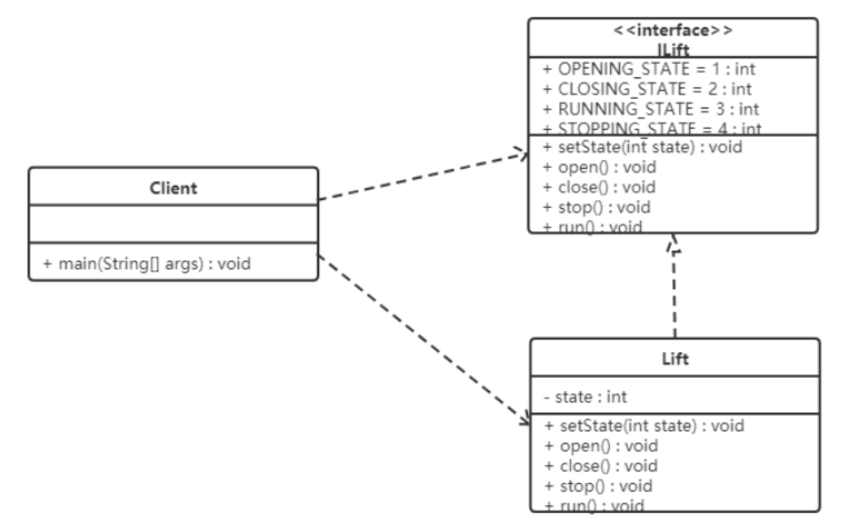
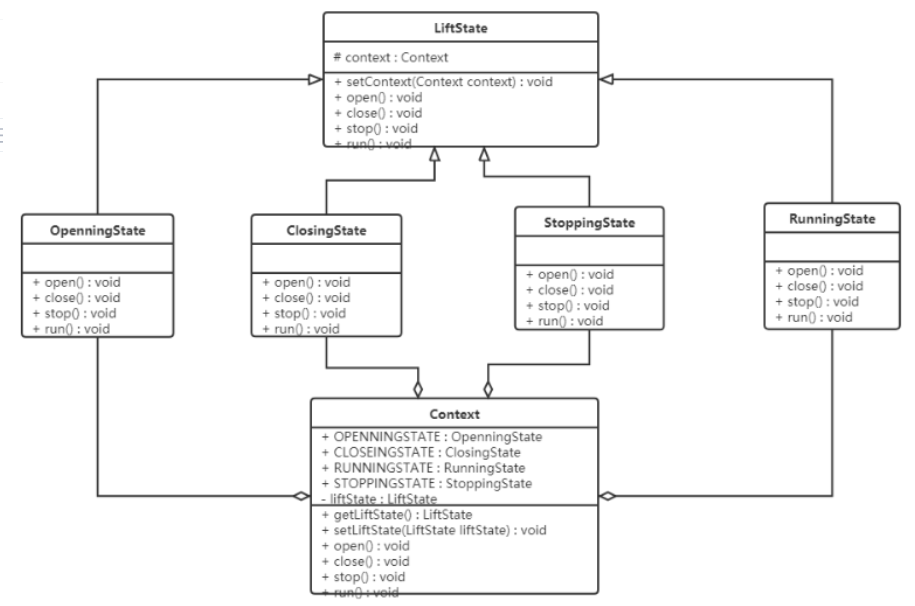

## **状态模式（State Pattern）**

**状态模式：对有状态的对象，把复杂的“判断逻辑”提取到不同的状态对象中，允许状态对象在其内部状态发生改变时改变其行为。**

在状态模式（State Pattern）中，类的行为是基于它的状态改变的。这种类型的设计模式属于行为型模式。

在状态模式中，我们创建表示各种状态的对象和一个行为随着状态对象改变而改变的 context 对象。

------

### **1.反例**

【例】通过按钮来控制一个电梯的状态，一个电梯有开门状态，关门状态，停止状态，运行状态。每一种状态改变，都有可能要根据其他状态来更新处理。例如，如果电梯门现在处于运行时状态，就不能进行开门操作，而如果电梯门是停止状态，就可以执行开门操作。类图如下：



```java
//电梯接口
/**
 * 电梯接口
 */
public interface ILift {
    // 定义四个电梯状态的常量
    int OPENING_STATE = 1;
    int CLOSING_STATE = 2;
    int RUNNING_STATE = 3;
    int STOPPING_STATE = 4;
    // 设置电梯状态的功能
    void setState(int state);
    // 电梯操作功能
    void open();
    void close();
    void run();
    void stop();
}

```

```java
/**
 * 电梯类(ILift的子实现类)
 */
public class Lift implements ILift {
    // 声明一个记录当前电梯的状态
    private int state;


    public void setState(int state) {
        this.state = state;
    }


    public void open() {
        switch (state) {
            case OPENING_STATE:
                // 什么事都不做
                break;
            case CLOSING_STATE:
                System.out.println("电梯打开了...");
                // 设置当前电梯状态为开启状态
                setState(OPENING_STATE);
                break;
            case STOPPING_STATE:
                System.out.println("电梯打开了...");
                // 设置当前电梯状态为开启状态
                setState(OPENING_STATE);
                break;
            case RUNNING_STATE:
                // 什么事都不做
                break;
        }
    }


    public void close() {
        switch (this.state) {
            case OPENING_STATE:
                System.out.println("电梯关门了。。。");//只有开门状态可以关闭电梯门，可以对应电梯状态表来看
                this.setState(CLOSING_STATE);//关门之后电梯就是关闭状态了
                break;
            case CLOSING_STATE:
                //do nothing //已经是关门状态，不能关门
                break;
            case RUNNING_STATE:
                //do nothing //运行时电梯门是关着的，不能关门
                break;
            case STOPPING_STATE:
                //do nothing //停止时电梯也是关着的，不能关门
                break;
        }
    }


    public void run() {
        switch (this.state) {
            case OPENING_STATE://电梯不能开着门就走
                //do nothing
                break;
            case CLOSING_STATE://门关了，可以运行了
                System.out.println("电梯开始运行了。。。");
                this.setState(RUNNING_STATE);//现在是运行状态
                break;
            case RUNNING_STATE:
                //do nothing 已经是运行状态了
                break;
            case STOPPING_STATE:
                System.out.println("电梯开始运行了。。。");
                this.setState(RUNNING_STATE);
                break;
        }
    }


    public void stop() {
        switch (this.state) {
            case OPENING_STATE: //开门的电梯已经是是停止的了(正常情况下)
                //do nothing
                break;
            case CLOSING_STATE://关门时才可以停止
                System.out.println("电梯停止了。。。");
                this.setState(STOPPING_STATE);
                break;
            case RUNNING_STATE://运行时当然可以停止了
                System.out.println("电梯停止了。。。");
                this.setState(STOPPING_STATE);
                break;
            case STOPPING_STATE:
                //do nothing
                break;
        }
    }
}

```

```java
//测试：
public class Client {
    public static void main(String[] args) {
        // 创建电梯对象
        Lift lift = new Lift();
        // 设置当前电梯的状态
        lift.setState(ILift.RUNNING_STATE);
        // 打开
        lift.open();
        lift.close();
        lift.run();
        lift.stop();
    }
}

```

问题分析：

- 使用了大量的 switch…case 这样的判断（if…else也是一样)，使程序的可阅读性变差。
- 扩展性很差。如果新加了断电的状态，我们需要修改上面判断逻辑

------

### **2.结构**

状态模式包含以下主要角色：

- 环境（Context）角色：也称为上下文，它定义了客户程序需要的接口，维护一个当前状态，并将与状态相关的操作委托给当前状态对象来处理。
- 抽象状态（State）角色：定义一个接口，用以封装环境对象中的特定状态所对应的行为。
- 具体状态（Concrete State）角色：实现抽象状态所对应的行为。

------


### **3.案例实现**

对上述电梯的案例使用状态模式进行改进。类图如下：



```java
//抽象状态类:
public abstract class LiftState {
    // 声明环境角色类变量
    protected Context context;
    public void setContext(Context context) {
        this.context = context;
    }
    // 电梯开启操作
    public abstract void open();
    // 电梯关闭操作
    public abstract void close();
    // 电梯运行操作
    public abstract void run();
    // 电梯停止操作
    public abstract void stop();
}

```

```java
//具体状态类：电梯开门状态、电梯运行状态 、电梯停止状态、电梯关门状态
/**
 * 电梯开启状态类
 */
public class OpeningState extends LiftState {
    // 当前状态要执行的方法
    public void open() {
        System.out.println("电梯开启。。。");
    }
    public void close() {
        // 修改状态
        super.context.setLiftState(Context.CLOSING_STATE);
        // 修改环境
        super.context.close();
    }
    public void run() {}
    public void stop() {}
}


/**
 * 电梯关闭状态类
 */
public class ClosingState extends LiftState {
    // 当前状态要执行的方法
    public void close() {
        System.out.println("电梯门关闭...");
    }
    // 关闭 -> 开启
    public void open() {
        super.context.setLiftState(Context.OPENING_STATE);
        super.context.open();
    }
    // 关闭 -> 运行
    public void run() {
        super.context.setLiftState(Context.RUNNING_STATE);
        super.context.run();
    }
    // 关闭 -> 停止
    public void stop() {
        super.context.setLiftState(Context.STOPPING_STATE);
        super.context.stop();
    }
}


/**
 * 电梯运行状态类
 */
public class RunningState extends LiftState {
    // 当前状态要执行的方法
    public void run() {
        System.out.println("电梯正在运行...");
    }
    // 运行时无法开门
    @Override
    public void open() {}
    // 运行时门是关的
    @Override
    public void close() {}
    // 运行 -> 停止
    @Override
    public void stop() {
        super.context.setLiftState(Context.STOPPING_STATE);
        super.context.stop();
    }
}


/**
 * 电梯停止状态类
 */
public class StoppingState extends LiftState {
    // 当前状态要执行的方法
    public void stop() {
        System.out.println("电梯停止了...");
    }
    // 停止 -> 开门（委托给ClosingState子类执行）
    public void open() {
        super.context.setLiftState(Context.OPENING_STATE);
        super.context.getLiftState().open();
    }
    // 停止 -> 关门（委托给ClosingState子类执行）
    public void close() {
        super.context.setLiftState(Context.CLOSING_STATE);
        super.context.getLiftState().close();
    }
    // 停止 -> 运行（委托给ClosingState子类执行）
    public void run() {
        super.context.setLiftState(Context.RUNNING_STATE);
        super.context.getLiftState().run();
    }
}

```

```java
//环境角色类：
public class Context {
    // 定义对应状态对象的常量
    public final static OpeningState OPENING_STATE = new OpeningState();
    public final static ClosingState CLOSING_STATE = new ClosingState();
    public final static RunningState RUNNING_STATE = new RunningState();
    public final static StoppingState STOPPING_STATE = new StoppingState();


    // 定义一个当前电梯状态变量
    private LiftState liftState;
    public LiftState getLiftState() {
        return liftState;
    }


    // 设置当前状态对象
    public void setLiftState(LiftState liftState) {
        this.liftState = liftState;
        // 设置当前状态对象中的Context对象
        this.liftState.setContext(this);
    }


    public void open() {
        this.liftState.open();
    }


    public void close() {
        this.liftState.close();
    }


    public void run() {
        this.liftState.run();
    }


    public void stop() {
        this.liftState.stop();
    }
}

```

```java
//测试类：
public class Client {
    public static void main(String[] args) {
        // 创建环境角色对象
        Context context = new Context();
        // 设置当前电梯装填
        context.setLiftState(new ClosingState());


        context.open();
        context.run();
        context.close();
        context.stop();
    }
}

```

------

### **4.优缺点**

**优点：**

- 将所有与某个状态有关的行为放到一个类中，并且可以方便地增加新的状态，只需要改变对象状态即可改变对象的行为。
- 允许状态转换逻辑与状态对象合成一体，而不是某一个巨大的条件语句块。

**缺点：**

- 状态模式的使用必然会增加系统类和对象的个数。
- 状态模式的结构与实现都较为复杂，如果使用不当将导致程序结构和代码的混乱。
- 状态模式对“开闭原则”的支持并不太好。

------

### **5.使用场景**

当一个对象的行为取决于它的状态，并且它必须在运行时根据状态改变它的行为时，就可以考虑使用状态模式。

一个操作中含有庞大的分支结构，并且这些分支决定于对象的状态时。

