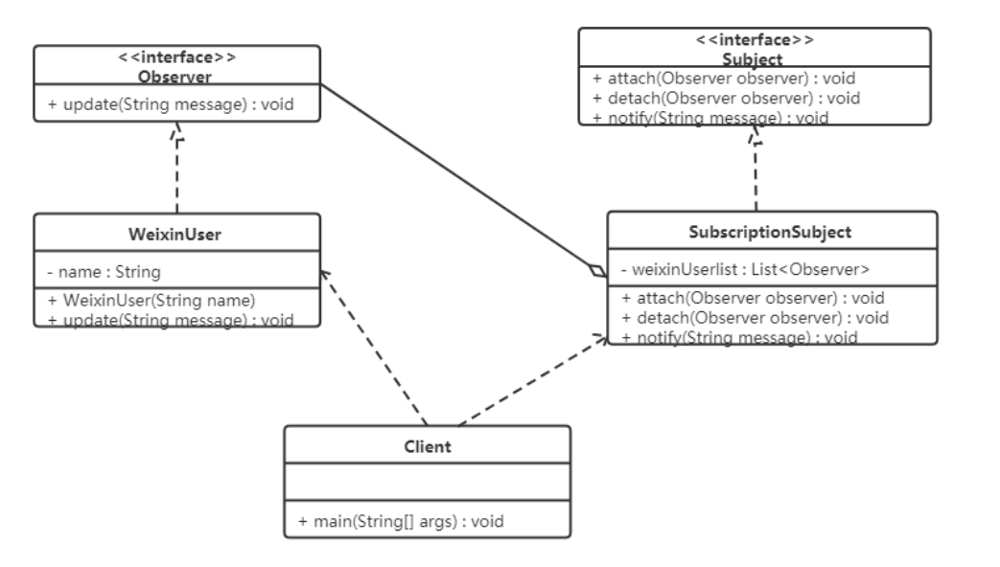

## **观察者模式（Observer Pattern）**

### **1.概述**

**观察者模式**：又被称为 发布 - 订阅（Publish / Subscribe）模式，它定义了一种一对多的依赖关系，让多个观察者对象同时监听某一个主题对象。这个主题对象在状态变化时，会通知所有的观察者对象，使他们能够自动更新自己。

------

### **2.结构**

在观察者模式中有如下角色：

- Subject：抽象主题（抽象被观察者），抽象主题角色把所有观察者对象保存在一个集合里，每个主题都可以有任意数量的观察者，抽象主题提供一个接口，可以增加和删除观察者对象。
- ConcreteSubject：具体主题（具体被观察者），该角色将有关状态存入具体观察者对象，在具体主题的内部状态发生改变时，给所有注册过的观察者发送通知。
- Observer：抽象观察者，是观察者的抽象类，它定义了一个更新接口，使得在得到主题更改通知时更新自己。
- ConcrereObserver：具体观察者，实现抽象观察者定义的更新接口，以便在得到主题更改通知时更新自身的状态。

------

### **3.案例实现**

【例】微信公众号

在使用微信公众号时，大家都会有这样的体验，当你关注的公众号中有新内容更新的话，它就会推送给关注公众号的微信用户端。我们使用观察者模式来模拟这样的场景，微信用户就是观察者，微信公众号是被观察者，有多个的微信用户关注了程序猿这个公众号。



```java
//抽象观察者：
public interface Observer {
    void update(String message);
}

```

```java
//具体观察者：微信用户，实现了更新的方法
public class WeiXinUser implements Observer {
    private String name;
    public WeiXinUser(String name) {
        this.name = name;
    }
    public void update(String message) {
        System.out.println(name + "-" + message);
    }
}

```

```java
//抽象主题角色：
public interface Subject {
    // 添加订阅者（添加观察者对象）
    void attach(Observer observer);
    // 删除订阅者
    void detach(Observer observer);
    // 通知订阅者更新消息
    void notify(String message);
}

```

```java
//具体主题角色：微信公众号，里面存储了订阅该公众号的微信用户，并实现了抽象主题中的方法
public class SubscriptionSubject implements Subject {
    // 定义一个集合，用来存储多个观察者对象
    private List<Observer> weiXinUserList = new ArrayList<>();


    public void attach(Observer observer) {
        weiXinUserList.add(observer);
    }


    public void detach(Observer observer) {
        weiXinUserList.remove(observer);
    }


    public void notify(String message) {
        for (Observer observer : weiXinUserList) {
            // 调用观察者对象中的update方法
            observer.update(message);
        }
    }
}
```

```java
//测试类：
public class Client {
    public static void main(String[] args) {
        // 1,创建公众号对象
        SubscriptionSubject subject = new SubscriptionSubject();
        // 2,订阅公众号
        subject.attach(new WeiXinUser("孙悟空"));
        subject.attach(new WeiXinUser("猪悟能"));
        subject.attach(new WeiXinUser("沙悟净"));
        // 3,公众号更新，发出消息给订阅者（观察者对象）
        subject.notify("传智黑马的专栏更新了！");
    }
}


```

------

### **4.优缺点**

**优点：**

- 降低了目标与观察者之间的耦合关系，两者之间是抽象耦合关系。
- 被观察者发送通知，所有注册的观察者都会收到信息【可以实现广播机制】。

**缺点：**

- 如果观察者非常多的话，那么所有的观察者收到被观察者发送的通知会耗时。
- 如果被观察者有循环依赖的话，那么被观察者发送通知会使观察者循环调用，会导致系统崩溃。

------

### **5.使用场景**

- 对象间存在一对多关系，一个对象的状态发生改变会影响其他对象。
- 当一个抽象模型有两个方面，其中一个方面依赖于另一方面时。

[别再面向 for 循环编程了，Spring 自带的观察者模式就很香！ (qq.com)](https://mp.weixin.qq.com/s/HrNEI3WcUKVcgbM3CaJmSg)

[Spring中观察者模式的应用 | 码农家园 (codenong.com)](https://www.codenong.com/cs105556324/)

[(47条消息) 《设计模式详解》行为型模式 - 观察者模式_萌宅鹿同学的博客-CSDN博客](https://luzhenyu.blog.csdn.net/article/details/122659050)


### **6.JDK 提供的实现 - Observable**

该类在 JDK9 中被弃用


在 Java 中，通过 java.util.Observable 类和 java.util.Observer 接口定义了观察者模式，只要实现它们的子类就可以编写观察者模式实例。

- Observable 类：抽象目标类（被观察者），它有一个 Vector 集合成员变量，用于保存所有要通知的观察者对象。
- void addObserver(Observer o) 方法：用于将新的观察者对象添加到集合中。
- void notifyObservers(Object arg) 方法：调用集合中的所有观察者对象的 update方法，通知它们数据发生改变。通常越晚加入集合的观察者越先得到通知。
- void setChange() 方法：用来设置一个 boolean 类型的内部标志，注明目标对象发生了变化。当它为 true 时，notifyObservers() 才会通知观察者。
- Observer 接口：抽象观察者，它监视目标对象的变化，当目标对象发生变化时，观察者得到通知，并调用 update 方法，进行相应的工作。


