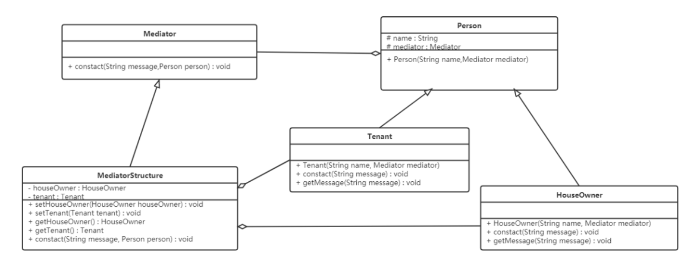

## **中介者模式（Mediator Pattern）**

### **1.概述**

**中介者模式**：又叫**调停模式**，定义一个中介角色来封装一系列对象之间的交互，使原有对象之间的耦合松散，且可以独立地改变它们之间的交互。


一般来说，同事类之间的关系是比较复杂的，多个同事类之间互相关联时，他们之间的关系会呈现为复杂的网状结构，这是一种过度耦合的架构，既不利于类的复用，也不稳定。例如在下左图中，有六个同事类对象，假如对象 1 发生变化，那么将会有 4 个对象受到影响。如果对象 2 发生变化，那么将会有 5 个对象受到影响。也就是说，同事类之间直接关联的设计是不好的。


如果引入中介者模式，那么同事类之间的关系将变为星型结构，从下右图中可以看到，任何一个类的变动，只会影响的类本身，以及中介者，这样就减小了系统的耦合。一个好的设计，必定不会把所有的对象关系处理逻辑封装在本类中，而是使用一个专门的类来管理那些不属于自己的行为。


------

### **2.结构**

中介者模式包含以下主要角色：

- Mediator：抽象中介者角色，它是中介者的接口，提供了同事对象注册与转发同事对象信息的抽象方法。
- ConcreteMediator：具体中介者角色，实现中介者接口，定义一个 List 来管理同事对象，协调各个同事角色之间的交互关系，因此它依赖于同事角色。
- Colleague：抽象同事类角色，定义同事类的接口，保存中介者对象，提供同事对象交互的抽象方法，实现所有相互影响的同事类的公共功能。
- Concrete Colleague：具体同事类角色，是抽象同事类的实现者，当需要与其他同事对象交互时，由中介者对象负责后续的交互。

------

### **3.案例实现**

【例】租房

现在租房基本都是通过房屋中介，房主将房屋托管给房屋中介，而租房者从房屋中介获取房屋信息。房屋中介充当租房者与房屋所有者之间的中介者。



```java
//抽象中介者类：
public abstract class Mediator {
    public abstract void contact(String message, Person person);
}

```

```java
//抽象同事类：
@AllArgsConstructor
public abstract class Person {
    protected String name;
    protected Mediator mediator;
}

```

```java
//具体同事类：房主、房客
/**
 * 具体的同事角色类 - 房主
 */
public class HouseOwner extends Person {
    public HouseOwner(String name, Mediator mediator) {
        super(name, mediator);
    }
    // 和中介联系（沟通）
    public void contact(String message) {
        mediator.contact(message,this);
    }
    // 获取信息
    public void getMessage(String message) {
        System.out.println("房主" + name + "获取到的信息是：" + message);
    }
}


/**
 * 具体的同事角色类 - 房客
 */
public class Tenant extends Person {
    public Tenant(String name, Mediator mediator) {
        super(name, mediator);
    }
    // 和中介联系（沟通）
    public void contact(String message) {
        mediator.contact(message,this);
    }
    // 获取信息
    public void getMessage(String message) {
        System.out.println("租房者" + name + "获取到的信息是：" + message);
    }
}

```

```java
//具体中介者角色：中介机构
@Data
public class MediatorStructure extends Mediator {
    // 聚合房主和房客对象
    private HouseOwner houseOwner;
    private Tenant tenant;


    public void contact(String message, Person person) {
        if (person == houseOwner) {
            tenant.getMessage(message);
        } else {
            houseOwner.getMessage(message);
        }
    }
}
```

```java
//测试类：
public class Client {
    public static void main(String[] args) {
        // 中介者对象
        MediatorStructure mediator = new MediatorStructure();
        // 租房者对象
        Tenant tenant = new Tenant("李四", mediator);
        // 房主对象
        HouseOwner houseOwner = new HouseOwner("张三", mediator);


        // 中介者要知道具体的房主和租房者
        mediator.setTenant(tenant);
        mediator.setHouseOwner(houseOwner);


        tenant.contact("我要租三室的房子！！！");
        houseOwner.contact("我这里有三室的房子，你要租吗？");
    }
}
---------------------------------------------
房主张三获取到的信息是：我要租三室的房子！！！
租房者李四获取到的信息是：我这里有三室的房子，你要租吗？
```

------

### **4.优缺点**

**优点：**

- 松散耦合

> 中介者模式通过把多个同事对象之间的交互封装到中介者对象里面，从而使得同事对象之间松散耦合，基本上可以做到互补依赖。这样一来，同事对象就可以独立地变化和复用，而不再像以前那样“牵一处而动全身”了。

- 集中控制交互

> 多个同事对象的交互，被封装在中介者对象里面集中管理，使得这些交互行为发生变化的时候，只需要修改中介者对象就可以了，当然如果是已经做好的系统，那么就扩展中介者对象，而各个同事类不需要做修改。

- 一对多关联转变为一对一的关联

> 没有使用中介者模式的时候，同事对象之间的关系通常是一对多的，引入中介者对象以后，中介者对象和同事对象的关系通常变成双向的一对一，这会让对象的关系更容易理解和实现。

**缺点：**

- 当同事类太多时，中介者的职责将很大，它会变得复杂而庞大，以至于系统难以维护。

------


### **5.使用场景**

  **5.1中介者模式的适用情况**

- 系统中对象之间存在复杂的引用关系，系统结构混乱且难以理解。
- 当想创建一个运行于多个类之间的对象，又不想生成新的子类时。

------

  **5.2中介者模式在MVC模式中的应用**

[Java设计模式总汇二---MVC、中介者设计模式 - TMusketeer - 博客园 (cnblogs.com)](https://www.cnblogs.com/cmusketeer/p/8270909.html)


比如说，在MVC框架中，控制器（Controller）就是模型（Model）和视图（View）之间的中介者：

- Model(模型)：代表一个存取对象的数据，有Dao、Bean等等
- View(视图)：表示所看到的东西，比如网页、JSP等用于展示模型中的数据
- Controller(控制器)：作用于模型和视图中间，控制数据流向模型对象，在数据变化时更新视图


 

------

 **5.3中介者模式实战(ORM框架)**

[**(47条消息) 中介者模式及其应用场景_归斯君的博客-CSDN博客_中介者模式应用**](https://blog.csdn.net/hello_1566/article/details/124342204)


