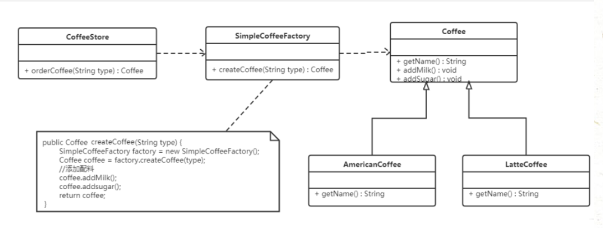
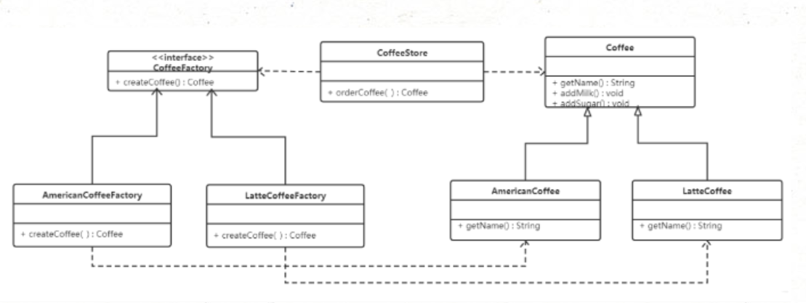

## **1.简单工厂模式**

​     简单工厂不是一种设计模式，反而比较像是一种编程习惯。

------

**结构**

简单工厂包含如下角色：

- 抽象产品：定义了产品的规范，描述了产品的主要特性和功能。
- 具体产品：实现或者继承抽象产品的子类。
- 具体工厂：提供了创建产品的方法，调用者通过该方法来获取产品。

------

下例中，抽象产品是咖啡抽象类，具体产品是美式咖啡和拿铁咖啡：

**实现**

使用简单工厂对上面案例进行改进，类图如下：



代码如下：

```java
//抽象产品：咖啡抽象类 Coffee
public abstract class Coffee {
    // 获取咖啡名称
    public abstract String getName();
    // 加糖
    public void addSugar() {
        System.out.println("加糖");
    }
    // 加奶
    public void addMilk() {
        System.out.println("加奶");
    }
}

```

```java
//具体产品：

//美式咖啡
public class AmericanCoffee extends Coffee {
    public String getName() {
        return "美式咖啡";
    }
}

// 拿铁咖啡
public class LatteCoffee extends Coffee {
    public String getName() {
        return "拿铁咖啡";
    }
}
```

```java
//简单工厂类：用来生产咖啡
public class SimpleCoffeeFactory {
    public Coffee createCoffee(String type) {
        // 声明Coffee类型的变量，根据不同类型创建不同的coffee子类对象
        Coffee coffee = null;
        if ("american".equals(type)) {
            coffee = new AmericanCoffee();
        } else if ("latte".equals(type)) {
            coffee = new LatteCoffee();
        } else {
            throw new RuntimeException("对不起，您所点的咖啡没有");
        }
        return coffee;
    }
}
```

```java
//客户端，咖啡店：使用简单工厂来生产咖啡		
public class CoffeeStore {
    public Coffee orderCoffee(String type) {
        // 生产咖啡的简单工厂
        SimpleCoffeeFactory factory = new SimpleCoffeeFactory();
        // 调用生产咖啡的方法
        Coffee coffee = factory.createCoffee(type);
        // 加配料
        coffee.addMilk();
        coffee.addSugar();
        return coffee;
    }
}
```

​	在以上代码中，工厂处理创建对象的细节，一旦有了 SimpleCoffeeFactory，CoffeeStore 类中的 orderCoffee() 就变成此对象的客户，后期如果需要 Coffee 对象直接从工厂中获取即可，这样也就解除了和 Coffee 实现类的耦合。但是又产生了新的耦合，CoffeeStore 对象和 SimpleCoffeeFactory 工厂对象的耦合，工厂对象和商品对象的耦合。后期如果再加新品种的咖啡，我们需要修改 SimpleCoffeeFactory 的代码，违反了开闭原则。工厂类的客户端可能有很多，比如创建美团外卖等，这样只需要修改工厂类的代码，省去其他的修改操作。

------

**优缺点：**

**优点：**封装了创建对象的过程，可以通过参数直接获取对象。把对象的创建和业务逻辑层分开，这样以后就避免了修改客户代码，如果要实现新产品直接修改工厂类，而不需要在原代码中修改，这样就降低了客户代码修改的可能性，更加容易扩展。

**缺点：**增加新产品时还是需要修改工厂类的代码，违背了“开闭原则”。

------

**扩展(静态工厂 - static)**

​	在开发中也有一部分人将工厂类中的创建对象的功能定义为静态的，这就是静态工厂模式，它也不属于 23 种设计模式。

```java
public class SimpleCoffeeFactory {
    public static Coffee createCoffee(String type) {
        // 声明Coffee类型的变量，根据不同类型创建不同的coffee子类对象
        Coffee coffee = null;
        if ("american".equals(type)) {
            coffee = new AmericanCoffee();
        } else if ("latte".equals(type)) {
            coffee = new LatteCoffee();
        } else {
            throw new RuntimeException("对不起，您所点的咖啡没有");
        }
        return coffee;
    }
}
```

```java
//咖啡店
public class CoffeeStore {
    public Coffee orderCoffee(String type) {
        // 生产咖啡的简单工厂
        //SimpleCoffeeFactory factory = new SimpleCoffeeFactory();
        // 调用生产咖啡的方法
        //Coffee coffee = factory.createCoffee(type);
        Coffee coffee = SimpleCoffeeFactory.createCoffee(type);
        // 加配料
        coffee.addMilk();
        coffee.addSugar();
        return coffee;
    }
}

```

## 2.工厂方法模式

**简单工厂模式违背了开闭原则，使用工厂方法模式可以完全遵循开闭原则。**

------

**概念:**

​    定义一个用于创建对象的接口（工厂），让其子类决定实例化哪个产品类对象。

​    工厂方法模式使一个产品类的实例化延迟到其工厂的子类。

------

**结构:**

工厂方法模式的主要角色：

- 抽象工厂（Abstract Factory）：提供了创建产品的接口，调用者通过它访问具体工厂的工厂方法来创建产品。
- 具体工厂（ConcreteFactory）：主要是实现抽象工厂中的抽象方法，完成具体产品的创建。
- 抽象产品（Product）：定义了产品的规范，描述了产品的主要特性和功能。
- 具体产品（ConcreteProduct）：实现了抽象产品角色所定义的接口，由具体工厂来创建，它同具体工厂之间一一对应。

------

**实现:**

使用工厂方法模式对上例进行改进，类图如下：



代码如下：

```java
//抽象产品：咖啡抽象类 Coffee
public abstract class Coffee {
    // 获取咖啡名称
    public abstract String getName();
    // 加糖
    public void addSugar() {
        System.out.println("加糖");
    }
    // 加奶
    public void addMilk() {
        System.out.println("加奶");
    }
}

```

```java
//具体产品：

//美式咖啡
public class AmericanCoffee extends Coffee {
    public String getName() {
        return "美式咖啡";
    }
}

// 拿铁咖啡
public class LatteCoffee extends Coffee {
    public String getName() {
        return "拿铁咖啡";
    }
}
```

```java
//抽象工厂
public interface CoffeeFactory {
    // 创建咖啡对象的方法
    Coffee createCoffee();
}
```

```java
//具体工厂

/**
 * 美式咖啡工厂，专门用来生产美式咖啡
 */
public class AmericanCoffeeFactory implements CoffeeFactory {
    public Coffee createCoffee() {
        return new AmericanCoffee();
    }
}


/**
 * 拿铁咖啡工厂，专门用来生产拿铁咖啡
 */
public class LatteCoffeeFactory implements CoffeeFactory {
    public Coffee createCoffee() {
        return new LatteCoffee();
    }
}
```

```java
//咖啡店类：

public class CoffeeStore {
    private CoffeeFactory factory;
    public void setFactory(CoffeeFactory factory) {
        this.factory = factory;
    }
    // 点咖啡功能
    public Coffee orderCoffee() {
        Coffee coffee = factory.createCoffee();
        // 加配料
        coffee.addMilk();
        coffee.addSugar();
        return coffee;
    }
}
```

```java
//客户端使用

public class Client {
    public static void main(String[] args) {
        // 创建咖啡店对象
        CoffeeStore store = new CoffeeStore();
        // 创建对象, 使用不同的工厂创建不同的产品
        // CoffeeFactory factory = new AmericanCoffeeFactory();
        CoffeeFactory factory = new LatteCoffeeFactory();
        store.setFactory(factory);
        // 点咖啡
        Coffee coffee = store.orderCoffee();
        System.out.println(coffee.getName());
    }
}
```

​       根据以上代码可知，要增加产品类时也要增加相应地工厂类，从而不需要修改工厂类的代码，这样就满足了开闭原则。工厂方法模式是简单工厂模式的进一步抽象，不仅保持了简单工厂模式的优点，而且克服了它的缺点。

------

**优缺点**

**优点：**

- 用户只需要知道具体工厂的名称就可得到所要的产品，无须知道产品的具体创建过程。
- 在系统增加新的产品时只需要添加具体产品类和对应的具体工厂类，无须对原工厂进行任何修改，满足开闭原则。

**缺点：**

- 每增加一个产品就要增加一个具体产品类和一个对应的具体工厂类，增加了系统的复杂度。


