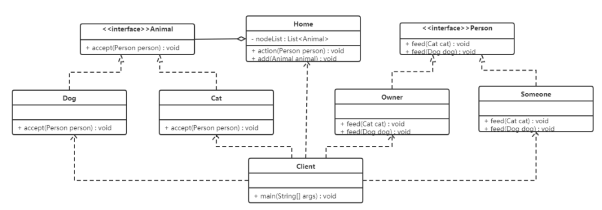

## **访问者模式（Visitor Pattern）**

### **1.概述**

访问者模式：封装一些作用于某种数据结构中的各元素的操作，它可以在不改变这个数据结构的前提下定义作用于这些元素的新的操作。

------

### **2.结构**

访问者模式包含以下主要角色:

- Visitor：抽象访问者角色，定义了对每一个元素 Element 访问的行为，它的参数就是可以访问的元素，它的方法个数理论上来讲与元素类个数（Element 的实现类个数）是一样的，从这点不难看出，访问者模式要求元素类的个数不能改变。
- ConcreteVisitor：具体访问者角色，给出对每一个元素类访问时所产生的具体行为。
- Element：抽象元素角色，定义了一个接受访问者的方法（accept），其意义是指，每一个元素都要可以被访问者访问。
- ConcreteElement：具体元素角色， 提供接受访问方法的具体实现，而这个具体的实现，通常情况下是使用访问者提供的访问该元素类的方法。
- Object Structure：对象结构角色，定义当中所提到的对象结构，对象结构是一个抽象表述，具体点可以理解为一个具有容器性质或者复合对象特性的类，它会含有一组元素（Element），并且可以迭代这些元素，供访问者访问。

------

### **3.案例实现**

【例】给宠物喂食

现在养宠物的人特别多，就以这个为例，当然宠物还分为狗，猫等，要给宠物喂食的话，主人可以喂，其他人也可以喂食。

- 抽象访问者角色：给宠物喂食的人
- 具体访问者角色：主人、其他人
- 抽象元素角色：动物抽象类
- 具体元素角色：宠物狗、宠物猫
- 结构对象角色：主人家



```JAVA
//抽象访问者类：给宠喂食
public interface Person {
    // 喂食宠物猫
    void feed(Cat cat);
    // 喂食宠物狗
    void feed(Dog dog);
}
```

```JAVA
//具体访问者角色：主人、其他人，都实现 Person 接口
/**
 * 具体访问者角色类(自己)
 */
public class Owner implements Person {
    public void feed(Cat cat) {
        System.out.println("主人喂食猫");
    }
    public void feed(Dog dog) {
        System.out.println("主人喂食狗");
    }
}
/**
 *  具体访问者角色类(其他人)
 */
public class Someone implements Person {
    public void feed(Cat cat) {
        System.out.println("其他人喂食猫");
    }
    public void feed(Dog dog) {
        System.out.println("其他人喂食狗");
    }
}
```

```JAVA
//抽象元素角色：被喂食的动物抽象类
public interface Animal {
    // 接受访问者访问的功能
    void accept(Person person);
}

```

```JAVA
//具体元素角色：狗、猫
/**
 * 具体元素角色类（宠物狗）
 */
public class Dog implements Animal {
    public void accept(Person person) {
        person.feed(this); // 访问者给宠物狗喂食
        System.out.println("好好吃，汪汪汪。。。");
    }
}
/**
 * 具体元素角色类（宠物猫）
 */
public class Cat implements Animal {
    public void accept(Person person) {
        person.feed(this); // 访问者给宠物猫喂食
        System.out.println("好好吃，喵喵喵。。。");
    }
}

```

```JAVA
//对象结构角色：此案例中是主人的家
public class Home {
    // 声明一个集合对象，用来存储元素对象
    private List<Animal> nodeList = new ArrayList<>();
    // 添加元素功能
    public void add(Animal animal) {
        nodeList.add(animal);
    }
    public void action(Person person) {
        // 遍历集合，获取每一个元素，让访问者访问每一个元素
        for (Animal animal : nodeList) {
            animal.accept(person);
        }
    }
}

```

```JAVA
//测试类：
public class Client {
    public static void main(String[] args) {
        // 创建Home对象
        Home home = new Home();
        // 添加元素到Home对象中
        home.add(new Dog());
        home.add(new Cat());


        // 创建主人对象
        Owner owner = new Owner();
        // 让主人喂食所有的宠物
        home.action(owner);
    }
}
-------------------------------------
主人喂食狗
好好吃，汪汪汪。。。
主人喂食猫
好好吃，喵喵喵。。。
```

------

### **4.优缺点**

**优点：**

- 扩展性好

在不修改对象结构中的元素的情况下，为对象结构中的元素添加新的功能。

- 复用性好

通过访问者来定义整个对象结构通用的功能，从而提高复用程度。

- 分离无关行为

通过访问者来分离无关的行为，把相关的行为封装在一起，构成一个访问者，这样每一个访问者的功能都比较单一。

**缺点：**

- 对象结构变化很困难

在访问者模式中，每增加一个新的元素类，都要在每一个具体访问者类中增加相应的具体操作，这违背了 “开闭原则”。

- 违反了依赖倒置原则

访问者模式依赖了具体类，而没有依赖抽象类。

------

### **5.使用场景**

- 对象结构相对稳定，但其操作算法经常变化的程序。
- 对象结构中的对象需要提供多种不同且不相关的操作，而且要避免让这些操作的变化影响对象的结构。

------

### **6.扩展**

**访问者模式用到了一种双分派的技术。**

**分派：**变量被声明时的类型叫做变量的静态类型（也被叫做明显类型）；而变量所引用的对象的真实类型又叫做变量的实际类型。

比如 Map map = new HashMap() ，map 变量的静态类型是 Map ，实际类型是 HashMap 。

根据对象的类型而对方法进行的选择，就是分派 (Dispatch)，分派又分为两种：

- 动态分派 (Dynamic Dispatch) 发生在运行时期，动态分派动态地置换掉某个方法，Java 通过方法的重写支持动态分派。
- 静态分派 (Static Dispatch) 发生在编译时期，分派根据静态类型信息发生，方法重载就是静态分派。


**1.动态分派**

通过**方法重写**支持动态分派。

```JAVA
public class Animal {
    public void execute() {
        System.out.println("Animal");
    }
}


public class Dog extends Animal {
    @Override
    public void execute() {
        System.out.println("dog");
    }
}


public class Cat extends Animal {
    @Override
    public void execute() {
        System.out.println("cat");
    }
}


public class Client {
       public static void main(String[] args) {
        Animal a = new Animal();
        a.execute();
      
        Animal d = new Dog();
        d.execute();
        
        Animal c = new Cat();
        c.execute();
    }
}

-----------------
animal
dog
cat

```

Java 编译器在编译时期并不总是知道哪些代码会被执行，因为编译器仅仅知道对象的静态类型，而不知道对象的真实类型；而方法的调用则是根据对象的真实类型，而不是静态类型。


**2.静态分派**

通过**方法重载**支持静态分派。

```JAVA
public class Animal {}

public class Dog extends Animal {}

public class Cat extends Animal {}

public class Execute {
    public void execute(Animal a) {
        System.out.println("Animal");
    }
    public void execute(Dog d) {
        System.out.println("dog");
    }
    public void execute(Cat c) {
        System.out.println("cat");
    }
}


public class Client {
    public static void main(String[] args) {
        Animal a = new Animal();
        Animal a1 = new Dog();
        Animal a2 = new Cat();
            // 静态分派根据静态类型决定
        Execute exe = new Execute();
        exe.execute(a);
        exe.execute(a1);
        exe.execute(a2);
    }
}
---------------
animal
animal
animal
```

**3.双分派**

所谓**双分派技术**就是在选择一个方法的时候，不仅仅要根据消息接收者的运行时区别，还要根据参数的运行时区别。

```JAVA
public class Animal {
    public void accept(Execute exe) {
        // 2.传递了this给Execute,根据静态类型进行方法重载实现静态分派
        exe.execute(this);
    }
}

public class Dog extends Animal {
    public void accept(Execute exe) {
        exe.execute(this);
    }
}

public class Cat extends Animal {
    public void accept(Execute exe) {
        exe.execute(this);
    }
}

public class Execute {
    public void execute(Animal a) {
        System.out.println("animal");
    }
    public void execute(Dog d) {
        System.out.println("dog");
    }
    public void execute(Cat c) {
        System.out.println("cat");
    }
}


public class Client {
    public static void main(String[] args) {
        Animal a = new Animal();
        Animal d = new Dog();
        Animal c = new Cat();


        Execute exe = new Execute();
          //1.exe传递给Animal类型的变量调用,方法重写实现动态分派
        a.accept(exe);
        d.accept(exe);
        c.accept(exe);
    }
}


```

上面代码中：

- 客户端将 Execute 的对象做为参数传递给 Animal 类型的变量调用的方法，这里完成第一次分派，这里是方法重写，所以是动态分派，也就是执行实际类型中的方法；
- 同时也将自己 this 作为参数传递进去，这里就完成了第二次分派，这里的 Execute 类中有多个重载方法，而传递进行的是 this，就是具体的实际类型的对象，所以是静态分派。


**双分派实现动态绑定的本质：在重载方法委派的前面加上了继承体系中覆盖的环节，由于覆盖是动态的，所以重载就是动态的了。**


理解：

1、动态分派要达到的效果是正确的，分别输出 a、b、c，但是实现每个对象的方法都写在其各自的类中，不好维护，它的实现过程不行。

2、静态分派的这种实现过程是比较好的，没有把输出 a、b、c 的操作耦合到各自的类中，而是统一在 Execute 中维护执行，但是却没有达到想要的效果。。

3、所以也就有了双分派，同样是将执行过程放在 Execute 中管理，最后也达到了想要的效果，输出结果为 a、b、c。其实现方法其实就是在各个类中依赖了 Execute，再将自己 this 传递过去，从而实现在 Execute 操作的目的。