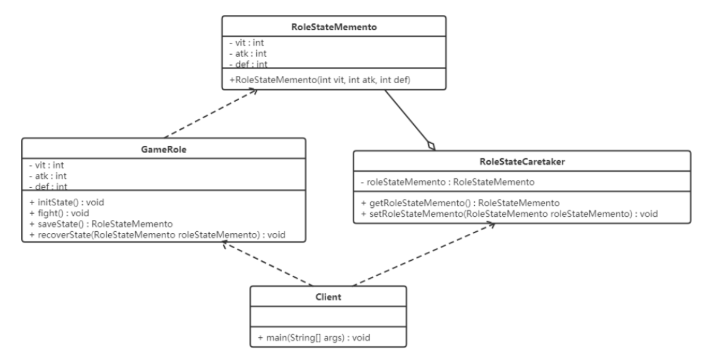
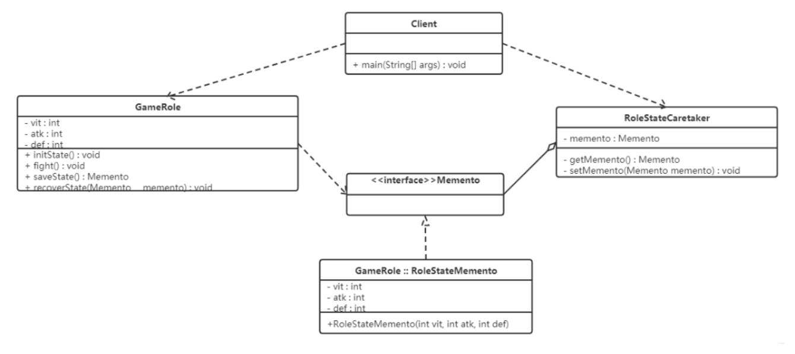

## **备忘录模式（Memento Pattern）**

### **1.概述**

**备忘录模式**：又叫**快照模式**，在不破坏封装性的前提下，捕获一个对象的内部状态，并在该对象之外保存这个状态，以便以后当需要时能将该对象恢复到原先保存的状态。

备忘录模式提供了一种状态恢复的实现机制，使得用户可以方便地回到一个特定的历史步骤，当新的状态无效或者存在问题时，可以使用暂时存储起来的备忘录将状态复原，很多软件都提供了撤销（Undo）操作，如 Word、记事本、Photoshop、IDEA等软件在编辑时按 Ctrl+Z 组合键时能撤销当前操作，使文档恢复到之前的状态；还有在 浏览器 中的后退键、数据库事务管理中的回滚操作、玩游戏时的中间结果存档功能、数据库与操作系统的备份操作、棋类游戏中的悔棋功能等都属于这类。

------

### **2.结构**

备忘录模式的主要角色如下：

- Originator：发起人角色，记录当前时刻的内部状态信息，提供创建备忘录和恢复备忘录数据的功能，实现其他业务功能，它可以访问备忘录里的所有信息。
- Memento：备忘录角色，负责存储发起人的内部状态，在需要的时候提供这些内部状态给发起人。
- Caretaker：管理者角色，对备忘录进行管理，提供保存与获取备忘录的功能，但其不能对备忘录的内容进行访问与修改。

**备忘录有两个等效的接口：**

**窄接口**：管理者对象（和其他发起人对象之外的任何对象）看到的是备忘录的窄接口 (narror Interface)，这个窄接口只允许他把备忘录对象传给其他的对象。

**宽接口**：发起人对象可以看到一个宽接口 (wide Interface)，这个宽接口允许它读取所有的数据，以便根据这些数据恢复这个发起人对象的内部状态。

------

### **3.案例实现**

【例】游戏挑战BOSS

游戏中的某个场景，一游戏角色有生命力、攻击力、防御力等数据，在打 Boss 前和后一定会不一样的，我们允许玩家如果感觉与 Boss 决斗的效果不理想可以让游戏恢复到决斗之前的状态。

要实现上述案例，有两种方式：

- “白箱”备忘录模式
- “黑箱”备忘录模式


**白箱备忘录模式**

白箱模式下，备忘录角色对任何对象都提供一个宽接口，备忘录角色的内部所存储的状态就对所有对象公开。



```java
//发起人角色：游戏角色
/**
 * 游戏角色类(属于发起人角色)
 */
@Data
public class GameRole {
    private int vit; // 生命力
    private int atk; // 攻击力
    private int def; // 防御力
    // 初始化内部状态
    public void initState() {
        this.vit = 100;
        this.atk = 100;
        this.def = 100;
    }
    // 战斗
    public void fight() {
        this.vit = 0;
        this.atk = 0;
        this.def = 0;
    }
    // 保存角色状态功能
    public RoleStateMemento saveState() {
        return new RoleStateMemento(vit, atk, def);
    }
    // 恢复角色状态
    public void recoverState(RoleStateMemento roleStateMemento) {
        // 将备忘录对象中存储的状态赋值给当前对象的成员
        this.vit = roleStateMemento.getVit();
        this.atk = roleStateMemento.getAtk();
        this.def = roleStateMemento.getDef();
    }
    // 展示状态功能
    public void stateDisplay() {
        System.out.println("角色生命力：" + vit);
        System.out.println("角色攻击力：" + atk);
        System.out.println("角色防御力：" + def);
    }
}

```

```java
//备忘录角色：用于存储发起人的内部状态，因此拥有属性和发起人一样
@Data
@AllArgsConstructor
public class RoleStateMemento {
    private int vit; // 生命力
    private int atk; // 攻击力
    private int def; // 防御力
}

```

```java
//管理者角色：用于管理备忘录角色
@Data
public class RoleStateCaretaker {
    private RoleStateMemento roleStateMemento;
}
```

```java
//测试类：
public class Client {
    public static void main(String[] args) {
        System.out.println("---------------大战boss前-----------------");
        // 创建游戏角色对象
        GameRole gameRole = new GameRole();
        gameRole.initState(); // 初始化状态操作
        gameRole.stateDisplay();
        // 将该游戏角色内部状态进行备份
        // 创建管理者对象
        RoleStateCaretaker roleStateCaretaker = new RoleStateCaretaker();
        roleStateCaretaker.setRoleStateMemento(gameRole.saveState());


        System.out.println("---------------大战boss后-----------------");
        // 损耗严重
        gameRole.fight();
        gameRole.stateDisplay();


        System.out.println("---------------恢复之前的状态-----------------");
        gameRole.recoverState(roleStateCaretaker.getRoleStateMemento());
        gameRole.stateDisplay();
    }
}
----------------------------
---------------大战boos前-----------------
角色生命力：100
角色攻击力：100
角色防御力：100
---------------大战boos后-----------------
角色生命力：0
角色攻击力：0
角色防御力：0
---------------恢复之前的状态-----------------
角色生命力：100
角色攻击力：100
角色防御力：100
```

> 分析：白箱备忘录模式是破坏封装性的，但是通过程序员自律，同样可以在一定程度上实现模式的大部分用意。


**黑箱备忘录模式**

黑箱模式下，备忘录角色对发起人对象提供一个宽接口，为其他对象提供一个窄接口。

Java 中，实现双重接口的办法是：将备忘录类设计成发起人类的内部成员类。

- 将 RoleStateMemento 设为 GameRole 的内部类，从而将 RoleStateMemento 对象封装在 GameRole 里面；
- 在外面提供一个标识接口 Memento 给 RoleStateCaretaker 及其他对象使用。
- 这样 GameRole 类看到的是 RoleStateMemento 所有的接口，而RoleStateCaretaker 及其他对象看到的仅仅是标识接口 Memento 所暴露出来的接口，从而维护了封装性。



```java
//备忘录接口：对外提供窄接口，标识接口，没有任何方法
public interface Memento {
}

```

```java
//发起人角色：游戏角色，在内部定义备忘录内部类 RoleStateMemento（私有），对自己提供宽接口，但外部无法访问
@Data
public class GameRole {
    private int vit; // 生命力
    private int atk; // 攻击力
    private int def; // 防御力
    // 初始化内部状态
    public void initState() {
        this.vit = 100;
        this.atk = 100;
        this.def = 100;
    }
    // 战斗
    public void fight() {
        this.vit = 0;
        this.atk = 0;
        this.def = 0;
    }
    // 保存角色状态功能
    public Memento saveState() {
        return new RoleStateMemento(vit, atk, def);
    }
    // 恢复角色状态
    public void recoverState(Memento memento) {
        RoleStateMemento roleStateMemento = (RoleStateMemento) memento;
        // 将备忘录对象中存储的状态赋值给当前对象的成员
        this.vit = roleStateMemento.getVit();
        this.atk = roleStateMemento.getAtk();
        this.def = roleStateMemento.getDef();
    }
    // 展示状态功能
    public void stateDisplay() {
        System.out.println("角色生命力：" + vit);
        System.out.println("角色攻击力：" + atk);
        System.out.println("角色防御力：" + def);
    }
    // 对发起者宽接口，对其他类窄接口
    @Data
    @AllArgsConstructor
    private static class RoleStateMemento implements Memento {
        private int vit; // 生命力
        private int atk; // 攻击力
        private int def; // 防御力
    }
}

```

```java
//管理者角色：这个类聚合的是 Memento 接口，只是个标识接口，因此该角色无法更改备忘录的内容
@Data
public class RoleStateCaretaker {
    private Memento memento;
}
```

```java
//测试类：
public class Client {
    public static void main(String[] args) {
        System.out.println("---------------大战boos前-----------------");
        // 创建游戏角色对象
        GameRole gameRole = new GameRole();
        gameRole.initState(); // 初始化状态操作
        gameRole.stateDisplay();
        // 将该游戏角色内部状态进行备份
        // 创建管理者对象
        RoleStateCaretaker roleStateCaretaker = new RoleStateCaretaker();
        roleStateCaretaker.setMemento(gameRole.saveState());


        System.out.println("---------------大战boos后-----------------");
        // 损耗严重
        gameRole.fight();
        gameRole.stateDisplay();


        System.out.println("---------------恢复之前的状态-----------------");
        gameRole.recoverState(roleStateCaretaker.getMemento());
        gameRole.stateDisplay();
    }
}

-----------------------
---------------大战boos前-----------------
角色生命力：100
角色攻击力：100
角色防御力：100
---------------大战boos后-----------------
角色生命力：0
角色攻击力：0
角色防御力：0
---------------恢复之前的状态-----------------
角色生命力：100
角色攻击力：100
角色防御力：100
```

------

### **4.优缺点**

**优点：**

- 提供了一种可以恢复状态的机制。当用户需要时能够比较方便地将数据恢复到某个历史的状态。
- 简化了发起人类。发起人无需管理和保存其内部状态的备份，所有状态备份保存在备忘录中，由管理者进行管理，符合单一职责原则。
- （黑箱模式）实现了内部状态的封装。除了创建它的发起人之外，其他对象都不能够访问这些状态信息。

**缺点：**

- 资源消耗大。如果要保存的内部状态信息过多或者特别频繁，将会占用比较大的内存资源。

------

### **5.使用场景**

- 需要保存与恢复数据的场景，如玩游戏时的中间结果的存档功能。
- 需要提供一个可回滚操作的场景，如 Word、记事本、Photoshop，idea等软件在编辑时按 Ctrl+Z 组合键，还有数据库中事务操作。