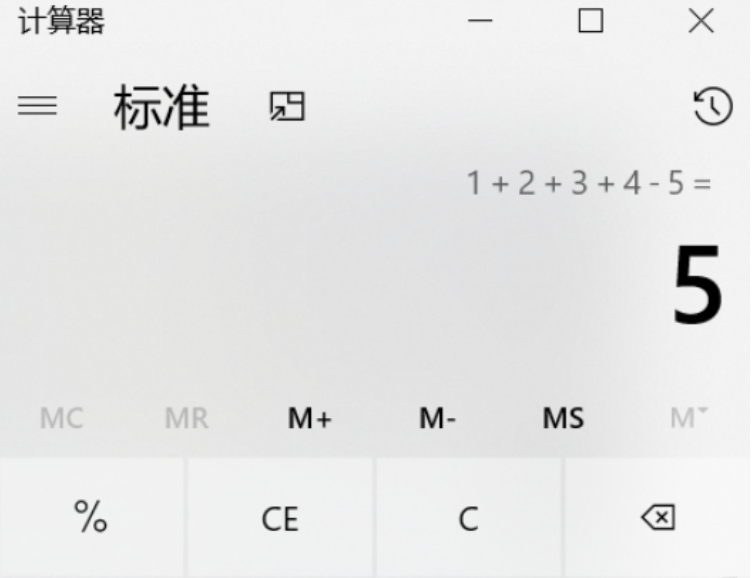
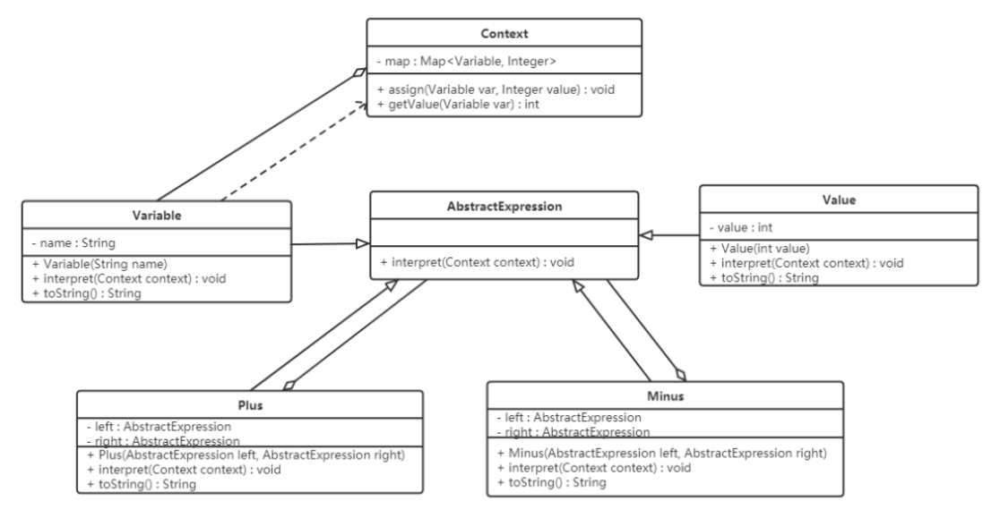

## **解释器模式（Interpreter Pattern)**

### **1.概述**

**解释器模式**：给定一个语言，定义它的文法表示，并定义一个解释器，这个解释器使用该标识来解释语言中的句子；


**实列：**



如上图，设计一个软件用来进行加减计算，我们第一想法就是使用工具类，提供对应的加法和减法的工具方法。

```java
// 用于两个整数相加
public static int add(int a,int b){
    return a + b;
}


// 用于三个整数相加
public static int add(int a,int b,int c){
    return a + b + c;
}


// 用于n个整数相加
public static int add(Integer ... arr) {
    int sum = 0;
    for (Integer i : arr) {
        sum += i;
    }
    return sum;
}

```

上面的形式比较单一、有限，如果形式变化非常多，这就不符合要求，因为加法和减法运算，两个运算符与数值可以有无限种组合方式。比如 1+2+3+4+5、1+2+3-4 等等。显然，现在需要一种翻译识别机器，能够解析由数字以及 + - 符号构成的合法的运算序列。

如果把运算符和数字都看作节点的话，能够逐个节点的进行读取解析运算，这就是解释器模式的思维。

在解释器模式中，我们需要将待解决的问题，提取出规则，抽象为一种“语言”。比如加减法运算，规则为：由数值和±符号组成的合法序列，“1+3-2”就是这种语言的句子。解释器就是要解析出来语句的含义。

**文法（语法）规则：**文法是用于描述语言的语法结构的形式规则

```
expression ::= value | plus | minus
plus ::= expression ‘+’ expression   
minus ::= expression ‘-’ expression  
value ::= integer
```

> 这里的符号 ::= 表示“定义为”的意思，竖线 | 表示或，左右的其中一个，引号内为字符本身，引号外为语法。


上面规则描述为：表达式可以是一个值，也可以是 plus 或者 minus 运算，而 plus 和 minus 又是由表达式结合运算符构成，值的类型为整型数。


**抽象语法树：**在计算机科学中，抽象语法树（AbstractSyntaxTree，AST），或简称语法树（Syntax tree），是源代码语法结构的一种抽象表示。它以树状的形式表现编程语言的语法结构，树上的每个节点都表示源代码中的一种结构。

用树形来表示符合文法规则的句子。


------

### **2.结构**

解释器模式包含以下主要角色：

- Abstract Expression：抽象表达式，定义解释器的接口，约定解释器的解释操作，主要包含解释方法 interpret()。
- Terminal Expression：终结符表达式，是抽象表达式的子类，用来实现文法中与终结符相关的操作，文法中的每一个终结符都有一个具体终结表达式与之相对应。
- Nonterminal Expression：非终结符表达式，也是抽象表达式的子类，用来实现文法中与非终结符相关的操作，文法中的每条规则都对应于一个非终结符表达式。
- Context：环境角色，通常包含各个解释器需要的数据或是公共的功能，一般用来传递被所有解释器共享的数据，后面的解释器可以从这里获取这些值。
- Client：客户端，主要任务是将需要分析的句子或表达式转换成使用解释器对象描述的抽象语法树，然后调用解释器的解释方法，当然也可以通过环境角色间接访问解释器的解释方法。

------

### **3.案例实现**

【例】设计实现加减法的软件



```java
//抽象表达式：
public abstract class AbstractExpression {
    public abstract int interpret(Context context);
}
```

```java
//终结符表达式：变量表达式
@AllArgsConstructor
public class Variable extends AbstractExpression {
    // 声明存储变量名的成员变量
    private String name;


    public int interpret(Context context) {
        // 直接返回变量的值
        return context.getValue(this);
    }


    @Override
    public String toString() {
        return name;
    }
}

```

```java
//非终结表达式：加法表达式、减法表达式
/**
 * 加法表达式类
 */
@AllArgsConstructor
public class Plus extends AbstractExpression {
    // +号左边的表达式
    private AbstractExpression left;
    // +号右边的表达式
    private AbstractExpression right;
    @Override
    public int interpret(Context context) {
        // 将左边表达式的结果和右边表达式的结果进行相加
        return left.interpret(context) + right.interpret(context);
    }
    @Override
    public String toString() {
        return "(" + left.toString() + " + " + right.toString() + ")";
    }
}
/**
 * 减法表达式类
 */
@AllArgsConstructor
public class Minus extends AbstractExpression {
    // -号左边的表达式
    private AbstractExpression left;
    // -号右边的表达式
    private AbstractExpression right;
    @Override
    public int interpret(Context context) {
        // 将左边表达式的结果和右边表达式的结果进行相减
        return left.interpret(context) - right.interpret(context);
    }
    @Override
    public String toString() {
        return "(" + left.toString() + " - " + right.toString() + ")";
    }
}
```

```java
//环境角色类：
public class Context {
    // 定义一个map集合，用来存储变量及对应的值
    private Map<Variable, Integer> map = new HashMap<>();
    // 添加变量的功能
    public void assign(Variable var, Integer value) {
        map.put(var, value);
    }
    // 根据变量获取对应的值
    public int getValue(Variable var) {
        return map.get(var);
    }
}

```

```java
//测试类：
public class Client {
    public static void main(String[] args) {
        // 创建环境对象
        Context context = new Context();
        // 创建多个变量对象
        Variable a = new Variable("a");
        Variable b = new Variable("b");
        Variable c = new Variable("c");
        Variable d = new Variable("d");


        // 将变量存储到环境对象中
        context.assign(a, 1);
        context.assign(b, 2);
        context.assign(c, 3);
        context.assign(d, 4);


        // 获取抽象语法树 a + b - c + d
        AbstractExpression expression = new Plus(a, new Minus(new Minus(b, c), d));


        //  解释（计算）
        int result = expression.interpret(context);
        System.out.println(expression + " = " + result);
    }
}
------------------
(a + ((b - c) - d)) = -4
```

### **4.优缺点**

**优点：**

- 易于改变和扩展文法。

> 由于在解释器模式中使用类来表示语言的文法规则，因此可以通过继承等机制来改变或扩展文法。每一条文法规则都可以表示为一个类，因此可以方便地实现一个简单的语言。

- 实现文法较为容易。

> 在抽象语法树中每一个表达式节点类的实现方式都是相似的，这些类的代码编写都不会特别复杂。

- 增加新的解释表达式较为方便。

> 如果用户需要增加新的解释表达式只需要对应增加一个新的终结符表达式或非终结符表达式类，原有表达式类代码无须修改，符合 “开闭原则”。

**缺点：**

- 对于复杂文法难以维护。

> 在解释器模式中，每一条规则至少需要定义一个类，因此如果一个语言包含太多文法规则，类的个数将会急剧增加，导致系统难以管理和维护。

- 执行效率较低。

> 由于在解释器模式中使用了大量的循环和递归调用，因此在解释较为复杂的句子时其速度很慢，而且代码的调试过程也比较麻烦。

------

### **5.使用场景**

- 当语言的文法较为简单，且执行效率不是关键问题时。
- 当问题重复出现，且可以用一种简单的语言来进行表达时。
- 当一个语言需要解释执行，并且语言中的句子可以表示为一个抽象语法树的时候。