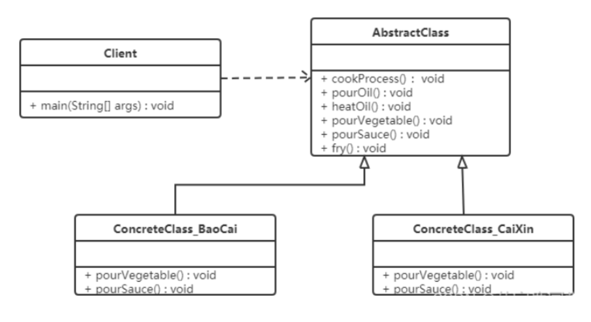
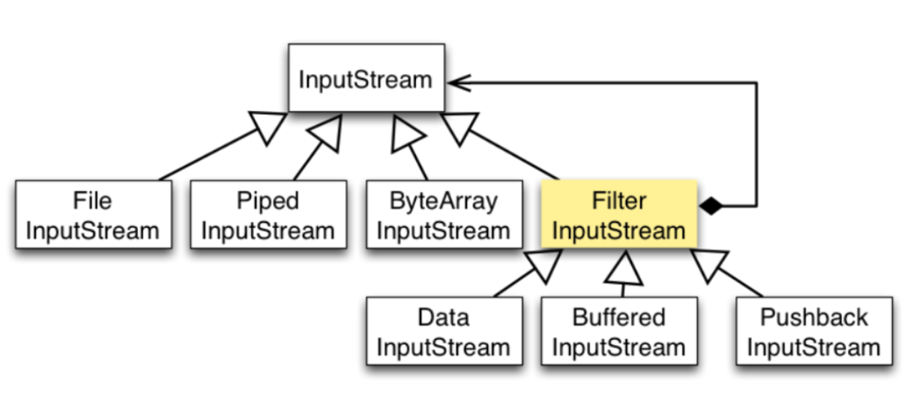

## **模板模式（Template Pattern）**

### **1.概述**

**模板方法模式**：定义一个操作中的算法骨架，而将算法的一些步骤延迟到子类中，使得子类可以不改变该算法结构的情况下重定义该算法的某些特定步骤。


在面向对象程序设计过程中，程序员常常会遇到这种情况：设计一个系统时知道了算法所需的关键步骤，而且确定了这些步骤的执行顺序，但某些步骤的具体实现还未知，或者说某些步骤的实现与具体的环境相关。

例如，去银行办理业务一般要经过以下 4 个流程：取号、排队、办理具体业务、对银行工作人员进行评分等，其中取号、排队和对银行工作人员进行评分的业务对每个客户是一样的，可以在父类中实现，但是办理具体业务却因人而异，它可能是存款、取款或者转账等，可以延迟到子类中实现。

------

### **2.结构**

模板方法（Template Method）模式包含以下主要角色：

- 抽象类（Abstract Class）：负责给出一个算法的轮廓和骨架。它由一个模板方法和若干个基本方法构成。

​        **·** 模板方法：定义了算法的骨架，按某种顺序调用其包含的基本方法。

​        **·**  基本方法：是实现算法各个步骤的方法，是模板方法的组成部分。基本方法又可以分为三种：

​               **·** 抽象方法 (Abstract Method) ：一个抽象方法由抽象类声明、由其具体子类实现。

​               **·** 具体方法 (Concrete Method) ：一个具体方法由一个抽象类或具体类声明并实现，其子类可以进行覆盖也可以直接继承。

​               **·** 钩子方法 (Hook Method) ：在抽象类中已经实现，包括用于判断的逻辑方法和需要子类重写的空方法两种。

​         一般钩子方法是用于判断的逻辑方法，这类方法名一般为 isXxx，返回值类型为 boolean 类型。

- 具体子类（Concrete Class）：实现抽象类中所定义的抽象方法和钩子方法，它们是一个顶级逻辑的组成步骤。

------

### **3.案例实现**

【例】炒菜

炒菜的步骤是固定的，分为【倒油】、【热油】、【倒蔬菜】、【倒调料品】、【翻炒】等步骤。

现通过模板方法模式来用代码模拟，类图如下：



**抽象类**：定义模板方法和抽象方法。

> 为防止恶意操作，一般模板方法都加上 final 关键词。

```java
public abstract class AbstractClass {
    // 模板方法定义
    public final void cookProcess() {
        pourOil();
        heatOil();
        pourVegetable();
        pourSauce();
        fry();
    }
    // 第一步：倒油是一样的，直接实现
    public void pourOil() {
        System.out.println("倒油");
    }
    // 第二步：热油是一样的，直接实现
    public void heatOil() {
        System.out.println("热油");
    }
    // 第三步：倒蔬菜是不一样的（一个下包菜，一个是下菜心），抽象方法
    public abstract void pourVegetable();
    // 第四步：倒调味料是不一样，抽象方法
    public abstract void pourSauce();
    // 第五步：翻炒是一样的，直接实现
    public void fry() {
        System.out.println("炒啊炒啊炒到熟啊");
    }
}
```

```java
//具体子类：实现模板方法中的抽象方法和钩子方法
/**
 * 炒包菜类
 */
public class ConcreteClass_BaoCai extends AbstractClass {
    public void pourVegetable() {
        System.out.println("下锅的蔬菜是包菜");
    }
    public void pourSauce() {
        System.out.println("下锅的酱料是辣椒");
    }
}


/**
 * 炒菜心类
 */
public class ConcreteClass_CaiXin extends AbstractClass {
    public void pourVegetable() {
        System.out.println("下锅的蔬菜是菜心");
    }
    public void pourSauce() {
        System.out.println("下锅的酱料是蒜蓉");
    }
}
```

```java
//测试类：
public class Client {
    public static void main(String[] args) {
        // 炒包菜
        // 创建对象
        ConcreteClass_BaoCai baoCai = new ConcreteClass_BaoCai();
        // 调用炒菜的功能
        baoCai.cookProcess();
    }
}
------------------
倒油
热油
下锅的蔬菜是包菜
下锅的酱料是辣椒
炒啊炒啊炒到熟啊
测试类：
```

------

### **4.优缺点**

**优点：**

- 提高代码复用性：将相同部分的代码放在抽象的父类中，而将不同的代码放入不同的子类中。
- 实现了反向控制：通过一个父类调用其子类的操作，通过对子类的具体实现扩展不同的行为，实现了反向控制 ，符合“开闭原则”。

**缺点：**

- 对每个不同的实现都需要定义一个子类，这会导致类的个数增加，系统更加庞大，设计也更加抽象。
- 父类中的抽象方法由子类实现，子类执行的结果会影响父类的结果，这导致一种反向的控制结构，它提高了代码阅读的难度。

------

### **5.适用场景**

算法的整体步骤很固定，但其中个别部分易变时，这时候可以使用模板方法模式，将容易变的部分抽象出来，供子类实现。

需要通过子类来决定父类算法中某个步骤是否执行，实现子类对父类的反向控制。

------

### **6.拓展**

**JDK源码 - InputStream**

[InputStream](https://so.csdn.net/so/search?q=InputStream&spm=1001.2101.3001.7020) 类中使用了模板方法模式。在 InputStream 类中定义了多个 read() 方法，如下：

```java
public abstract class InputStream implements Closeable {
    // 抽象方法，要求子类必须重写
    public abstract int read() throws IOException;


    public int read(byte b[]) throws IOException {
        return read(b, 0, b.length);
    }


    public int read(byte b[], int off, int len) throws IOException {
        if (b == null) {
            throw new NullPointerException();
        } else if (off < 0 || len < 0 || len > b.length - off) {
            throw new IndexOutOfBoundsException();
        } else if (len == 0) {
            return 0;
        }


        int c = read(); // 调用了无参的read方法，该方法是每次读取一个字节数据
        if (c == -1) {
            return -1;
        }
        b[off] = (byte)c;


        int i = 1;
        try {
            for (; i < len ; i++) {
                c = read(); // 调用了无参的read方法，该方法是每次读取一个字节数据
                if (c == -1) {
                    break;
                }
                b[off + i] = (byte)c;
            }
        } catch (IOException ee) {
        }
        return i;
    }
}

```

从上面代码可以看到，无参的 read() 方法是抽象方法，要求子类必须实现。而 read(byte b[]) 方法调用了 read(byte b[], int off, int len) 方法，所以在此处重点看的方法是带三个参数的方法。

在该方法中，可以看到调用了无参的抽象的 read() 方法。


**All源码：**



**InputStream 抽象类**

```java
public abstract int read() 
// 读取数据


public int read(byte b[]) 
// 将读取到的数据放在 byte 数组中，该方法实际上是根据下面的方法实现的，off 为 0，len 为数组的长度


public int read(byte b[], int off, int len) 
// 从第 off 位置读取 len 长度字节的数据放到 byte 数组中，流是以 -1 来判断是否读取结束的


public long skip(long n) 
// 跳过指定个数的字节不读取，想想看电影跳过片头片尾


public int available() 
// 返回可读的字节数量


public void close() 
// 读取完，关闭流，释放资源


public synchronized void mark(int readlimit) 
// 标记读取位置，下次还可以从这里开始读取，使用前要看当前流是否支持，可以使用 markSupport() 方法判断


public synchronized void reset() 
// 重置读取位置为上次 mark 标记的位置


public boolean markSupported() 
// 判断当前流是否支持标记流，和上面两个方法配套使用
```

**源码实现**

```java
public abstract class InputStream implements Closeable {
    private static final int SKIP_BUFFER_SIZE = 2048;  //用于skip方法，和skipBuffer相关
    private static byte[] skipBuffer;    // skipBuffer is initialized in skip(long), if needed.
    
    //从输入流中读取下一个字节，
    //正常返回0-255，到达文件的末尾返回-1
    //在流中还有数据，但是没有读到时该方法会阻塞(block)
    //Java IO和New IO的区别就是阻塞流和非阻塞流
    //抽象方法！不同的子类不同的实现！
    public abstract int read() throws IOException;  
    
    //将流中的数据读入放在byte数组的第off个位置先后的len个位置中
    //返回值为放入字节的个数。
    //这个方法在利用抽象方法read，某种意义上简单的Templete模式。
    public int read(byte b[], int off, int len) throws IOException {
        //检查输入是否正常。一般情况下，检查输入是方法设计的第一步
        if (b == null) {    
            throw new NullPointerException();
        } else if (off < 0 || len < 0 || len > b.length - off) {
             throw new IndexOutOfBoundsException();
        } else if (len == 0) {
             return 0;
        }        
        //读取下一个字节
        int c = read();
        //到达文件的末端返回-1
        if (c == -1) {    return -1;   }
        //返回的字节downcast                           
        b[off] = (byte)c;
        //已经读取了一个字节                                                   
        int i = 1;                                                                        
        try {
            //最多读取len个字节，所以要循环len次
            for (; i < len ; i++) {
                //每次循环从流中读取一个字节
                //由于read方法阻塞，
                //所以read(byte[],int,int)也会阻塞
                c = read();
                //到达末尾，理所当然返回-1                                       
                if (c == -1) {            break;           } 
                //读到就放入byte数组中
                b[off + i] = (byte)c;
            }
        } catch (IOException ee) {     }
        return i;
    }


     //利用上面的方法read(byte[] b)
    public int read(byte b[]) throws IOException {
        return read(b, 0, b.length);
     }                          
    //方法内部使用的、表示要跳过的字节数目，
     public long skip(long n) throws IOException {
        long remaining = n;    
        int nr;
        if (skipBuffer == null)
        //初始化一个跳转的缓存
        skipBuffer = new byte[SKIP_BUFFER_SIZE];                   
        //本地化的跳转缓存
        byte[] localSkipBuffer = skipBuffer;          
        //检查输入参数，应该放在方法的开始                            
        if (n <= 0) {    return 0;      }                             
        //一共要跳过n个，每次跳过部分，循环       
        while (remaining > 0) {                                      
            nr = read(localSkipBuffer, 0, (int) Math.min(SKIP_BUFFER_SIZE, remaining));
            //利用上面的read(byte[],int,int)方法尽量读取n个字节  
            //读到流的末端，则返回
            if (nr < 0) {  break;    }
            //没有完全读到需要的，则继续循环
            remaining -= nr;                                       
        }       
        return n - remaining;//返回时要么全部读完，要么因为到达文件末端，读取了部分
    }
    //查询流中还有多少可以读取的字节
    //该方法不会block。在java中抽象类方法的实现一般有以下几种方式: 
    //1.抛出异常(java.util)；2.“弱”实现。像上面这种。子类在必要的时候覆盖它。
    //3.“空”实现。
    public int available() throws IOException {           
        return 0;
    }
    //关闭当前流、同时释放与此流相关的资源
    //关闭当前流、同时释放与此流相关的资源
    public void close() throws IOException {}
    //markSupport可以查询当前流是否支持mark
    public synchronized void mark(int readlimit) {}
    //对mark过的流进行复位。只有当流支持mark时才可以使用此方法。
    public synchronized void reset() throws IOException {


                   throw new IOException("mark/reset not supported");


}
    //查询是否支持mark
    //绝大部分不支持，因此提供默认实现，返回false。子类有需要可以覆盖。
    public boolean markSupported() {           
        return false;
    }
}
```

**FilterInputStream**

```java
public class FilterInputStream extends InputStream {
    //装饰器的代码特征: 被装饰的对象一般是装饰器的成员变量
    protected volatile InputStream in; //将要被装饰的字节输入流
    protected FilterInputStream(InputStream in) {   //通过构造方法传入此被装饰的流
        this.in = in;
     }
    //下面这些方法，完成最小的装饰――0装饰，只是调用被装饰流的方法而已
    public int read() throws IOException {
        return in.read();
    }
    public int read(byte b[]) throws IOException {
        return read(b, 0, b.length);
     }
    public int read(byte b[], int off, int len) throws IOException {
        return in.read(b, off, len);
     }
    public long skip(long n) throws IOException {
        return in.skip(n);
    }
    public int available() throws IOException {
        return in.available();
    }
    public void close() throws IOException {
        in.close();
    }
    public synchronized void mark(int readlimit) {
        in.mark(readlimit);
     }
    public synchronized void reset() throws IOException {
        in.reset();
    }
    public boolean markSupported() {
        return in.markSupported();
    }
}

```

**ByteArrayInputStream**

```java
public class ByteArrayInputStream extends InputStream {
    protected byte buf[];                  //内部的buffer，一般通过构造器输入
    protected int pos;                   //当前位置的cursor。从0至byte数组的长度。
    //byte[pos]就是read方法读取的字节
    protected int mark = 0;             //mark的位置。
    protected int count;              //流中字节的数目。


    //构造器，从一个byte[]创建一个ByteArrayInputStream
     public ByteArrayInputStream(byte buf[]) {
        //初始化流中的各个成员变量
        this.buf = buf;              
        this.pos = 0;
        this.count = buf.length;
     }
    //构造器
     public ByteArrayInputStream(byte buf[], int offset, int length) {                
        this.buf = buf;
        this.pos = offset; //与上面不同
        this.count = Math.min(offset + length, buf.length);
        this.mark = offset; //与上面不同
    }
    //从流中读取下一个字节
     public synchronized int read() {           
        //返回下一个位置的字节//流中没有数据则返回-1
        return (pos < count) ? (buf[pos++] & 0xff) : -1; 
    }
    // ByteArrayInputStream要覆盖InputStream中可以看出其提供了该方法的实现
    //某些时候，父类不能完全实现子类的功能，父类的实现一般比较通用。
    //当子类有更有效的方法时，我们会覆盖这些方法。
    public synchronized int read(byte b[], int off, int len) {
        //首先检查输入参数的状态是否正确
        if(b==null){ 
            throw new NullPointerException();
        } else if (off < 0 || len < 0 || len > b.length - off) {
            throw new IndexOutOfBoundsException();
        }
        if (pos >= count) {             return -1;             }
        if (pos + len > count) {      len = count - pos;         }
        if (len <= 0) {           return 0;     }
        //java中提供数据复制的方法
        //出于速度的原因！他们都用到System.arraycopy方法
        System.arraycopy(buf, pos, b, off, len); 
        pos += len;
        return len;
    }
    //下面这个方法，在InputStream中也已经实现了。
    //但是当时是通过将字节读入一个buffer中实现的，好像效率低了一点。
    //比InputStream中的方法简单、高效
    public synchronized long skip(long n) {
        //当前位置，可以跳跃的字节数目
        if (pos + n > count) {    n = count - pos;       }       
        //小于0，则不可以跳跃
         if (n < 0) {       return 0;     }   
        //跳跃后，当前位置变化                                 
        pos += n;                                                                              
        return n;
    }   
    //查询流中还有多少字节没有读取。                                 
public synchronized int available() {
    return count - pos;
    }
    //ByteArrayInputStream支持mark所以返回true
    public boolean markSupported() {                   
            return true;
}  
    //在流中当前位置mark。      
    public void mark(int readAheadLimit) {            
        mark = pos;
     }
    //重置流。即回到mark的位置。
    public synchronized void reset() {
        pos = mark;
    }
    //关闭ByteArrayInputStream不会产生任何动作。
    public void close() throws IOException {   }
}  

```

**BufferedInputStream**

```java
public class BufferedInputStream extends FilterInputStream {
    private static int defaultBufferSize = 8192;    //默认缓存的大小
    protected volatile byte buf[];  //内部的缓存
    protected int count;     //buffer的大小
    protected int pos;      //buffer中cursor的位置
    protected int markpos = -1;    //mark的位置
    protected int marklimit;     //mark的范围
    
    //原子性更新。和一致性编程相关
    private static final    
    AtomicReferenceFieldUpdater<BufferedInputStream, byte[]> bufUpdater =
    AtomicReferenceFieldUpdater.newUpdater (BufferedInputStream.class, byte[].class,"buf");
    //检查输入流是否关闭，同时返回被包装流
     private InputStream getInIfOpen() throws IOException {
        InputStream input = in;
        if (input == null)    throw new IOException("Stream closed");
        return input;
    }
    //检查buffer的状态，同时返回缓存
    private byte[] getBufIfOpen() throws IOException {                       
        byte[] buffer = buf;
        //不太可能发生的状态
        if (buffer == null)   throw new IOException("Stream closed");    
        return buffer;
    }


    //构造器
public BufferedInputStream(InputStream in) {
    //指定默认长度的buffer
        this(in, defaultBufferSize);                                                              
    }
    //构造器
    public BufferedInputStream(InputStream in, int size) {                           
        super(in);
        //检查输入参数
        if(size<=0){
            throw new IllegalArgumentException("Buffer size <= 0");
        }
        //创建指定长度的buffer
        buf = new byte[size]; 
    }
    //从流中读取数据，填充如缓存中。
    private void fill() throws IOException {
        //得到buffer
        byte[] buffer = getBufIfOpen();                            
            if (markpos < 0)
            //mark位置小于0，此时pos为0
            pos = 0;
            //pos大于buffer的长度            
            else if (pos >= buffer.length) 
            if (markpos > 0) {        
                int sz = pos - markpos;                                                           
　　　　　　　　　 System.arraycopy(buffer, markpos, buffer, 0, sz);
                pos = sz;
                markpos = 0;
            } else if (buffer.length >= marklimit) {                 
                //buffer的长度大于marklimit时，mark失效
                markpos = -1; 
                //丢弃buffer中的内容                                                                  
　　　　　　　　　 pos = 0;                                    
            }else{                                                                         
                //buffer的长度小于marklimit时对buffer扩容
                int nsz = pos * 2;
                if (nsz > marklimit) 
                    nsz = marklimit;//扩容为原来的2倍，太大则为marklimit大小
                    byte nbuf[] = new byte[nsz];                   
                    //将buffer中的字节拷贝如扩容后的buf中    
                    System.arraycopy(buffer, 0, nbuf, 0, pos);        
                    if (!bufUpdater.compareAndSet(this, buffer, nbuf)) {    
                    //在buffer在被操作时，不能取代此buffer
                    throw new IOException("Stream closed");
                }
                //将新buf赋值给buffer
                buffer = nbuf;                                                               
            }
            count = pos;
            int n = getInIfOpen().read(buffer, pos, buffer.length - pos);
            if (n > 0)     count = n + pos;
        }
        //读取下一个字节
        public synchronized int read() throws IOException { 
        //到达buffer的末端    
        if (pos >= count) {                                                                 
            //就从流中读取数据，填充buffer 
            fill();                                                                                
　　　　　　　//读过一次，没有数据则返回-1
            if (pos >= count)  return -1;                                
        }
        //返回buffer中下一个位置的字节
        return getBufIfOpen()[pos++] & 0xff;                           
    }
    //将数据从流中读入buffer中
     private int read1(byte[] b, int off, int len) throws IOException {                 
        int avail = count - pos; //buffer中还剩的可读字符                                                                            
        //buffer中没有可以读取的数据时
        if(avail<=0){                                                                                        
            //将输入流中的字节读入b中
            if (len >= getBufIfOpen().length && markpos < 0) {             
                return getInIfOpen().read(b, off, len);
            }
            fill();//填充                                                                                               
            avail = count - pos;
            if (avail <= 0) return -1;
        }
        //从流中读取后，检查可以读取的数目
        int cnt = (avail < len) ? avail : len;                                                  
        //将当前buffer中的字节放入b的末端
        System.arraycopy(getBufIfOpen(), pos, b, off, cnt);            
        pos += cnt;
        return cnt;
    }


    public synchronized int read(byte b[], int off, int len)throws IOException {
        getBufIfOpen();                                                                                     
　　　　　// 检查buffer是否open
        //检查输入参数是否正确
        if ((off | len | (off + len) | (b.length - (off + len))) < 0) {           
            throw new IndexOutOfBoundsException();
        } else if (len == 0) {
            return 0;
        }
        int n = 0;
        for (;;) {
            int nread = read1(b, off + n, len - n);
            if (nread <= 0)     return (n == 0) ? nread : n;
            n += nread;
            if (n >= len)     return n;
            InputStream input = in;
            if (input != null && input.available() <= 0)     return n;
        }
    }


    public synchronized long skip(long n) throws IOException {
        // 检查buffer是否关闭
        getBufIfOpen();                                        
        //检查输入参数是否正确
        if (n <= 0) {    return 0;      }                 
        //buffered中可以读取字节的数目
        long avail = count - pos;                    
        //可以读取的小于0，则从流中读取
        if (avail <= 0) {                                          
            //mark小于0，则mark在流中 
            if (markpos <0)  return getInIfOpen().skip(n);     
            // 从流中读取数据，填充缓冲区。
            fill();                                  
            //可以读的取字节为buffer的容量减当前位置
            avail = count - pos;                                   
            if (avail <= 0)     return 0;
        }       
        long skipped = (avail < n) ? avail : n;      
        pos += skipped;                                       
　　　　　//当前位置改变
        return skipped;
    }
    //该方法不会block！返回流中可以读取的字节的数目。
    //该方法的返回值为缓存中的可读字节数目加流中可读字节数目的和
    public synchronized int available() throws IOException {
        return getInIfOpen().available() + (count - pos);                 
    }


    //当前位置处为mark位置
    public synchronized void mark(int readlimit) {  
        marklimit = readlimit;
        markpos = pos;
    }


    public synchronized void reset() throws IOException {
        // 缓冲去关闭了，肯定就抛出异常！程序设计中经常的手段
        getBufIfOpen();
        if (markpos < 0)     throw new IOException("Resetting to invalid mark");
        pos = markpos;
    }
    //该流和ByteArrayInputStream一样都支持mark
    public boolean markSupported() {           
        return true;
    }
    //关闭当前流同时释放相应的系统资源。
    public void close() throws IOException {
        byte[] buffer;
        while ( (buffer = buf) != null) {
            if (bufUpdater.compareAndSet(this, buffer, null)) {
            InputStream input = in;
            in = null;
            if (input != null)    input.close();
            return;
        }
        // Else retry in case a new buf was CASed in fill()
        }
    }
}
```

**PipedInputStream**

```java
public class PipedInputStream extends InputStream {
    //标识有读取方或写入方关闭
    boolean closedByWriter = false;                                                             
    volatile boolean closedByReader = false;    
    //是否建立连接
    boolean connected = false;                                                                     
    //标识哪个线程
    Thread readSide;                                                                                             
    Thread writeSide;
    //缓冲区的默认大小
    protected static final int PIPE_SIZE = 1024;                         
    //缓冲区
    protected byte buffer[] = new byte[PIPE_SIZE];                 
    //下一个写入字节的位置。0代表空，in==out代表满
    protected int in = -1;               
    //下一个读取字节的位置
protected int out = 0;    
          
    //给定源的输入流
    public PipedInputStream(PipedOutputStream src) throws IOException {                
        connect(src);
    }
    //默认构造器，下部一定要connect源
    public PipedInputStream() {    }                                                
    //连接输入源
    public void connect(PipedOutputStream src) throws IOException {               
        //调用源的connect方法连接当前对象
        src.connect(this);                                                                           
    }
    //只被PipedOuputStream调用
    protected synchronized void receive(int b) throws IOException {                  
        //检查状态，写入
        checkStateForReceive();                                                                                 
        //永远是PipedOuputStream
        writeSide = Thread.currentThread();                                                      
        //输入和输出相等，等待空间
        if (in == out)     awaitSpace();                                                           
        if (in < 0) {
            in = 0;
            out = 0;
        }
        //放入buffer相应的位置
        buffer[in++] = (byte)(b & 0xFF);                                                             
        //in为0表示buffer已空
        if (in >= buffer.length) {      in = 0;         }                                             
    }


    synchronized void receive(byte b[], int off, int len)  throws IOException {
        checkStateForReceive();
        //从PipedOutputStream可以看出
        writeSide = Thread.currentThread();                                   
        int bytesToTransfer = len;
        while (bytesToTransfer > 0) {
            //满了，会通知读取的；空会通知写入
            if (in == out)    awaitSpace();                                
            int nextTransferAmount = 0;
            if (out < in) {
                nextTransferAmount = buffer.length - in;
            } else if (in < out) {
                if (in == -1) {
                in = out = 0;
                nextTransferAmount = buffer.length - in;
            } else {
                nextTransferAmount = out - in;
            }
        }
        if (nextTransferAmount > bytesToTransfer)  nextTransferAmount = bytesToTransfer;
        assert(nextTransferAmount > 0);
        System.arraycopy(b, off, buffer, in, nextTransferAmount);
        bytesToTransfer -= nextTransferAmount;
        off += nextTransferAmount;
        in += nextTransferAmount;
        if (in >= buffer.length) {     in = 0;      }
        }
    }
    //检查当前状态，等待输入
    private void checkStateForReceive() throws IOException {                           
        if (!connected) {
            throw new IOException("Pipe not connected");
        } else if (closedByWriter || closedByReader) {
            throw new IOException("Pipe closed");
        } else if (readSide != null && !readSide.isAlive()) {
            throw new IOException("Read end dead");
        }
    }
    
    //Buffer已满，等待一段时间
    private void awaitSpace() throws IOException {                                              
        //in==out表示满了，没有空间
        while (in == out) {                                                                                             
            //检查接受端的状态
            checkStateForReceive();                                                                       
            //通知读取端
            notifyAll();                                                                                  
            try {
                wait(1000);
            } catch (InterruptedException ex) {
                throw new java.io.InterruptedIOException();
            }
        }
    }


    //通知所有等待的线程()已经接受到最后的字节
    synchronized void receivedLast() {                  
        closedByWriter = true;                             //
        notifyAll();
    }


    public synchronized int read()  throws IOException {
        //检查一些内部状态
        if (!connected) {                                                                              
            throw new IOException("Pipe not connected");
        } else if (closedByReader) {
            throw new IOException("Pipe closed");
        } else if (writeSide != null && !writeSide.isAlive()&& !closedByWriter && (in < 0)) {
            throw new IOException("Write end dead");
        }
        //当前线程读取
        readSide = Thread.currentThread();                                            
        //重复两次? ? ? 
          int trials = 2;                                                                               
        while (in < 0) {
        //输入断关闭返回-1
        if (closedByWriter) {              return -1;        }                 
            //状态错误
            if ((writeSide != null) && (!writeSide.isAlive()) && (--trials < 0)) {         
                throw new IOException("Pipe broken");
            }
            notifyAll();        // 空了，通知写入端可以写入                                                                         try {
                wait(1000);
            } catch (InterruptedException ex) {
                throw new java.io.InterruptedIOException();
            }
        }
        int ret = buffer[out++] & 0xFF;                                                                         if (out >= buffer.length) {             out = 0;                }
        //没有任何字节
        if (in == out) {           in = -1;                 }                             
        return ret;
    }


    public synchronized int read(byte b[], int off, int len)  throws IOException {
        //检查输入参数的正确性
         if (b == null) {                                                                                 
            throw new NullPointerException();
        } else if (off < 0 || len < 0 || len > b.length - off) {
            throw new IndexOutOfBoundsException();
        } else if (len == 0) {
            return 0;
        }
        //读取下一个
         int c = read();                                                                                 
        //已经到达末尾了，返回-1
        if (c < 0) {    return -1;       }                                            
        //放入外部buffer中
        b[off] = (byte) c;                                                                    
        //return-len
        int rlen = 1;                                                                            
        //下一个in存在，且没有到达len
        while ((in >= 0) && (--len > 0)) {                                          
            //依次放入外部buffer
            b[off + rlen] = buffer[out++];                                         
            rlen++;
            //读到buffer的末尾，返回头部
            if (out >= buffer.length) {         out = 0;           }        
            //读、写位置一致时，表示没有数据
            if (in == out) {     in = -1;      }               
        }
        //返回填充的长度
        return rlen;                                                                            
    }
    //返回还有多少字节可以读取
    public synchronized int available() throws IOException {             
        //到达末端，没有字节
        if(in < 0)
            return 0;                                                                                         
        else if(in == out)
            //写入的和读出的一致，表示满
            return buffer.length;                                                               
        else if (in > out)
            //写入的大于读出
            return in - out;                                                                                 
        else
            //写入的小于读出的
            return in + buffer.length - out;                                                
    }
    //关闭当前流，同时释放与其相关的资源
    public void close()  throws IOException {                
        //表示由输入流关闭
        closedByReader = true;                                             
        //同步化当前对象，in为-1
        synchronized (this) {     in = -1;    }        
    }
        
} 
```

**总结如下：**在 InputStream 父类中已经定义好了读取一个字节数组数据的方法是每次读取一个字节，并将其存储到数组的第一个索引位置，读取 len 个字节数据。具体如何读取一个字节数据呢？由子类实现。


