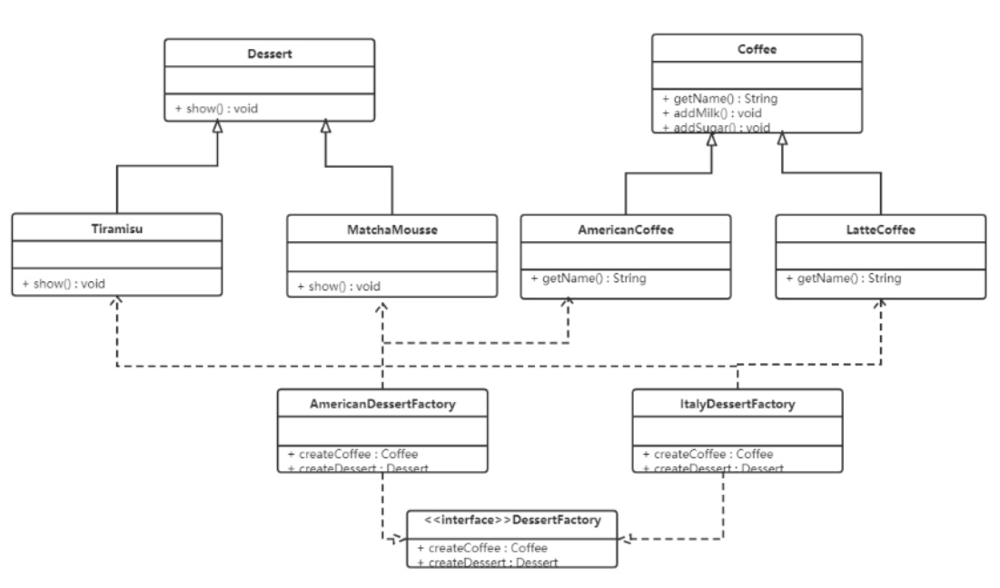
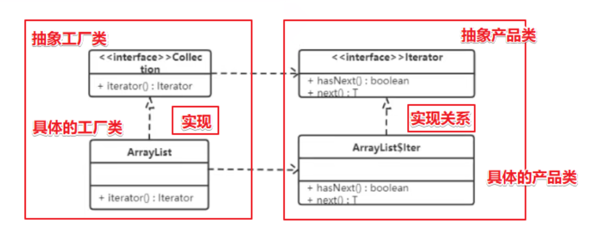
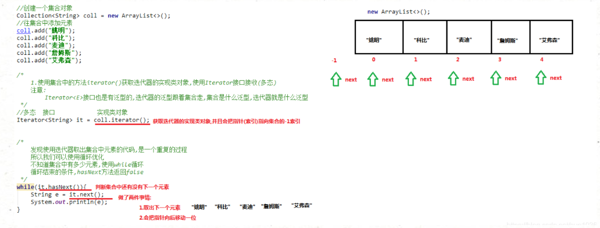

## 抽象工厂模式（Factory Pattern）

**工厂方法模式**：一个工厂生产一种类对象的模式。

**抽象工厂模式**：一个工厂可以生产多种类对象的模式。

------

前面介绍的工厂方法模式只考虑一类产品的生产

- 如畜牧场只养动物、电视机厂只生产电视机等。

这些工厂只生产同种类产品，同种类产品称为同等级产品，也就是说：工厂方法模式只考虑生产同等级的产品，但是在现实生活中许多工厂是综合型的工厂，能生产多等级（种类）的产品。

- 如电器厂既生产电视机又生产洗衣机或空调，大学既有软件专业又有生物专业等。

------

**抽象工厂模式将考虑**多等级产品的生产，将同一个具体工厂所生产的位于不同等级的一组产品称为一个产品族。

名词总结：

- 同等级产品：就是同类别的产品，如：美式咖啡、拿铁咖啡。
- 同一产品族：就是一个工厂生产的不同类别的一系列产品，如：拿铁咖啡、意大利甜品。

------

**概念**

- 抽象工厂模式是一种为访问类提供一个创建一组相关或相互依赖对象的接口，且访问类无须指定所要产品的具体类就能得到同族的不同等级的产品的模式结构。
- 抽象工厂模式是工厂方法模式的升级版本，工厂方法模式只生产一个等级的产品，而抽象工厂模式可生产多个等级的产品。

------

**结构**

抽象工厂模式的主要角色如下：

- 抽象工厂：提供了创建产品的接口，它包含多个创建产品的方法，可以创建多个不同等级的产品。
- 具体工厂：主要是实现抽象工厂中的多个抽象方法，完成具体产品的创建。
- 抽象产品：定义了产品的规范，描述了产品的主要特性和功能，抽象工厂模式有多个抽象产品。
- 具体产品：实现了抽象产品角色所定义的接口，由具体工厂来创建，它同具体工厂之间是多对一的关系。

------

**实现**

现咖啡店业务发生改变，不仅要生产咖啡还要生产甜点，如提拉米苏、抹茶慕斯等。

是按照工厂方法模式，需要定义提拉米苏类、抹茶慕斯类、提拉米苏工厂、抹茶慕斯工厂、甜点工厂类，很容易发生类爆炸情况。

- 拿铁咖啡、美式咖啡是一个产品等级，都是咖啡；提拉米苏、抹茶慕斯也是一个产品等级，都是甜品；
- 拿铁咖啡、提拉米苏是同一产品族，都属于意大利风味；美式咖啡、抹茶慕斯是同一产品族，都属于美式风味；

所以这个案例可以使用抽象工厂模式实现。类图如下：



代码如下：

```java
//抽象产品：咖啡抽象类 Coffee
public abstract class Coffee {
    // 获取咖啡名称
    public abstract String getName();
    // 加糖
    public void addSugar() {
        System.out.println("加糖");
    }
    // 加奶
    public void addMilk() {
        System.out.println("加奶");
    }
}


// 甜品抽象类
public abstract class Dessert {
    // 获取咖啡名称
    public abstract String getName();
    // 加糖
    public void addSugar() {
        System.out.println("加糖");
    }
    // 加奶
    public void addMilk() {
        System.out.println("加奶");
    }
}
```

```java
//具体产品：

//美式咖啡
public class AmericanCoffee extends Coffee {
    public String getName() {
        return "美式咖啡";
    }
}

// 拿铁咖啡
public class LatteCoffee extends Coffee {
    public String getName() {
        return "拿铁咖啡";
    }
}
```

```java
//抽象工厂

//甜品工厂
public interface DessertFactory {
    // 生产咖啡的功能
    Coffee createCoffee();
    // 生产甜品的功能
    Dessert createDessert();
}
```

```java
//具体工厂

/**
 意大利风味的甜品工厂
 生产拿铁咖啡和提拉米苏甜品
 */
public class ItalyDessertFactory implements DessertFactory {
    public Coffee createCoffee() {
        return new LatteCoffee();
    }
    public Dessert createDessert() {
        return new Trimisu();
    }
}


/**
 美式风味的甜品工厂
  生产美式咖啡和抹茶慕斯
 */
public class AmericanDessertFactory implements DessertFactory {
    public Coffee createCoffee() {
        return new AmericanCoffee();
    }
    public Dessert createDessert() {
        return new MatchaMousse();
    }
}
```

```java
//测试类：
public class Client {
    public static void main(String[] args) {
        // 创建的是意大利风味甜品工厂对象
        ItalyDessertFactory factory = new ItalyDessertFactory();
        // 获取拿铁咖啡和提拉米苏甜品
        Coffee coffee = factory.createCoffee();
        Dessert dessert = factory.createDessert();
        dessert.show();
    }
}

//说明： 如果要加同一个产品族的话，只需要再加一个对应的工厂类即可，不需要修改其他的类。
```

------

**优缺点**

**优点：**

- 当一个产品族中的多个对象被设计成一起工作时，它能保证客户端始终只使用同一个产品族中的对象。
- 想要生产一个产品族的产品，只需要一个接口或类。

**缺点：**

- 当产品族中需要增加一个新的产品时，所有的工厂类都需要进行修改。

------

**使用场景**

- 当需要创建的对象是一系列相互关联或相互依赖的产品族时，如电器工厂中的电视机、洗衣机、空调等。
- 系统中有多个产品族，但每次只使用其中的某一族产品，如有人只喜欢穿某一个品牌的衣服和鞋。
- 系统中提供了产品的类库，且所有产品的接口相同，客户端不依赖产品实例的创建细节和内部结构。

如：输入法换皮肤，一整套一起换。生成不同操作系统的程序。

------

**扩展：简单工厂 + 配置文件**

可以通过工厂模式 + 配置文件的方式解除工厂对象和产品对象的耦合。

在工厂类中加载配置文件中的全类名，并创建对象进行存储，客户端如果需要对象，直接进行获取即可。

实现代码：

```java
//第一步：定义配置文件 bean.properties（使用 .properties 是为了方便演示）

american=com.itheima.pattern.factory.config_factory.AmericanCoffee
latte=com.itheima.pattern.factory.config_factory.LatteCoffee
```

```java
//第二步：改进工厂类：

public class CoffeeFactory {
    // 加载配置文件，获取配置文件中配置的全类名，并创建该类的对象进行存储
    // 1,定义容器对象存储咖啡对象
    private static HashMap<String, Coffee> map = new HashMap<>();


    // 2,加载配置文件，只需要加载一次
    static {
        // 2.1 创建Properties对象
        Properties p = new Properties();
        // 2.2 调用p对象中的load方法进行配置文件的加载
        InputStream is = CoffeeFactory.class.getClassLoader().getResourceAsStream("bean.properties");
        try {
            p.load(is);
            // 从p集合中获取全类名并创建对象
            Set<Object> keys = p.keySet();
            for (Object key : keys) {
                String className = p.getProperty((String) key);
                // 通过反射技术创建对象
                Class clazz = Class.forName(className);
                Coffee coffee = (Coffee) clazz.newInstance();
                // 将名称和对象存储到容器中
                map.put((String) key, coffee);
            }
        } catch (Exception e) {
            e.printStackTrace();
        }
    }
    //根据名称获取对象
    public static Coffee createCoffee(String name) {
        return map.get(name);
    }
}
```

```java
// 测试
public class Client {
    public static void main(String[] args) {
      Coffee  coffee = CoffeeFactory.createCoffee("american")
      System.out.println(coffee.getName());
    }
}

```

- 静态成员变量用来存储创建的对象，键存储的是名称，值存储的是对应的对象；
- 读取配置文件以及创建对象写在静态代码块中，目的就是只需要执行一次。

------


**使用场景：**

**JDK源码解析 -- Collection.iterator方法**

```java
public class Demo {
    public static void main(String[] args) {
        List<String> list = new ArrayList<>();
        list.add("令狐冲");
        list.add("风清扬");
        list.add("任我行");

        //获取迭代器对象
        Iterator<String> it = list.iterator();
        //使用迭代器遍历
        while(it.hasNext()) {
            String ele = it.next();
            System.out.println(ele);
        }
    }
}
```

在**单列集合获取迭代器的方法**就使用到了工厂方法模式，我们通过类图看看结构：



- Collection 接口是抽象工厂类，ArrayList 是具体的工厂类；
- Iterator 接口是抽象商品类，ArrayList 类中的 Iter 内部类是具体的商品类；
- 在具体的工厂类中 iterator() 方法创建具体的商品类的对象。


**注意：**

在进行集合元素取出时，如果集合中已经没有元素了，还继续使用迭代器的next方法，将会发生java.util.NoSuchElementException没有集合元素异常。

在进行集合元素获取时，如果添加或移除集合中的元素 , 将无法继续迭代 , 将会抛出java.util.ConcurrentModificationException并发修改异常。

------

**迭代器遍历集合元素的过程**



​     在调用Iterator的next方法之前，迭代器的索引位于第一个元素之前，不指向任何元素，当第一次调用迭代器的next方法后，迭代器的索引会向后移动一位，指向第一个元素并将该元素返回，当再次调用next方法时，迭代器的索引会指向第二个元素并将该元素返回，依此类推，直到hasNext方法返回false，表示到达了集合的末尾，终止对元素的遍历。

------

**迭代器源码分析**

​	迭代器是遍历Collection集合的通用方式，任意Collection集合都可以使用迭代器进行遍历，那么每一种集合的自身特性是不同的，也就是存储元素的方式不同，那么是如何做到遍历方式的统一呢，接下来我们以ArrayList集合为例分析一下迭代器的源代码。

```java
//java.util.Iterator接口，定义遍历集合元素相关的 hasNext()、next() 方法
public interface Iterator<E> {
    boolean hasNext();
    E next();
}
```

```java
//java.util.ArrayList类， ArrayList 类中定义内部类 Itr 实现接口 Iterator 重写hasNext()、next()方法；
//ArrayList 类实现List接口，即实现了Collection接口，重写 iterator() 方法创建并返回内部类 Itr 的对象，
//因此ArrayList集合对象调用 iterator()方法即返回迭代器对象。

public class ArrayList<E> implements List<E> {
   /**
    *  ArrayList实现接口Collection
    *  重写方法iterator()
    *  返回Iterator接口实现类 Itr类的对象
    */
    public Iterator<E> iterator() {
        return new Itr();
    }
    
   /**
    * ArrayList中定义内部类Itr，实现接口Iterator
    * 重写hasNext()、next()方法
    */
    private class Itr implements Iterator<E> {
        public boolean hasNext() {...}
        
        public E next() {...}
    }

```

**结论**

- 所有Collection集合的迭代器，全由内部类实现。
- 集合中定义内部类，实现迭代器接口，可以使所有Collection集合的遍历方式统一。
- 调用迭代器的方法hasNext()，next()均执行集合中内部类的重写方法。


DateForamt 类中的 getInstance() 方法使用的是工厂模式

Calendar 类中的 getInstance() 方法使用的是工厂模式


