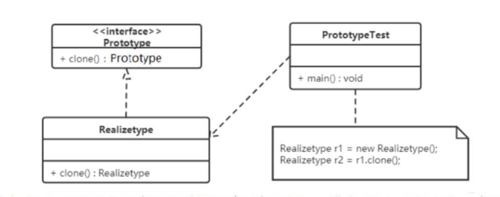
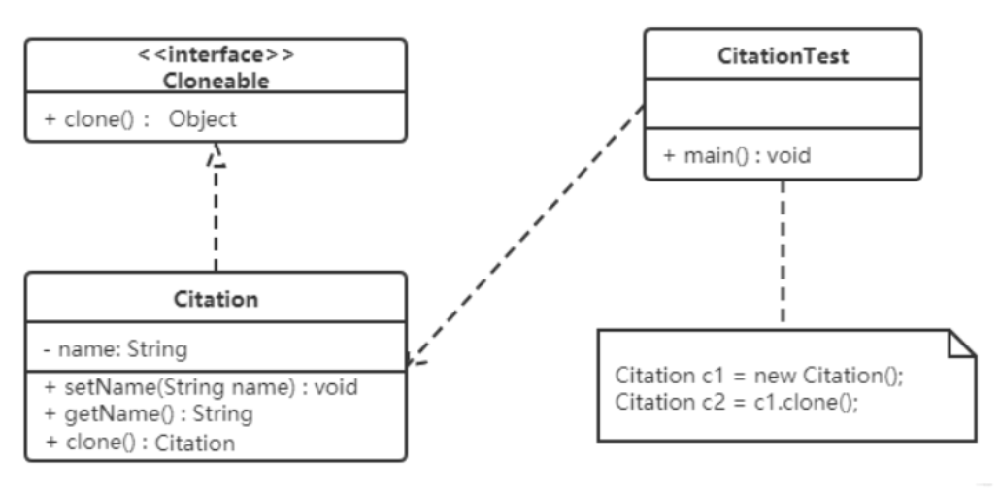

## **原型模式（Prototype Pattern）**

### **1.概述**

​    用一个已经创建的实例作为原型，通过复制该原型对象来创建一个和原型对象相同的新对象。

------

### 2.原型模式的优点 

​	● 性能优良 

​		原型模式是在内存二进制流的拷贝，要比直接new一个对象性能好很多，特别是要在一个循环体内产生大量的对象时，原型模式可以更好地体现其优点。 

​	● 逃避构造函数的约束 

​		这既是它的优点也是缺点，直接在内存中拷贝，构造函数是不会执行的。优点就是减少了约束，缺点也是减少了约束，需要大家在实际应用时考虑。 

------

### **3.结构**

原型模式**包含如下角色**：

- 抽象原型类：规定了具体原型对象必须实现的的 clone() 方法。
- 具体原型类：实现抽象原型类的 clone() 方法，它是可被复制的对象。
- 访问类：使用具体原型类中的 clone() 方法来复制新的对象。

接口类图如下：



------

### **4.实现**

原型模式的克隆分为浅克隆和深克隆。

- 浅克隆：创建一个新对象，新对象的属性和原对象完全相同，对于非基本类型属性，仍指向原有属性所指向的对象的内存地址。
- 深克隆：创建一个新对象，属性中引用的其他对象也会被克隆，不再指向原有对象地址。


**浅克隆类似“快捷方式”，深克隆才是真正的“复制文件”。**

​	Java 中的 Object 类中提供了 clone() 方法来实现浅克隆。

​	Java 中的 Cloneable 接口是上面类图中的抽象原型类，而实现了 Cloneable 接口的子实现类就是具体的原型类。

```java
//Realizetype：具体的原型类

public class Realizetype implements Cloneable {


    public Realizetype() {
        System.out.println("具体的原型对象创建完成！");
    }


    @Override
    protected Realizetype clone() throws CloneNotSupportedException {
        System.out.println("具体原型复制成功！");
        return (Realizetype) super.clone();
    }
}

```

```java
//PrototypeTest：测试访问类

public class PrototypeTest {
    public static void main(String[] args) throws CloneNotSupportedException {
        Realizetype r1 = new Realizetype(); // 原型对象
        Realizetype r2 = r1.clone(); // 克隆出来的对象
        System.out.println("对象r1和r2是同一个对象？" + (r1 == r2));
    }
}

运行结果：clone 原型对象的时候，不会调用构造方法，因为该对象不是通过 new 创建的
具体的原型对象创建完成！
具体原型复制成功！
对象r1和r2是同一个对象？false

```


------

### **5.案例**

【例】使用原型模式生成 “三好学生” 奖状。

​	同一学校的 “三好学生” 奖状除了获奖人姓名不同，其他都相同，可以使用原型模式复制多个“三好学生”奖状出来，然后修改奖状上的名字即可。

类图如下：



```java
/**
 * 奖状类
 */
@Data
public class Citation implements Cloneable {
    private String name; // 奖状上的名字


    public void show() {
        System.out.println(name + "同学：在2020学年第一学期中表现优秀，被评为三好学生。特发此状！");
    }


    @Override
    public Citation clone() throws CloneNotSupportedException {
        return (Citation) super.clone();
    }
}

//注意 要使用clone方法，类的成员变量上不要增加final关键字。
```

```java
/**
 * 测出访问类
 */
public class CitationTest {
    public static void main(String[] args) throws CloneNotSupportedException {
        Citation c1 = new Citation();
        c1.setName("张三");


        // 复制奖状
        Citation c2 = c1.clone();
        c2.setName("李四"); // 将奖状的名字改为李四


        c1.show();
        c2.show();
    }
}

```

------

### **6.使用场景**

● 资源优化场景 

​	类初始化需要消化非常多的资源，这个资源包括数据、硬件资源等。 

● 性能和安全要求的场景 

​	通过new产生一个对象需要非常繁琐的数据准备或访问权限，则可以使用原型模式。 

● 一个对象多个修改者的场景 

​	一个对象需要提供给其他对象访问，而且各个调用者可能都需要修改其值时，可以考虑使用原型模式拷贝多个对象供调用者使用。 


​	在实际项目中，原型模式很少单独出现，一般是和工厂方法模式一起出现，通过clone的 

方法创建一个对象，然后由工厂方法提供给调用者。原型模式已经与Java融为一体，大家可以随手拿来使用。

------

### 7.拓展

**引用对象的浅克隆**

将上面的“三好学生”奖状的案例中 Citation 类的 name 属性修改为 Student 类型的属性。

```java
/**
 * 学生类
 */
@Data
public class Student {
    private String name;
    public Student(String name) {
        this.name = name;
    }
}

```

```java
/**
 * 奖状类
 */
@Data
public class Citation implements Cloneable {
    private Student stu; // 这是个引用对象


    void show() {
        System.out.println(stu.getName() + "同学：在2020学年第一学期中表现优秀，被评为三好学生。特发此状！");
    }


    @Override
    public Citation clone() throws CloneNotSupportedException {
        return (Citation) super.clone();
    }
}
```

```java
// 测试
public class CitationTest {
    public static void main(String[] args) throws Exception {
        // 原型对象
        Citation c1 = new Citation();
        Student stu1 = new Student("张三");
        c1.setStu(stu1);


        // 复制奖状并修改名字
        Citation c2 = c1.Clone();
        Student stu2 = c2.getStu();
        stu2.setName("李四");


        // 判断stu1对象和stu2对象是否是同一个对象
        System.out.println("st1和stu2是否同一个对象？" + (stu1 == stu2));


        c1.show();
        c2.show();
    }
}

运行结果：stu1 和 stu2 是同一个对象
st1和stu2是否同一个对象？true
李四同学：在2020学年第一学期中表现优秀，被评为三好学生。特发此状！
李四同学：在2020学年第一学期中表现优秀，被评为三好学生。特发此状！

stu1 和 stu2 是同一个对象，就会产生将 stu1 中 name 属性值改为 “李四”，两个 Citation 对象中显示的都是李四。
这就是浅克隆的效果，对具体原型类（Citation）中的引用类型的属性进行引用的复制。

```

**这种情况需要使用深克隆，而进行深克隆需要使用对象流**

```java
例子：  Student 和 Citation 都要实现序列化接口
public class CitationTest1 {
    public static void main(String[] args) throws Exception {
        Citation c1 = new Citation();
        Student stu = new Student("张三", "西安");
        c1.setStu(stu);

        //创建对象输出流对象
        ObjectOutputStream oos = new ObjectOutputStream(new FileOutputStream("C:\\Users\\Think\\Desktop\\b.txt"));
        //将c1对象写出到文件中
        oos.writeObject(c1);
        oos.close();

        //创建对象出入流对象
        ObjectInputStream ois = new ObjectInputStream(new FileInputStream("C:\\Users\\Think\\Desktop\\b.txt"));
        //读取对象
        Citation c2 = (Citation) ois.readObject();
        //获取c2奖状所属学生对象
        Student stu1 = c2.getStu();
        stu1.setName("李四");

        //判断stu对象和stu1对象是否是同一个对象
        System.out.println("stu和stu1是同一个对象？" + (stu == stu1));

        c1.show();
        c2.show();
    }
}
```

**实现 1：文件流 + 对象流**

**学生类（Student）同上，但是要实现 Serializable 接口**

```java
/**
 * 学生类
 */
@Data
public class Student implements Serializable{
    private String name;
    public Student(String name) {
        this.name = name;
    }
}

```

**奖状类（Citation）实现 Serializable 接口，定义一个 deepClone 方法，通过文件输出流流和对象流实现深克隆。**

```
// 1 所有对象都实现序列化的接口
// 2 自定义一个深度克隆方法deepClone, 通过文件流和对象流的方式实现对象的深度拷贝
public Citation deepClone() throws Exception {
  try (ObjectOutputStream oos = new ObjectOutputStream(new FileOutputStream("a.txt"));
       ObjectInputStream ois = new ObjectInputStream(new FileInputStream("a.txt"));) {
    oos.writeObject(this);
    Citation citation = (Citation) ois.readObject();
    return citation;
  }
}

```

------

**实现 2：字节数组流 + 对象流**

**学生类（Student）同上，但是要实现 Serializable 接口。**

```java
/**
 * 学生类
 */
@Data
public class Student implements Serializable{
    private String name;
    public Student(String name) {
        this.name = name;
    }
}
```

**奖状类（Citation）实现 Serializable 接口，定义一个 deepClone 方法，通过文件输出流流和对象流实现深克隆。**

```java
// 1 所有对象都实现序列化的接口
// 2 自定义一个深度克隆方法deepClone, 通过字节数组流和对象流的方式实现对象的深度拷贝
public Citation deepClone2() throws Exception {
  try (ByteArrayOutputStream bos = new ByteArrayOutputStream();
       ObjectOutputStream oos = new ObjectOutputStream(bos)) {
    oos.writeObject(this);
    ByteArrayInputStream bis = new ByteArrayInputStream(bos.toByteArray());
    ObjectInputStream ois = new ObjectInputStream(bis);
    return (Citation) ois.readObject();
  }
}

```

**测试**

以上两种方法都可以实现深克隆：

```java
public class CitationTest {
    public static void main(String[] args) throws Exception {
        // 原型对象
        Citation c1 = new Citation();
        Student stu1 = new Student("张三");
        c1.setStu(stu1);


        // 复制奖状并修改名字
        Citation c2 = c1.deepClone();
        Student stu2 = c2.getStu();
        stu2.setName("李四");


        // 判断stu1对象和stu2对象是否是同一个对象
        System.out.println("st1和stu2是否同一个对象？" + (stu1 == stu2));


        c1.show();
        c2.show();
    }
}
————————————————
运行结果：
st1和stu2是否同一个对象？false
张三同学：在2020学年第一学期中表现优秀，被评为三好学生。特发此状！
李四同学：在2020学年第一学期中表现优秀，被评为三好学生。特发此状！
```

