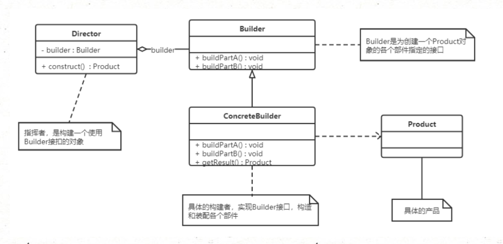
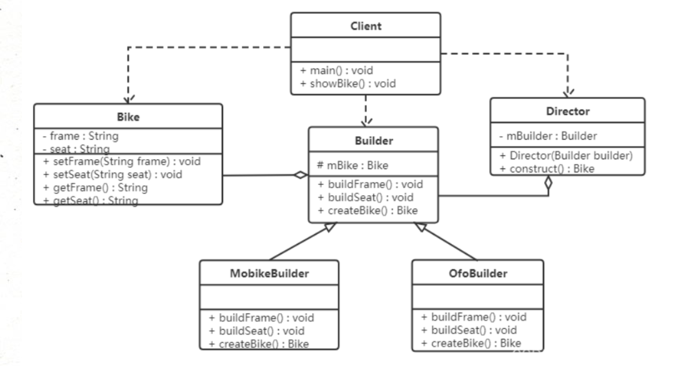

## **建造者模式（Builder Pattern）**

## **1.概述**

将一个复杂对象的构建与表示分离，使得同样的构建过程可以创建不同的表示。


这个模式适用于：某个对象的构建过程复杂的情况。

- 将部件的构造与装配分离，由 Builder(建造者)负责构造，Director(指挥者)进行装配，实现了构建和装配的解耦。
- 不同的构建器，相同的装配，可以做出不同的对象。
- 相同的构建器，不同的装配顺序，也可以做出不同的对象。
- 用户只需要指定复杂对象的类型就可以得到该对象，而无须知道其内部的具体构造细节。

------

## **2.结构**

建造者（Builder）模式包含如下角色：

- 抽象建造者类 Builder：这个接口规定要实现复杂对象的那些部分的创建，并不涉及具体的部件对象的创建。
- 具体建造者类 ConcreteBuilder：实现 Builder 接口，完成复杂产品的各个部件的具体创建方法。在构造过程完成后，提供产品的实例。
- 产品类 Product：要创建的复杂对象。
- 指挥者类 Director：调用具体建造者来创建复杂对象的各个部分，在指导者中不涉及具体产品的信息，只负责保证对象各部分完整创建或按某种顺序创建。



指挥者类用来指挥建造顺序，建造者只负责造部件。

抽象工厂生产出来的是某个系列的各种单品，构造者模式生产多种零件组装成一个单品。

抽象工厂用来对对象的生成进行解耦，建造者模式用来应对复杂对象的生成。

------

## **3.实例**

【例】**创建共享单车**

生产自行车是一个复杂的过程，它包含了车架，车座等组件的生产：

- 车架有碳纤维，铝合金等材质。
- 车座有橡胶，真皮等材质。

对于自行车的生产就可以使用建造者模式，类图如下：



- Bike 是产品，包含车架，车座等组件。
- Builder 是抽象建造者。
- MobikeBuilder 和 OfoBuilder 是具体的建造者。
- Director 是指挥者。

------

```java
//产品对象：自行车

@Data
public class Bike {
    // 车架
    private String frame;
      // 车座
    private String seat;
}

```

```java
//抽象构建者类：Builder

public abstract class Builder {
    protected Bike bike = new Bike();
    // 构建组装自行车所需零件: 车架,车座
    public abstract void buildFrame();
    public abstract void buildSeat();
    // 根据已有零件构建自行车
    public abstract Bike createBike();
}

```

```java
//具体构建者类：摩拜单车、ofo 单车

/**
 * 具体的构建者，用来构建摩拜单车对象
 */
public class MobileBuilder extends Builder {
    @Override
    public void buildFrame() {
        bike.setFrame("碳纤维车架");
    }
    @Override
    public void buildSeat() {
        bike.setSeat("真皮车座");
    }
    @Override
    public Bike createBike() {
        return bike;
    }
}


/**
 * 具体的构建者，用来构建ofo单车对象
 */
public class OfoBuilder extends Builder {
    @Override
    public void buildFrame() {
        bike.setFrame("铝合金车架");
    }
    @Override
    public void buildSeat() {
        bike.setSeat("橡胶车座");
    }
    @Override
    public Bike createBike() {
        return bike;
    }
}

```

```java
//指挥者类：Director

/**
 * 指挥者类
 */
@Setter
public class Director {
    private Builder builder;
    // 组装自行车的功能,可以获取到自行车实例
    public Bike construct() {
        builder.buildFrame();
        builder.buildSeat();
        return builder.createBike();
    }
}

```

```java
//测试类：
public class Client {
    public static void main(String[] args) {
        // 创建指挥者对象
        Director director = new Director(new MobileBuilder());
        // 指挥者进行指挥,组装自行车(构建零件等细节被隐藏了)
        Bike bike = director.construct();
        System.out.println(bike.getFrame());
        System.out.println(bike.getSeat());
    }
}

```

​      上面示例是 Builder 模式的常规用法，指挥者类 Director 在建造者模式中具有很重要的作用，它用于指导具体构建者如何构建产品，控制调用先后次序，并向调用者返回完整的产品类。

但是有些情况下可以简化系统结构，可以把指挥者类和抽象建造者进行结合：

```java
/** 
 * 抽象builder类
 */
public abstract class Builder {
    protected Bike bike = new Bike();
      // 构建组装自行车所需零件: 车架,车座
    public abstract void buildFrame();
    public abstract void buildSeat();
      // 根据已有零件构建自行车
    public abstract Bike createBike();
  
    // 组装,根据上面步骤,构建自己车,可以获取到自行车实例
    // 这应当是director的功能,放到builder中
    public Bike construct() {
        this.buildFrame();
        this.BuildSeat();
        return this.createBike();
    }
}

这样做确实简化了系统结构，但同时也加重了抽象建造者类的职责，不符合单一职责原则。
如果 construct() 过于复杂，建议还是封装到 Director 中。

```

------

## **4.优缺点**

**优点：**

- 建造者模式的封装性很好。使用建造者模式可以有效的封装变化，在使用建造者模式的场景中，一般产品类和建造者类是比较稳定的，因此，将主要的业务逻辑封装在指挥者类中对整体而言可以取得比较好的稳定性。
- 在建造者模式中，客户端不必知道产品内部组成的细节，将产品本身与产品的创建过程解耦，使得相同的创建过程可以创建不同的产品对象。
- 可以更加精细地控制产品的创建过程。将复杂产品的创建步骤分解在不同的方法中，使得创建过程更加清晰，也更方便使用程序来控制创建过程。
- 建造者模式很容易进行扩展。如果有新的需求，通过实现一个新的建造者类就可以完成，基本上不用修改之前已经测试通过的代码，因此也就不会对原有功能引入风险，符合开闭原则。

**缺点：**

- 使用范围有一定的限制。
- 建造者模式所创建的产品一般具有较多的共同点，其组成部分相似，如果产品之间的差异性很大，则不适合使用建造者模式。

------

## **5.使用场景 (经典Builder模式)**

建造者模式创建的是复杂对象，其产品的各个部分经常面临着剧烈变化，但将它们组合在一起的算法却相对稳定，所以它通常在以下场合使用。

- 创建的对象较复杂，由多个部件构成，各部件面临着复杂的变化，但部件间的建造顺序是稳定的。
- 创建复杂对象的算法独立于该对象的组成部分以及它们的装配方式，即产品的构建过程和最终的表示是独立的。

------

## **6.扩展 - 构建对象**

​       建造者模式除了上面的用途外，在开发中还有一个常用的使用方式，就是当一个类构造器需要传入很多参数时，如果创建这个类的实例，代码可读性会非常差，而且很容易引入错误，此时就可以利用建造者模式进行重构。

### **重构前**

```java
public class Phone {
    private String cpu;
    private String screen;
    private String memory;
    private String mainboard;


    public Phone(String cpu, String screen, String memory, String mainboard) {
        this.cpu = cpu;
        this.screen = screen;
        this.memory = memory;
        this.mainboard = mainboard;
    }


    public String getCpu() {
        return cpu;
    }


    public void setCpu(String cpu) {
        this.cpu = cpu;
    }


    public String getScreen() {
        return screen;
    }


    public void setScreen(String screen) {
        this.screen = screen;
    }


    public String getMemory() {
        return memory;
    }


    public void setMemory(String memory) {
        this.memory = memory;
    }


    public String getMainboard() {
        return mainboard;
    }


    public void setMainboard(String mainboard) {
        this.mainboard = mainboard;
    }


    @Override
    public String toString() {
        return "Phone{" +
                "cpu='" + cpu + '\'' +
                ", screen='" + screen + '\'' +
                ", memory='" + memory + '\'' +
                ", mainboard='" + mainboard + '\'' +
                '}';
    }
}

————————————————
在客户端中构建对象：传递了 4 个参数，如果参数更多呢？代码的可读性及使用的成本就是比较高。
public class Client {
    public static void main(String[] args) {
        // 构建Phone对象
        Phone phone = new Phone("intel","三星屏幕","金士顿","华硕");
        System.out.println(phone);
    }
}

```

### **重构后**

使用构建者模式重构代码：

```java
public class Phone {
    private String cpu;
    private String screen;
    private String memory;
    private String mainboard;


    // 私有构造方法
    private Phone(Builder builder) {
        this.cpu = builder.cpu;
        this.screen = builder.screen;
        this.memory = builder.memory;
        this.mainboard = builder.mainboard;
    }


    public static final class Builder {
        private String cpu;
        private String screen;
        private String memory;
        private String mainboard;


        public Builder cpu(String cpu) {
            this.cpu = cpu;
            return this;
        }


        public Builder screen(String screen) {
            this.screen = screen;
            return this;
        }


        public Builder memory(String memory) {
            this.memory = memory;
            return this;
        }


        public Builder mainboard(String mainboard) {
            this.mainboard = mainboard;
            return this;
        }


        // 使用构建者创建Phone对象
        public Phone build() {
            return new Phone(this);
        }
    }


    @Override
    public String toString() {
        return "Phone{" +
                "cpu='" + cpu + '\'' +
                ", screen='" + screen + '\'' +
                ", memory='" + memory + '\'' +
                ", mainboard='" + mainboard + '\'' +
                '}';
    }
}
————————————————
在客户端中构建对象：使用起来更灵活方便，某种程度上也可以提高开发效率。
public class Client {
    public static void main(String[] args) {
        Phone phone = new Phone.Builder()
                .cpu("intel")
                .mainboard("华硕")
                .memory("金士顿")
                .screen("三星")
                .build();
        System.out.println(phone);
    }
}

在 Lombok 中只需要使用 @Builder 即可使用构建者模式来构建对象。
```


---------------------------------------------总结---------------------------------------

**工厂方法模式 vs 建造者模式**

**两者对比：**

- 工厂方法模式注重的是整体对象的创建方式
- 建造者模式注重的是部件构建的过程，意在通过一步一步地精确构造创建出一个复杂的对象。


**举个简单例子来说明两者的差异，如要制造一个超人：**

- 如果使用工厂方法模式，直接产生出来的就是一个力大无穷、能够飞翔、内裤外穿的超人。
- 如果使用建造者模式，则需要组装手、头、脚、躯干等部分，然后再把内裤外穿，于是一个超人就诞生了。


**抽象工厂模式 vs 建造者模式**

**两者对比：**

- 抽象工厂模式实现对产品家族的创建，一个产品家族是这样的一系列产品：具有不同分类维度的产品组合，采用抽象工厂模式则是不需要关心构建过程，只关心什么产品由什么工厂生产即可。
- 建造者模式则是要求按照指定的蓝图建造产品，它的主要目的是通过组装零配件而产生一个新产品。


**简单的例子：**

- 如果将抽象工厂模式看成汽车配件生产工厂，生产一个产品族的产品，
- 那么建造者模式就是一个汽车组装工厂，通过对部件的组装可以返回一辆完整的汽车。

