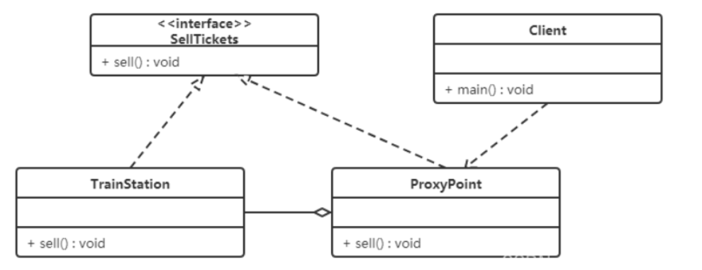

# **代理模式（Proxy Pattern）**

## **1.概述**

当访问对象不适合或者不能直接引用目标对象，可以提供一个代理以控制对该对象的访问，代理对象作为访问对象和目标对象之间的中介。

Java 中的代理按照代理类生成时机不同又分为**静态代理**和**动态代理**；

**静态代理**代理类**在编译期就生成**，而动态代理代理类则是**在 Java 运行时动态生成**；

动态代理又有 **JDK 代理** 和 **CGLib 代理**两种。

------

## **2.结构**

代理（Proxy）模式分为三种角色：

- 抽象主题类： 通过接口或抽象类声明真实主题和代理对象实现的业务方法。
- 真实主题类： 实现了抽象主题中的具体业务，是代理对象所代表的真实对象，是最终要引用的对象。
- 代理类 ： 提供了与真实主题相同的接口，其内部含有对真实主题的引用，它可以访问、控制或扩展真实主题的功能。

例如:

  买电脑时，是通过“地方电脑厂商”代理“联想”和“戴尔”进行电脑的销售。

“卖电脑的规范”就是抽象主题类，“联想” 和“戴尔”就是真实主题类，”地方电脑厂商“ 就是代理类。

------

## **3.静态代理**

【例】火车站卖票

​       如果要买火车票的话，需要去火车站买票，坐车到火车站，排队等一系列的操作，显然比较麻烦。而火车站在多个地方都有代售点，我们去代售点买票就方便很多了。这个例子其实就是典型的代理模式，火车站是目标对象，代售点是代理对象。类图如下：

   


代码如下：

```
//卖火车票的接口类：
public interface SellTickets {
    void sell();
}
```

```
//火车站类：火车票具有卖票功能，实现 SellTickets 接口
public class TrainStation implements SellTickets {
    public void sell() {
        System.out.println("火车站卖票");
    }
}

```

```java
//代售点类：代理火车站，进行卖票操作，同时对该方法做了点增强（收取费用）
public class ProxyPoint implements SellTickets {
    // 火车站类对象
    private TrainStation trainStation  = new TrainStation();
    public void sell() {
        System.out.println("代售点收取一些服务费用");
        trainStation.sell();
    }
}
```

```java
//测试类：
public class Client {
    public static void main(String[] args) {
        // 创建代售点类对象
        ProxyPoint proxyPoint = new ProxyPoint();
        // 调用方法进行卖票
        proxyPoint.sell();
    }
}
----------------------------------
从上面代码中可以看出测试类直接访问的是 ProxyPoint 类对象，也就是说 ProxyPoint 作为访问对象和目标对象的中介。
同时也对 sell 方法进行了增强（代理点收取一些服务费用）。
```

------

## **4.动态代理**

我们使用动态代理实现上面案例，先说说 JDK 提供的动态代理。

**JDK 动态代理**

Java 中提供了一个动态代理类 Proxy，Proxy 并不是我们上述所说的代理对象的类，而是提供了一个创建代理对象的静态方法（newProxyInstance 方法）来获取代理对象。

**注：JDK 动态代要求必须定义接口，因为它只能对接口进行代理。**


**代码如下：**

```java
//卖火车票的接口类：同静态代理。
public interface SellTickets {
    void sell();
}
```

```java
//火车站类：火车票具有卖票功能，实现 SellTickets 接口，同静态代理。
public class TrainStation implements SellTickets {
    public void sell() {
        System.out.println("火车站卖票");
    }
}
```

```java
//获取代理对象的工厂类：
public class ProxyFactory {
    // 目标对象
    private TrainStation station = new TrainStation();
    // 获取代理对象
    public SellTickets getProxyObject() {
        // 返回代理对象
        /*
            ClassLoader loader: 类加载器,用于加载代理类,可以通过目标对象获取类加载器
            Class<?>[] interfaces: 代理类实现的接口的字节码对象
            InvocationHandler h: 代理对象调用处理程序
        */
        SellTickets proxyObject = (SellTickets) Proxy.newProxyInstance(
                station.getClass().getClassLoader(), // 类加载器,用于加载代理类
                station.getClass().getInterfaces(), // 代理类实现的接口的字节码对象
                new InvocationHandler() {
                    /**
                     @param proxy 代理对象, 和proxyObject是同一个对象,在invoke方法中基本不用
                     @param method 对接口中的方法进行封装的method对象
                     @param args 调用方法的实际参数
                     @return 方法的返回值
                     */
                    @Override
                    public Object invoke(Object proxy, Method method, Object[] args) throws Throwable {
                        System.out.println("代售点收取一定的服务费用(jdk动态代理 )");
                        // 执行目标对象的方法
                        Object obj = method.invoke(station, args);
                        return obj;
                    }
                }
        );
        return proxyObject;
    }
}
```

```java
//测试类：
public class Client {
    public static void main(String[] args) {
        // 获取代理对象
        // 1, 创建代理工厂对象
        ProxyFactory factory = new ProxyFactory();
        // 2, 使用factory对象的方法获取代理对象
        SellTickets proxyObject = factory.getProxyObject();
        // 3, 调用代理对象的方法
        proxyObject.sell();
    }
}
```

------


## **5.JDK 动态代理分析**

思考以下问题：

ProxyFactory 是代理类吗？

ProxyFactory 不是代理模式中所说的代理类，而是程序在运行过程中动态的在内存中生成的代理类。

通过阿里巴巴开源的 Java 诊断工具（Arthas【阿尔萨斯】）查看代理类的结构：（去除其他代码）

```java
// 程序运行过程中动态生成的代理类
public final class $Proxy0 extends Proxy implements SellTickets {

  private static Method m3;


    public $Proxy0(InvocationHandler invocationHandler) {
        super(invocationHandler);
    }


    static {
      m3 = Class.forName("com.itheima.proxy.dynamic.jdk.SellTickets").getMethod("sell", new Class[0]);
      return;
    }
  
    public final void sell() {
      this.h.invoke(this, m3, null);
    }
}

```

从上面的类中，我们可以看到以下几个信息：

- 代理类 **$Proxy0** 实现了 SellTickets 接口，这也就印证了真实类和代理类实现同样的接口。
- 代理类 $Proxy0 将我们提供了的匿名内部类对象传递给了父类。

**动态代理的执行流程是什么样？**

摘取整个流程的重点代码：

```java
// 程序运行过程中动态生成的代理类
public final class $Proxy0 extends Proxy implements SellTickets {
    private static Method m3;

    public $Proxy0(InvocationHandler invocationHandler) {
        super(invocationHandler);
    }

    static {
        m3 = Class.forName("com.itheima.proxy.dynamic.jdk.SellTickets").getMethod("sell", new Class[0]);
    }
      
    // ② 根据多态的特性，执行的是代理类 $Proxy0 中的 sell() 方法
    public final void sell() {
    // ③ 代理类 $Proxy0 中的 sell() 方法中又调用了 InvocationHandler 接口的子实现类对象的 invoke 方法
        this.h.invoke(this, m3, null);
    }
}


// Java提供的动态代理相关类
public class Proxy implements java.io.Serializable {
    protected InvocationHandler h;
     
    protected Proxy(InvocationHandler h) {
        this.h = h;
    }
}


// 代理工厂类
public class ProxyFactory {

    private TrainStation station = new TrainStation();

    public SellTickets getProxyObject() {
        SellTickets sellTickets = (SellTickets) Proxy.newProxyInstance(station.getClass().getClassLoader(),
                station.getClass().getInterfaces(),
                new InvocationHandler() {
                    // ④ invoke 方法通过反射执行了真实对象所属类 TrainStation 中的 sell() 方法
                    public Object invoke(Object proxy, Method method, Object[] args) throws Throwable {
                        System.out.println("代理点收取一些服务费用(JDK动态代理方式)");
                        Object result = method.invoke(station, args);
                        return result;
                    }
                });
        return sellTickets;
    }
}


// 测试访问类
public class Client {
    public static void main(String[] args) {
        // 获取代理对象
        ProxyFactory factory = new ProxyFactory();
          // ① 在测试类中通过代理对象调用 sell() 方法
        SellTickets proxyObject = factory.getProxyObject();
        proxyObject.sell();
    }
}

```


**执行流程如下：**

​	① 在测试类中通过代理对象调用 sell() 方法

​	② 根据多态的特性，执行的是代理类 $Proxy0 中的 sell() 方法

​	③ 代理类 $Proxy0 中的 sell() 方法中又调用了 InvocationHandler 接口的子实现类对象的 invoke 方法

​	④ invoke 方法通过反射执行了真实对象所属类 TrainStation 中的 sell() 方法


**注意：**

​       上面的案例中，如果没有定义 SellTickets 接口，只定义了 TrainStation 火车站类。则 JDK 代理无法使用；

​        **因为 JDK 动态代理要求必须定义接口，它只能对接口进行代理。**


**CGLIB 动态代理**

​    CGLIB 是一个功能强大，高性能的代码生成包，它可以为没有实现接口的类提供代理，为 JDK 的动态代理提供了很好的补充。

​    CGLIB 是第三方提供的包，所以需要引入依赖：

```
<dependency>
    <groupId>cglib</groupId>
    <artifactId>cglib</artifactId>
    <version>2.2.2</version>
</dependency>
```

代码如下：**CGLIB 动态代理可以不代理接口，直接代理类。**

```java
//火车站类：火车票具有卖票功能，实现 SellTickets 接口，同静态代理。
public class TrainStation implements SellTickets {
    public void sell() {
        System.out.println("火车站卖票");
    }
}
```

```
//代理工厂类：用来获取代理对象

**
 * 代理对象工厂, 用来获取代理对象
 */
public class ProxyFactory implements MethodInterceptor {
    // 火车站对象
    private TrainStation station = new TrainStation();
    // 获取代理对象
    public TrainStation getProxyObject() {
        // 创建Enhancer对象,类似于JDK代理中的Proxy类
        Enhancer enhancer = new Enhancer();
        // 设置父类的字节码对象(指定父类)
        enhancer.setSuperclass(TrainStation.class);
        // 设置回调函数
        enhancer.setCallback(this);
        // 创建代理对象
        TrainStation proxyObject = (TrainStation) enhancer.create();
        return proxyObject;
    }


    /**
     @param o 代理对象
     @param method 真实对象中的方法的Method实例
     @param objects 实际参数
     @param methodProxy 代理对象中的方法的method实例
     @return 方法执行结果
     */
    @Override
    public Object intercept(Object o, Method method, Object[] objects, MethodProxy methodProxy) throws Throwable {
        System.out.println("代售点收取一定的服务费用(Cglib代理)");
        // 要调用目标对象的方法
        Object invoke = method.invoke(station, objects);
        return invoke;
    }
}
```

------

## **6.三种代理的对比**

**两种动态代理的对比：JDK 代理 和 CGLib 代理**

- CGLib 动态代理，底层采用 ASM 字节码生成框架，使用字节码技术生成代理类，在 JDK1.6 之前比使用 JDK 动态代理的效率要高。唯一需要注意的是，**CGLib 不能对声明为 final 的类或者方法进行代理**，因为CGLib 的原理是动态生成被代理类的子类。
- JDK1.6、JDK1.7、JDK1.8 逐步对 JDK 动态代理优化之后，在调用次数较少的情况下，JDK 代理效率高于 CGLib 代理效率；只有当进行大量调用的时候，JDK1.6 和 JDK1.7 比 CGLib 代理效率低一点，但是到 JDK1.8 的时候，JDK 代理效率高于 CGLib 代理。
- 所以，JDK1.8 以后，**如果有接口就使用 JDK 动态代理，没有接口就使用 CGLib 代理。**


**动态代理和静态代理的对比：**

- 动态代理与静态代理相比较，最大的好处是接口中声明的所有方法都被转移到调用处理器一个集中的方法中处理 (InvocationHandler.invoke)。这样，在接口方法数量比较多的时候，我们可以进行灵活处理，而不需要像静态代理那样每一个方法进行中转。
- 如果接口增加一个方法，静态代理模式除了所有实现类需要实现这个方法外，所有代理类也需要实现此方法，增加了代码维护的复杂度，而动态代理不会出现该问题。


## **7.优缺点**

**优点：（**保护、增强、解耦**）**

- 代理模式在客户端与目标对象之间起到一个中介作用和保护目标对象的作用；
- 代理对象可以扩展目标对象的功能；
- 代理模式能将客户端与目标对象分离，在一定程度上降低了系统的耦合度；

**缺点：**

- 增加了系统的复杂度；

------


## **8.使用场景**

代理模式最常用的一个应用场景就是，在业务系统中开发一些非功能性需求，比如：**监控、统计、鉴权、限流、事务、幂等、日志**。我们将这些附加功能与业务功能解耦，放到代理类中统一处理，让程序员只需要关注业务方面的开发。实际上，前面举的搜集接口请求信息的例子，就是这个应用场景的一个典型例子。

如果你熟悉 Java 语言和 Spring 开发框架，这部分工作都是可以在 Spring AOP 切面中完成的。前面我们也提到，Spring AOP 底层的实现原理就是基于动态代理。


**1.远程（Remote）代理（RPC 的思想）**

- 本地服务通过网络请求远程服务。为了实现本地到远程的通信，我们需要实现网络通信，处理其中可能的异常。为良好的代码设计和可维护性，我们将网络通信部分隐藏起来，只暴露给本地服务一个接口，通过该接口即可访问远程服务提供的功能，而不必过多关心通信部分的细节。


**2.防火墙（Firewall）代理（VPN 的思想）**

- 当你将浏览器配置成使用代理功能时，防火墙就将你的浏览器的请求转给互联网；当互联网返回响应时，代理服务器再把它转给你的浏览器。


**3.保护（Protect or Access）代理**

- 控制对一个对象的访问，如果需要，可以给不同的用户提供不同级别的使用权限。


