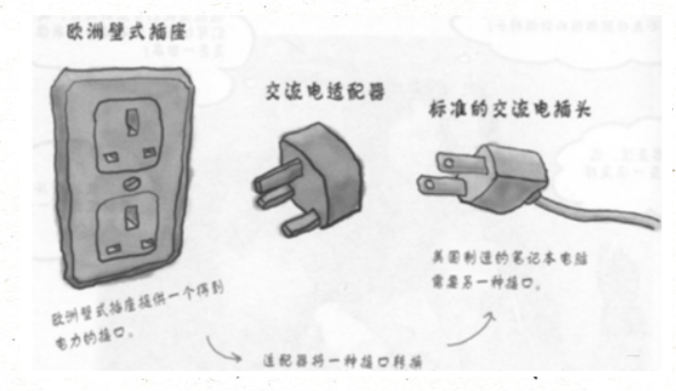
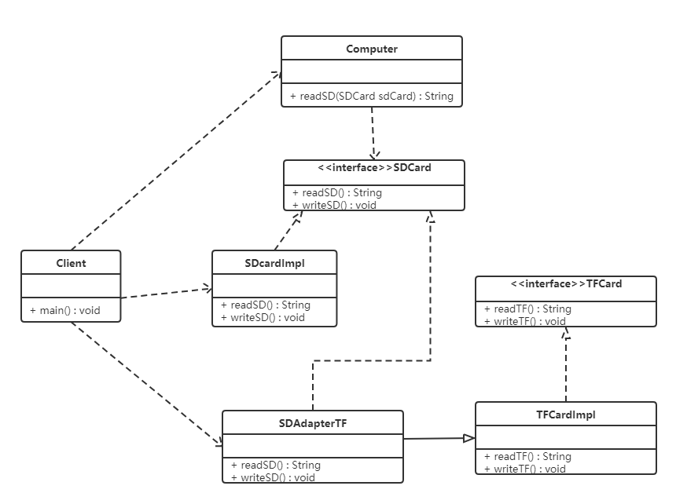
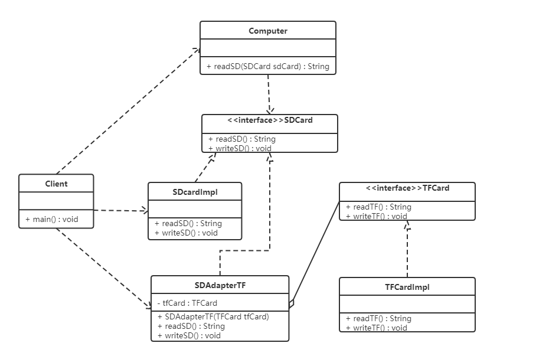
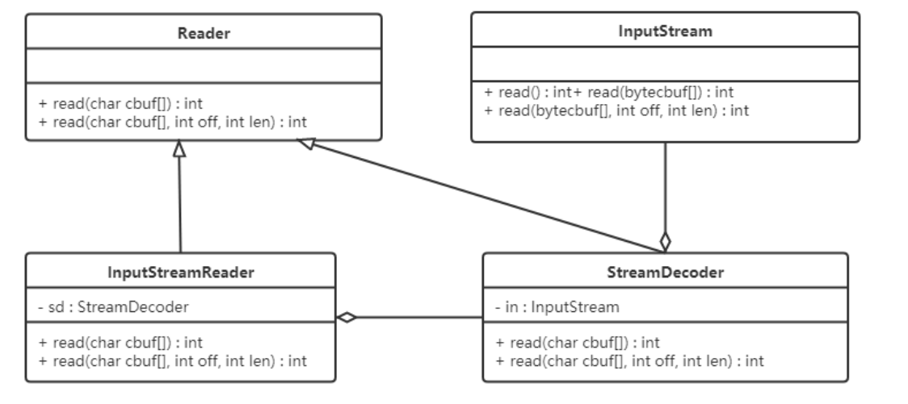

# **适配器模式（Adapter Pattern）**

## **1.概述**

如果去欧洲国家去旅游的话，他们的插座如下图最左边，是欧洲标准。而我们使用的插头如下图最右边的。因此我们的笔记本电脑，手机在当地不能直接充电。所以就需要一个插座转换器，转换器第 1 面插入当地的插座，第 2 面供我们充电，这样使得我们的插头在当地能使用。生活中这样的例子很多，手机充电器（将 220v 转换为 5v 的电压），读卡器等，其实就是使用到了适配器模式。



**定义：**

**将一个类的接口转换成客户希望的另外一个接口，使得原本由于接口不兼容而不能一起工作的那些类能一起工作。**

- 适配器模式分为类适配器模式和对象适配器模式，前者由于类之间的耦合度比后者高，且要求程序员了解现有组件库中的相关组件的内部结构，所以应用相对较少些。


**主要解决**：主要解决在软件系统中，常常要将一些"现存的对象"放到新的环境中，而新环境要求的接口是现对象不能满足的。


**何时使用：**

 1、系统需要使用现有的类，而此类的接口不符合系统的需要。 

 2、想要建立一个可以重复使用的类，用于与一些彼此之间没有太大关联的一些类，包括一些可能在将来引进的类一起工作，这些源类不一定有一致的接口。 

 3、通过接口转换，将一个类插入另一个类系中。（比如老虎和飞禽，现在多了一个飞虎，在不增加实体的需求下，增加一个适配器，在里面包容一个虎对象，实现飞的接口。）

------

## **2.结构**

适配器模式（Adapter）包含以下主要角色：

- 目标（Target）接口：当前系统业务所期望访问的接口，它可以是抽象类或接口。
- 适配者（Adaptee）类：它是被访问和适配的现存组件库中的组件接口。
- 适配器（Adapter）类：它是一个转换器，通过继承或引用适配者的对象，把适配者接口转换成目标接口，让客户按目标接口的格式访问适配者。

适配者类，其实是要被适配到目标接口的类。

------

## **3.类适配器模式**

实现方式：定义一个适配器类来实现当前系统的业务接口，同时又继承现有组件库中已经存在的组件。

**实现业务接口**，**继承已有组件**

【例】读卡器

现有一台电脑只能读取 SD 卡，而要读取 TF 卡中的内容的话就需要使用到适配器模式。

创建一个读卡器，将 TF 卡中的内容读取出来，类图如下：

- SDCard 是目标接口，它是 Computer 所期望访问的接口
- TFCard 是适配者类，它将会被适配到 Computer 可以访问的 SDCard
- SDAdapterTF 是适配器类，它实现让目标访问 SDCard 却达到 TFCard 的功能。



代码如下：

```java
//Computer：可以直接访问 SDCard，但是不能直接访问 TFCard，即将通过适配器去访问 TFCard
public class Computer {
    // 从SD卡中读取数据
    public String readSD(SDCard sdCard) {
        if (sdCard == null) {
            throw new NullPointerException("sd card can not be null");
        }
        return sdCard.readSD();
    }
}
```

```java
//目标接口：SDCard 是 Computer 期望访问的接口

/**
 * SD卡的接口
 */
public interface SDCard {
    // 从SD卡中读取数据
    String readSD();
    // 往SD卡中写数据
    void writeSD(String msg);
}


/**
 * SD卡的实现类
 */
public class SDCardImpl implements SDCard {
    public String readSD() {
        String msg = "sd card read a msg :hello word SD";
        return msg;
    }


    public void writeSD(String msg) {
        System.out.println("sd card write msg : " + msg);
    }
}
```

```java
//适配者类：TFCard 是要被适配的接口，适配成可以通过 SDCard 来访问

/**
 * TF卡的接口
 */
public interface TFCard {
    // 从TF卡中读取数据
    String readTF();
    // 往TF卡中写数据
    void writeTF(String msg);
}


/**
 * TF卡的实现类
 */
public class TFCardImpl implements TFCard {
    public String readTF() {
        String msg = "TFCard read msg: hello word TFCard";
        return msg;
    }


    public void writeTF(String msg) {
        System.out.println("TFCard write msg: " + msg);
    }
}
```

**适配器类**：实现业务接口，继承已有组件

- 本质上还是要执行 TFCard 的功能，因此 extends TFCardImpl
- 但是又可以让 Computer 通过 SDCard 接口来访问，因此 implements SDCard

```
public class SDAdapterTF extends TFCardImpl implements SDCard {
    @Override
    public String readSD() {
        System.out.println("adapter read tf card");
        return readTF();
    }
    @Override
    public void writeSD(String msg) {
        System.out.println("adapter write tf card");
        writeTF(msg);
    }
}

```

```java
//测试类：

public class Client {
    public static void main(String[] args) {
        // 创建计算机对象
        Computer computer = new Computer();
        // 电脑读取SD卡中的数据(可直接读)
        String msg = computer.readSD(new SDCardImpl());
        System.out.println(msg);


        System.out.println("===============");
        // 使用电脑读取TF卡中的数据(无法直接读)
        // 定义适配器类
        String msg1 = computer.readSD(new SDAdapterTF());
        System.out.println(msg1);
    }
}

说明：类适配器模式违背了合成复用原则，类适配器是客户类有一个接口规范的情况下可用，反之不可用。
```

------

## **4.对象适配器模式**

实现方式：对象适配器模式可釆用将现有组件库中已经实现的组件引入适配器类中，该类同时实现当前系统的业务接口。

**实现业务接口，引入已有组件**

【例】读卡器

我们使用对象适配器模式将读卡器的案例进行改写，类图如下：

**注意** SDAdapterTF 不再是直接继承 TFCardImpl，而是聚合 TFCard 接口



代码如下：类适配器模式的代码，我们只需要修改适配器类（SDAdapterTF）和测试类

```java
//适配器类：通过聚合一个适配者类，来使用它的方法

public class SDAdapterTF implements SDCard {
    // 声明适配者类
    private TFCard tfCard;

    public SDAdapterTF(TFCard tfCard) {
        this.tfCard = tfCard;
    }

      @Override
    public String readSD() {
        System.out.println("adapter read tf card");
        return tfCard.readTF();
    }

      @Override
    public void writeSD(String msg) {
        System.out.println("adapter write tf card");
        tfCard.writeTF(msg);
    }
}
```

```java
//测试类：

public class Client {
    public static void main(String[] args) {
        // 创建计算机对象
        Computer computer = new Computer();
        // 电脑读取SD卡中的数据(可直接读)
        String msg = computer.readSD(new SDCardImpl());
        System.out.println(msg);


        System.out.println("===============");
        // 使用电脑读取TF卡中的数据(无法直接读)
        // 创建适配器类对象
        SDAdapterTF sdAdapterTF = new SDAdapterTF(new TFCardImpl());
        String msg1 = computer.readSD(sdAdapterTF);
        System.out.println(msg1);
    }
}
```

------

## **5.接口适配器模式**

当不希望实现一个接口中所有的方法时，可以创建一个抽象类 Adapter 实现接口所有方法，然后只需要继承该抽象类即可。

```java
//Interface接口: 实现所有方法
public interface Interface {

    //读取数据
    public String read();

    // 写数据
    public void write(String msg);
}

```

```
//Adapter 抽象类实现接口, 并为该接口中每个方法提供一个默认实现(空方法)
public abstract class Adapter implements Interface{
    //抽象类实现接口, 并为该接口中每个方法提供一个默认实现(空方法)

    @Override
    public String read() {
        return null;
    }

    @Override
    public void write(String msg) {

    }
}
```

```java
// 测试: 通过匿名函数使用抽象类AbsAdapter, 覆盖重写read方法
public class Client {
    public static void main(String[] args) {

        Adapter adapter = new Adapter() {
            @Override
            public void write(String msg) {
                System.out.println(msg);
            }
        };
        adapter.write("tf card");
    }
}
```

------

## **6.应用场景**

- 以前开发的系统存在满足新系统功能需求的类，但其接口同新系统的接口不一致。
- 使用第三方提供的组件，但组件接口定义和自己要求的接口定义不同。


------

## **7.JDK 源码 - Reader 与 InputStream**

- 解码：字节数据 -> 字符数据
- 编码：字符数据 -> 字节数据


Reader（字符流）、InputStream（字节流）之间适配使用的是 InputStreamReader。（表面上是这样）InputStreamReader 继承自 java.io 包中的 Reader，对他中的抽象的未实现的方法给出实现。如：

```
public int read() throws IOException {
    return sd.read();
}


public int read(char cbuf[], int offset, int length) throws IOException {
    return sd.read(cbuf, offset, length);
}

```

如上代码中的 sd（StreamDecoder 类对象），在 Sun 的 JDK 实现中，实际的方法实现是对 sun.nio.cs.StreamDecoder 类的同名方法的调用封装。类结构图如下：



**从上图可以看出：**

- InputStreamReader 是对同样实现了 Reader 的 StreamDecoder 的封装。
- StreamDecoder 不是 Java SE API 中的内容，是 Sun JDK 给出的自身实现，它对构造方法中的字节流类（InputStream）进行封装，并通过该类进行了字节流和字符流之间的解码转换。

------

**结论：**

- 表面看，InputStreamReader 做了 InputStream 字节流类到 Reader 字符流之间的转换。
- 而从如上 Sun JDK 中的实现类关系结构中可以看出，是 StreamDecoder 在设计实现上采用了适配器模式。