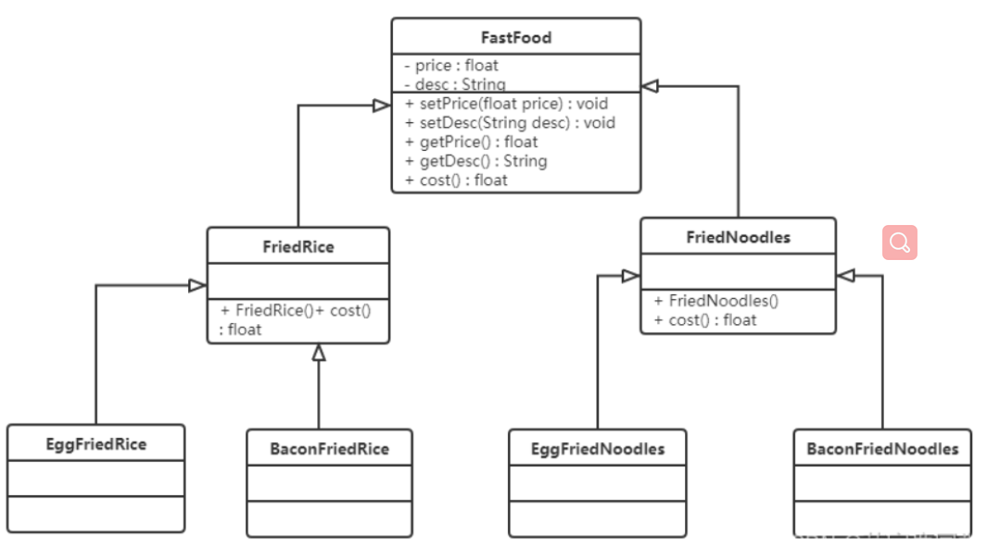
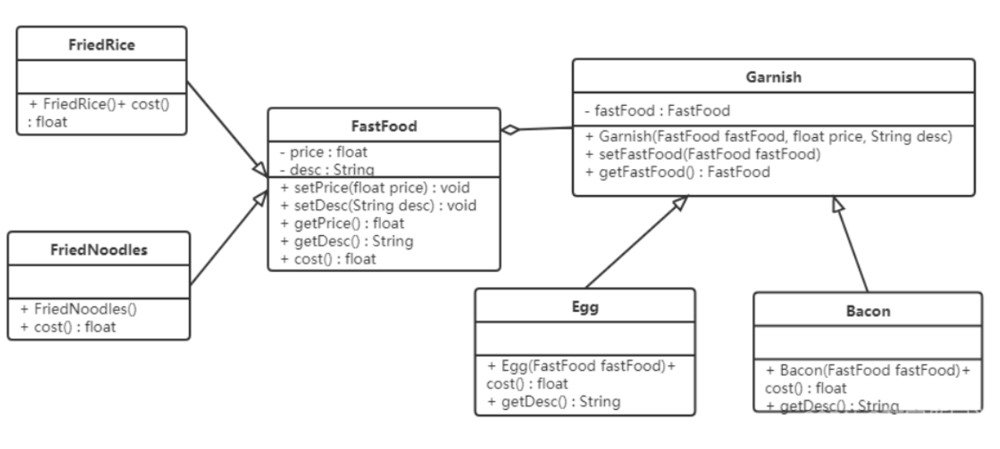
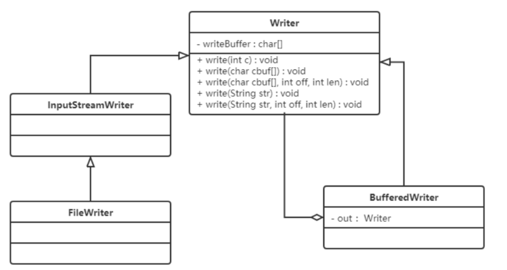

# **装饰者模式（Decorator Pattern）**

## **1.概述**

- 在不改变现有对象结构的情况下，动态地给该对象增加一些职责（即增加其额外功能）的模式。

先来看一个快餐店的例子：快餐店有炒面、炒饭等快餐，可以额外附加鸡蛋、火腿、培根这些配菜，当然加配菜需要额外加钱，每个配菜的价钱通常不太一样，那么计算总价就会显得比较麻烦。下面是使用继承方式的类图：



**使用继承的方式存在的问题：**

- 扩展性不好：如果要再加一种配料（火腿肠），我们就会发现需要给 FriedRice 和 FriedNoodles 分别定义一个子类。如果要新增一个快餐品类（炒河粉）的话，就需要定义更多的子类。
- 产生过多的子类

------

## **2.结构**

装饰者（Decorator）模式中的角色：

- 抽象构件（Component）角色 ：定义一个抽象接口以规范准备接收附加责任的对象。
- 具体构件（Concrete Component）角色 ：实现抽象构件，通过装饰角色为其添加一些职责。
- 抽象装饰（Decorator）角色 ： 继承或实现抽象构件，并包含具体构件的实例，可以通过其子类扩展具体构件的功能。
- 具体装饰（ConcreteDecorator）角色 ：实现抽象装饰的相关方法，并给具体构件对象添加附加的责任。


## **3.案例**

使用装饰者模式对快餐店案例进行改进，类图如下：



```java
// 抽象构件角色：快餐类
@Data
public abstract class FastFood {
    private float price; // 价格
    private String desc; // 描述


    public FastFood(float price, String desc) {
        this.price = price;
        this.desc = desc;
    }


    public abstract float cost();
}

```

```java
//具体构件角色：炒饭类、炒面类
public class FriedRice extends FastFood {
    public FriedRice() {
        super(10, "炒饭");
    }


    public float cost() {
        return getPrice();
    }
}


public class FriedNoodles extends FastFood {
    public FriedNoodles() {
        super(12, "炒面");
    }


    public float cost() {
        return getPrice();
    }
}

```

```java
//抽象装饰者角色：配料类
@Data
public abstract class Garnish extends FastFood {
    // 声明快餐类的变量
    private FastFood fastFood;


    public Garnish(FastFood fastFood, float price, String desc) {
        super(price, desc);
        this.fastFood = fastFood;
    }
}
```

```java
//具体装饰者角色：鸡蛋配料类、培根配料类
public class Egg extends Garnish {
    public Egg(FastFood fastFood) {
        super(fastFood, 1, "鸡蛋");
    }
  
    // 计算价格
    public float cost() {
        return getPrice() + getFastFood().cost();
    }


    @Override
    public String getDesc() {
        return super.getDesc() + getFastFood().getDesc();
    }
}


public class Bacon extends Garnish {
    public Bacon(FastFood fastFood) {
        super(fastFood, 2, "培根");
    }
    
      // 计算价格
    public float cost() {
        return getPrice() + getFastFood().cost();
    }


    @Override
    public String getDesc() {
        return super.getDesc() + getFastFood().getDesc();
    }
}
```

```java
//测试类：
public class Client {
    public static void main(String[] args) {
        //  点一份炒饭
        FastFood food = new FriedRice();
        System.out.println(food.getDesc() + "  " + food.cost() + "元");
        // 在上面的炒饭中加一个鸡蛋
        food = new Egg(food);
        System.out.println(food.getDesc() + "  " + food.cost() + "元");
        // 再加一个鸡蛋
        food = new Egg(food);
        System.out.println(food.getDesc() + "  " + food.cost() + "元");
        // 再加一个培根
        food = new Bacon(food);
        System.out.println(food.getDesc() + "  " + food.cost() + "元");
    }
}

```

------

## **4.使用场景**

- 当不能采用继承的方式对系统进行扩充或者采用继承不利于系统扩展和维护时。
- 在不影响其他对象的情况下，以动态、透明的方式给单个对象添加职责。
- 当对象的功能要求可以动态地添加，也可以再动态地撤销时。


**注意：**不能采用继承的情况主要有两类：

- 第一类是系统中存在大量独立的扩展，为支持每一种组合将产生大量的子类，使得子类数目呈爆炸性增长。
- 第二类是因为类定义不能继承（如 final 类）。

------


## **5.JDK源码解析**

**IO流中的包装类使用到了装饰者模式**：BufferedInputStream，BufferedOutputStream，BufferedReader，BufferedWriter。

以 BufferedWriter 举例来说明，先看看如何使用 BufferedWriter：

```java
// 创建FileWriter对象
FileWriter fw = new FileWriter("C:\\Users\\Think\\Desktop\\a.txt");
// 创建BufferedWriter对象
BufferedWriter bw = new BufferedWriter(fw);
// 写数据
bw.write("hello Buffered");
bw.close();
```

**使用起来感觉确实像是装饰者模式，接下来看它们的结构：**



**BufferedWriter 使用装饰者模式对 Writer 子实现类进行了增强，添加了缓冲区，提高了写数据的效率。**

------

## **6.代理和装饰者的区别**

**相同点：**

- 都要实现与目标类相同的业务接口
- 在两个类中都要声明目标对象
- 都可以在不修改目标类的前提下增强目标方法

**不同点：**

**1.目的不同**

- 装饰者是为了增强目标对象
- 静态代理是为了保护和隐藏目标对象

装饰者可以迭代增强，代理只能增强一次

**2.获取目标对象构建的地方不同**

- 装饰者是由外界传递进来，可以通过构造方法传递
- 静态代理是在代理类内部创建，以此来隐藏目标对象