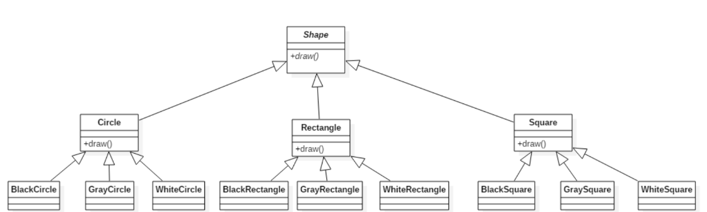
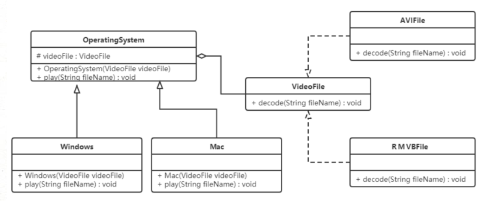

# **桥接模式（Bridge Pattern）**

## **1.概述**

 **将抽象与实现分离，使它们可以独立变化。它是用组合关系代替继承关系来实现，从而降低了抽象和实现这两个可变维度的耦合度。**



可以发现有很多的类，假如需要增加一个形状或再增加一种颜色，就需要创建更多的类。

在一个有多种可能会变化的维度的系统中，用继承方式会造成类爆炸，扩展起来不灵活。每次在一个维度上新增一个具体实现都要增加多个子类。为了更加灵活的设计系统，此时可以考虑使用桥接模式。

------


## **2.结构**

桥接（Bridge）模式包含以下主要角色：

- 抽象化（Abstraction）角色 ：定义抽象类，并包含一个对实现化对象的引用。
- 扩展抽象化（Refined Abstraction）角色 ：抽象化角色的子类，实现父类中的业务方法，并通过组合关系调用实现化角色中的业务方法。
- 实现化（Implementor）角色 ：定义实现化角色的接口，供扩展抽象化角色调用。
- 具体实现化（Concrete Implementor）角色 ：给出实现化角色接口的具体实现。

------


## **3.案例**

【例】视频播放器

需要开发一个跨平台视频播放器，可以在不同操作系统平台（Windows、Mac、Linux 等）上播放多种格式的视频文件，常见的视频格式包括 RMVB、AVI、WMV 等，该播放器包含了两个维度，适合使用桥接模式。

> 两个维度是指：不同操作系统、不同的视频格式，这些都有可能任意变化

类图如下：



```java
//实现化角色：视频文件格式接口
public interface VideoFile {
    // 解码功能
    void decode(String fileName);
}
```

```java
//具体实现化角色：具体的视频文件类，avi、rmvb 等
public class AviFile implements VideoFile {
    public void decode(String fileName) {
        System.out.println("avi视频文件 ：" + fileName);
    }
}


public class RmvbFile implements VideoFile {
    public void decode(String fileName) {
        System.out.println("rmvb视频文件 ：" + fileName);
    }
}

```

```java
//抽象化角色：操作系统抽象类
public abstract class OperatingSystem {
    // 声明videFile变量
    protected VideoFile videoFile;

    public OperatingSystem(VideoFile videoFile) {
        this.videoFile = videoFile;
    }

    public abstract void play(String fileName);
}

```

```java
//拓展抽象化角色：Windows、Mac 操作系统
public class Windows extends OperatingSystem {
    public Windows(VideoFile videoFile) {
        super(videoFile);
    }


    public void play(String fileName) {
        videoFile.decode(fileName);
    }
}


public class Mac extends OperatingSystem {
    public Mac(VideoFile videoFile) {
        super(videoFile);
    }


    public void play(String fileName) {
        videoFile.decode(fileName);
    }
}
```

```java
//测试类：
public class Client {
    public static void main(String[] args) {
        // 创建Mac系统对象
        OperatingSystem system = new Mac(new AviFile());
        // 使用操作系统播放视频文件
        system.play("战狼3");
    }
}
```

------


## **4.使用场景**

- 当一个类存在两个独立变化的维度，且这两个维度都需要进行扩展时。
- 当一个系统不希望使用继承或因为多层次继承导致出现“类爆炸”的情况时。

> 类爆炸：类的个数急剧增加


- 当一个系统需要在构件的抽象化角色和具体化角色之间增加更多的灵活性时。

> 避免在两个层次之间建立静态的继承联系，通过桥接模式可以使它们在抽象层建立一个关联关系。

------


## **5.优缺点**

**优点：** 1、抽象和实现的分离。 2、优秀的扩展能力。 3、实现细节对客户透明。

**缺点：**桥接模式的引入会增加系统的理解与设计难度，由于聚合关联关系建立在抽象层，要求开发者针对抽象进行设计与编程。