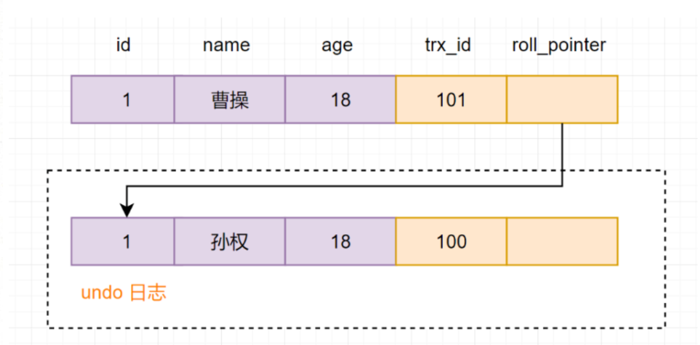

## 第 1 节 相关数据库知识点回顾

### **1.1 什么是数据库事务，为什么要有事务**

事务，由一个有限的数据库操作序列构成，这些操**作要么全部执行,要么全部不执行**，是一个不可分割的工作位。

> 假如A转账给B 100 元，先从A的账户里扣除 100 元，再在 B 的账户上加上 100 元。如果扣完A的100元后，还没来得及给B加上，银行系统异常了，最后导致A的余额减少了，B的余额却没有增加。所以就需要事务，将A的钱回滚回去，就是这么简单。

**为什么要有事务呢？** 就是为了**保证数据的最终一致性。**


### 1.2 事务包括哪几个特性？ 

在关系型数据库管理系统中，一个逻辑工作单元要成为事务，必须满足这 4 个特性，即所谓的 ACID： 原子性（Atomicity）、一致性（Consistency）、隔离性（Isolation）和持久性（Durability）。 

#### 1.原子性

原子性：事务是一个原子操作单元，其对数据的修改，要么全都执行，要么全都不执行。 

修改---》Buffer Pool修改---》刷盘。可能会有下面两种情况： 

- 事务提交了，如果此时Buffer Pool的脏页没有刷盘，如何保证修改的数据生效？ Redo 
- 如果事务没提交，但是Buffer Pool的脏页刷盘了，如何保证不该存在的数据撤销？Undo 

每一个写事务，都会修改BufferPool，从而产生相应的Redo/Undo日志，在Buffer Pool 中的页被刷到磁盘之前，这些日志信息都会先写入到日志文件中，如果 Buffer Pool 中的脏页没有刷成功，此时数据库挂了，那在数据库再次启动之后，可以通过 Redo 日志将其恢复出来，以保证脏页写的数据不会丢失。如果脏页刷新成功，此时数据库挂了，就需要通过Undo来实现了。

#### 2.持久性

持久性：指的是一个事务一旦提交，它对数据库中数据的改变就应该是永久性的，后续的操作或故障不应该对其有任何影响，不会丢失。 

如下图所示，一个“提交”动作触发的操作有：binlog落地、发送binlog、存储引擎提交、flush_logs， check_point、事务提交标记等。这些都是数据库保证其数据完整性、持久性的手段。


MySQL的持久性也与WAL技术相关，redo log在系统Crash重启之类的情况时，可以修复数据，从而保障事务的持久性。通过原子性可以保证逻辑上的持久性，通过存储引擎的数据刷盘可以保证物理上的持久性。 

#### 3. 隔离性 

隔离性：指的是一个事务的执行不能被其他事务干扰，即一个事务内部的操作及使用的数据对其他的并发事务是隔离的。 

InnoDB 支持的隔离性有 4 种，隔离性从低到高分别为：读未提交、读提交、可重复读、可串行化。锁和多版本控制（MVCC）技术就是用于保障隔离性的。

#### 4. **一致性** 

一致性：指的是事务开始之前和事务结束之后，数据库的完整性限制未被破坏。一致性包括两方面的内容，分别是约束一致性和数据一致性。 

- 约束一致性：创建表结构时所指定的外键、Check、唯一索引等约束，可惜在 MySQL 中不支持 Check 。 
- 数据一致性：是一个综合性的规定，因为它是由原子性、持久性、隔离性共同保证的结果，而不是单单依赖于某一种技术。 

一致性也可以理解为数据的完整性。数据的完整性是通过原子性、隔离性、持久性来保证的，而这3个特性又是通过 Redo/Undo 来保证的。逻辑上的一致性，包括唯一索引、外键约束、check 约束，这属于业务逻辑范畴。


ACID 及它们之间的关系如下图所示，4个特性中有3个与 WAL 有关系，都需要通过 Redo、Undo 日志来保证等。 

WAL的全称为Write-Ahead Logging，先写日志，再写磁盘。


## 第 2 节 事务并发存在的问题

### **2.1 并发事务** 

事务并发处理可能会带来一些问题，比如：更新丢失、脏读、不可重复读、幻读等。 

- 更新丢失 

  当两个或多个事务更新同一行记录，会产生更新丢失现象。可以分为回滚覆盖和提交覆盖。 

  - 回滚覆盖：一个事务回滚操作，把其他事务已提交的数据给覆盖了。 
  - 提交覆盖：一个事务提交操作，把其他事务已提交的数据给覆盖了。 

- 脏读 

  - 一个事务读取到了另一个事务修改但未提交的数据。 

  > 假设现在有两个事务A、B：
  > - 假设现在Jay的余额是100，事务A正在准备查询Jay的余额
  > - 事务B先扣减Jay的余额，扣了10，但是还没提交
  > - 最后A读到的余额是90，即扣减后的余额
  >
  > 

- 不可重复读 

  - 一个事务中多次读取同一行记录不一致，后面读取的跟前面读取的不一致。 

  > 假设现在有两个事务A和B：
  >
  > - 事务A先查询Jay的余额，查到结果是100
  > - 这时候事务B 对Jay的账户余额进行扣减，扣去10后，提交事务
  > - 事务A再去查询Jay的账户余额发现变成了90
  >
  > 

- 幻读 

  - 一个事务中多次按相同条件查询，结果不一致。后续查询的结果和面前查询结果不同，多了或少了 几行记录。

  > 假设现在有两个事务A、B：
  >
  > - 事务A先查询id大于2的账户记录，得到记录id=2和id=3的两条记录
  > - 这时候，事务B开启，插入一条id=4的记录，并且提交了
  > - 事务A再去执行相同的查询，却得到了id=2,3,4的3条记录了。
  >
  > 

### 2.2 MySQl锁家族

####  **1.四大隔离级别**

为了解决并发事务存在的**脏读、不可重复读、幻读**等问题，数据库大叔设计了四种隔离级别。分别是**读未提交，读已提交，可重复读，串行化（Serializable）**。

- **读未提交**

  读未提交隔离级别，只限制了两个数据**不能同时修改**，但是修改数据的时候，即使事务**未提交**，都是可以被别的事务读取到的，这级别的事务隔离有**脏读、重复读、幻读**的问题；

- **读已提交**

  读已提交隔离级别，当前事务只能读取到其他事务**提交**的数据，所以这种事务的隔离级别**解决了脏读**问题，但还是会存在**重复读、幻读**问题；

- **可重复读**

  可重复读隔离级别，限制了读取数据的时候，不可以进行修改，所以**解决了重复读**的问题，但是读取范围数据的时候，是可以插入数据，所以还会存在**幻读**问题；

- **串行化**

  事务最高的隔离级别，在该级别下，所有事务都是进行**串行化顺序**执行的。可以避免脏读、不可重复读与幻读所有并发问题。但是这种事务隔离级别下，事务执行很耗性能。
  
  
  
  ​	数据库的事务隔离级别越高，并发问题就越小，但是并发处理能力越差（代价）。读未提交隔离级别最低，并发问题多，但是并发处理能力好。以后使用时，可以根据系统特点来选择一个合适的隔离级别，比如对不可重复读和幻读并不敏感，更多关心数据库并发处理能力，此时可以使用Read Commited隔离级别。 
  
  事务隔离级别，针对Innodb引擎，支持事务的功能。像MyISAM引擎没有关系。 
  
  
  
  **事务隔离级别和锁的关系** 
  
  1）事务隔离级别是SQL92定制的标准，相当于事务并发控制的整体解决方案，本质上是对锁和MVCC使用的封装，隐藏了底层细节。 
  
  2）锁是数据库实现并发控制的基础，事务隔离性是采用锁来实现，对相应操作加不同的锁，就可以防止其他事务同时对数据进行读写操作。 
  
  3）对用户来讲，首先选择使用隔离级别，当选用的隔离级别不能解决并发问题或需求时，才有必要在开发中手动的设置锁。 
  
  MySQL默认隔离级别：可重复读 
  
  Oracle、SQLServer默认隔离级别：读已提交 
  
  一般使用时，建议采用默认隔离级别，然后存在的一些并发问题，可以通过悲观锁、乐观锁等实现处理。 
  
  
  
  ### **MySQL 隔离级别控制**
  
  MySQL默认的事务隔离级别是Repeatable Read，查看MySQL当前数据库的事务隔离级别命令如下：
  
  ```mysql
  show variables like 'transaction_isolation';
  或者
  select @@transaction_isolation;
  ```
  
  设置事务隔离级别可以如下命令：
  
  ```mysql
  set transaction_isolation = 'READ-UNCOMMITTED';
  set transaction_isolation = 'READ-COMMITTED';
  set transaction_isolation = 'REPEATABLE-READ';
  set transaction_isolation = 'SERIALIZABLE';
  ```
  
  

#### **2.四大隔离级别，都会存在哪些并发问题呢**

| 隔离级别 | 脏读 | 不可重复读 | 幻读 |
| :------: | :--: | :--------: | :--: |
| 读未提交 |  √   |     √      |  √   |
| 读已提交 |  ×   |     √      |  √   |
| 可重复读 |  ×   |     ×      |  √   |
|  串行化  |  ×   |     ×      |  ×   |

#### **3.数据库是如何保证事务的隔离性的呢？**

数据库是通过**加锁**，来实现事务的隔离性的。这就好像，如果你想一个人静静，不被别人打扰，你就可以在房门上加上一把锁。

加锁确实好使，可以保证隔离性。比如**串行化隔离级别就是加锁实现的**。但是频繁的加锁，导致读数据时，没办法修改，修改数据时，没办法读取，大大**降低了数据库性能**。


::: tip 读锁、写锁

读锁 ：也称为 共享锁 、英文用 S 表示。针对同一份数据，多个事务的读操作可以同时进行而不会互相影响，相互不阻塞的。 

写锁 ：也称为 排他锁 、英文用 X 表示。当前写操作没有完成前，它会阻断其他写锁和读锁。这样就能确保在给定的时间里，只有一个事务能执行写入，并防止其他用户读取正在写入的同一资源。 

**需要注意的是对于 InnoDB引擎来说，读锁和写锁可以加在表上，也可以加在行上。**

:::

::: tip 表级锁、页级锁、行锁

行锁 和 表锁 的区别：

**表锁**： 开销小，加锁快，不会出现死锁；锁定力度大，发生锁冲突概率高，并发度最低

**行锁**： 开销大，加锁慢，会出现死锁；锁定粒度小，发生锁冲突的概率低，并发度高

:::

##### 1.表锁（Table Lock）

**① 表级别的S锁、X锁** 

在对某个表执行SELECT、INSERT、DELETE、UPDATE语句时，InnoDB存储引擎是不会为这个表添加表级别的 S锁 或者 X锁 的。在对某个表执行一些诸如 ALTER TABLE 、 DROP TABLE 这类的 DDL 语句时，其他事务对这个表并发执行诸如SELECT、INSERT、DELETE、UPDATE的语句会发生阻塞。同理，某个事务中对某个表执行SELECT、INSERT、DELETE、UPDATE语句时，在其他会话中对这个表执行 DDL 语句也会发生阻塞。这个过程其实是通过在 server层 使用一种称之为 元数据锁 （英文名： Metadata Locks，简称 MDL ）结构来实现的。


- LOCK TABLES 表名 READ      --InnoDB存储引擎会对表  加表级别的 S锁 。
- LOCK TABLES 表名 WRITE     --InnoDB存储引擎会对表  加表级别的 X锁 。

不过尽量避免在使用InnoDB存储引擎的表上使用 LOCK TABLES 这样的手动锁表语句，它们并不会提供什么额外的保护，只是会降低并发能力而已。InnoDB的厉害之处还是实现了更细粒度的 行锁；
MySQL的表级锁有两种模式：（以MyISAM表进行操作的演示）

- 表共享读锁（Table Read Lock）
- 表独占写锁（Table Write Lock）

| 锁类型 | 自己可读 | 自己可写 | 自己可操作其他表 | 他人可读 | 他人可写 |
| :----: | :------: | :------: | :--------------: | :------: | :------: |
|  读锁  |    是    |    否    |        否        |    是    |    否    |
|  写锁  |    是    |    是    |        否        |    否    |    否    |

**读写互斥原则：**

1. 读读相容
2. 读写互斥
3. 写写互斥

**② 意向锁 （intention lock）** 

InnoDB 支持 多粒度锁（multiple granularity locking） ，它允许 行级锁 与 表级锁 共存，而**意向锁**就是其中的一种 表锁 。意向锁分为两种： 

> 意向共享锁（intention shared lock, IS）：事务有意向对表中的某些行加**共享锁**（S锁） 
>
> -- 事务要获取某些行的 S 锁，必须先获得表的 IS 锁。 
> SELECT column FROM table ... LOCK IN SHARE MODE;

> 意向排他锁（intention exclusive lock, IX）：事务有意向对表中的某些行加**排他锁**（X锁） 
> -- 事务要获取某些行的 X 锁，必须先获得表的 IX 锁。 
> SELECT column FROM table ... FOR UPDATE;

即：意向锁是由存储引擎 自己维护的 ，用户无法手动操作意向锁，在为数据行加共享 / 排他锁之前，InooDB 会先获取该数据行 所在数据表的对应意向锁 。 

意向锁的并发性：

意向锁不会与行级的共享 / 排他锁互斥！正因为如此，意向锁并不会影响到多个事务对不同数据行加排他锁时的并发性。（不然我们直接用普通的表锁就行了） 

我们扩展一下上面 teacher表的例子来概括一下意向锁的作用（一条数据从被锁定到被释放的过程中，可能存在多种不同锁，但是这里我们只着重表现意向锁）。 

从上面的案例可以得到如下结论： 

1. InnoDB 支持 多粒度锁 ，特定场景下，行级锁可以与表级锁共存。 

2. 意向锁之间互不排斥，但除了 IS 与 S 兼容外， 意向锁会与 共享锁 / 排他锁 互斥 。 

3. IX，IS是表级锁，不会和行级的X，S锁发生冲突。只会和表级的X，S发生冲突。 

4. 意向锁在保证并发性的前提下，实现了 行锁和表锁共存 且 满足事务隔离性 的要求。

|                  | 意向共享锁(IS) | 意向排他锁(IX) |
| :--------------: | :------------: | :------------: |
|   共享锁（S）    |      兼容      |      互斥      |
|   排他锁（X）    |      互斥      |      互斥      |
| 意向共享锁（IS） |      兼容      |      兼容      |
| 意向排他锁（IX） |      兼容      |      兼容      |

**③ 自增锁（AUTO-INC 锁）**

```mysql
-- 在使用MySQL过程中，我们可以为表的某个列添加 AUTO_INCREMENT 属性。举例： 

CREATE TABLE `teacher` (
`id` int NOT NULL AUTO_INCREMENT,
`name` varchar(255) NOT NULL,
PRIMARY KEY (`id`)
) ENGINE=InnoDB DEFAULT CHARSET=utf8mb4 COLLATE=utf8mb4_0900_ai_ci;

```

-- 由于这个表的id字段声明了AUTO_INCREMENT，意味着在书写插入语句时不需要为其赋值，SQL语句修改 如下所示。

INSERT INTO `teacher` (name) VALUES ('zhangsan'), ('lisi');

-- 现在我们看到的上面插入数据只是一种简单的插入模式，所有插入数据的方式总共分为三类，分别是“ Simple inserts ”，“ Bulk inserts ”和“ Mixed-mode inserts ”。

1. “Simple inserts” （简单插入）
    可以 预先确定要插入的行数 （当语句被初始处理时）的语句。包括没有嵌套子查询的单行和多行INSERT...VALUES() 和 REPLACE 语句。比如我们上面举的例子就属于该类插入，已经确定要插入的行数。

2. “Bulk inserts” （批量插入）
    事先不知道要插入的行数 （和所需自动递增值的数量）的语句。比如: INSERT ... SELECT ， REPLACE... SELECT 和 LOAD DATA 语句，但不包括纯INSERT。 InnoDB在每处理一行，为AUTO_INCREMENT列分配一个新值。


3. “Mixed-mode inserts” （混合模式插入）
    这些是“Simple inserts”语句但是指定部分新行的自动递增值。例如: 
    INSERT INTO teacher (id,name)VALUES (1,'a'), (NULL,'b'), (5,'c'), (NULL,'d'); 
    只是指定了部分id的值。另一种类型的“混合模式插入”是 INSERT ... ON DUPLICATE KEY UPDATE 。


innodb_autoinc_lock_mode有三种取值，分别对应与不同锁定模式：

（1）innodb_autoinc_lock_mode = 0(“传统”锁定模式)
在此锁定模式下，所有类型的insert语句都会获得一个特殊的表级AUTO-INC锁，用于插入具有AUTO_INCREMENT列的表。这种模式其实就如我们上面的例子，即每当执行insert的时候，都会得到一个表级锁(AUTO-INC锁)，使得语句中生成的auto_increment为顺序，且在binlog中重放的时候，可以保证master与slave中数据的auto_increment是相同的。因为是表级锁，当在同一时间多个事务中执行insert的时候，对于AUTO-INC锁的争夺会 限制并发 能力。

（2）innodb_autoinc_lock_mode = 1(“连续”锁定模式)
在 MySQL 8.0 之前，连续锁定模式是 默认 的。在这个模式下，“bulk inserts”仍然使用AUTO-INC表级锁，并保持到语句结束。这适用于所有INSERT ...SELECT，REPLACE ... SELECT和LOAD DATA语句。同一时刻只有一个语句可以持有AUTO-INC锁。对于“Simple inserts”（要插入的行数事先已知），则通过在 mutex（轻量锁） 的控制下获得所需数量的自动递增值来避免表级AUTO-INC锁， 它只在分配过程的持续时间内保持，而不是直到语句完成。不使用
表级AUTO-INC锁，除非AUTO-INC锁由另一个事务保持。如果另一个事务保持AUTO-INC锁，则“Simpleinserts”等待AUTO-INC锁，如同它是一个“bulk inserts”。

（3）innodb_autoinc_lock_mode = 2(“交错”锁定模式)
从 MySQL 8.0 开始，交错锁模式是 默认 设置。在此锁定模式下，自动递增值 保证 在所有并发执行的所有类型的insert语句中是 唯一 且 单调递增 的。但是，由于多个语句可以同时生成数字（即，跨语句交叉编号），为任何给定语句插入的行生成的值可能不是连续的。


## **第 3 节 MVCC** 

### **1. 什么是 MVCC？**

​	MVCC，即**Multi-Version  Concurrency Control （多版本并发控制）**。它是一种并发控制的方法，一般在数据库管理系统中，实现对数据库的并发访问，在编程语言中实现事务内存。

> 通俗的讲，数据库中同时存在多个版本的数据，并不是整个数据库的多个版本，而是某一条记录的多个版本同时存在，在某个事务对其进行操作的时候，需要查看这一条记录的隐藏列事务版本id，比对事务id并根据事物隔离级别去判断读取哪个版本的数据。

数据库隔离级别读**已提交、可重复读** 都是基于MVCC实现的，相对于加锁简单粗暴的方式，它用更好的方式去处理读写冲突，能有效提高数据库并发性能。

------

### **2. MVCC实现的关键知识点**

#### **2.1 事务版本号**

​	事务每次开启前，都会从数据库获得一个**自增**长的事务ID，可以从事务ID判断事务的执行先后顺序。这就是事务版本号。

#### **2.2 隐式字段**

​	对于InnoDB存储引擎，每一行记录都有两个隐藏列**trx_id**、**roll_pointer**，如果表中没有主键和非NULL唯一键时，则还会有第三个隐藏的主键列**row_id**。

| 列名         | 是否必须 | 描述                                             |
| ------------ | -------- | ------------------------------------------------ |
| row_id       | 否       | 单调递增的行ID，不是必需的，占用6个字节。        |
| trx_id       | 是       | 记录操作该数据事务的事务ID                       |
| roll_pointer | 是       | 这个隐藏列就相当于一个指针，指向回滚段的undo日志 |

#### **2.3 undo log**

​	undo log，**回滚日志**，用于记录数据被修改前的信息。在表记录修改之前，会先把数据拷贝到undo log里，如果事务回滚，即可以通过undo log来还原数据。

可以这样认为，当delete一条记录时，undo log 中会记录一条对应的insert记录，当update一条记录时，它记录一条对应相反的update记录。

undo log有什么**用途**呢？

1. 事务回滚时，保证原子性和一致性。
2. 用于MVCC**快照读**。

#### **2.4 版本链**

多个事务并行操作某一行数据时，不同事务对该行数据的修改会产生多个版本，然后通过回滚指针（roll_pointer），连成一个链表，这个链表就称为**版本链**。如下：


​                                                                                   版本链

其实，通过版本链，我们就可以看出**事务版本号、表格隐藏的列和undo log**它们之间的关系。我们再来小分析一下。

1. 假设现在有一张core_user表，表里面有一条数据,id为1，名字为孙权：


1. 现在开启一个事务A：对core_user表执行 **update core_user set name ="曹操" where id=1**,会进行如下流程操作

- 首先获得一个事务ID=100
- 把core_user表修改前的数据,拷贝到undo log
- 修改core_user表中，id=1的数据，名字改为曹操
- 把修改后的数据事务Id=101改成当前事务版本号，并把 **roll_pointer**指向undo log数据地址。


#### **2.5 快照读和当前读**

**快照读：** 读取的是记录数据的可见版本（有旧的版本）。不加锁,普通的select语句都是快照读,如：

> select * from core_user where id > 2;

**当前读**：读取的是记录数据的最新版本，显式加锁的都是当前读

> select * from core_user where id > 2 for update; select * from account where id>2 lock in share mode;

#### **2.6 Read View**

- **Read View是什么呢？** 它就是事务执行SQL语句时，产生的读视图。实际上在innodb中，每个SQL语句执行前都会得到一个Read View。
- **Read View有什么用呢？** 它主要是用来做可见性判断的，即判断当前事务可见哪个版本的数据~

Read View是如何保证可见性判断的呢？我们先看看Read view 的几个重要属性

- **m_ids**:当前系统中那些活跃(未提交)的读写事务ID, 它数据结构为一个List。
- **min_limit_id**:表示在生成Read View时，当前系统中活跃的读写事务中最小的事务id，即m_ids中的最小值。
- **max_limit_id**:表示生成Read View时，系统中应该分配给下一个事务的id值。
- **creator_trx_id**: 创建当前Read View的事务ID


> **Read view 匹配条件规则**
>
> 1. 如果数据事务ID **trx_id < min_limit_id**，表明生成该版本的事务在生成Read View**前**，已经提交(因为事务ID是递增的)，所以该版本可以被当前事务访问。
> 2. 如果 **trx_id>= max_limit_id**，表明生成该版本的事务在生成ReadView后才生成，所以该版本不可以被当前事务访问。
> 3. 如果 **min_limit_id =,需腰分3种情况讨论**
>
> ​	（1）如果m_ids包含trx_id,则代表Read View生成时刻，这个事务还未提交，但是如果数据的trx_id等于   creator_trx_id的话，表明数据是自己生成的，因此            是**可见**的。
>
> ​	（2）如果m_ids包含trx_id，并且trx_id不等于creator_trx_id，则Read  View生成时，事务未提交，并且不是自己生产的，所以当前事务也是**看不见**的；
>
> ​	（3）如果m_ids不包含trx_id，则说明你这个事务在Read View生成之前就已经提交了，修改的结果，当前事务是能看见的。

------

### **3. MVCC实现原理分析**

**3.1 查询一条记录，基于MVCC，是怎样的流程**

1. 获取事务自己的版本号，即事务ID
2. 获取Read View
3. 查询得到的数据，然后Read View中的事务版本号进行比较。
4. 如果不符合Read View的可见性规则， 即就需要Undo log中历史快照;
5. 最后返回符合规则的数据

InnoDB 实现MVCC，是通过Read View+ Undo Log 实现的，Undo Log 保存了历史快照，Read View可见性规则帮助判断当前版本的数据是否可见。

**3.2 读已提交（RC）隔离级别，存在不可重复读问题的分析历程**

1. 创建core_user表，插入一条初始化数据,如下：


1. 隔离级别设置为读已提交（RC），事务A和事务B同时对core_user表进行查询和修改操作。

```mysql
事务A: select * fom core_user where id=1 

事务B: update core_user set name =”曹操”
```

执行流程如下：  

最后事务A查询到的结果是，**name=曹操**的记录，我们**基于MVCC**，来分析一下执行流程：

(1) A开启事务，首先得到一个事务ID为100

(2) B开启事务，得到事务ID为101

(3) 事务A生成一个Read View，read view对应的值如下

| 变量           | 值       |
| -------------- | -------- |
| m_ids          | 100，101 |
| max_limit_id   | 102      |
| min_limit_id   | 100      |
| creator_trx_id | 100      |

然后回到版本链：开始从版本链中挑选可见的记录：


​                                                                                                 版本链

由图可以看出，最新版本的列name的内容是孙权，该版本的trx_id值为100。开始执行read view可见性规则校验：

```mysql
min_limit_id(100)=<trx_id（100）<102; 

creator_trx_id = trx_id =100;
```

由此可得，trx_id=100的这个记录，当前事务是可见的。所以查到是name为孙权的记录。

（4). 事务B进行修改操作，把名字改为曹操。把原数据拷贝到undo log,然后对数据进行修改，标记事务ID和上一个数据版本在undo log的地址。



(5) 提交事务

(6) 事务A再次执行查询操作，**新生成一个Read View**，Read View对应的值如下

| 变量           | 值   |
| -------------- | ---- |
| m_ids          | 100  |
| max_limit_id   | 102  |
| min_limit_id   | 100  |
| creator_trx_id | 100  |

然后再次回到版本链：从版本链中挑选可见的记录：


从图可得，最新版本的列name的内容是曹操，该版本的trx_id值为101。开始执行Read View可见性规则校验：

```mysql
min_limit_id(100)=<trx_id（101）<max_limit_id（102); 
但是,trx_id=101，不属于m_ids集合
```

因此，trx_id=101这个记录，对于当前事务是可见的。所以SQL查询到的是name为曹操的记录。

综上所述，在**读已提交（RC）隔离级别**下，同一个事务里，两个相同的查询，读取同一条记录（id=1），却返回了不同的数据（**第一次查出来是孙权，第二次查出来是曹操那条记录**），因此RC隔离级别，存在**不可重复读**并发问题。

**4.3 可重复读（RR）隔离级别，解决不可重复读问题的分析**

在RR隔离级别下，是如何解决不可重复读问题的呢？我们一起再来看下，

还是4.2小节那个流程，还是这个事务A和事务B，如下：

  

**4.3.1 不同隔离级别下，Read View的工作方式不同**

实际上，各种事务隔离级别下的Read view工作方式，是不一样的，RR可以解决不可重复读问题，就是跟**Read view工作方式有关**。

- 在读已提交（RC）隔离级别下，同一个事务里面，

**每一次查询都会产生一个新的Read View副本**，这样就可能造成同一个事务里前后读取数据可能不一致的问题（不可重复读并发问题）。

| begin                               |                   |
| ----------------------------------- | ----------------- |
| select * from core_user where id =1 | 生成一个Read View |
| /                                   | /                 |
| /                                   | /                 |
| select * from core_user where id =1 | 生成一个Read View |

- 在可重复读（RR）隔离级别下，

**一个事务里只会获取一次read view**，都是副本共用的，从而保证每次查询的数据都是一样的。

| begin                               |                       |
| ----------------------------------- | --------------------- |
| select * from core_user where id =1 | 生成一个Read View     |
| /                                   |                       |
| /                                   |                       |
| select * from core_user where id =1 | 共用一个Read View副本 |

**4.3.2 实例分析**

我们穿越下，回到**刚4.2的例子**，然后执行第2个查询的时候：

事务A再次执行查询操作，复用老的Read View副本，Read View对应的值如下

| 变量           | 值       |
| -------------- | -------- |
| m_ids          | 100，101 |
| max_limit_id   | 102      |
| min_limit_id   | 100      |
| creator_trx_id | 100      |

然后再次回到版本链：从版本链中挑选可见的记录：


从图可得，最新版本的列name的内容是曹操，该版本的trx_id值为101。开始执行read view可见性规则校验：

```mysql
min_limit_id(100)=<trx_id（101）<max_limit_id（102); 
因为m_ids{100,101}包含trx_id（101）， 
并且creator_trx_id (100) 不等于trx_id（101）
```

所以，trx_id=101这个记录，对于当前事务是**不可见**的。这时候呢，版本链roll_pointer跳到下一个版本，trx_id=100这个记录，再次校验是否可见：

```mysql
min_limit_id(100)=<trx_id（100）< max_limit_id（102); 
因为m_ids{100,101}包含trx_id（100），
并且creator_trx_id (100) 等于trx_id（100）
```

所以，trx_id=100这个记录，对于当前事务是**可见**的，所以两次查询结果，都是**name=孙权**的那个记录。即在可重复读（RR）隔离级别下，复用老的Read View副本，解决了**不可重复读**的问题。

**4.4 网络江湖传说，MVCC是否解决了幻读问题呢？**

网络江湖有个传说，说MVCC的RR隔离级别，解决了幻读问题，我们来一起分析一下。

**4.4.1 RR级别下，一个快照读的例子，不存在幻读问题**

  

由图可得，步骤2和步骤6查询结果集没有变化，**看起来RR级别是已经解决幻读问题啦**~

**4.4.2 RR级别下，一个当前读的例子**

假设现在有个account表，表中有4条数据，RR级别。

- 开启事务A，执行

**当前读**，查询id>2的所有记录。

- 再开启事务B，插入id=5的一条数据。

流程如下：


显然，事务B执行插入操作时，阻塞了~因为事务A在执行select ... lock in share mode（当前读）的时候，不仅在id = 3,4 这2条记录上加了锁，而且在id > 2这个范围上也加了**间隙锁**。

因此，我们可以发现，RR隔离级别下，加锁的select, update, delete等语句，会使用间隙锁+ 临键锁，锁住索引记录之间的范围，避免范围间插入记录，以**避免产生幻影行记录**，那就是说RR隔离级别解决了幻读问题？

**4.4.3 这种特殊场景，似乎有幻读问题**


其实，上图事务A中，多加了update account set balance=200 where id=5;这步操作，同一个事务，相同的sql，查出的结果集不同了，这个结果，就符合了幻读的定义~
