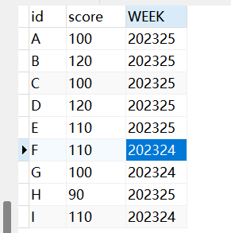
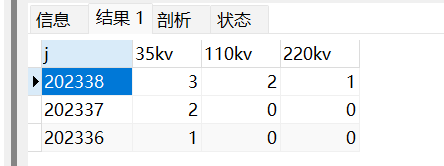

## 一.低版本MySql实现窗口函数

## 1.问题

低版本的MySql ，无法使用,rank（）,row_number（）等其它窗口函数。

## 2.解决方案

测试表：

### 1.row_number()

```mysql
-- MySql8.0中的row_number（）函数，可以使用变量来实现。

-- 能用但是不会并列 
select t.id,t.score,t.week,
IF(@pre_name = t.week , @cur_rank := @cur_rank + 1, @cur_rank := 1) ranking,
@pre_name := t.week weeking
FROM stock t, (SELECT @cur_rank := 0, @pre_name := NULL) r
ORDER BY week DESC,score DESC; 


-- 优化后 --
select t.id,t.score,t.week,
IF(@pre_name = t.week , @rank_counter := @rank_counter + 1, @rank_counter := 1) pm,
IF(@pre_score = t.score , @cur_rank := @cur_rank , @cur_rank := @rank_counter) blpm,
@pre_name := t.week weeknum,
@pre_score := t.score scoreCount
FROM stock t, (SELECT @pre_name := NULL, @pre_score := NULL,@cur_rank := 0,@rank_counter:=0) r
ORDER BY CAST(week AS FLOAT) DESC,CAST(score AS FLOAT) DESC; 
```

### 2.SUM() OVER()  

测试表：

```mysql
-- -----视图_转换格式
CREATE VIEW npyyzb_kv35220 AS 
SELECT SUM(a.35kv) '35kv', SUM(a.110kv) '110kv', SUM(a.220kv) '220kv',"全市" name ,a.j
FROM(
SELECT a.*,IF(b =35,1,0) as '35kv',IF(b =110,1,0) as '110kv',IF(b =220,1,0) as '220kv'
FROM(
select * FROM kv35220 
)a
)a
GROUP BY a.j
```


```mysql
-----------------高版本实现
SELECT  
j,
SUM(110kv) OVER(partition by SUBSTR(j,1,4) ORDER BY j) 110kv 
FROM npyyzb_kv35220

-----------------低版本实现
SELECT 
 a.j,
(
	SELECT SUM(b.35kv)
	FROM  npyyzb_kv35220 b
	WHERE b.j <= a.j  AND SUBSTR(b.j,1,4) = SUBSTR(a.j,1,4) 
  )35kv,
(
	SELECT SUM(b.110kv)
	FROM  npyyzb_kv35220 b
	WHERE b.j <= a.j AND SUBSTR(b.j,1,4) = SUBSTR(a.j,1,4) 
  )110kv,
(
	SELECT SUM(b.220kv)
	FROM  npyyzb_kv35220 b
	WHERE b.j <= a.j  AND SUBSTR(b.j,1,4) = SUBSTR(a.j,1,4) 
  )220kv
from npyyzb_kv35220 a
GROUP BY j
```




::: tip
另外一种实现方式：利用变量

:::


**为了解决上述问题1：新增了一张周数的配置表。**


**遇到新的问题：因为是计算累计值，本周没有数据，就展示上周的累计数据。**

**-- 最终实现方式 --**

原始数据：


------

**视图1：**

```mysql
-- 视图1
CREATE VIEW view_1 AS
SELECT SUM(a.35kv) '35kv', SUM(a.110kv) '110kv', SUM(a.220kv) '220kv',"全市" name ,a.TBZS
FROM(
SELECT a.*,IF(b =35,1,0) as '35kv',IF(b =110,1,0) as '110kv',IF(b =220,1,0) as '220kv'
FROM(
select * FROM np_35220 WHERE i != "是" 
)a
)a
GROUP BY a.TBZS
```

------


------

**视图2：**

```mysql
-- 视图2
CREATE VIEW view_2 AS
SELECT a.weeknum as tbzs,
if(b.35kv is null ,0,b.35kv ) 35kv,
if(b.110kv is null ,0,b.110kv ) 110kv,
if(b.220kv is null ,0,b.220kv ) 220kv,
"全市" name 
FROM (
	SELECT * FROM configweek
)a
LEFT JOIN (
	SELECT * from 	view_1
)b
ON a.weeknum = b.tbzs
```

------


------

**视图3：**

```mysql
-- 视图3 （利用变量来实现sum() over()函数）
SELECT a.*,a.35kv+a.110kv+a.220kv as sum 
FROM(
select t.tbzs,
cast(IF(@pre_name = substr(t.tbzs,1,4) , @cur_35 := @cur_35 + 35kv, @cur_35 := 35kv) as char) 35kv,
cast(IF(@pre_name = substr(t.tbzs,1,4) , @cur_110 := @cur_110 + 110kv, @cur_110 := 110kv)as char) 110kv,
cast(IF(@pre_name = substr(t.tbzs,1,4) , @cur_220 := @cur_220 + 220kv, @cur_220 := 220kv)as char) 220kv,
@pre_name := substr(t.tbzs,1,4) year1
FROM view_2 t, (SELECT @cur_35 := 0,@cur_110 := 0,@cur_220 := 0, @pre_name := NULL) r
ORDER BY substr(t.tbzs,1,4) asc,tbzs asc
)a
```


