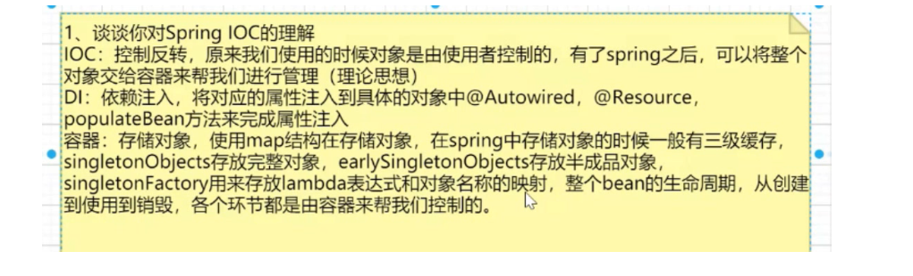
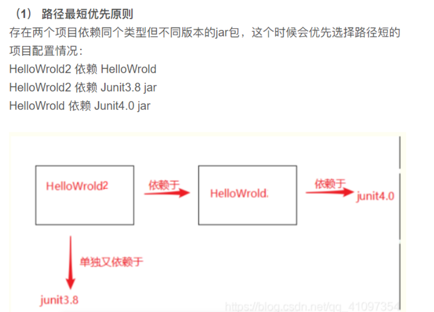
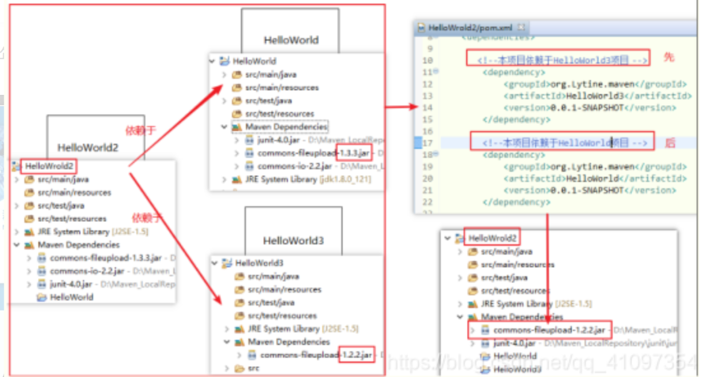
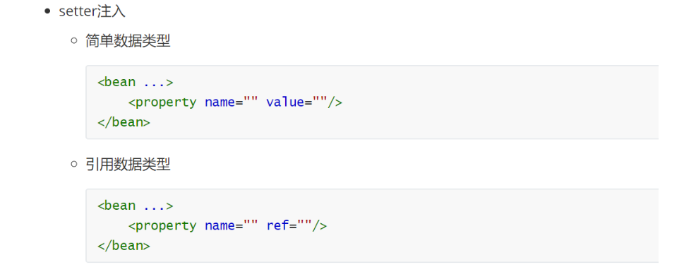
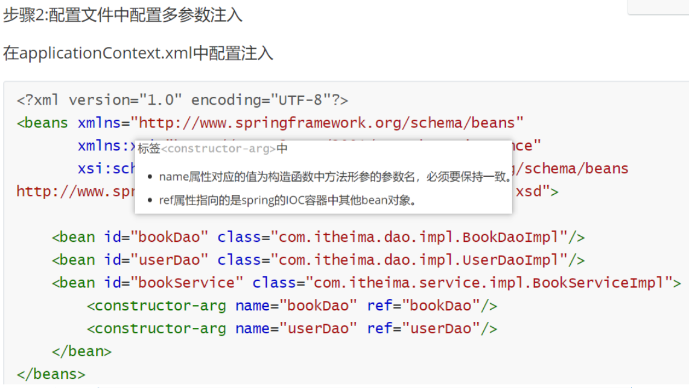
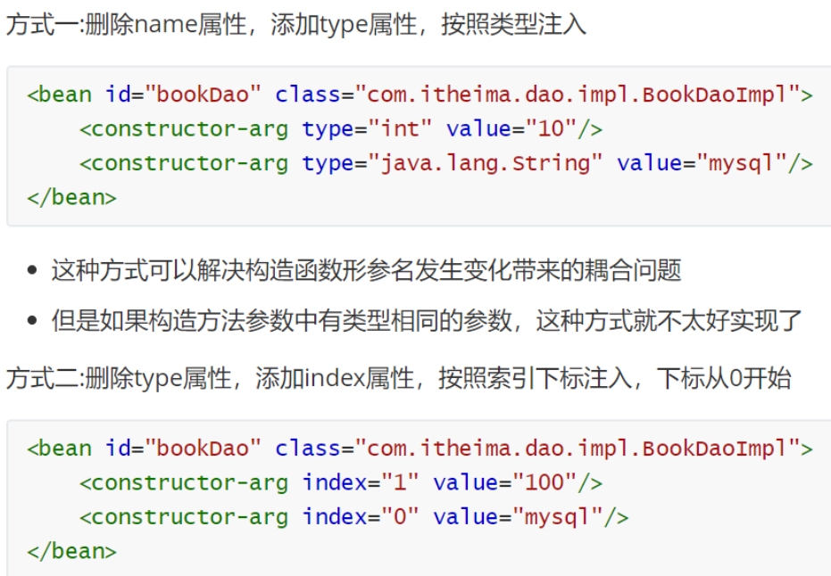
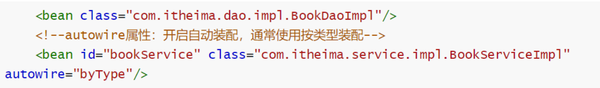
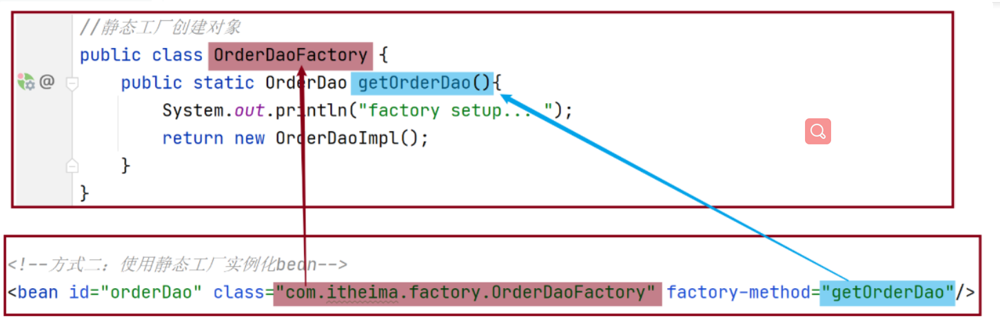
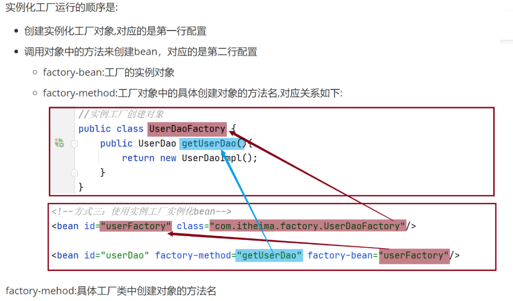
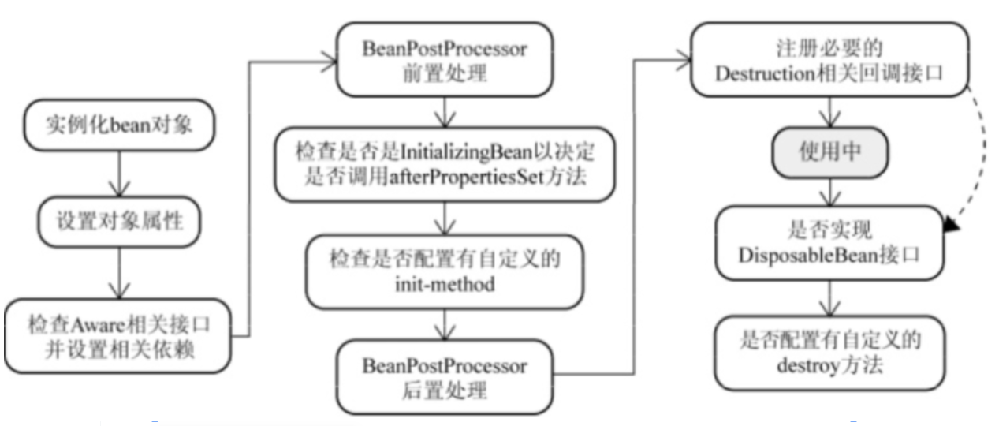

**为什么要使用** **spring？**

· spring 提供 ioc 技术，容器会帮你管理依赖的对象，从而不需要自己创建和管理依赖对象了，更轻松的实现了程序的解耦。

· spring 提供了事务支持，使得事务操作变的更加方便。

· spring 提供了面向切片编程，这样可以更方便的处理某一类的问题。

· 更方便的框架集成，spring 可以很方便的集成其他框架，比如 MyBatis、hibernate 等。

**IOC:**

spring提出的一种思想，就是由spring来负责控制对象的生命周期和对象间的关系，控制指的是当前对象对内部成员的控制权；控制反转指的是这种控制权不由当前对象管理了，由其他（类，第三方容器）来管理。

如：业务层要用数据层的类对象，以前是自己new的，现在自己不new了，交给spring提供的一个IOC容器来创建对象。就反转控制了数据层对象的创建权。

**AOP：**

aop是面向切面编程，可以通过预编译方式和运行期间通过动态代理实现在不改变源码的情况下对方法进行增强的一项技术。

如：统一处理日志、异常等。

**DI:**

在容器中建立bean与bean之间的依赖关系的整个过程，称为依赖注入。

如：业务层要用数据层的类对象，以前是自己new的，现在不自己new了，靠IOC容器给注入进来，这种思想就是依赖注入。

**Maven 依赖传递：**

依赖原则目的：防止jar包的冲突。

为了避免造成依赖重复，需要选择一个依赖路径。

依赖原则：

1.路径最短优先原则。

2.路径长度相同：

**2.1 覆盖**：后面声明的会覆盖前面的依赖

如果**在****同一****pom.xml文件中有2个相同的依赖；后面声明的会覆盖前面的依赖**

**2.2 优先**：则先声明的依赖，会覆盖后面声明的依赖

如果是在**不同****pom.xml中有2个相同的依赖；则先声明的依赖，会覆盖后面生命的依赖**

如下HelloWorld2依赖项目HelloWorld，和项目HelloWorld3

HelloWorld与HelloWorld3都有不同版本的commons-fileupload.jar

显然，先写在前面的HelloWorld3的jar包被采用了

————————————————

**DependencyManagement：**

主要有两个作用：

> **一个是集中管理项目的依赖项，**

> **另一个就是控制使用的依赖项的版本。**

------

**Spring 有哪些主要模块？**

· spring core：框架的最基础部分，提供 ioc 和依赖注入特性。

· spring context：提供框架式的Bean访问方式，其他程序可以通过Context访问Spring的Bean资源，相当于资源注入。 

· spring dao：Data Access Object 提供了JDBC的抽象层。

· spring aop：提供了面向切面的编程实现，让你可以自定义拦截器、切点等。

· spring Web：提供了针对 Web 开发的集成特性，例如文件上传，利用 servlet listeners 进行 ioc 

容器初始化和针对 Web 的 ApplicationContext。

spring Web mvc：spring 中的 mvc 封装包提供了 Web 应用的 Model-View-Controller（MVC）的实现。

------

**spring的常用注入方式有哪些？**

setter 属性注入

构造器注入

注解方式注入

==注意事项:==

- 需要注入属性的类中对应属性的setter方法不能省略
- 被注入的对象必须要被Spring的IOC容器管理
- 按照类型在Spring的IOC容器中如果找到多个对象，会报NoUniqueBeanDefinitionException

------

**实例化bean的三种方式：**

构造方法

Spring底层使用的是类的无参构造方法。

静态工厂实例化

创建一个工厂类OrderDaoFactory并提供一个==静态方法==

编写AppForInstanceOrder运行类，在类中通过工厂获取对象

**factory-method**="getOrderDao"  // 具体工厂类中创建对象的方法名

实例工厂实例化

------

**bean的生命周期：**

**1.什么是生命周期?**

   从创建到消亡的完整过程,例如人从出生到死亡的整个过程就是一个生命周期。

**2.bean生命周期是什么?**

bean对象从创建(init)到销毁(destory)的整体过程。

===============================================================

1.首先Spring启动，查找并加载需要被Spring管理的bean，进行Bean的实例化，也就是我们通常说的new

2.按照spring上下文对实例化的bean进行配置，也就是Ioc注入

3.如果这个Bean实现BeanNameAware接口，调用setBeanName()方法设置Id

4.如果这个Bean实现了BeanFactoryAware接口，会调用它实现的setBeanFactory(),

传递的是spring工厂本身。

5.如果这个Bean实现了ApplicationContextAware接口，将调用Bean的setApplicationContext()方法，将bean所在应用上下文引用传入进来。

6..实例化之前调用：BeanPostProcessor   （前置处理

7.实例化的时候 ，如果bean使用init-method声明了初始化方法，该方法也会被调用

8.实质化之后调用：BeanPostProcessor     （后置处理

9.bean的销毁  当bean不再被使用时，就会调用destroy()方法

10.最后，如果这个 Bean 的 Spring 配置中配置了 destroy-method 属性，会自动调用其配置的销毁方法。

===============================================================

1.实例化：Spring启动，查找并加载需要被Spring管理的bean，进行Bean的实例化，也就是我们通常说的new

2.属性注入：Bean实例化后对将Bean的引入和值注入到Bean的属性中（IOC注入）

3.设置beanId：如果实现**BeanNameAware接口**，调用setBeanName()方法设置ID

4.如果Bean实现了**BeanFactoryAware接口**的话调用BeanFactoryAware.setBeanFactory(setBeanFactory(BeanFactory)：将BeanFactory容器实例传入；

5.如果Bean实现了**ApplicationContextAware接口**的话，Spring将调用Bean的setApplicationContext()方法，将bean所在应用上下文引用传入进来。

6.实例化之前调用：**BeanPostProcessor.postProcessBeforeInitialization**(Object obj, String s)方法调用，

7.实例化：如果Bean 实现了**InitializingBean**（初始化）接口，Spring将调用他们的**afterPropertiesSet()**方法。类似的，如果bean使用init-method声明了初始化方法，该方法也会被调用

8.实质化之后调用：如果关联BeanPostProcessor接口，调用postProcessAfterInitialization(Object obj, String s)方法，

注：前面这里我们就完成bean的实例化；

9.bean的销毁：当bean不再被使用时，就会调用destroy()方法；

10.bean销毁调用方法：如果bean实现了DisposableBean接口，Spring将调用它的destory()接口方法，同样，如果bean使用了destory-method 声明销毁方法，该方法也会被调用。

================================================================

 找工作的时候有些人会被问道Spring中Bean的生命周期，其实也就是考察一下对Spring是否熟悉，工作中很少用到其中的内容，那我们简单看一下。

​    在说明前可以思考一下**Servlet的生命周期**：实例化，初始init，接收请求service，销毁destroy；

​    Spring上下文中的Bean也类似，如下

​    **1、实例化一个Bean－－也就是我们常说的new；**

​    **2、按照Spring上下文对实例化的Bean进行配置－－也就是IOC注入；**

​    **3、如果这个Bean已经实现了BeanNameAware接口，会调用它实现的setBeanName(String)方法，此处传递的就是Spring配置文件中Bean的id值**

​    **4、如果这个Bean已经实现了BeanFactoryAware接口，会调用它实现的setBeanFactory(setBeanFactory(BeanFactory)传递的是Spring工厂自身（可以用这个方式来获取其它Bean，只需在Spring配置文件中配置一个普通的Bean就可以）；**

​    **5、如果这个Bean已经实现了ApplicationContextAware接口，会调用setApplicationContext(ApplicationContext)方法，传入Spring上下文（同样这个方式也可以实现步骤4的内容，但比4更好，因为ApplicationContext是BeanFactory的子接口，有更多的实现方法）；**

​    **6、如果这个Bean关联了BeanPostProcessor接口，将会调用postProcessBeforeInitialization(Object obj, String s)方法，BeanPostProcessor经常被用作是Bean内容的更改，并且由于这个是在Bean初始化结束时调用那个的方法，也可以被应用于内存或缓存技术；**

​    **7、如果Bean在Spring配置文件中配置了init-method属性会自动调用其配置的初始化方法。**

​    **8、如果这个Bean关联了BeanPostProcessor接口，将会调用postProcessAfterInitialization(Object obj, String s)方法、；**

​    **注：以上工作完成以后就可以应用这个Bean了，那这个Bean是一个Singleton的，所以一般情况下我们调用同一个id的Bean会是在内容地址相同的实例，当然在Spring配置文件中也可以配置非Singleton，这里我们不做赘述。**

​    **9、当Bean不再需要时，会经过清理阶段，如果Bean实现了DisposableBean这个接口，会调用那个其实现的destroy()方法；**

​    **10、最后，如果这个Bean的Spring配置中配置了destroy-method属性，会自动调用其配置的销毁方法。**

 

以上10步骤可以作为面试或者笔试的模板，另外我们这里描述的是应用Spring上下文Bean的生命周期，如果应用Spring的工厂也就是BeanFactory的话去掉第5步就Ok了。

**3.bean生命周期控制是什么?**

在bean创建后到销毁前做一些事情。

 **什么是依赖自动装配?**

IoC容器根据bean所依赖的资源在容器中自动查找并注入到bean中的过程称为自动装配。

**自动装配方式有哪些?**

==按类型（常用）==

按名称

按构造方法

 **spring 中的 bean 是线程安全的吗？**

**spring中的bean 默认是单例模式，所有线程都共享一个单例实列Bean，因此是存在资源的竞争。**

**实际上大部分时候 spring bean是无状态**（**没有实例变量的对象，不能保存数据，是不变类，**）的比如spring mvc的（controller，service，dao），**线程中的操作不会对Bean的成员执行查询以外的操作，那么这个单例Bean是线程安全的。**

**对于有状态的bean**，Spring官方提供的bean，一**般提供了通过ThreadLocal去解决线程安全的方法**，比如RequestContextHolder、TransactionSynchronizationManager、LocaleContextHolder等。

 **spring 支持几种 bean 的作用域？**

spring 支持 5 种作用域，如下：

· singleton：spring ioc 容器中只存在一个 bean 实例，bean 以单例模式存在，是系统默认值；

· prototype：每次从容器调用 bean 时都会创建一个新的示例，既每次 getBean()相当于执行 new Bean()操作；

· Web 环境下的作用域：

· request：每次 http 请求都会创建一个 bean；

· session：同一个 http session 共享一个 bean 实例；

· global-session：用于 portlet 容器，因为每个 portlet 有单独的 session，globalsession 提供一个全局性的 http session。

**注意：** 使用 prototype 作用域需要慎重的思考，因为频繁创建和销毁 bean 会带来很大的性能开销。

**spring 自动装配 bean 有哪些方式？**

· no：默认值，表示没有自动装配，应使用显式 bean 引用进行装配。

· byName：它根据 bean 的名称注入对象依赖项。

· byType：它根据类型注入对象依赖项。

· 构造函数：通过构造函数来注入依赖项，需要设置大量的参数。

· autodetect：容器首先通过构造函数使用 autowire 装配，如果不能，则通过 byType 自动装配。

------

**springmvc执行流程**

 

一个请求匹配前端控制器 DispatcherServlet 的请求映射路径(在 web.xml中指定), WEB 容器将该请求转交给 DispatcherServlet 处理

DispatcherServlet 接收到请求后, 将根据 请求信息 交给 处理器映射器 （HandlerMapping）

HandlerMapping 根据用户的url请求 查找匹配该url的 Handler，并返回一个执行链

DispatcherServlet 再请求 处理器适配器(HandlerAdapter) 调用相应的 Handler 进行处理并返回 ModelAndView 给 DispatcherServlet

DispatcherServlet 将 ModelAndView 请求 ViewReslover（视图解析器）解析，返回具体 View

DispatcherServlet 对 View 进行渲染视图（即将模型数据填充至视图中）

DispatcherServlet 将页面响应给用户

------

**springmvc⽀持restful风格吗？有哪些注解**

@RequestMapping如果没有指定请求方式，将接收Get,Post,Head,Options等所有的请求方式

@GetMapping

@PostMapping

@DeleteMapping

@PutMapping

@PathVariable从路径中获取参数

@RequestBody从请求体中获取数据，获取的是json格式数据

@RequestParam 获取url拼接的值