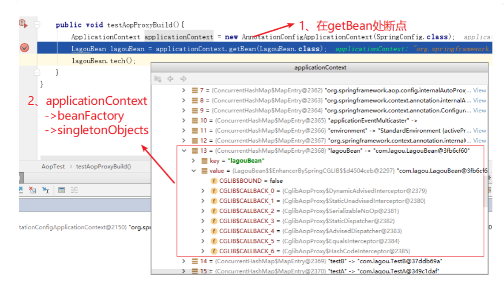
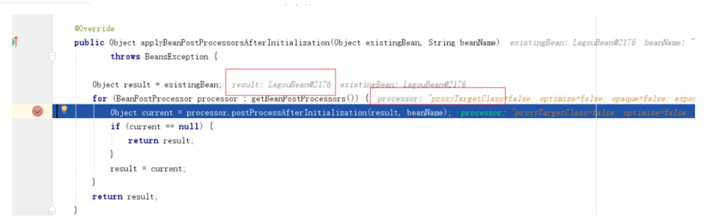
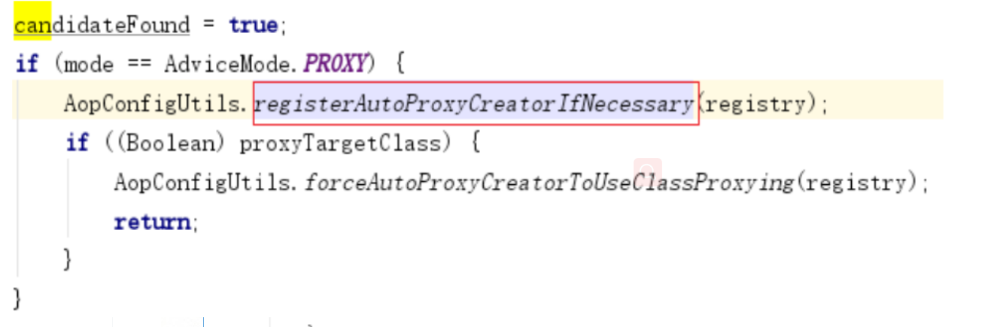
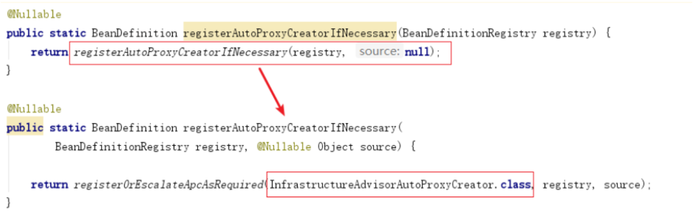
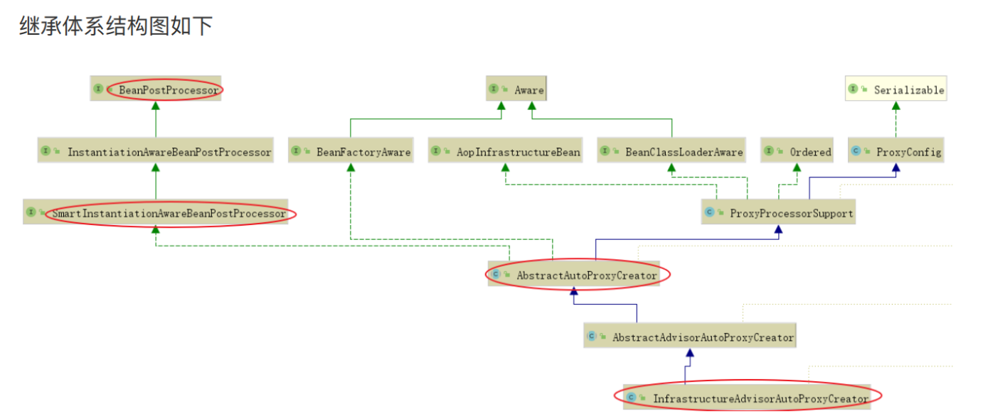
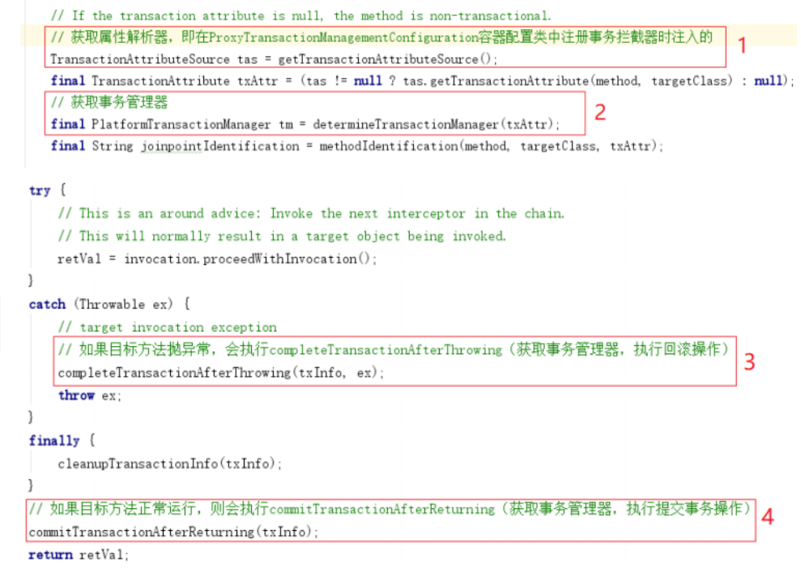

# **第1节 代理对象创建** 

## **1.1 AOP基础用例准备** 

 Bean定义 

```java
@Component
public class LagouBean {
  public void tech(){
  System.out.println("java learning......");
  }
}
```

Aspect定义

```java
package com.lagou;
import org.aspectj.lang.annotation.Aspect;
import org.aspectj.lang.annotation.Before;
import org.aspectj.lang.annotation.Pointcut;
import org.springframework.stereotype.Component;

@Component
@Aspect
public class LagouAspect {

    @Pointcut("execution(* com.lagou.*.*(..))")
    public void pointcut(){
    }

    @Before("pointcut()")
    public void before() {
      System.out.println("before method ......");
     }
  }

```

测试⽤例

```java
/**
* 测试⽤例：Aop 代理对象创建
*/
@Test
public void testAopProxyBuild(){
    ApplicationContext applicationContext = new  AnnotationConfigApplicationContext(SpringConfig.class);
    LagouBean lagouBean = applicationContext.getBean(LagouBean.class);
    lagouBean.tech();
}
```

------


## **1.2 时机点分析**



我们发现在 getBean 之前，LagouBean对象已经产⽣（即在第⼀⾏初始化代码中完成），⽽且该对象是⼀个代理对象（Cglib代理对象），我们断定，容器初始化过程中⽬标Ban已经完成了代理，返回了代理对象。


------

## **1.3 代理对象创建流程**

AbstractAutowireCapableBeanFactory#initializeBean(java.lang.String, java.lang.Object, org.springframework.beans.factory.support.RootBeanDefifinition)

```java
/**
初始化Bean
包括Bean后置处理器初始化
Bean的⼀些初始化⽅法的执⾏init-method
Bean的实现的声明周期相关接⼝的属性注⼊
*/
protected Object initializeBean(final String beanName, final Object bean,@Nullable RootBeanDefinition mbd) {
      // 执⾏所有的AwareMethods
      if (System.getSecurityManager() != null) {
      AccessController.doPrivileged((PrivilegedAction<Object>) () -> {
          invokeAwareMethods(beanName, bean);
          return null;
            }, getAccessControlContext());
        }else {
            invokeAwareMethods(beanName, bean);
         }
       Object wrappedBean = bean;
       if (mbd == null || !mbd.isSynthetic()) {
            // 执⾏所有的BeanPostProcessor#postProcessBeforeInitialization 初始化之前的处理器⽅法
            wrappedBean = applyBeanPostProcessorsBeforeInitialization(wrappedBean,beanName);
        }
      try {
         // 这⾥就开始执⾏afterPropertiesSet（实现了InitializingBean接⼝）⽅法和 initMethod
            invokeInitMethods(beanName, wrappedBean, mbd);
        }catch (Throwable ex) {
            throw new BeanCreationException((mbd != null ? mbd.getResourceDescription() : null),beanName, "Invocation of init method failed", ex);
        }
        if (mbd == null || !mbd.isSynthetic()) {
            // 整个Bean初始化完成，执⾏后置处理器⽅法
           wrappedBean = applyBeanPostProcessorsAfterInitialization(wrappedBean, beanName);
         }
          return wrappedBean;
   }
           
```

AbstractAutowireCapableBeanFactory#applyBeanPostProcessorsAfterInitialization

```java
@Override
public Object applyBeanPostProcessorsAfterInitialization(Object existingBean, String beanName) throws BeansException {
      Object result = existingBean;
      // 循环执⾏后置处理器
      for (BeanPostProcessor processor : getBeanPostProcessors()) {
          Object current = processor.postProcessAfterInitialization(result,beanName);
            if (current == null) {
              return result;
            }
              result = current;
       }
              return result;
   }

```



------

创建代理对象的后置处理器AbstractAutoProxyCreator#postProcessAfterInitialization

```java
/**
Create a proxy with the configured interceptors if the bean is
 identified as one to proxy by the subclass.
* @see #getAdvicesAndAdvisorsForBean
*/
@Override
public Object postProcessAfterInitialization(@Nullable Object bean, String beanName) {
      if (bean != null) {
      // 检查下该类是否已经暴露过了（可能已经创建了，⽐如A依赖B时，创建A时候，就会先去创建B。
      // 当真正需要创建B时，就没必要再代理⼀次已经代理过的对象）,避免重复创建
      Object cacheKey = getCacheKey(bean.getClass(), beanName);
      if (this.earlyProxyReferences.remove(cacheKey) != bean) {
            return wrapIfNecessary(bean, beanName, cacheKey);
         }
      }
       return bean;
  }


```

------

AbstractAutoProxyCreator#wrapIfNecessary

```java
/**
* Wrap the given bean if necessary, i.e. if it is eligible for being
proxied.
* @param bean the raw bean instance
* @param beanName the name of the bean
* @param cacheKey the cache key for metadata access
* @return a proxy wrapping the bean, or the raw bean instance as-is
*/
protected Object wrapIfNecessary(Object bean, String beanName, Object cacheKey) {
      // targetSourcedBeans包含，说明前⾯创建过
      if (StringUtils.hasLength(beanName) && this.targetSourcedBeans.contains(beanName)) {
         return bean;
      }
      if (Boolean.FALSE.equals(this.advisedBeans.get(cacheKey))) {
         return bean;
      }
      if (isInfrastructureClass(bean.getClass()) || shouldSkip(bean.getClass(), beanName)) {
         this.advisedBeans.put(cacheKey, Boolean.FALSE);
         return bean;
      }
      // Create proxy if we have advice.
      // 得到所有候选Advisor，对Advisors和bean的⽅法双层遍历匹配，最终得到⼀个 List<Advisor>，即specificInterceptors
         Object[] specificInterceptors = getAdvicesAndAdvisorsForBean(bean.getClass(), beanName, null);
         if (specificInterceptors != DO_NOT_PROXY) {
            this.advisedBeans.put(cacheKey, Boolean.TRUE);
            // 重点，创建代理对象
            Object proxy = createProxy(bean.getClass(), beanName, specificInterceptors, new SingletonTargetSource(bean));
            this.proxyTypes.put(cacheKey, proxy.getClass());
            return proxy;
         }
            this.advisedBeans.put(cacheKey, Boolean.FALSE);
            return bean;
   }
```

AbstractAutoProxyCreator#createProxy

```java
/**
Create an AOP proxy for the given bean.
为指定 bean 创建代理对象
*/
protected Object createProxy(Class<?> beanClass, @Nullable String beanName,@Nullable Object[] specificInterceptors, TargetSource targetSource) {
      if (this.beanFactory instanceof ConfigurableListableBeanFactory) {
        AutoProxyUtils.exposeTargetClass((ConfigurableListableBeanFactory)
        this.beanFactory, beanName, beanClass);
     }
     // 创建代理的⼯作交给ProxyFactory
     ProxyFactory proxyFactory = new ProxyFactory();
     proxyFactory.copyFrom(this);

     // 根据⼀些情况判断是否要设置proxyTargetClass=true
     if (!proxyFactory.isProxyTargetClass()) {
           if (shouldProxyTargetClass(beanClass, beanName)) {
           proxyFactory.setProxyTargetClass(true);
           } else {
             evaluateProxyInterfaces(beanClass, proxyFactory);
         }
      }

      // 把指定和通⽤拦截对象合并, 并都适配成Advisor
      Advisor[] advisors = buildAdvisors(beanName, specificInterceptors);
      proxyFactory.addAdvisors(advisors);
      // 设置参数
      proxyFactory.setTargetSource(targetSource);
      customizeProxyFactory(proxyFactory);
      proxyFactory.setFrozen(this.freezeProxy);
      if (advisorsPreFiltered()) {
         proxyFactory.setPreFiltered(true);
      }
     // 上⾯准备做完就开始创建代理
     return proxyFactory.getProxy(getProxyClassLoader());
  }
```

接着跟进到ProxyFactory中

```java
public class ProxyFactory extends ProxyCreatorSupport {
    public Object getProxy(ClassLoader classLoader) {
      // ⽤ProxyFactory创建AopProxy, 然后⽤AopProxy创建Proxy, 所以这⾥重要的是看获取的AopProxy
      // 对象是什么,
      // 然后进去看怎么创建动态代理, 提供了两种：jdk proxy, cglib
       return createAopProxy().getProxy(classLoader);
     }
 }

public class ProxyCreatorSupport extends AdvisedSupport {
      private AopProxyFactory aopProxyFactory;
      public ProxyCreatorSupport() {
        this.aopProxyFactory = new DefaultAopProxyFactory();
      }
      protected final synchronized AopProxy createAopProxy() {
        if (!this.active) {
            activate();
       }
      //先获取创建AopProxy的⼯⼚, 再由此创建AopProxy
      return getAopProxyFactory().createAopProxy(this);
    }
      public AopProxyFactory getAopProxyFactory() {
        return this.aopProxyFactory;
     }
 }
```

流程就是⽤AopProxyFactory创建AopProxy, 再⽤AopProxy创建代理对象，这⾥的AopProxyFactory默认是DefaultAopProxyFactory，看他的createAopProxy⽅法

```JAVA
public class DefaultAopProxyFactory implements AopProxyFactory, Serializable {
    @Override
    public AopProxy createAopProxy(AdvisedSupport config) throws AopConfigException {
        if (config.isOptimize() || config.isProxyTargetClass() || hasNoUserSuppliedProxyInterfaces(config)) {
              Class<?> targetClass = config.getTargetClass();
                  if (targetClass == null) {
                      throw new AopConfigException("TargetSource cannot determine target class: "+ "Either an interface or a target is required for proxy creation.");
                    }
                  if (targetClass.isInterface()) {
                      return new JdkDynamicAopProxy(config);
                   }
                      return new ObjenesisCglibAopProxy(config);
                } else {
                      return new JdkDynamicAopProxy(config);
            }
        }
                     
      /**             
       * Determine whether the supplied {@link AdvisedSupport} has only the  {@link org.springframework.aop.SpringProxy} interface specified (or no              
       * proxy interfaces specified at all).                    
       */
      private boolean hasNoUserSuppliedProxyInterfaces(AdvisedSupport config) {
            Class<?>[] interfaces = config.getProxiedInterfaces();
            return (interfaces.length == 0 || (interfaces.length == 1 && SpringProxy.class.equals(interfaces[0])));
       }
    }	
```

这⾥决定创建代理对象是⽤JDK Proxy，还是⽤ Cglib 了，最简单的从使⽤⽅⾯使⽤来说：设置 proxyTargetClass=true强制使⽤Cglib 代理，什么参数都不设并且对象类实现了接⼝则默认⽤JDK 代 

理，如果没有实现接⼝则也必须⽤Cglib 

ProxyFactory#getProxy(java.lang.ClassLoader) 

------ CglibAopProxy#getProxy(java.lang.ClassLoader)

```JAVA
@Override
public Object getProxy(@Nullable ClassLoader classLoader) {
      if (logger.isTraceEnabled()) {
          logger.trace("Creating CGLIB proxy: " + this.advised.getTargetSource());
        }
      try {
          Class<?> rootClass = this.advised.getTargetClass();
          Assert.state(rootClass != null, "Target class must be available for creating a CGLIB proxy");
          Class<?> proxySuperClass = rootClass;
          if (ClassUtils.isCglibProxyClass(rootClass)) {
              proxySuperClass = rootClass.getSuperclass();
              Class<?>[] additionalInterfaces = rootClass.getInterfaces();
              for (Class<?> additionalInterface : additionalInterfaces) {
                this.advised.addInterface(additionalInterface);
               }
            }
          // Validate the class, writing log messages as necessary.
             validateClassIfNecessary(proxySuperClass, classLoader);
          // 配置 Cglib 增强
          Enhancer enhancer = createEnhancer();
          if (classLoader != null) {
              enhancer.setClassLoader(classLoader);
              if (classLoader instanceof SmartClassLoader && ((SmartClassLoader)classLoader).isClassReloadable(proxySuperClass)) {
                enhancer.setUseCache(false);
           }
     }
        enhancer.setSuperclass(proxySuperClass);
        enhancer.setInterfaces(AopProxyUtils.completeProxiedInterfaces(this.advised));
        enhancer.setNamingPolicy(SpringNamingPolicy.INSTANCE);
        enhancer.setStrategy(new ClassLoaderAwareUndeclaredThrowableStrategy(classLoader));
        Callback[] callbacks = getCallbacks(rootClass);
        Class<?>[] types = new Class<?>[callbacks.length];
        for (int x = 0; x < types.length; x++) {
          types[x] = callbacks[x].getClass();
        }
       // fixedInterceptorMap only populated at this point, after getCallbacks call above
          enhancer.setCallbackFilter(new ProxyCallbackFilter(this.advised.getConfigurationOnlyCopy(), this.fixedInterceptorMap,this.fixedInterceptorOffset));
          enhancer.setCallbackTypes(types);
      // ⽣成代理类，并且创建⼀个代理类的实例
          return createProxyClassAndInstance(enhancer, callbacks);
       } catch (CodeGenerationException | IllegalArgumentException ex) {
          throw new AopConfigException("Could not generate CGLIB subclass of " + this.advised.getTargetClass() +
          ": Common causes of this problem include using a final class or anon-visible class",ex);
       }catch (Throwable ex) {
         // TargetSource.getTarget() failed
         throw new AopConfigException("Unexpected AOP exception", ex);
       }
 }
	
```

**AOP源码分析类方法调用关系过程记录**

```JAVA
org.springframework.beans.factory.support.AbstractAutowireCapableBeanFactory#initializeBean
调⽤
org.springframework.beans.factory.support.AbstractAutowireCapableBeanFactory#applyBeanPostProcessorsAfterInitialization
调⽤
org.springframework.aop.framework.autoproxy.AbstractAutoProxyCreator#postProcessAfterInitialization（后置处理器AbstractAutoProxyCreator完成bean代理对象创建）
调⽤
org.springframework.aop.framework.autoproxy.AbstractAutoProxyCreator#wrapIfNecessary
调⽤
org.springframework.aop.framework.autoproxy.AbstractAutoProxyCreator#createProxy （在这⼀步把委托对象的aop增强和通⽤拦截进⾏合并，最终给代理对象）
调⽤
org.springframework.aop.framework.DefaultAopProxyFactory#createAopProxy
调⽤
org.springframework.aop.framework.CglibAopProxy#getProxy(java.lang.ClassLoader)

```


------

# **第2节 Spring声明式事务控制**

声明式事务很⽅便，尤其纯注解模式，仅仅⼏个注解就能控制事务了 

思考：这些注解都做了什么？好神奇！ 

@EnableTransactionManagement @Transactional

## **2.1@EnableTransactionManagement**

```java
@Target(ElementType.TYPE)
@Retention(RetentionPolicy.RUNTIME)
@Documented
@Import(TransactionManagementConfigurationSelector.class)
public @interface EnableTransactionManagement {
  ..............
}
		
```

@EnableTransactionManagement 注解使⽤ @Import 标签引⼊了 

TransactionManagementConfifigurationSelector类，这个类⼜向容器中导⼊了两个重要的组件

```java
public class TransactionManagementConfigurationSelector extends AdviceModeImportSelector<EnableTransactionManagement> {

   /**
    Returns {@link ProxyTransactionManagementConfiguration} or
     {@code AspectJ(Jta)TransactionManagementConfiguration} for {@code PROXY}
    and {@code ASPECTJ} values of {@link EnableTransactionManagement#mode()},
     respectively.
    */
   @Override
   protected String[] selectImports(AdviceMode adviceMode) {
      switch (adviceMode) {
         case PROXY:
            return new String[] {AutoProxyRegistrar.class.getName(),
                  ProxyTransactionManagementConfiguration.class.getName()};
         case ASPECTJ:
            return new String[] {determineTransactionAspectClass()};
         default:
            return null;
      }
   }

   private String determineTransactionAspectClass() {
      return (ClassUtils.isPresent("javax.transaction.Transactional", getClass().getClassLoader()) ?
            TransactionManagementConfigUtils.JTA_TRANSACTION_ASPECT_CONFIGURATION_CLASS_NAME :
            TransactionManagementConfigUtils.TRANSACTION_ASPECT_CONFIGURATION_CLASS_NAME);
   }

}	
```

## **2.2 加载事务控制组件**

```java
public class AutoProxyRegistrar implements ImportBeanDefinitionRegistrar {

   private final Log logger = LogFactory.getLog(getClass());

   /**
    *注册、升级并配置标准的自动代理生成器(auto proxy creator, APC)
    *给定注册表。通过查找在导入时声明的最近注释来工作
    *同时具有{@code @Configuration}和{@code proxyTargetClass}的{@code @Configuration}类
    *属性。如果{@code mode}设置为{@code PROXY}，则APC被注册;
    *如果将{@code proxyTargetClass}设置为{@code true}，那么APC将强制使用子类(CGLIB)代理。
    * <p>几个{@code @Enable*}注解同时暴露了{@code模式}和
    * {@code proxyTargetClass}属性。重要的是要注意其中的大多数
    *功能最终共享一个{@linkplain AopConfigUtils#AUTO_PROXY_CREATOR_BEAN_NAME
    *单个APC}。因此，这个实现并不“关心”具体是哪个
    *它找到的注释——只要它暴露了正确的{@code模式}和
    * {@code proxyTargetClass}属性，APC可以全部注册和配置
    *一样。
    */
       @Override
       public void registerBeanDefinitions(AnnotationMetadata importingClassMetadata, BeanDefinitionRegistry registry) {
          boolean candidateFound = false;
          Set<String> annTypes = importingClassMetadata.getAnnotationTypes();
          for (String annType : annTypes) {
             AnnotationAttributes candidate = AnnotationConfigUtils.attributesFor(importingClassMetadata, annType);
             if (candidate == null) {
                continue;
             }
             Object mode = candidate.get("mode");
             Object proxyTargetClass = candidate.get("proxyTargetClass");
             if (mode != null && proxyTargetClass != null && AdviceMode.class == mode.getClass() && Boolean.class == proxyTargetClass.getClass()) {
                candidateFound = true;
                if (mode == AdviceMode.PROXY) {
                   AopConfigUtils.registerAutoProxyCreatorIfNecessary(registry);
                   if ((Boolean) proxyTargetClass) {
                      AopConfigUtils.forceAutoProxyCreatorToUseClassProxying(registry);
                      return;
                   }
                }
             }
          }
          if (!candidateFound && logger.isInfoEnabled()) {
             String name = getClass().getSimpleName();
             logger.info(String.format("%s was imported but no annotations were found " +
                   "having both 'mode' and 'proxyTargetClass' attributes of type " +
                   "AdviceMode and boolean respectively. This means that auto proxy " +
                   "creator registration and configuration may not have occurred as " +
                   "intended, and components may not be proxied as expected. Check to " +
                   "ensure that %s has been @Import'ed on the same class where these " +
                   "annotations are declared; otherwise remove the import of %s " +
                   "altogether.", name, name, name));
          }
      }  
  }	
```



进⼊ AopConfifigUtils.registerAutoProxyCreatorIfNecessary ⽅法



发现最终，注册了⼀个叫做 InfrastructureAdvisorAutoProxyCreator 的 Bean，⽽这个类是 

AbstractAutoProxyCreator 的⼦类，实现了 SmartInstantiationAwareBeanPostProcessor 接⼝

```java
public class InfrastructureAdvisorAutoProxyCreator extends AbstractAdvisorAutoProxyCreator 

public abstract class AbstractAdvisorAutoProxyCreator extends AbstractAutoProxyCreator 

public abstract class AbstractAutoProxyCreator extends ProxyProcessorSupport implements SmartInstantiationAwareBeanPostProcessor, BeanFactoryAware

```




它实现了SmartInstantiationAwareBeanPostProcessor，说明这是⼀个后置处理器，⽽且跟 spring AOP 开启@EnableAspectJAutoProxy 时注册的 AnnotationAwareAspectJProxyCreator实 

现的是同⼀个接⼝，所以说，声明式事务是 springAOP 思想的⼀种应用

```java
// - ProxyTransactionManagementConfifiguration 组件
package org.springframework.transaction.annotation;

import org.springframework.beans.factory.config.BeanDefinition;
import org.springframework.context.annotation.Bean;
import org.springframework.context.annotation.Configuration;
import org.springframework.context.annotation.Role;
import org.springframework.transaction.config.TransactionManagementConfigUtils;
import org.springframework.transaction.interceptor.BeanFactoryTransactionAttributeSourceAdvisor;
import org.springframework.transaction.interceptor.TransactionAttributeSource;
import org.springframework.transaction.interceptor.TransactionInterceptor;

/**
 * {@code @Configuration} class that registers the Spring infrastructure beans
 * necessary to enable proxy-based annotation-driven transaction management.
 *
 * @author Chris Beams
 * @author Sebastien Deleuze
 * @since 3.1
 * @see EnableTransactionManagement
 * @see TransactionManagementConfigurationSelector
 */
@Configuration(proxyBeanMethods = false)
@Role(BeanDefinition.ROLE_INFRASTRUCTURE)
public class ProxyTransactionManagementConfiguration extends AbstractTransactionManagementConfiguration {

   @Bean(name = TransactionManagementConfigUtils.TRANSACTION_ADVISOR_BEAN_NAME)
   @Role(BeanDefinition.ROLE_INFRASTRUCTURE)
   public BeanFactoryTransactionAttributeSourceAdvisor transactionAdvisor(
         TransactionAttributeSource transactionAttributeSource, TransactionInterceptor transactionInterceptor) {
      // 事务增强器
      BeanFactoryTransactionAttributeSourceAdvisor advisor = new BeanFactoryTransactionAttributeSourceAdvisor();
      // 向事务增强器中注⼊ 属性解析器 transactionAttributeSource
      advisor.setTransactionAttributeSource(transactionAttributeSource);
      // 向事务增强器中注⼊ 事务拦截器 transactionInterceptor
      advisor.setAdvice(transactionInterceptor);
      if (this.enableTx != null) {
         advisor.setOrder(this.enableTx.<Integer>getNumber("order"));
      }
      return advisor;
   }

   @Bean
   @Role(BeanDefinition.ROLE_INFRASTRUCTURE)
   public TransactionAttributeSource transactionAttributeSource() {
      return new AnnotationTransactionAttributeSource();
   }

   @Bean
   @Role(BeanDefinition.ROLE_INFRASTRUCTURE)
   // 属性解析器 transactionAttributeSource
   public TransactionInterceptor transactionInterceptor(TransactionAttributeSource transactionAttributeSource) {
      TransactionInterceptor interceptor = new TransactionInterceptor();
      interceptor.setTransactionAttributeSource(transactionAttributeSource);
      if (this.txManager != null) {
         interceptor.setTransactionManager(this.txManager);
      }
      return interceptor;
   }

}
```

ProxyTransactionManagementConfifiguration是⼀个容器配置类，注册了⼀个组件 

transactionAdvisor，称为事务增强器，然后在这个事务增强器中⼜注⼊了两个属性： 

transactionAttributeSource，即属性解析器transactionAttributeSource 和 事务拦截器 transactionInterceptor

```java
// -- 属性解析器 AnnotationTransactionAttributeSource 源码如下	
package org.springframework.transaction.annotation;

import java.io.Serializable;
import java.lang.reflect.AnnotatedElement;
import java.lang.reflect.Method;
import java.util.Arrays;
import java.util.Collections;
import java.util.LinkedHashSet;
import java.util.Set;

import org.springframework.lang.Nullable;
import org.springframework.transaction.interceptor.AbstractFallbackTransactionAttributeSource;
import org.springframework.transaction.interceptor.TransactionAttribute;
import org.springframework.util.Assert;
import org.springframework.util.ClassUtils;

@SuppressWarnings("serial")
public class AnnotationTransactionAttributeSource extends AbstractFallbackTransactionAttributeSource implements Serializable {

   private static final boolean jta12Present;

   private static final boolean ejb3Present;

   static {
      ClassLoader classLoader = AnnotationTransactionAttributeSource.class.getClassLoader();
      jta12Present = ClassUtils.isPresent("javax.transaction.Transactional", classLoader);
      ejb3Present = ClassUtils.isPresent("javax.ejb.TransactionAttribute", classLoader);
   }

   private final boolean publicMethodsOnly;
   //注解解析器集合
   private final Set<TransactionAnnotationParser> annotationParsers;


   public AnnotationTransactionAttributeSource() {
      this(true);
   }

   
   public AnnotationTransactionAttributeSource(boolean publicMethodsOnly) {
      this.publicMethodsOnly = publicMethodsOnly;
      if (jta12Present || ejb3Present) {
         this.annotationParsers = new LinkedHashSet<>(4);
         this.annotationParsers.add(new SpringTransactionAnnotationParser());
         if (jta12Present) {
            this.annotationParsers.add(new JtaTransactionAnnotationParser());
         }
         if (ejb3Present) {
            this.annotationParsers.add(new Ejb3TransactionAnnotationParser());
         }
      }
      else {
         this.annotationParsers = Collections.singleton(new SpringTransactionAnnotationParser());
      }
   }

   /**
    Create a custom AnnotationTransactionAttributeSource.
     @param annotationParser the TransactionAnnotationParser to use
    */
   public AnnotationTransactionAttributeSource(TransactionAnnotationParser annotationParser) {
      this.publicMethodsOnly = true;
      Assert.notNull(annotationParser, "TransactionAnnotationParser must not be null");
      this.annotationParsers = Collections.singleton(annotationParser);
   }

   /**
    Create a custom AnnotationTransactionAttributeSource.
     @param annotationParsers the TransactionAnnotationParsers to use
    */
   public AnnotationTransactionAttributeSource(TransactionAnnotationParser... annotationParsers) {
      this.publicMethodsOnly = true;
      Assert.notEmpty(annotationParsers, "At least one TransactionAnnotationParser needs to be specified");
      this.annotationParsers = new LinkedHashSet<>(Arrays.asList(annotationParsers));
   }

   /**
    Create a custom AnnotationTransactionAttributeSource.
     @param annotationParsers the TransactionAnnotationParsers to use
    */
   public AnnotationTransactionAttributeSource(Set<TransactionAnnotationParser> annotationParsers) {
      this.publicMethodsOnly = true;
      Assert.notEmpty(annotationParsers, "At least one TransactionAnnotationParser needs to be specified");
      this.annotationParsers = annotationParsers;
   }


   @Override
   public boolean isCandidateClass(Class<?> targetClass) {
      for (TransactionAnnotationParser parser : this.annotationParsers) {
         if (parser.isCandidateClass(targetClass)) {
            return true;
         }
      }
      return false;
   }

   @Override
   @Nullable
   protected TransactionAttribute findTransactionAttribute(Class<?> clazz) {
      return determineTransactionAttribute(clazz);
   }

   @Override
   @Nullable
   protected TransactionAttribute findTransactionAttribute(Method method) {
      return determineTransactionAttribute(method);
   }


   @Nullable
   protected TransactionAttribute determineTransactionAttribute(AnnotatedElement element) {
     //解析器
      for (TransactionAnnotationParser parser : this.annotationParsers) {
         TransactionAttribute attr = parser.parseTransactionAnnotation(element);
         if (attr != null) {
            return attr;
         }
      }
      return null;
   }

   /**
    * By default, only public methods can be made transactional.
    */
   @Override
   protected boolean allowPublicMethodsOnly() {
      return this.publicMethodsOnly;
   }


   @Override
   public boolean equals(@Nullable Object other) {
      if (this == other) {
         return true;
      }
      if (!(other instanceof AnnotationTransactionAttributeSource)) {
         return false;
      }
      AnnotationTransactionAttributeSource otherTas = (AnnotationTransactionAttributeSource) other;
      return (this.annotationParsers.equals(otherTas.annotationParsers) &&
            this.publicMethodsOnly == otherTas.publicMethodsOnly);
   }

   @Override
   public int hashCode() {
      return this.annotationParsers.hashCode();
   }

}
```

属性解析器有⼀个成员变量是annotationParsers，是⼀个集合，可以添加多种注解解析器 (TransactionAnnotationParser)，我们关注 Spring 的注解解析器，部分源码如下

```java
public interface TransactionAnnotationParser {

   default boolean isCandidateClass(Class<?> targetClass) {
      return true;
   }

   @Nullable
   TransactionAttribute parseTransactionAnnotation(AnnotatedElement element);
}

public class SpringTransactionAnnotationParser implements TransactionAnnotationParser, Serializable {

   @Override
   public boolean isCandidateClass(Class<?> targetClass) {
      return AnnotationUtils.isCandidateClass(targetClass, Transactional.class);
   }

   @Override
   @Nullable
   public TransactionAttribute parseTransactionAnnotation(AnnotatedElement element) {
      AnnotationAttributes attributes = AnnotatedElementUtils.findMergedAnnotationAttributes(
            element, Transactional.class, false, false);
      if (attributes != null) {
         return parseTransactionAnnotation(attributes);
      }
      else {
         return null;
      }
   }

   public TransactionAttribute parseTransactionAnnotation(Transactional ann) {
      return parseTransactionAnnotation(AnnotationUtils.getAnnotationAttributes(ann, false, false));
   }

   protected TransactionAttribute parseTransactionAnnotation(AnnotationAttributes attributes) {
      RuleBasedTransactionAttribute rbta = new RuleBasedTransactionAttribute();
      //对应@Transactional注解的属性
      Propagation propagation = attributes.getEnum("propagation");
      rbta.setPropagationBehavior(propagation.value());
      Isolation isolation = attributes.getEnum("isolation");
      rbta.setIsolationLevel(isolation.value());
      rbta.setTimeout(attributes.getNumber("timeout").intValue());
      rbta.setReadOnly(attributes.getBoolean("readOnly"));
      rbta.setQualifier(attributes.getString("value"));

      List<RollbackRuleAttribute> rollbackRules = new ArrayList<>();
      for (Class<?> rbRule : attributes.getClassArray("rollbackFor")) {
         rollbackRules.add(new RollbackRuleAttribute(rbRule));
      }
      for (String rbRule : attributes.getStringArray("rollbackForClassName")) {
         rollbackRules.add(new RollbackRuleAttribute(rbRule));
      }
      for (Class<?> rbRule : attributes.getClassArray("noRollbackFor")) {
         rollbackRules.add(new NoRollbackRuleAttribute(rbRule));
      }
      for (String rbRule : attributes.getStringArray("noRollbackForClassName")) {
         rollbackRules.add(new NoRollbackRuleAttribute(rbRule));
      }
      rbta.setRollbackRules(rollbackRules);

      return rbta;
   }


   @Override
   public boolean equals(@Nullable Object other) {
      return (this == other || other instanceof SpringTransactionAnnotationParser);
   }

   @Override
   public int hashCode() {
      return SpringTransactionAnnotationParser.class.hashCode();
   }

}

```

属性解析器的作⽤之⼀就是⽤来解析@Transactional注解 

```java
//
// Source code recreated from a .class file by IntelliJ IDEA
// (powered by Fernflower decompiler)
//

package org.springframework.transaction.interceptor;

import java.io.IOException;
import java.io.ObjectInputStream;
import java.io.ObjectOutputStream;
import java.io.Serializable;
import java.lang.reflect.Method;
import java.util.Properties;
import org.aopalliance.intercept.MethodInterceptor;
import org.aopalliance.intercept.MethodInvocation;
import org.springframework.aop.support.AopUtils;
import org.springframework.beans.factory.BeanFactory;
import org.springframework.lang.Nullable;
import org.springframework.transaction.PlatformTransactionManager;
import org.springframework.transaction.TransactionManager;

public class TransactionInterceptor extends TransactionAspectSupport implements MethodInterceptor, Serializable {
    public TransactionInterceptor() {
    }
    //构造方法传入
    public TransactionInterceptor(TransactionManager ptm, TransactionAttributeSource tas) {
        this.setTransactionManager(ptm);
        this.setTransactionAttributeSource(tas);
    }

    /** @deprecated */
    @Deprecated
    public TransactionInterceptor(PlatformTransactionManager ptm, TransactionAttributeSource tas) {
        this.setTransactionManager(ptm);
        this.setTransactionAttributeSource(tas);
    }

    /** @deprecated */
    @Deprecated
    public TransactionInterceptor(PlatformTransactionManager ptm, Properties attributes) {
        this.setTransactionManager(ptm);
        this.setTransactionAttributes(attributes);
    }

    @Nullable
    public Object invoke(MethodInvocation invocation) throws Throwable {
        Class<?> targetClass = invocation.getThis() != null ? AopUtils.getTargetClass(invocation.getThis()) : null;
        Method var10001 = invocation.getMethod();
        invocation.getClass();
        //添加事务
        return this.invokeWithinTransaction(var10001, targetClass, invocation::proceed);
    }

    private void writeObject(ObjectOutputStream oos) throws IOException {
        oos.defaultWriteObject();
        oos.writeObject(this.getTransactionManagerBeanName());
        oos.writeObject(this.getTransactionManager());
        oos.writeObject(this.getTransactionAttributeSource());
        oos.writeObject(this.getBeanFactory());
    }

    private void readObject(ObjectInputStream ois) throws IOException, ClassNotFoundException {
        ois.defaultReadObject();
        this.setTransactionManagerBeanName((String)ois.readObject());
        this.setTransactionManager((PlatformTransactionManager)ois.readObject());
        this.setTransactionAttributeSource((TransactionAttributeSource)ois.readObject());
        this.setBeanFactory((BeanFactory)ois.readObject());
    }
}
```

**上述组件如何关联起来的？** 

- 事务拦截器实现了MethodInterceptor接⼝，追溯⼀下上⾯提到的 InfrastructureAdvisorAutoProxyCreator后置处理器，它会在代理对象执⾏⽬标⽅法的时候获取其拦截器链，⽽拦截器链就是这个TransactionInterceptor，这就把这两个组件联系起来； 
- 构造⽅法传⼊PlatformTransactionManager(事务管理器)、TransactionAttributeSource(属性解析器)，但是追溯⼀下上⾯贴的ProxyTransactionManagementConfifiguration的源码，在注册事务拦截器的时候并没有调⽤这个带参构造⽅法，⽽是调⽤的⽆参构造⽅法，然后再调⽤set⽅法注⼊这两个属性，效果⼀样。 
- invokeWithinTransaction ⽅法，部分源码如下（关注1、2、3、4 标注处）



```java
@Nullable
protected Object invokeWithinTransaction(Method method, @Nullable Class<?> targetClass,
      final InvocationCallback invocation) throws Throwable {

   // If the transaction attribute is null, the method is non-transactional.
   TransactionAttributeSource tas = getTransactionAttributeSource();
   final TransactionAttribute txAttr = (tas != null ? tas.getTransactionAttribute(method, targetClass) : null);
   final TransactionManager tm = determineTransactionManager(txAttr);

   if (this.reactiveAdapterRegistry != null && tm instanceof ReactiveTransactionManager) {
      ReactiveTransactionSupport txSupport = this.transactionSupportCache.computeIfAbsent(method, key -> {
         if (KotlinDetector.isKotlinType(method.getDeclaringClass()) && KotlinDelegate.isSuspend(method)) {
            throw new TransactionUsageException(
                  "Unsupported annotated transaction on suspending function detected: " + method +
                  ". Use TransactionalOperator.transactional extensions instead.");
         }
         ReactiveAdapter adapter = this.reactiveAdapterRegistry.getAdapter(method.getReturnType());
         if (adapter == null) {
            throw new IllegalStateException("Cannot apply reactive transaction to non-reactive return type: " +
                  method.getReturnType());
         }
         return new ReactiveTransactionSupport(adapter);
      });
      return txSupport.invokeWithinTransaction(
            method, targetClass, invocation, txAttr, (ReactiveTransactionManager) tm);
   }

   PlatformTransactionManager ptm = asPlatformTransactionManager(tm);
   final String joinpointIdentification = methodIdentification(method, targetClass, txAttr);

   if (txAttr == null || !(ptm instanceof CallbackPreferringPlatformTransactionManager)) {
      // Standard transaction demarcation with getTransaction and commit/rollback calls.
      TransactionInfo txInfo = createTransactionIfNecessary(ptm, txAttr, joinpointIdentification);

      Object retVal;
      try {
         // This is an around advice: Invoke the next interceptor in the chain.
         // This will normally result in a target object being invoked.
         retVal = invocation.proceedWithInvocation();
      }
      catch (Throwable ex) {
         // target invocation exception
         completeTransactionAfterThrowing(txInfo, ex);
         throw ex;
      }
      finally {
         cleanupTransactionInfo(txInfo);
      }

      if (retVal != null && vavrPresent && VavrDelegate.isVavrTry(retVal)) {
         // Set rollback-only in case of Vavr failure matching our rollback rules...
         TransactionStatus status = txInfo.getTransactionStatus();
         if (status != null && txAttr != null) {
            retVal = VavrDelegate.evaluateTryFailure(retVal, txAttr, status);
         }
      }

      commitTransactionAfterReturning(txInfo);
      return retVal;
   }

   else {
      Object result;
      final ThrowableHolder throwableHolder = new ThrowableHolder();

      // It's a CallbackPreferringPlatformTransactionManager: pass a TransactionCallback in.
      try {
         result = ((CallbackPreferringPlatformTransactionManager) ptm).execute(txAttr, status -> {
            TransactionInfo txInfo = prepareTransactionInfo(ptm, txAttr, joinpointIdentification, status);
            try {
               Object retVal = invocation.proceedWithInvocation();
               if (retVal != null && vavrPresent && VavrDelegate.isVavrTry(retVal)) {
                  // Set rollback-only in case of Vavr failure matching our rollback rules...
                  retVal = VavrDelegate.evaluateTryFailure(retVal, txAttr, status);
               }
               return retVal;
            }
            catch (Throwable ex) {
               if (txAttr.rollbackOn(ex)) {
                  // A RuntimeException: will lead to a rollback.
                  if (ex instanceof RuntimeException) {
                     throw (RuntimeException) ex;
                  }
                  else {
                     throw new ThrowableHolderException(ex);
                  }
               }
               else {
                  // A normal return value: will lead to a commit.
                  throwableHolder.throwable = ex;
                  return null;
               }
            }
            finally {
               cleanupTransactionInfo(txInfo);
            }
         });
      }
      catch (ThrowableHolderException ex) {
         throw ex.getCause();
      }
      catch (TransactionSystemException ex2) {
         if (throwableHolder.throwable != null) {
            logger.error("Application exception overridden by commit exception", throwableHolder.throwable);
            ex2.initApplicationException(throwableHolder.throwable);
         }
         throw ex2;
      }
      catch (Throwable ex2) {
         if (throwableHolder.throwable != null) {
            logger.error("Application exception overridden by commit exception", throwableHolder.throwable);
         }
         throw ex2;
      }

      // Check result state: It might indicate a Throwable to rethrow.
      if (throwableHolder.throwable != null) {
         throw throwableHolder.throwable;
      }
      return result;
   }
}
```

**声明式事务分析过程记录**

**@EnableTransactionManagement 注解** 

1)  通过@import引⼊了TransactionManagementConfigurationSelector类 它的selectImports⽅法导⼊了另外两个类：AutoProxyRegistrar和 ProxyTransactionManagementConfiguration ;


2）AutoProxyRegistrar类分析 ⽅法registerBeanDefinitions中，引⼊了其他类，通过 AopConfigUtils.registerAutoProxyCreatorIfNecessary(registry)引 InfrastructureAdvisorAutoProxyCreator， 

 它继承了AbstractAutoProxyCreator，是⼀个 后置处理器类;


3）ProxyTransactionManagementConfiguration 是⼀个添加了@Configuration注解的配置类 （注册bean） 注册事务增强器（注⼊属性解析器、事务拦截器） 

属性解析器：AnnotationTransactionAttributeSource，内部持有了⼀个解析器集合  Set annotationParsers; 

具体使⽤的是SpringTransactionAnnotationParser解析器，⽤来解析 @Transactional的事务属性 

事务拦截器：TransactionInterceptor实现了MethodInterceptor接⼝，该通⽤拦截会在产⽣代理对象之前和aop增强合并，最终⼀起影响到代理对象 TransactionInterceptor的invoke⽅法中invokeWithinTransaction会触发原有业务逻辑调⽤（增强事务）


