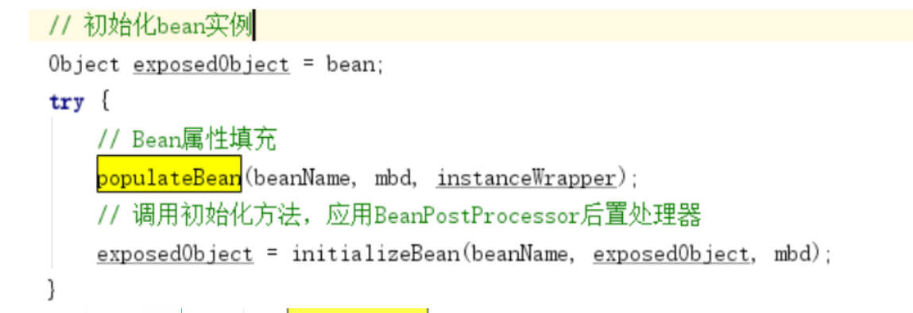

# **第1节 Spring IoC容器初始化主体流程**

## 1.1 Spring IoC的容器体系 

IoC容器是Spring的核心模块，是抽象了对象管理、依赖关系管理的框架解决⽅案。Spring 提供了很多的容器，其中 BeanFactory 是顶层容器（根容器），不能被实例化，它定义了所有 IoC 容器 必须遵从的⼀套原则，具体的容器实现可以增加额外的功能，⽐如我们常用到的ApplicationContext，其下更具体的实现如 ClassPathXmlApplicationContext 包含了解析 xml 等⼀系列的内容， AnnotationConfifigApplicationContext 则是包含了注解解析等⼀系列的内容。Spring IoC 容器继承体系 ⾮常聪明，需要使用哪个层次用哪个层次即可，不必使用功能大而全的。 

**BeanFactory 顶级接口方法栈如下：**


 注意：**String FACTORY_BEAN_PREFIX = "&";**

如果我们在获取Bean的时候，使用&则获取的是[FactoryBean](https://so.csdn.net/so/search?q=FactoryBean&spm=1001.2101.3001.7020)本身对象，否则是获取getObject的代理对象。

**BeanFactory 容器继承体系：**


通过其接⼝设计，我们可以看到我们⼀贯使⽤的 ApplicationContext 除了继承BeanFactory的⼦接⼝， 还继承了ResourceLoader、MessageSource等接⼝，因此其提供的功能也就更丰富了。 

下⾯我们以 ClasspathXmlApplicationContext 为例，深⼊源码说明 IoC 容器的初始化流程。


## 1.2 Bean生命周期关键时机点 

**思路：**创建⼀个类 LagouBean ，让其实现⼏个特殊的接⼝，并分别在接⼝实现的构造器、接口⽅法中 

断点，观察线程调⽤栈，分析出 Bean 对象创建和管理关键点的触发时机。 

- LagouBean类

```java
package com.lagou;
import org.springframework.beans.BeansException;
import org.springframework.beans.factory.DisposableBean;
import org.springframework.beans.factory.InitializingBean;
import org.springframework.beans.factory.config.BeanFactoryPostProcessor;
import org.springframework.beans.factory.config.BeanPostProcessor;
import org.springframework.beans.factory.config.ConfigurableListableBeanFactory;
import org.springframework.stereotype.Component;

public class LagouBean implements InitializingBean{

/**
* 构造函数
*/
 public LagouBean(){ 
   System.out.println("LagouBean 构造器...");
}

/**
* InitializingBean 接⼝实现
*/
public void afterPropertiesSet() throws Exception {
    System.out.println("LagouBean afterPropertiesSet...");
  }
}
```

- BeanPostProcessor 接⼝实现类

```java
package com.lagou;
import org.springframework.beans.BeansException;
import org.springframework.beans.factory.config.BeanPostProcessor;
import org.springframework.stereotype.Component;

public class MyBeanPostProcessor implements BeanPostProcessor {

 public MyBeanPostProcessor() {
   System.out.println("BeanPostProcessor 实现类构造函数...");
 }

 @Override
 public Object postProcessBeforeInitialization(Object bean, String beanName)throws BeansException {
     if("lagouBean".equals(beanName)) {
         System.out.println("BeanPostProcessor 实现类postProcessBeforeInitialization ⽅法被调⽤中......");
      }
     return bean;
   }

 @Override
 public Object postProcessAfterInitialization(Object bean, String beanName)throws BeansException {
      if("lagouBean".equals(beanName)) {
         System.out.println("BeanPostProcessor 实现类postProcessAfterInitialization ⽅法被调⽤中......");
    }
    return bean;
   }

}
```

- BeanFactoryPostProcessor 接⼝实现类

```java
package com.lagou;
import org.springframework.beans.BeansException;
import org.springframework.beans.factory.config.BeanFactoryPostProcessor;
import
org.springframework.beans.factory.config.ConfigurableListableBeanFactory;
import org.springframework.stereotype.Component;

public class MyBeanFactoryPostProcessor implements BeanFactoryPostProcessor {
   
     public MyBeanFactoryPostProcessor() {
         System.out.println("BeanFactoryPostProcessor的实现类构造函数...");
     }

      @Override
      public void postProcessBeanFactory(ConfigurableListableBeanFactory  beanFactory) throws BeansException {
         System.out.println("BeanFactoryPostProcessor的实现⽅法调⽤中......");
      }

}
```

- applicationContext.xml

```java
<?xml version="1.0" encoding="UTF-8"?>
<beans xmlns="http://www.springframework.org/schema/beans"
       xmlns:xsi="http://www.w3.org/2001/XMLSchema-instance"
       xsi:schemaLocation="http://www.springframework.org/schema/beans
       https://www.springframework.org/schema/beans/spring-beans.xsd">

      <bean id="lagouBean" class="com.lagou.LagouBean"/>
      <bean id="myBeanFactoryPostProcessor" class="com.lagou.MyBeanFactoryPostProcessor"/>
      <bean id="myBeanPostProcessor" class="com.lagou.MyBeanPostProcessor"/>

</beans>
```

- IoC 容器源码分析⽤例

```java
/**
* Ioc 容器源码分析基础案例
*/
@Test
public void testIoC() {
    ApplicationContext applicationContext = new ClassPathXmlApplicationContext("classpath:applicationContext.xml");
    LagouBean lagouBean = applicationContext.getBean(LagouBean.class);
    System.out.println(lagouBean);
 }
```

**（1）分析 Bean 的创建是在容器初始化时还是在 getBean 时：**


根据断点调试，我们发现，在未设置延迟加载的前提下，Bean 的创建是在容器初始化过程中完成的。

**（2）分析构造函数调用情况**


通过如上观察，我们发现构造函数的调⽤时机在AbstractApplicationContext类 **refresh⽅法** 的 fifinishBeanFactoryInitialization(beanFactory)处;


**（3）分析 InitializingBean 之 afterPropertiesSet 初始化方法调用情况**


通过如上观察，我们发现 InitializingBean中afterPropertiesSet ⽅法的调⽤时机也是在 AbstractApplicationContext类refresh⽅法的fifinishBeanFactoryInitialization(beanFactory);


**（4）分析BeanFactoryPostProcessor 初始化和调⽤情况**

​	分别在构造函数、postProcessBeanFactory ⽅法处打断点，观察调⽤栈，发现 

​	**BeanFactoryPostProcessor 初始化**在AbstractApplicationContext类refresh⽅法的 invokeBeanFactoryPostProcessors(beanFactory); 

​	**postProcessBeanFactory 调⽤**在AbstractApplicationContext类refresh⽅法的 invokeBeanFactoryPostProcessors(beanFactory);


**（5）分析 BeanPostProcessor 初始化和调⽤情况** 

​	分别在构造函数、postProcessBeanFactory ⽅法处打断点，观察调⽤栈，发现 

​	**BeanPostProcessor 初始化**在AbstractApplicationContext类refresh⽅法的 registerBeanPostProcessors(beanFactory); 

​	**postProcessBeforeInitialization 调⽤**在AbstractApplicationContext类refresh⽅法的 fifinishBeanFactoryInitialization(beanFactory); 

​	**postProcessAfterInitialization 调⽤**在AbstractApplicationContext类refresh⽅法的 fifinishBeanFactoryInitialization(beanFactory);


**（6）总结** 

​	根据上⾯的调试分析，我们发现 Bean对象创建的⼏个关键时机点代码层级的调⽤都在 AbstractApplicationContext 类 的 refresh ⽅法中，可⻅这个⽅法对于Spring IoC 容器初始化来说相当 关键，汇总如下：


## 1.3 Spring IoC容器初始化主流程

​	由上分析可知，Spring IoC 容器初始化的关键环节就在 AbstractApplicationContext#refresh() ⽅法中 ，我们查看 refresh ⽅法来俯瞰容器创建的主体流程，主体流程下的具体⼦流程我们后⾯再来讨论。

```java
@Override
public void refresh() throws BeansException, IllegalStateException {
    synchronized (this.startupShutdownMonitor) {
    // 第⼀步：刷新前的预处理
    prepareRefresh();

    /*
    第⼆步：
    获取BeanFactory；默认实现是DefaultListableBeanFactory
    加载BeanDefition 并注册到 BeanDefitionRegistry
    / 
    ConfigurableListableBeanFactory beanFactory = obtainFreshBeanFactory();

    // 第三步：BeanFactory的预准备⼯作（BeanFactory进⾏⼀些设置，⽐如context的类加载器等）
    prepareBeanFactory(beanFactory);

    try {
        // 第四步：BeanFactory准备⼯作完成后进⾏的后置处理⼯作
        postProcessBeanFactory(beanFactory);

        // 第五步：实例化并调⽤实现了BeanFactoryPostProcessor接⼝的Bean 
        invokeBeanFactoryPostProcessors(beanFactory);

        // 第六步：注册BeanPostProcessor（Bean的后置处理器），在创建bean的前后等执⾏
        registerBeanPostProcessors(beanFactory);

        // 第七步：初始化MessageSource组件（做国际化功能；消息绑定，消息解析）；
        initMessageSource();

        // 第⼋步：初始化事件派发器
        initApplicationEventMulticaster();

        // 第九步：⼦类重写这个⽅法，在容器刷新的时候可以⾃定义逻辑
        onRefresh();

        // 第⼗步：注册应⽤的监听器。就是注册实现了ApplicationListener接⼝的监听器bean
        registerListeners();

        /
        第⼗⼀步：
        初始化所有剩下的⾮懒加载的单例bean
        初始化创建⾮懒加载⽅式的单例Bean实例（未设置属性）
        填充属性
        初始化⽅法调⽤（⽐如调⽤afterPropertiesSet⽅法、init-method⽅法）
        调⽤BeanPostProcessor（后置处理器）对实例bean进⾏后置处
        /
        finishBeanFactoryInitialization(beanFactory);

        /
        第⼗⼆步：
        完成context的刷新。主要是调⽤LifecycleProcessor的onRefresh()⽅法，并且发布事
        件 （ContextRefreshedEvent）
        */
        finishRefresh();
        }
          .......
        }
    }
```

# **第2节 BeanFactory创建流程**

## **2.1 获取BeanFactory子流程**


## **2.2 BeanDefifinition加载解析及注册⼦流程**

**（1）该子流程涉及到如下几个关键步骤** 

- Resource定位：指对BeanDefifinition的资源定位过程。通俗讲就是找到定义Javabean信息的XML⽂件，并将其封装成Resource对象。 
- BeanDefifinition载⼊ ：把⽤户定义好的Javabean表示为IoC容器内部的数据结构，这个容器内部的数据结构就是BeanDefifinition。 
- 注册BeanDefifinition到 IoC 容器

**（2）过程分析**

**Step 1：**子流程入口在 AbstractRefreshableApplicationContext#refreshBeanFactory ⽅法中


**Step 2：**依次调⽤多个类的 loadBeanDefifinitions ⽅法 —> AbstractXmlApplicationContext —> AbstractBeanDefifinitionReader —> XmlBeanDefifinitionReader 

⼀直执⾏到 XmlBeanDefifinitionReader 的 doLoadBeanDefifinitions 方法


**Step 3：**我们重点观察XmlBeanDefifinitionReader 类的 registerBeanDefifinitions ⽅法，期间产⽣了多次重载调⽤，我们定位到最后⼀个


- 此处我们关注两个地⽅：⼀个createRederContext⽅法，⼀个是 DefaultBeanDefifinitionDocumentReader类的registerBeanDefifinitions⽅法，先进⼊ createRederContext ⽅法看看


- 我们可以看到，此处 Spring ⾸先完成了 NamespaceHandlerResolver 的初始化。 我们再进⼊ registerBeanDefifinitions ⽅法中追踪，调⽤了 

DefaultBeanDefifinitionDocumentReader#registerBeanDefifinitions 方法


- 进⼊ doRegisterBeanDefifinitions ⽅法


- 进⼊ parseBeanDefifinitions ⽅法

  

- 进⼊ parseDefaultElement ⽅法


- 进⼊ processBeanDefifinition ⽅法


- ⾄此，注册流程结束，我们发现，所谓的注册就是把封装的 XML 中定义的 Bean信息封装为 BeanDefifinition 对象之后放⼊⼀个Map中，BeanFactory 是以 Map 的结构组织这些 BeanDefifinition的。


# **第3节 Bean创建流程**

- 通过最开始的关键时机点分析，我们知道Bean创建⼦流程⼊⼝在 AbstractApplicationContext#refresh()⽅法的fifinishBeanFactoryInitialization(beanFactory) 处


- 进⼊fifinishBeanFactoryInitialization 


- 继续进⼊DefaultListableBeanFactory类的preInstantiateSingletons⽅法，我们找到下⾯部分的代码，看到⼯⼚Bean或者普通Bean，最终都是通过getBean的⽅法获取实例


- 继续跟踪下去，我们进⼊到了AbstractBeanFactory类的doGetBean⽅法，这个⽅法中的代码很多，我们直接找到核心部分


- 接着进⼊到AbstractAutowireCapableBeanFactory类的⽅法，找到以下代码部分


- 进⼊doCreateBean⽅法看看，该⽅法我们关注两块重点区域

​       1.创建Bean实例，此时尚未设置属性   


​      2.给Bean填充属性，调⽤初始化⽅法，应⽤BeanPostProcessor后置处理器



------

# **第4节 lazy-init 延迟加载机制原理**

- lazy-init 延迟加载机制分析

普通 Bean 的初始化是在容器启动初始化阶段执⾏的，⽽被lazy-init=true修饰的 bean 则是在从容器⾥第⼀次进⾏context.getBean() 时进⾏触发。Spring 启动的时候会把所有bean信息(包括XML和注解)解 析转化成Spring能够识别的BeanDefifinition并存到Hashmap⾥供下⾯的初始化时⽤，然后对每个 BeanDefifinition 进⾏处理，如果是懒加载的则在容器初始化阶段不处理，其他的则在容器初始化阶段进⾏初始化并依赖注⼊

```java
public void preInstantiateSingletons() throws BeansException {
      // 所有beanDefinition集合
      List<String> beanNames = new ArrayList<String>(this.beanDefinitionNames);

      // 触发所有⾮懒加载单例bean的初始化
      for (String beanName : beanNames) {
           // 获取bean 定义
          RootBeanDefinition bd = getMergedLocalBeanDefinition(beanName);

          // 判断是否是懒加载单例bean，如果是单例的并且不是懒加载的则在容器创建时初始化
          if (!bd.isAbstract() && bd.isSingleton() && !bd.isLazyInit()) {
              // 判断是否是 FactoryBean
              if (isFactoryBean(beanName)) {
                  final FactoryBean<?> factory = (FactoryBean<?>)
                  getBean(FACTORY_BEAN_PREFIX + beanName);
                  boolean isEagerInit;
                  if (System.getSecurityManager() != null && factory instanceof  SmartFactoryBean) {
                      isEagerInit = AccessController.doPrivileged(new PrivilegedAction<Boolean>() {
                          @Override
                          public Boolean run() {
                            return ((SmartFactoryBean<?>) factory).isEagerInit();
                            }
                          }, getAccessControlContext());
                       }
                    }else {
                            /*
                            如果是普通bean则进⾏初始化并依赖注⼊，此 getBean(beanName)接下来触发的逻辑和懒加载时 context.getBean("beanName") 所触发的逻辑是⼀样的
                            */
                            getBean(beanName);
                     }
               }
         }
   }
```

- 总结 

对于被修饰为lazy-init的bean Spring 容器初始化阶段不会进⾏ init 并且依赖注⼊，当第⼀次进⾏getBean时候才进⾏初始化并依赖注⼊对于⾮懒加载的bean，getBean的时候会从缓存⾥头获取，因为容器初始化阶段 Bean 已经初始化完成并缓存了起来。

------

# **第5节 Spring IoC循环依赖问题**

## 5.1 什么是循环依赖 

循环依赖其实就是循环引⽤，也就是两个或者两个以上的 Bean 互相持有对⽅，最终形成闭环。⽐如A依赖于B，B依赖于C，C⼜依赖于A。


注意，这⾥不是函数的循环调⽤，是对象的相互依赖关系。循环调⽤其实就是⼀个死循环，除⾮有终结条件。 

Spring中循环依赖场景有： 

- 构造器的循环依赖（构造器注⼊） 
- Field 属性的循环依赖（set注⼊） 

其中，构造器的循环依赖问题⽆法解决，只能拋出 BeanCurrentlyInCreationException 异常，在解决属性循环依赖时，spring采⽤的是提前暴露对象的⽅法。


## 5.2 循环依赖处理机制 

​      1.单例 bean 构造器参数循环依赖（⽆法解决） 

​      2.prototype 原型 bean循环依赖（⽆法解决） 

​		对于原型bean的初始化过程中不论是通过构造器参数循环依赖还是通过setXxx⽅法产⽣循环依赖，Spring都会直接报错处理。 

​        AbstractBeanFactory.doGetBean()⽅法：

```java
 if (isPrototypeCurrentlyInCreation(beanName)) {
     throw new BeanCurrentlyInCreationException(beanName);
}

protected boolean isPrototypeCurrentlyInCreation(String beanName) {
    Object curVal = this.prototypesCurrentlyInCreation.get();
    return (curVal != null &&(curVal.equals(beanName) || (curVal instanceof Set && ((Set<?>)curVal).contains(beanName))));
}
//在获取bean之前如果这个原型bean正在被创建则直接抛出异常。原型bean在创建之前会进⾏标记这个beanName正在被创建，等创建结束之后会删除标记    
try {
    //创建原型bean之前添加标记
    beforePrototypeCreation(beanName);
    //创建原型bean
    prototypeInstance = createBean(beanName, mbd, args);
  }finally {
    //创建原型bean之后删除标记
    afterPrototypeCreation(beanName);
}
```

总结：Spring 不⽀持原型 bean 的循环依赖。 

- 单例bean通过setXxx或者@Autowired进⾏循环依赖

​      Spring 的循环依赖的理论依据基于 Java 的引⽤传递，当获得对象的引⽤时，对象的属性是可以延后设置的，但是构造器必须是在获取引⽤之前 Spring通过setXxx或者@Autowired⽅法解决循环依赖其实是通过提前暴露⼀个ObjectFactory对象来完成的，简单来说ClassA在调⽤构造器完成对象初始化之后，在调⽤ClassA的setClassB⽅法 

之前就把ClassA实例化的对象通过ObjectFactory提前暴露到Spring容器中。 

- Spring容器初始化ClassA通过构造器初始化对象后提前暴露到Spring容器。

```java
boolean earlySingletonExposure = (mbd.isSingleton() && this.allowCircularReferences && isSingletonCurrentlyInCreation(beanName));
if (earlySingletonExposure) {
      if (logger.isDebugEnabled()) {
           logger.debug("Eagerly caching bean '" + beanName +"' to allow for resolving potential circular references");
      }
      //将初始化后的对象提前已ObjectFactory对象注⼊到容器中
      addSingletonFactory(beanName, new ObjectFactory<Object>() {
            @Override
            public Object getObject() throws BeansException {
            return getEarlyBeanReference(beanName, mbd, bean);
       }
    });
}
```

- ClassA调⽤setClassB⽅法，Spring⾸先尝试从容器中获取ClassB，此时ClassB不存在Spring 容器中。 
- Spring容器初始化ClassB，同时也会将ClassB提前暴露到Spring容器中 
- ClassB调⽤setClassA⽅法，Spring从容器中获取ClassA ，因为第⼀步中已经提前暴露了ClassA，因此可以获取到ClassA实例 
- ClassA通过spring容器获取到ClassB，完成了对象初始化操作。 
- 这样ClassA和ClassB都完成了对象初始化操作，解决了循环依赖问题。