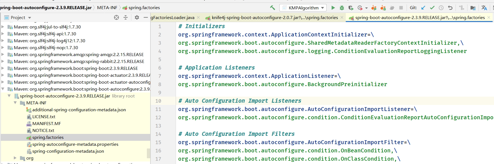
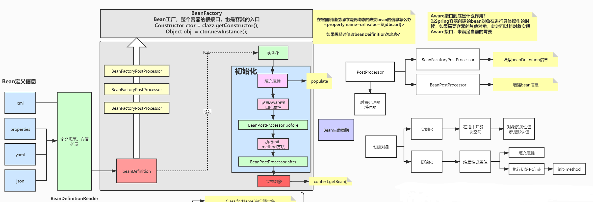

# SpringBoot原理深入及源码剖析

- 传统的Spring框架实现一个Web服务，需要导入各种依赖的Jar包，然后编写对应的XML配置文件等，相较而言，SpringBoot 显得更加方便；
- 针对Spring Boot框架的**依赖管理**、**自动装配**和**执行流程**进行深入分析；

## **1.管理依赖**

-   问题 (1) 为什么导入dependency时不需要指定版本?

​    在Spring Boot 程序中,项目pom.xml 文件有两个核心依赖，分别是 **spring-boot-start-parent** 和 **spring-boot-start-web**;

###   **1.1 spring-boot-start-parent**

```
 <parent>
   <groupId>org.springframework.boot</groupId>
   <artifactId>spring-boot-starter-parent</artifactId>
   <version>2.3.9.RELEASE</version>
 </parent>
```

上述代码中，将 spring-boot-start-parent 依赖作为 spring Boot 项目的统一父项目依赖管理，并将项目版本号统一；

点击 **spring-boot-start-parent** 查看底层源文件，发现spring-boot-starter-parent 的底层有一个父依赖 **spring-boot-dependencies**

```
<parent>
  <groupId>org.springframework.boot</groupId>
  <artifactId>spring-boot-dependencies</artifactId>
  <version>2.3.9.RELEASE</version>
</parent>
```

继续查看Spring-boot-deoendencies底层文件，核心代码具体如下：

```
<properties>
  <commons-codec.version>1.14</commons-codec.version>
  <commons-dbcp2.version>2.7.0</commons-dbcp2.version>
  <commons-lang3.version>3.10</commons-lang3.version>
  <commons-pool.version>1.6</commons-pool.version>
  <spring-retry.version>1.2.5.RELEASE</spring-retry.version>
  <spring-security.version>5.3.8.RELEASE</spring-security.version>
  .........
</properties>
```

从 **spring-boot-dependencies** 底层源文件可以看出。该文件通过标签对一些常用技术框架的依赖文件进行了**统一版本号的管理**，这也是pom.xml引入依赖文件不需要标注依赖文件版本号的原因。

**注意**：如果pom.xml引入的依赖文件不是 spring-boot-starter-parent 管理的，那么在pom.xml引入依赖文件时，需要使用标签指定依赖文件的版本号。

### **1.2 spring-boot-start-web依赖**

查看spring-boot-starter-web依赖文件源码，核心代码如下 

```
<dependencies>
  <dependency>
    <groupId>org.springframework.boot</groupId>
    <artifactId>spring-boot-starter</artifactId>
    <version>2.3.9.RELEASE</version>
    <scope>compile</scope>
  </dependency>
  <dependency>
    <groupId>org.springframework.boot</groupId>
    <artifactId>spring-boot-starter-json</artifactId>
    <version>2.3.9.RELEASE</version>
    <scope>compile</scope>
  </dependency>
  <dependency>
    <groupId>org.springframework.boot</groupId>
    <artifactId>spring-boot-starter-tomcat</artifactId>
    <version>2.3.9.RELEASE</version>
    <scope>compile</scope>
  </dependency>
  <dependency>
    <groupId>org.springframework</groupId>
    <artifactId>spring-web</artifactId>
    <version>5.2.13.RELEASE</version>
    <scope>compile</scope>
  </dependency>
  <dependency>
    <groupId>org.springframework</groupId>
    <artifactId>spring-webmvc</artifactId>
    <version>5.2.13.RELEASE</version>
    <scope>compile</scope>
  </dependency>
</dependencies>
```

从上述代码可以发现，spring-boot-start-web依赖启动器的主要作用是提供web开发场景所需的底层所有依赖，当然这些引入的依赖文件的版本号还是有spring-boot-start-parent父依赖进行的统一管理。

Spring Boot 除了提供上述介绍的web依赖启动器外，还提供了其他很多开发场景的相关依赖:

```java
//Core starter, including auto-configuration support, logging and YAML
spring-boot-starter                       

//Starter for using Spring AMQP and Rabbit MQ
spring-boot-starter-amqp                  

//Starter for aspect-oriented programming with Spring AOP and AspectJ
spring-boot-starter-aop                    

//Starter for JMS messaging using Apache Artemis
spring-boot-starter-artemis                

//Starter for using Spring Batch
spring-boot-starter-batch                  

//Starter for using Spring Framework’s caching support
spring-boot-starter-cache                  

//Starter for using Cassandra distributed database and Spring Data Cassandra
spring-boot-starter-data-cassandra         

//Starter for using Elasticsearch search and analytics engine and Spring Data Elasticsearch
spring-boot-starter-data-elasticsearch     

//Starter for using Spring Data JDBC
spring-boot-starter-data-jdbc              

//Starter for using Spring Data JPA with Hibernate
spring-boot-starter-data-jpa               

//Starter for using Spring Data LDAP
spring-boot-starter-data-ldap               

// Starter for using MongoDB document-oriented database and Spring Data MongoDB
spring-boot-starter-data-mongodb           

//Starter for using MongoDB document-oriented database and Spring Data MongoDB Reactive
spring-boot-starter-data-mongodb-reactive   

//Starter for using Redis key-value data store with Spring Data Redis and the Lettuce client
spring-boot-starter-data-redis              

//Starter for using Redis key-value data store with Spring Data Redis reactive and the Lettuce client
spring-boot-starter-data-redis-reactive      

//Starter for exposing Spring Data repositories over REST using Spring Data REST
spring-boot-starter-data-rest                

//Starter for building MVC web applications using FreeMarker views
spring-boot-starter-freemarker               

//Starter for using JDBC with the HikariCP connection pool
spring-boot-starter-jdbc                     

// Starter for building RESTful web applications using JAX-RS and Jersey. An alternative to spring-boot-starter-web
spring-boot-starter-jersey                  

//Starter for reading and writing json
spring-boot-starter-json                         

//Starter for using Java Mail and Spring Framework’s email sending support
spring-boot-starter-mail                         

//Starter for using Spring Security’s OAuth2/OpenID Connect client features
spring-boot-starter-oauth2-client                 

//Starter for using Spring Security’s OAuth2 resource server features
spring-boot-starter-oauth2-resource-server        

//Starter for using the Quartz scheduler
spring-boot-starter-quartz                        

//Starter for using Spring Security
spring-boot-starter-security                      

//Starter for testing Spring Boot applications with libraries including JUnit Jupiter, Hamcrest and Mockito
spring-boot-starter-test                          

//Starter for building MVC web applications using Thymeleaf views
spring-boot-starter-thymeleaf                      

//Starter for building web, including RESTful, applications using Spring MVC. Uses Tomcat as the default embedded container
spring-boot-starter-web                            

//Starter for using Spring Web Services
spring-boot-starter-web-services                   

//Starter for building WebFlux applications using Spring Framework’s Reactive Web support
spring-boot-starter-webflux                         

spring-boot-starter-websocket
```


## **2.自动装配(启动流程)**

  **概念**: 能够在我们添加jar包依赖的时候,自动为我们配置一些组件的相关配置，我们无需配置或者只需要少量配置就能运行编写的项目

-   **问题: Spring Boot到底是如何进行自动配置的，都把哪些组件进行了自动装配?**

     Spring Boot 应用的启动入口是@**SpringBootApplication**注解标注类中的main()方法，

​		@SpringBootApplication能够扫描Spring组件并自动装配SpringBoot

```java
@SpringBootApplication
@MapperScan(value = "com.msz.mapper.*" )
public class VueStudentApplication {
    public static void main(String[] args) {
        SpringApplication.run(VueStudentApplication.class,args);
    }

}
```

```java
@Target(ElementType.TYPE)                  //注解的适用范围,Type表示注解可以描述在类，接口，注解或者枚举中 
@Retention(RetentionPolicy.RUNTIME)        //表示注解的生命周期，runtime运行时
@Documented                                //表示注解可以记录在javadoc中           
@Inherited                                 //表示表示可以被子类继承该注解
@SpringBootConfiguration                   //标明该类为配置类
@EnableAutoConfiguration                   //启动自动装配功能
@ComponentScan(                            //包扫描器
       excludeFilters = { @Filter(type = FilterType.CUSTOM, classes = TypeExcludeFilter.class),
       @Filter(type = FilterType.CUSTOM, classes = AutoConfigurationExcludeFilter.class) })
public @interface SpringBootApplication {

   @AliasFor(annotation = EnableAutoConfiguration.class)
   Class<?>[] exclude() default {};

   @AliasFor(annotation = EnableAutoConfiguration.class)
   String[] excludeName() default {};

   @AliasFor(annotation = ComponentScan.class, attribute = "basePackages")
   String[] scanBasePackages() default {};

   @AliasFor(annotation = ComponentScan.class, attribute = "basePackageClasses")
   Class<?>[] scanBasePackageClasses() default {};

   @AliasFor(annotation = ComponentScan.class, attribute = "nameGenerator")
   Class<? extends BeanNameGenerator> nameGenerator() default BeanNameGenerator.class;

   @AliasFor(annotation = Configuration.class)
   boolean proxyBeanMethods() default true;
}
```

------


​	从上述源码可以看出，@**SpringBootApplication**注解是一个组合注解，前面4个是注解的元数据信息，我们主要看后面3个注解：**@SpringBootConfiguration**、**@EnableAutoConfiguration**、**@ComponentScan**三个核心注解、关于这三个核心注解相关说明具体如下：


###   **1.@SpringBootConfiguration注解**

​       @SpringBootConfiguration注解表示SpringBoot配置类。查看@SpringBootConfiguration注解源码，核心代码具体如下:

```java
@Target(ElementType.TYPE)
@Retention(RetentionPolicy.RUNTIME)
@Documented
@Configuration      //配置IOC容器
public @interface SpringBootConfiguration {
     @AliasFor(annotation = Configuration.class)
     boolean proxyBeanMethods() default true;
 }
```

------

从上述源码可以看出，@SpringBootConfiguration 注解内部有一个核心注解@Configuration，该注解是Spring框架提供的，表示当前类为一个配置类(XML配置文件的注解表现形式)，并可以被组件扫描器扫描。由此可见，@SpringBootConfiguration注解的作用与@Configuration注解相同，都是标识一个可以被组件扫描器扫描的配置类，只不过@SpringBootConfiguration是被SpringBoot进行了重新封装命名而已。


### **2.@EnableAutoConfiguration注解**

@EnableAutoConfiguration注解**表示开启自动配置功能**，该注解是SpringBoot框架配重要的注解，也是实现自动化配置的注解，核心代码如下：

```java
@Target(ElementType.TYPE)
@Retention(RetentionPolicy.RUNTIME)
@Documented
@Inherited
@AutoConfigurationPackage                       //自动配置包
@Import(AutoConfigurationImportSelector.class)  //自动配置类扫描导入
public @interface EnableAutoConfiguration {
   String ENABLED_OVERRIDE_PROPERTY = "spring.boot.enableautoconfiguration";
   Class<?>[] exclude() default {};
   String[] excludeName() default {};
}
```

从上述代码可以看出，@EnableAutoConfiguration注解是一个组合注解，它主要包括有@AutoConfigurationPackage和@Import核心注解。

下面对这两个核心注解分别解析：

####   **1.@AutoConfigurationPackage注解**

```java
@Target(ElementType.TYPE)
@Retention(RetentionPolicy.RUNTIME)
@Documented
@Inherited
@Import(AutoConfigurationPackages.Registrar.class)  //导入Registrar中注册的组件
public @interface AutoConfigurationPackage {
   String[] basePackages() default {};
   Class<?>[] basePackageClasses() default {};
}
```

从上述源码可以看出,@AutoConfigurationPackage注解的功能是由@Import注解实现的，作用是向容器导入注册的所有组件，导入的组件有Registar决定：

```java
public abstract class AutoConfigurationPackages {

   private static final Log logger = LogFactory.getLog(AutoConfigurationPackages.class);

   private static final String BEAN = AutoConfigurationPackages.class.getName();

   public static boolean has(BeanFactory beanFactory) {
      return beanFactory.containsBean(BEAN) && !get(beanFactory).isEmpty();
   }

   public static List<String> get(BeanFactory beanFactory) {
      try {
         return beanFactory.getBean(BEAN, BasePackages.class).get();
      }
      catch (NoSuchBeanDefinitionException ex) {
         throw new IllegalStateException("Unable to retrieve @EnableAutoConfiguration base packages");
      }
   }

   public static void register(BeanDefinitionRegistry registry, String... packageNames) {
      if (registry.containsBeanDefinition(BEAN)) {
         BeanDefinition beanDefinition = registry.getBeanDefinition(BEAN);
         ConstructorArgumentValues constructorArguments = beanDefinition.getConstructorArgumentValues();
         constructorArguments.addIndexedArgumentValue(0, addBasePackages(constructorArguments, packageNames));
      }
      else {
         GenericBeanDefinition beanDefinition = new GenericBeanDefinition();
         beanDefinition.setBeanClass(BasePackages.class);
         beanDefinition.getConstructorArgumentValues().addIndexedArgumentValue(0, packageNames);
         beanDefinition.setRole(BeanDefinition.ROLE_INFRASTRUCTURE);
         registry.registerBeanDefinition(BEAN, beanDefinition);
      }
   }

   private static String[] addBasePackages(ConstructorArgumentValues constructorArguments, String[] packageNames) {
      String[] existing = (String[]) constructorArguments.getIndexedArgumentValue(0, String[].class).getValue();
      Set<String> merged = new LinkedHashSet<>();
      merged.addAll(Arrays.asList(existing));
      merged.addAll(Arrays.asList(packageNames));
      return StringUtils.toStringArray(merged);
   }
   
   /**
    {@link ImportBeanDefinitionRegistrar} to store the base package from the importing
     configuration.  =========核心方法===========
    */
   static class Registrar implements ImportBeanDefinitionRegistrar, DeterminableImports {

      @Override
      public void registerBeanDefinitions(AnnotationMetadata metadata, BeanDefinitionRegistry registry) {
         register(registry, new PackageImports(metadata).getPackageNames().toArray(new String[0]));
      }

      @Override
      public Set<Object> determineImports(AnnotationMetadata metadata) {
         return Collections.singleton(new PackageImports(metadata));
      }
   }

   /**
    * Wrapper for a package import.
    */
   private static final class PackageImports {

      private final List<String> packageNames;

      PackageImports(AnnotationMetadata metadata) {
         AnnotationAttributes attributes = AnnotationAttributes
               .fromMap(metadata.getAnnotationAttributes(AutoConfigurationPackage.class.getName(), false));
         List<String> packageNames = new ArrayList<>();
         for (String basePackage : attributes.getStringArray("basePackages")) {
            packageNames.add(basePackage);
         }
         for (Class<?> basePackageClass : attributes.getClassArray("basePackageClasses")) {
            packageNames.add(basePackageClass.getPackage().getName());
         }
         if (packageNames.isEmpty()) {
            packageNames.add(ClassUtils.getPackageName(metadata.getClassName()));
         }
         this.packageNames = Collections.unmodifiableList(packageNames);
      }

      List<String> getPackageNames() {
         return this.packageNames;
      }
      
      @Override
      public boolean equals(Object obj) {
         if (obj == null || getClass() != obj.getClass()) {
            return false;
         }
         return this.packageNames.equals(((PackageImports) obj).packageNames);
      }

      @Override
      public int hashCode() {
         return this.packageNames.hashCode();
      }

      @Override
      public String toString() {
         return "Package Imports " + this.packageNames;
      }
   }

   /**
    * Holder for the base package (name may be null to indicate no scanning).
    */
   static final class BasePackages {
      private final List<String> packages;
      private boolean loggedBasePackageInfo;

      BasePackages(String... names) {
         List<String> packages = new ArrayList<>();
         for (String name : names) {
            if (StringUtils.hasText(name)) {
               packages.add(name);
            }
         }
         this.packages = packages;
      }

      List<String> get() {
         if (!this.loggedBasePackageInfo) {
            if (this.packages.isEmpty()) {
               if (logger.isWarnEnabled()) {
                  logger.warn("@EnableAutoConfiguration was declared on a class "
                        + "in the default package. Automatic @Repository and "
                        + "@Entity scanning is not enabled.");
               }
            }
            else {
               if (logger.isDebugEnabled()) {
                  String packageNames = StringUtils.collectionToCommaDelimitedString(this.packages);
                  logger.debug("@EnableAutoConfiguration was declared on a class in the package '" + packageNames
                        + "'. Automatic @Repository and @Entity scanning is enabled.");
               }
            }
            this.loggedBasePackageInfo = true;
         }
         return this.packages;
      }
   }
}
```

​	从上述源码可以看出，在Registrar类中有一个registerBeanDefinitions()方法，使用Debug模式启动项目，可以看到选中的部分就是com.msz 也就是说，@AutoConfigurationPackage注解的主要作用是获取项目主程序启动类所在的根目录，从而指定后续组件扫描器要扫描的包位置，因此，在定义项目包结构时，要求定义的包结构规范，项目主程序启动类要定义在最外层的根目录位置，然后再根目录位置内部建立子包和类进行业务开发，这样才能保证定义的类能够被组件扫描器扫描。

####   **2.@Import(AutoConfigurationImportSelector.class)注解**

​    导入注解，从名称上来看，它导入了一个自动配置导入选择器，我们点击进去，查看AutoConfigurationImportSelector类的 getAutoConfigurationEntry()方法：

```java
public class AutoConfigurationImportSelector implements DeferredImportSelector, BeanClassLoaderAware,
      ResourceLoaderAware, BeanFactoryAware, EnvironmentAware, Ordered {

   private static final AutoConfigurationEntry EMPTY_ENTRY = new AutoConfigurationEntry();
   private static final String[] NO_IMPORTS = {};
   private static final Log logger = LogFactory.getLog(AutoConfigurationImportSelector.class);
   private static final String PROPERTY_NAME_AUTOCONFIGURE_EXCLUDE = "spring.autoconfigure.exclude";
   private ConfigurableListableBeanFactory beanFactory;
   private Environment environment;
   private ClassLoader beanClassLoader;
   private ResourceLoader resourceLoader;
   private ConfigurationClassFilter configurationClassFilter;

   @Override
   public String[] selectImports(AnnotationMetadata annotationMetadata) {
      if (!isEnabled(annotationMetadata)) {
         return NO_IMPORTS;
      }
      AutoConfigurationEntry autoConfigurationEntry = getAutoConfigurationEntry(annotationMetadata);
      return StringUtils.toStringArray(autoConfigurationEntry.getConfigurations());
   }

   @Override
   public Predicate<String> getExclusionFilter() {
      return this::shouldExclude;
   }

   private boolean shouldExclude(String configurationClassName) {
      return getConfigurationClassFilter().filter(Collections.singletonList(configurationClassName)).isEmpty();
   }

   // ================核心方法================
   protected AutoConfigurationEntry getAutoConfigurationEntry(AnnotationMetadata annotationMetadata) {
      if (!isEnabled(annotationMetadata)) {
         return EMPTY_ENTRY;
      }
      AnnotationAttributes attributes = getAttributes(annotationMetadata);
      //获取所有springBoot提供的后续自动配置类XxxAutoConfiguration
      List<String> configurations = getCandidateConfigurations(annotationMetadata, attributes);
      configurations = removeDuplicates(configurations);
      Set<String> exclusions = getExclusions(annotationMetadata, attributes);
      checkExcludedClasses(configurations, exclusions);
      configurations.removeAll(exclusions);
       //筛选并过滤出当前应用环境下需要的自动配置类XxxAutoConfiguration
      configurations = getConfigurationClassFilter().filter(configurations);
      fireAutoConfigurationImportEvents(configurations, exclusions);
      return new AutoConfigurationEntry(configurations, exclusions);
   }

   @Override
   public Class<? extends Group> getImportGroup() {
      return AutoConfigurationGroup.class;
   }

   protected boolean isEnabled(AnnotationMetadata metadata) {
      if (getClass() == AutoConfigurationImportSelector.class) {
         return getEnvironment().getProperty(EnableAutoConfiguration.ENABLED_OVERRIDE_PROPERTY, Boolean.class, true);
      }
      return true;
   }

   protected AnnotationAttributes getAttributes(AnnotationMetadata metadata) {
      String name = getAnnotationClass().getName();
      AnnotationAttributes attributes = AnnotationAttributes.fromMap(metadata.getAnnotationAttributes(name, true));
      Assert.notNull(attributes, () -> "No auto-configuration attributes found. Is " + metadata.getClassName()
            + " annotated with " + ClassUtils.getShortName(name) + "?");
      return attributes;
   }

   /**
    Return the source annotation class used by the selector.
     @return the annotation class
    */
   protected Class<?> getAnnotationClass() {
      return EnableAutoConfiguration.class;
   }

   protected List<String> getCandidateConfigurations(AnnotationMetadata metadata, AnnotationAttributes attributes) {
      List<String> configurations = SpringFactoriesLoader.loadFactoryNames(getSpringFactoriesLoaderFactoryClass(),
            getBeanClassLoader());
      Assert.notEmpty(configurations, "No auto configuration classes found in META-INF/spring.factories. If you "
            + "are using a custom packaging, make sure that file is correct.");
      return configurations;
   }

   protected Class<?> getSpringFactoriesLoaderFactoryClass() {
      return EnableAutoConfiguration.class;
   }

   private void checkExcludedClasses(List<String> configurations, Set<String> exclusions) {
      List<String> invalidExcludes = new ArrayList<>(exclusions.size());
      for (String exclusion : exclusions) {
         if (ClassUtils.isPresent(exclusion, getClass().getClassLoader()) && !configurations.contains(exclusion)) {
            invalidExcludes.add(exclusion);
         }
      }
      if (!invalidExcludes.isEmpty()) {
         handleInvalidExcludes(invalidExcludes);
      }
   }

   protected void handleInvalidExcludes(List<String> invalidExcludes) {
      StringBuilder message = new StringBuilder();
      for (String exclude : invalidExcludes) {
         message.append("\t- ").append(exclude).append(String.format("%n"));
      }
      throw new IllegalStateException(String.format(
            "The following classes could not be excluded because they are not auto-configuration classes:%n%s",
            message));
   }

   protected Set<String> getExclusions(AnnotationMetadata metadata, AnnotationAttributes attributes) {
      Set<String> excluded = new LinkedHashSet<>();
      excluded.addAll(asList(attributes, "exclude"));
      excluded.addAll(Arrays.asList(attributes.getStringArray("excludeName")));
      excluded.addAll(getExcludeAutoConfigurationsProperty());
      return excluded;
   }

   protected List<String> getExcludeAutoConfigurationsProperty() {
      Environment environment = getEnvironment();
      if (environment == null) {
         return Collections.emptyList();
      }
      if (environment instanceof ConfigurableEnvironment) {
         Binder binder = Binder.get(environment);
         return binder.bind(PROPERTY_NAME_AUTOCONFIGURE_EXCLUDE, String[].class).map(Arrays::asList)
               .orElse(Collections.emptyList());
      }
      String[] excludes = environment.getProperty(PROPERTY_NAME_AUTOCONFIGURE_EXCLUDE, String[].class);
      return (excludes != null) ? Arrays.asList(excludes) : Collections.emptyList();
   }

   protected List<AutoConfigurationImportFilter> getAutoConfigurationImportFilters() {
      return SpringFactoriesLoader.loadFactories(AutoConfigurationImportFilter.class, this.beanClassLoader);
   }

   private ConfigurationClassFilter getConfigurationClassFilter() {
      if (this.configurationClassFilter == null) {
         List<AutoConfigurationImportFilter> filters = getAutoConfigurationImportFilters();
         for (AutoConfigurationImportFilter filter : filters) {
            invokeAwareMethods(filter);
         }
         this.configurationClassFilter = new ConfigurationClassFilter(this.beanClassLoader, filters);
      }
      return this.configurationClassFilter;
   }

   protected final <T> List<T> removeDuplicates(List<T> list) {
      return new ArrayList<>(new LinkedHashSet<>(list));
   }

   protected final List<String> asList(AnnotationAttributes attributes, String name) {
      String[] value = attributes.getStringArray(name);
      return Arrays.asList(value);
   }

   private void fireAutoConfigurationImportEvents(List<String> configurations, Set<String> exclusions) {
      List<AutoConfigurationImportListener> listeners = getAutoConfigurationImportListeners();
      if (!listeners.isEmpty()) {
         AutoConfigurationImportEvent event = new AutoConfigurationImportEvent(this, configurations, exclusions);
         for (AutoConfigurationImportListener listener : listeners) {
            invokeAwareMethods(listener);
            listener.onAutoConfigurationImportEvent(event);
         }
      }
   }

   protected List<AutoConfigurationImportListener> getAutoConfigurationImportListeners() {
      return SpringFactoriesLoader.loadFactories(AutoConfigurationImportListener.class, this.beanClassLoader);
   }

   private void invokeAwareMethods(Object instance) {
      if (instance instanceof Aware) {
         if (instance instanceof BeanClassLoaderAware) {
            ((BeanClassLoaderAware) instance).setBeanClassLoader(this.beanClassLoader);
         }
         if (instance instanceof BeanFactoryAware) {
            ((BeanFactoryAware) instance).setBeanFactory(this.beanFactory);
         }
         if (instance instanceof EnvironmentAware) {
            ((EnvironmentAware) instance).setEnvironment(this.environment);
         }
         if (instance instanceof ResourceLoaderAware) {
            ((ResourceLoaderAware) instance).setResourceLoader(this.resourceLoader);
         }
      }
   }

   @Override
   public void setBeanFactory(BeanFactory beanFactory) throws BeansException {
      Assert.isInstanceOf(ConfigurableListableBeanFactory.class, beanFactory);
      this.beanFactory = (ConfigurableListableBeanFactory) beanFactory;
   }

   protected final ConfigurableListableBeanFactory getBeanFactory() {
      return this.beanFactory;
   }

   @Override
   public void setBeanClassLoader(ClassLoader classLoader) {
      this.beanClassLoader = classLoader;
   }

   protected ClassLoader getBeanClassLoader() {
      return this.beanClassLoader;
   }

   @Override
   public void setEnvironment(Environment environment) {
      this.environment = environment;
   }

   protected final Environment getEnvironment() {
      return this.environment;
   }

   @Override
   public void setResourceLoader(ResourceLoader resourceLoader) {
      this.resourceLoader = resourceLoader;
   }

   protected final ResourceLoader getResourceLoader() {
      return this.resourceLoader;
   }

   @Override
   public int getOrder() {
      return Ordered.LOWEST_PRECEDENCE - 1;
   }

   private static class ConfigurationClassFilter {

      private final AutoConfigurationMetadata autoConfigurationMetadata;

      private final List<AutoConfigurationImportFilter> filters;

      ConfigurationClassFilter(ClassLoader classLoader, List<AutoConfigurationImportFilter> filters) {
         this.autoConfigurationMetadata = AutoConfigurationMetadataLoader.loadMetadata(classLoader);
         this.filters = filters;
      }

      List<String> filter(List<String> configurations) {
         long startTime = System.nanoTime();
         String[] candidates = StringUtils.toStringArray(configurations);
         boolean skipped = false;
         for (AutoConfigurationImportFilter filter : this.filters) {
            boolean[] match = filter.match(candidates, this.autoConfigurationMetadata);
            for (int i = 0; i < match.length; i++) {
               if (!match[i]) {
                  candidates[i] = null;
                  skipped = true;
               }
            }
         }
         if (!skipped) {
            return configurations;
         }
         List<String> result = new ArrayList<>(candidates.length);
         for (String candidate : candidates) {
            if (candidate != null) {
               result.add(candidate);
            }
         }
         if (logger.isTraceEnabled()) {
            int numberFiltered = configurations.size() - result.size();
            logger.trace("Filtered " + numberFiltered + " auto configuration class in "
                  + TimeUnit.NANOSECONDS.toMillis(System.nanoTime() - startTime) + " ms");
         }
         return result;
      }

   }

   private static class AutoConfigurationGroup
         implements DeferredImportSelector.Group, BeanClassLoaderAware, BeanFactoryAware, ResourceLoaderAware {

      private final Map<String, AnnotationMetadata> entries = new LinkedHashMap<>();

      private final List<AutoConfigurationEntry> autoConfigurationEntries = new ArrayList<>();

      private ClassLoader beanClassLoader;

      private BeanFactory beanFactory;

      private ResourceLoader resourceLoader;

      private AutoConfigurationMetadata autoConfigurationMetadata;

      @Override
      public void setBeanClassLoader(ClassLoader classLoader) {
         this.beanClassLoader = classLoader;
      }

      @Override
      public void setBeanFactory(BeanFactory beanFactory) {
         this.beanFactory = beanFactory;
      }

      @Override
      public void setResourceLoader(ResourceLoader resourceLoader) {
         this.resourceLoader = resourceLoader;
      }

      @Override
      public void process(AnnotationMetadata annotationMetadata, DeferredImportSelector deferredImportSelector) {
         Assert.state(deferredImportSelector instanceof AutoConfigurationImportSelector,
               () -> String.format("Only %s implementations are supported, got %s",
                     AutoConfigurationImportSelector.class.getSimpleName(),
                     deferredImportSelector.getClass().getName()));
         AutoConfigurationEntry autoConfigurationEntry = ((AutoConfigurationImportSelector) deferredImportSelector)
               .getAutoConfigurationEntry(annotationMetadata);
         this.autoConfigurationEntries.add(autoConfigurationEntry);
         for (String importClassName : autoConfigurationEntry.getConfigurations()) {
            this.entries.putIfAbsent(importClassName, annotationMetadata);
         }
      }

      @Override
      public Iterable<Entry> selectImports() {
         if (this.autoConfigurationEntries.isEmpty()) {
            return Collections.emptyList();
         }
         Set<String> allExclusions = this.autoConfigurationEntries.stream()
               .map(AutoConfigurationEntry::getExclusions).flatMap(Collection::stream).collect(Collectors.toSet());
         Set<String> processedConfigurations = this.autoConfigurationEntries.stream()
               .map(AutoConfigurationEntry::getConfigurations).flatMap(Collection::stream)
               .collect(Collectors.toCollection(LinkedHashSet::new));
         processedConfigurations.removeAll(allExclusions);

         return sortAutoConfigurations(processedConfigurations, getAutoConfigurationMetadata()).stream()
               .map((importClassName) -> new Entry(this.entries.get(importClassName), importClassName))
               .collect(Collectors.toList());
      }

      private AutoConfigurationMetadata getAutoConfigurationMetadata() {
         if (this.autoConfigurationMetadata == null) {
            this.autoConfigurationMetadata = AutoConfigurationMetadataLoader.loadMetadata(this.beanClassLoader);
         }
         return this.autoConfigurationMetadata;
      }

      private List<String> sortAutoConfigurations(Set<String> configurations,
            AutoConfigurationMetadata autoConfigurationMetadata) {
         return new AutoConfigurationSorter(getMetadataReaderFactory(), autoConfigurationMetadata)
               .getInPriorityOrder(configurations);
      }

      private MetadataReaderFactory getMetadataReaderFactory() {
         try {
            return this.beanFactory.getBean(SharedMetadataReaderFactoryContextInitializer.BEAN_NAME,
                  MetadataReaderFactory.class);
         }
         catch (NoSuchBeanDefinitionException ex) {
            return new CachingMetadataReaderFactory(this.resourceLoader);
         }
      }

   }

   protected static class AutoConfigurationEntry {

      private final List<String> configurations;

      private final Set<String> exclusions;

      private AutoConfigurationEntry() {
         this.configurations = Collections.emptyList();
         this.exclusions = Collections.emptySet();
      }

      /**
       Create an entry with the configurations that were contributed and their
        exclusions.
       @param configurations the configurations that should be imported
        @param exclusions the exclusions that were applied to the original list
       */
      AutoConfigurationEntry(Collection<String> configurations, Collection<String> exclusions) {
         this.configurations = new ArrayList<>(configurations);
         this.exclusions = new HashSet<>(exclusions);
      }

      public List<String> getConfigurations() {
         return this.configurations;
      }

      public Set<String> getExclusions() {
         return this.exclusions;
      }
   }
}

```

在上述展示的getAutoConfigurationEntry()方法，其主要是筛选出当前项目环境需要启动的自动配置类XxxAutoConfiguration,从而实现当前项目运行所需的自动配置环境。另外特别注意2个重要业务处理方法：

**List configurations = getCandidateConfigurations(annotationMetadata, attributes); //大约有100多个自动配置类**:

```java
protected List<String> getCandidateConfigurations(AnnotationMetadata metadata, AnnotationAttributes attributes) {
   List<String> configurations = SpringFactoriesLoader.loadFactoryNames(getSpringFactoriesLoaderFactoryClass(),
         getBeanClassLoader());
   Assert.notEmpty(configurations, "No auto configuration classes found in META-INF/spring.factories. If you "
         + "are using a custom packaging, make sure that file is correct.");
   return configurations;
}
```

**//会去读取一个Spring.factories的文件**

```java
public final class SpringFactoriesLoader {
   public static final String FACTORIES_RESOURCE_LOCATION = "META-INF/spring.factories";
   private static final Log logger = LogFactory.getLog(SpringFactoriesLoader.class);
   private static final Map<ClassLoader, MultiValueMap<String, String>> cache = new ConcurrentReferenceHashMap<>();

   private SpringFactoriesLoader() {
   }

   public static <T> List<T> loadFactories(Class<T> factoryType, @Nullable ClassLoader classLoader) {
      Assert.notNull(factoryType, "'factoryType' must not be null");
      ClassLoader classLoaderToUse = classLoader;
      if (classLoaderToUse == null) {
         classLoaderToUse = SpringFactoriesLoader.class.getClassLoader();
      }
      List<String> factoryImplementationNames = loadFactoryNames(factoryType, classLoaderToUse);
      if (logger.isTraceEnabled()) {
         logger.trace("Loaded [" + factoryType.getName() + "] names: " + factoryImplementationNames);
      }
      List<T> result = new ArrayList<>(factoryImplementationNames.size());
      for (String factoryImplementationName : factoryImplementationNames) {
         result.add(instantiateFactory(factoryImplementationName, factoryType, classLoaderToUse));
      }
      AnnotationAwareOrderComparator.sort(result);
      return result;
   }

   public static List<String> loadFactoryNames(Class<?> factoryType, @Nullable ClassLoader classLoader) {
      String factoryTypeName = factoryType.getName();
      return loadSpringFactories(classLoader).getOrDefault(factoryTypeName, Collections.emptyList());
   }

   private static Map<String, List<String>> loadSpringFactories(@Nullable ClassLoader classLoader) {
      MultiValueMap<String, String> result = cache.get(classLoader);
      if (result != null) {
         return result;
      }

      try {
         Enumeration<URL> urls = (classLoader != null ?
               classLoader.getResources(FACTORIES_RESOURCE_LOCATION) :
               ClassLoader.getSystemResources(FACTORIES_RESOURCE_LOCATION));
         result = new LinkedMultiValueMap<>();
         while (urls.hasMoreElements()) {
            URL url = urls.nextElement();
            UrlResource resource = new UrlResource(url);
            Properties properties = PropertiesLoaderUtils.loadProperties(resource);
            for (Map.Entry<?, ?> entry : properties.entrySet()) {
               String factoryTypeName = ((String) entry.getKey()).trim();
               for (String factoryImplementationName : StringUtils.commaDelimitedListToStringArray((String) entry.getValue())) {
                  result.add(factoryTypeName, factoryImplementationName.trim());
               }
            }
         }
         cache.put(classLoader, result);
         return result;
      }
      catch (IOException ex) {
         throw new IllegalArgumentException("Unable to load factories from location [" +
               FACTORIES_RESOURCE_LOCATION + "]", ex);
      }
   }

   @SuppressWarnings("unchecked")
   private static <T> T instantiateFactory(String factoryImplementationName, Class<T> factoryType, ClassLoader classLoader) {
      try {
         Class<?> factoryImplementationClass = ClassUtils.forName(factoryImplementationName, classLoader);
         if (!factoryType.isAssignableFrom(factoryImplementationClass)) {
            throw new IllegalArgumentException(
                  "Class [" + factoryImplementationName + "] is not assignable to factory type [" + factoryType.getName() + "]");
         }
         return (T) ReflectionUtils.accessibleConstructor(factoryImplementationClass).newInstance();
      }
      catch (Throwable ex) {
         throw new IllegalArgumentException(
            "Unable to instantiate factory class [" + factoryImplementationName + "] for factory type [" + factoryType.getName() + "]",
            ex);
      }
   }
}
```

它其实是去加载一个外部的文件，而这文件是在：

	

@EnableAutoConfiguration就是从classpath中搜寻META-INF/spring.factories配置文件，并将其中            org.springframework.boot.autoconfigure.EnableAutoConfiguration对应的配置项通过反射(java Refletion)实例化为对应的标注了@Configuration的JavaConfig形式的配置类，并加载到IOC容器中。  

​	举例：在项目中加入了Web环境依赖启动器，对应的WebMvcAutoConfiguration自动配置类就会生效，打开该自动配置类会发现，在该配置类中通过全注解 配置类的方式对Spring MVC运行所需环境进行了默认配置，包括默认前缀、默认后缀、视图解析器、MVC校验器等。而这些自动配置类的本质就是传统SpringMVC框架中对应的XML配置文件，只不过在Spring Boot中以自动配置类的形式进行了预先配置，因此，在Spring Boot 项目中加入相关依赖启动器后，基本上不需要任何配置就可以运行程序，当然，我们也可以对这些自动配置类中默认的配置进行更改。

2.configurations = getConfigurationClassFilter().filter(configurations);  

//该方法的作用是对所有候选的自动配置类进行筛选，根据项目Pom.xml文件中加入的依赖文件筛选中最终符合当前项目运行环境对应的自动配置类

------


**==总结：==**

  因此springboot底层实现自动配置的步骤是:

​	1.springboot应用启动;

​	2.@SpringBootApplication起作用;

​	3.@EnableAutoConfiguration;

​	4.@AutoConfigurationPackage: 这个组合注解主要是@lmport(AutoConfigurationPackages. Registrar.class),它通过将Registrar类 导入到容器中，

而Registrar类作用是扫描主配置类同级目录以及子包，并将相应的组件导入到springboot创建管理的容器中;

​	5.@lmport(AutoConfigurationlmportSelector.class): 它通过将AutoConfigurationlmportSelector类导入到容器中，AutoConfigurationlmportSelector类作用是通过selectImports方法执行的过程中，会使用内部 工具类SpringFactoriesLoader,查找classpath上所有查找classpath上所有jar包中的META-INF/spring.factories进行加载，实现将配置类信息交给SpringFactory加载器进行一系列的容器创建过程；


### **3.@ComponentScan注解**

​	@ComponentScan注解，具体扫描的包的根路径由Spring Boot项目主程序启动类所在包位置决定，在扫描 过程中由前面介绍的@AutoConfgurationPackage注解进行解析,从而得到Spring Boot项目主程序启动类所在包的具体位置。

```java
@Target(ElementType.TYPE)                  //注解的适用范围,Type表示注解可以描述在类，接口，注解或者枚举中 
@Retention(RetentionPolicy.RUNTIME)        //表示注解的生命周期，runtime运行时
@Documented                                //表示注解可以记录在javadoc中           
@Inherited                                 //表示表示可以被子类继承该注解
@SpringBootConfiguration                   //标明该类为配置类
@EnableAutoConfiguration                   //启动自动装配功能
@ComponentScan(                            //包扫描器<context:component-scan base-package="com.xx.xxx">
       excludeFilters = { @Filter(type = FilterType.CUSTOM, classes = TypeExcludeFilter.class),
       @Filter(type = FilterType.CUSTOM, classes = AutoConfigurationExcludeFilter.class) })
public @interface SpringBootApplication {

   @AliasFor(annotation = EnableAutoConfiguration.class)
   Class<?>[] exclude() default {};

   @AliasFor(annotation = EnableAutoConfiguration.class)
   String[] excludeName() default {};

   @AliasFor(annotation = ComponentScan.class, attribute = "basePackages")
   String[] scanBasePackages() default {};

   @AliasFor(annotation = ComponentScan.class, attribute = "basePackageClasses")
   Class<?>[] scanBasePackageClasses() default {};

   @AliasFor(annotation = ComponentScan.class, attribute = "nameGenerator")
   Class<? extends BeanNameGenerator> nameGenerator() default BeanNameGenerator.class;

   @AliasFor(annotation = Configuration.class)
   boolean proxyBeanMethods() default true;
}
```


## 3.自定义Stater

**SpringBoot starter机制**

springBoot由众多starter组成(一系列的自动化配置的starter插件)。SpringBoot之所以流行，也是因为starter。

starter是SpringBoot非常重要的一部分，可以理解为一个可拔插式的插件，正是这些starer使得使用某个功能的开发者不需要关注各种依赖库的处理，不需要具体的配置信息，由Spring Boot自动通过classpath路径下的类发现需要的Bean,并织入相应的Bean.

例如，你想使用Reids插件，那么可以使用spring-boot-starter-redis；如果想使用MongoDB,可以使用spring-boot-starter-data-mongodb


**为什么要自定义starter**

开发过程中，经常会有一些独立于业务之外的配置模块。如果我们将这些可独立于业务代码之外的功能配置块封装成一个个starter,复用的时候只需要将其在pom中引用依赖即可，SpringBoot为我们完成自动装配；


**自定义starter的命名规则**

SpringBoot提供的starter以spring-boot-starter-xxx的方式命名的。官方建议自定义的starter使用xxx-spring-boot-starter命名规则。以区分SpringBoot生态提供的starter


整个过程分为两部分:

- 自定义starter
- 使用starter

首先，先完成自定义starter

新建maven jar工程，工程名为msz-spring-boot-starter 导入依赖 :

```java
 <dependencies>
        <dependency>
            <groupId>org.springframework.boot</groupId>
            <artifactId>spring-boot-autoconfigure</artifactId>
            <version>2.3.6.RELEASE</version>
        </dependency>
    </dependencies>
```

编写JavaBean

```java
@EnableConfigurationProperties(UserBean.class) //开启ConfigurationProperties
@ConfigurationProperties(prefix = "userbean")
public class UserBean {

    private Integer id;
    private String name;

    public Integer getId() {
        return id;
    }

    public void setId(Integer id) {
        this.id = id;
    }

    public String getName() {
        return name;
    }

    public void setName(String name) {
        this.name = name;
    }

    @Override
    public String toString() {
        return "UserBean{" +
                "id=" + id +
                ", name='" + name + '\'' +
                '}';
    }
}
```

编写MyConfig

```java
@Configuration
//@ConditionalOnClass(UserBean.class)  //注解: 当类路径classpath下有指定的类的情况，就会进行自动配置
@ConditionalOnClass
public class MyConfig {
    static {
        System.out.println("myconfig init ...");
    }

    @Bean
    public UserBean user(){
        return new UserBean();
    }
}
```

spring.factories文件

```
org.springframework.boot.autoconfigure.EnableAutoConfiguration=\
  com.msz.config.MyConfig // 指定自定加载的配置位置
```

在springboot中引入依赖

```
 <dependency>
      <groupId>com.msz</groupId>
      <artifactId>msz-spring-boot-starter</artifactId>
      <version>1.0-SNAPSHOT</version>
  </dependency>
```

测试 application.properties文件

```
userbean.name=sherlock
userbean.id=1
```

```
@SpringBootTest
class SpringBootTestApplicationTests {

    @Autowired
    private UserBean user;

    @Test
    void contextLoads() {
        System.out.println(user);
    }

}
```


## **4.执行原理**

 每个Spring Boot项目都有一个主程序启动类，在主程序启动类中有一个启动类项目main() 方法，在该方法中通过执行SpringApplication.run()即可启动整个SpringBoot程序。

- 问题：那么SpringApplication.run( ) 方法到底是如何做到启动SpringBoot项目的？

```java
@SpringBootApplication
@MapperScan(value = "com.msz.mapper.*" )
public class VueStudentApplication {
    public static void main(String[] args) {
        SpringApplication.run(VueStudentApplication.class,args);
    }
}

```

```
//调用静态类，参数对应的就是SpringBootApplication.class以及main方法中的args
public static ConfigurableApplicationContext run(Class<?> primarySource, String... args) {
   return run(new Class<?>[] { primarySource }, args);
}

//运行Spring应用
public static ConfigurableApplicationContext run(Class<?>[] primarySources, String[] args) {
      //SpringApplication的启动由两部分组成：
      //1.实例化SpringApplication对象
      //2.run(args):调用run方法
      return new SpringApplication(primarySources).run(args);
}

```

   从上述源码可以看出,SpringApplication.run方法内部执行了两个操作，分别是SpringApplication实列的初始创建和调用run( )启动项目，这两个阶段的实现具体说明如下：

​    1.SpringApplication实列的初始化创建

​        查看SpringApplication实列对象初始化创建的源码信息，核心代码具体如下：

```java
 public SpringApplication(ResourceLoader resourceLoader, Class<?>... primarySources) {
   this.resourceLoader = resourceLoader;
   Assert.notNull(primarySources, "PrimarySources must not be null");
   //项目启动类 SpringbootApplication.class设置为属性存储起来
   this.primarySources = new LinkedHashSet<>(Arrays.asList(primarySources));
   //设置应用类型是Servlet应用(Spring 5之前的传统MVC应用)还是是Reactive应用(Spring5开启出现的WebFlu交互式应用)
   this.webApplicationType = WebApplicationType.deduceFromClasspath();
   //设置初始化器(Initializer),最后会调用这些初始化器
   //所谓的初始化器就是org.springframework.context.ApplicationContextInitializer的实现类，在Spring上下文被刷新之前进行
   setInitializers((Collection) getSpringFactoriesInstances(ApplicationContextInitializer.class));
   //设置监听器(Listener)
   setListeners((Collection) getSpringFactoriesInstances(ApplicationListener.class));
   //初始化 mainApplicationClass 属性：用于推断并设置项目main（）方法启动的主程序启动类
   this.mainApplicationClass = deduceMainApplicationClass();
}
```

```java
//从 classpath上，判断Web应用类型
static WebApplicationType deduceFromClasspath() {
    //WebApplicationType.REACTIVE 类型 通过类加载器判断REACTIVE相关的Class是否存在
   if (ClassUtils.isPresent(WEBFLUX_INDICATOR_CLASS, null) && !ClassUtils.isPresent(WEBMVC_INDICATOR_CLASS, null)
         && !ClassUtils.isPresent(JERSEY_INDICATOR_CLASS, null)) {
      return WebApplicationType.REACTIVE;
   }
   //WebApplicationType.NONE类型
   for (String className : SERVLET_INDICATOR_CLASSES) {
       // 不存在 Servlet的类
      if (!ClassUtils.isPresent(className, null)) {
         return WebApplicationType.NONE;
      }
   }
   //WebApplicationType.SERVLET 类型。可以这样判断的原因是。引入SpringMVC时，是内嵌的Web应用，会引入Servlet类
   return WebApplicationType.SERVLET;
}
//如下：
<dependency>
    <groupId>org.springframework.boot</groupId>
    <artifactId>spring-boot-starter-web</artifactId>
</dependency>

<dependency>
  <groupId>org.springframework.boot</groupId>
  <artifactId>spring-boot-starter-tomcat</artifactId>
  <version>2.3.7.RELEASE</version>
  <scope>compile</scope>
</dependency>

<dependency>
  <groupId>org.springframework</groupId>
  <artifactId>spring-web</artifactId>
  <version>5.2.12.RELEASE</version>
  <scope>compile</scope>
</dependency>

<dependency>
  <groupId>org.springframework</groupId>
  <artifactId>spring-webmvc</artifactId>
  <version>5.2.12.RELEASE</version>
  <scope>compile</scope>
</dependency>

```

```java
//这里的入参type是 org.springframwork.context.ApplicationContextInitializer.class
private <T> Collection<T> getSpringFactoriesInstances(Class<T> type) {
   return getSpringFactoriesInstances(type, new Class<?>[] {});
}

private <T> Collection<T> getSpringFactoriesInstances(Class<T> type, Class<?>[] parameterTypes, Object... args) {
   ClassLoader classLoader = getClassLoader();
   // Use names and ensure unique to protect against duplicates
   // 加载指定类型对应的，在'META-INF/spring.factories'里的类名的数组
   Set<String> names = new LinkedHashSet<>(SpringFactoriesLoader.loadFactoryNames(type, classLoader));
   //根据names来进行实例化
   List<T> instances = createSpringFactoriesInstances(type, parameterTypes, classLoader, args, names);
   //对实例进行排序
   AnnotationAwareOrderComparator.sort(instances);
   return instances;
}
```

```java
public static List<String> loadFactoryNames(Class<?> factoryType, @Nullable ClassLoader classLoader) {
   String factoryTypeName = factoryType.getName();
   return loadSpringFactories(classLoader).getOrDefault(factoryTypeName, Collections.emptyList());
}

private static Map<String, List<String>> loadSpringFactories(@Nullable ClassLoader classLoader) {
   MultiValueMap<String, String> result = cache.get(classLoader);
   if (result != null) {
      return result;
   }

   try {
      Enumeration<URL> urls = (classLoader != null ?
            classLoader.getResources(FACTORIES_RESOURCE_LOCATION) :
            ClassLoader.getSystemResources(FACTORIES_RESOURCE_LOCATION));
      result = new LinkedMultiValueMap<>();
      while (urls.hasMoreElements()) {
         URL url = urls.nextElement();
         UrlResource resource = new UrlResource(url);
         Properties properties = PropertiesLoaderUtils.loadProperties(resource);
         for (Map.Entry<?, ?> entry : properties.entrySet()) {
            String factoryTypeName = ((String) entry.getKey()).trim();
            for (String factoryImplementationName : StringUtils.commaDelimitedListToStringArray((String) entry.getValue())) {
               result.add(factoryTypeName, factoryImplementationName.trim());
            }
         }
      }
      cache.put(classLoader, result);
      return result;
   }
   catch (IOException ex) {
      throw new IllegalArgumentException("Unable to load factories from location [" +
            FACTORIES_RESOURCE_LOCATION + "]", ex);
   }
}
```

```java
private Class<?> deduceMainApplicationClass() {
   try {
       //获取当前StackTraceElement 数组
      StackTraceElement[] stackTrace = new RuntimeException().getStackTrace();
      // 判断那个执行了 main 方法
      for (StackTraceElement stackTraceElement : stackTrace) {
         if ("main".equals(stackTraceElement.getMethodName())) {
            return Class.forName(stackTraceElement.getClassName());
         }
      }
   }
   catch (ClassNotFoundException ex) {
      // Swallow and continue
   }
   return null;
}
```

**第二部分 run():**

```java
public ConfigurableApplicationContext run(String... args) {
    //创建 StopWatch 对象，并启动，StopWatch 主要用于简单统计 run启动过程的时长
   StopWatch stopWatch = new StopWatch();
   stopWatch.start();
   //初始化应用上下文和异常报告集合
   ConfigurableApplicationContext context = null;
   Collection<SpringBootExceptionReporter> exceptionReporters = new ArrayList<>();
   //配置 headless 属性
   configureHeadlessProperty();
   
   //1.获取并启动监听器
   SpringApplicationRunListeners listeners = getRunListeners(args);
   listeners.starting();
   try {
       //创建 ApplicationArguments 对象 初始化默认应用参数类
       //args是启动Spring应用的命令行参数，该参数可以在Spring应用中被访问。如：--server.port=9000
      ApplicationArguments applicationArguments = new DefaultApplicationArguments(args);
      //2.项目运行环境Environment的预配置
      //创建并配置当前SpringBoot应用将要使用的Envionment
      //并遍历调用所有的SpringApplicationRunListenner的environment()方法
      ConfigurableEnvironment environment = prepareEnvironment(listeners, applicationArguments);
      configureIgnoreBeanInfo(environment);
      //准备Banner打印器 -就是启动SpringBoot的时候打印在console上的Ascll艺术字体
      Banner printedBanner = printBanner(environment);
      //3.创建Spring容器
      context = createApplicationContext();
      //获取异常报告器 SpringBootExceptionReporter数组
      //这一步的逻辑和实例化初始化器和监听一样
      //都是通过调用getSpringFactoriesInstances方法来获取配置的异样类名称并实例化所有的异常处理类
      exceptionReporters = getSpringFactoriesInstances(SpringBootExceptionReporter.class,
            new Class[] { ConfigurableApplicationContext.class }, context);
      //4.Spring容器前置处理
      //这一步主要是在容器刷新之前的准备动作，包含一个非常关键的操作：将启动类注入容器，为后续开启自动化配置奠定基础      
      prepareContext(context, environment, listeners, applicationArguments, printedBanner);
      //5.刷新容器
      refreshContext(context);
      //6.Spring容器后置处理
      //拓展接口，设计模式中的模板方法，默认为空实现
      //如果有自定义需求，可以重写该方法，比如打印一些启动结束log，或者一些其他后置处理
      afterRefresh(context, applicationArguments);
      //打印 SpringBoot启动的时长日志
      stopWatch.stop();
      if (this.logStartupInfo) {
         new StartupInfoLogger(this.mainApplicationClass).logStarted(getApplicationLog(), stopWatch);
      }
      //7.发出结束执行的事件通知
      //Runner运行器用于在服务启动时进行一些业务初始化操作，这些操作只能在服务器启动后执行一次
      //SpringBoot提供了ApplicationRunner和CommandLineRunner两种服务接口
      listeners.started(context);
      //8.执行Runners
      callRunners(context, applicationArguments);
   }
   catch (Throwable ex) {
       //如果发生异常，则进行处理，并抛出IllegalStateException 异常
      handleRunFailure(context, ex, exceptionReporters, listeners);
      throw new IllegalStateException(ex);
   }
   //9.发布应用上下文就绪事件
   try {
      listeners.running(context);
   }
   catch (Throwable ex) {
      handleRunFailure(context, ex, exceptionReporters, null);
      throw new IllegalStateException(ex);
   }
   return context;
}
```

```java
//1.getRunListeners
private SpringApplicationRunListeners getRunListeners(String[] args) {
   Class<?>[] types = new Class<?>[] { SpringApplication.class, String[].class };
   //这里仍然利用getSpringFactoriesInstances方法来获取实例
   //从META-INF/spring.factories中读取Key为org.springframework.boot.springApplicationRunListenner的Values
   return new SpringApplicationRunListeners(logger,
         getSpringFactoriesInstances(SpringApplicationRunListener.class, types, this, args));
}

private <T> Collection<T> getSpringFactoriesInstances(Class<T> type) {
   return getSpringFactoriesInstances(type, new Class<?>[] {});
}

private <T> Collection<T> getSpringFactoriesInstances(Class<T> type, Class<?>[] parameterTypes, Object... args) {
   ClassLoader classLoader = getClassLoader();
   // Use names and ensure unique to protect against duplicates
   Set<String> names = new LinkedHashSet<>(SpringFactoriesLoader.loadFactoryNames(type, classLoader));
   List<T> instances = createSpringFactoriesInstances(type, parameterTypes, classLoader, args, names);
   AnnotationAwareOrderComparator.sort(instances);
   return instances;
}
```

```java
//2.prepareEnvironment
/*加载外部化配置资源到environment，包括命令行参数、servletConfigInitParams
*servletContextInitParams、systemProperties、systemEnvironment、random、
*application.yml(.ymal/.xml/.properties)等;初始化日志系统
*/
private ConfigurableEnvironment prepareEnvironment(SpringApplicationRunListeners listeners,
      ApplicationArguments applicationArguments) {
   //获取或创建环境(存在就直接返回、不存在创建一个再返回)
   ConfigurableEnvironment environment = getOrCreateEnvironment();
   //配置环境：配置PropertySources和active Profiles
   configureEnvironment(environment, applicationArguments.getSourceArgs());
   ConfigurationPropertySources.attach(environment);
   //listeners环境准备(就是广播ApplicationEnvironmentPrepareEvent事件)
   listeners.environmentPrepared(environment);
   //将环境绑定到SpringApplication
   bindToSpringApplication(environment);
   //如果非Web环境，将环境转换成StandardEnvionment
   if (!this.isCustomEnvironment) {
      environment = new EnvironmentConverter(getClassLoader()).convertEnvironmentIfNecessary(environment,
            deduceEnvironmentClass());
   }
   //配置PropertySources对它自己的递归依赖
   //如果有attach到environment上的MutablePropertySources,则添加到environment的propertySource中
   ConfigurationPropertySources.attach(environment);
   return environment;
}
```

```java
//4createApplicationContext()
protected ConfigurableApplicationContext createApplicationContext() {
    //根据WebApplicationType类型，获得ApplicationContext类型
    //这里创建容器的类型 还是根据WebAoolicationType进行判断的
    //该类型为SERVLETL类型，所以会通过反射装载对应的字节码
    //也就是AnnotationConfigServletWebServerApplicationContext
    //先判断有没有指定的实现类
   Class<?> contextClass = this.applicationContextClass;
   if (contextClass == null) {
      try {
         switch (this.webApplicationType) {
         case SERVLET:
            contextClass = Class.forName(DEFAULT_SERVLET_WEB_CONTEXT_CLASS);
            break;
         case REACTIVE:
            contextClass = Class.forName(DEFAULT_REACTIVE_WEB_CONTEXT_CLASS);
            break;
         default:
            contextClass = Class.forName(DEFAULT_CONTEXT_CLASS);
         }
      }
      catch (ClassNotFoundException ex) {
         throw new IllegalStateException(
               "Unable create a default ApplicationContext, please specify an ApplicationContextClass", ex);
      }
   }
   //创建 ApplicationContext对象
   return (ConfigurableApplicationContext) BeanUtils.instantiateClass(contextClass);
}
```

```java
private void prepareContext(ConfigurableApplicationContext context, ConfigurableEnvironment environment,
      SpringApplicationRunListeners listeners, ApplicationArguments applicationArguments, Banner printedBanner) {
   //设置容器环境，包括各种变量       
   context.setEnvironment(environment);
   //设置上下文的bean 生成器和资源加载器
   postProcessApplicationContext(context);
   //执行容器中的ApplicationContextInitializer（包括spring.factories和自定义的实例）
   applyInitializers(context);
   //触发所有 SpringApplicationRunListenner监听的ContextPrepared事件方法
   listeners.contextPrepared(context);
   //记录启动日志
   if (this.logStartupInfo) {
      logStartupInfo(context.getParent() == null);
      logStartupProfileInfo(context);
   }
   // 注册启动参数bean，这里将容器指定的参数封装成bean，注入容器
   ConfigurableListableBeanFactory beanFactory = context.getBeanFactory();
   beanFactory.registerSingleton("springApplicationArguments", applicationArguments);
   if (printedBanner != null) {
      beanFactory.registerSingleton("springBootBanner", printedBanner);
   }
   if (beanFactory instanceof DefaultListableBeanFactory) {
      ((DefaultListableBeanFactory) beanFactory)
            .setAllowBeanDefinitionOverriding(this.allowBeanDefinitionOverriding);
   }
   if (this.lazyInitialization) {
      context.addBeanFactoryPostProcessor(new LazyInitializationBeanFactoryPostProcessor());
   }
   //加载所有资源
   Set<Object> sources = getAllSources();
   Assert.notEmpty(sources, "Sources must not be empty");
   //加载我们的启动类，将启动类注入容器，为后续开启自动化配置奠定基础
   load(context, sources.toArray(new Object[0]));
   //触发所有SpringApplicationRunListener 监听器的 Contextloaded 事件方法
   listeners.contextLoaded(context);
   //这块会对整个上下文进行一个预处理，比如触发监听器的响应事件、加载资源、设置上下文环境等
}
```

```java
private void refreshContext(ConfigurableApplicationContext context) {
    //注册ShutdownHook钩子
   if (this.registerShutdownHook) {
      try {
          //向JVM运行时注册一个关机钩子，再JVM关机时关闭这个上下文，除非它当时已经关闭
         context.registerShutdownHook();
      }
      catch (AccessControlException ex) {
         // Not allowed in some environments.
      }
   }
   //开启(刷新)Spring容器，通过refresh方法对整个IOC容器的初始化（包括Bean资源的定位、解析、注册等等）
   refresh((ApplicationContext) context);
}
```



```java
public void refresh() throws BeansException, IllegalStateException {
        synchronized (this.startupShutdownMonitor) {
            //刷新前的预处理;
            prepareRefresh();

            //获取BeanFactory；默认实现是DefaultListableBeanFactory，在创建容器的时候创建的
            ConfigurableListableBeanFactory beanFactory = obtainFreshBeanFactory();

            //BeanFactory的预准备工作（BeanFactory进行一些设置，比如context的类加载器，BeanPostProcessor和XXXAware自动装配等）
            prepareBeanFactory(beanFactory);

            try {
                //BeanFactory准备工作完成后进行的后置处理工作
                postProcessBeanFactory(beanFactory);

                //执行BeanFactoryPostProcessor的方法；
                invokeBeanFactoryPostProcessors(beanFactory);

                //注册BeanPostProcessor（Bean的后置处理器），在创建bean的前后等执行
                registerBeanPostProcessors(beanFactory);

                //初始化MessageSource组件（做国际化功能；消息绑定，消息解析）；
                initMessageSource();

                //初始化事件派发器
                initApplicationEventMulticaster();

                //子类重写这个方法，在容器刷新的时候可以自定义逻辑；如创建Tomcat，Jetty等WEB服务器
                onRefresh();

                //注册应用的监听器。就是注册实现了ApplicationListener接口的监听器bean，这些监听器是注册到ApplicationEventMulticaster中的
                registerListeners();

                //初始化所有剩下的非懒加载的单例bean
                finishBeanFactoryInitialization(beanFactory);

                //完成context的刷新。主要是调用LifecycleProcessor的onRefresh()方法，并且发布事件（ContextRefreshedEvent）
                finishRefresh();
            }

         catch (BeansException ex) {
                 if (logger.isWarnEnabled()) {
                logger.warn("Exception encountered during context initialization - " +
                     "cancelling refresh attempt: " + ex);
         }

         // Destroy already created singletons to avoid dangling resources.
         destroyBeans();

         // Reset 'active' flag.
         cancelRefresh(ex);

         // Propagate exception to caller.
         throw ex;
      }

      finally {
         // Reset common introspection caches in Spring's core, since we
         // might not ever need metadata for singleton beans anymore...
         resetCommonCaches();
      }
   }
}

```

```java
Spring容器的refresh()【创建刷新】;
1、prepareRefresh()刷新前的预处理;
    1）、initPropertySources()初始化一些属性设置;子类自定义个性化的属性设置方法；
    2）、getEnvironment().validateRequiredProperties();检验属性的合法等
    3）、earlyApplicationEvents= new LinkedHashSet<ApplicationEvent>();保存容器中的一些早期的事件；
2、obtainFreshBeanFactory();获取BeanFactory；
    1）、refreshBeanFactory();刷新【创建】BeanFactory；
            创建了一个this.beanFactory = new DefaultListableBeanFactory();
            设置id；
    2）、getBeanFactory();返回刚才GenericApplicationContext创建的BeanFactory对象；
    3）、将创建的BeanFactory【DefaultListableBeanFactory】返回；
3、prepareBeanFactory(beanFactory);BeanFactory的预准备工作（BeanFactory进行一些设置）；
    1）、设置BeanFactory的类加载器、支持表达式解析器...
    2）、添加部分BeanPostProcessor【ApplicationContextAwareProcessor】
    3）、设置忽略的自动装配的接口EnvironmentAware、EmbeddedValueResolverAware、xxx；
    4）、注册可以解析的自动装配；我们能直接在任何组件中自动注入：
            BeanFactory、ResourceLoader、ApplicationEventPublisher、ApplicationContext
    5）、添加BeanPostProcessor【ApplicationListenerDetector】
    6）、添加编译时的AspectJ；
    7）、给BeanFactory中注册一些能用的组件；
        environment【ConfigurableEnvironment】、
        systemProperties【Map<String, Object>】、
        systemEnvironment【Map<String, Object>】
4、postProcessBeanFactory(beanFactory);BeanFactory准备工作完成后进行的后置处理工作；
    1）、子类通过重写这个方法来在BeanFactory创建并预准备完成以后做进一步的设置
======================以上是BeanFactory的创建及预准备工作==================================
5、invokeBeanFactoryPostProcessors(beanFactory);执行BeanFactoryPostProcessor的方法；
    BeanFactoryPostProcessor：BeanFactory的后置处理器。在BeanFactory标准初始化之后执行的；
    两个接口：BeanFactoryPostProcessor、BeanDefinitionRegistryPostProcessor
    1）、执行BeanFactoryPostProcessor的方法；
        先执行BeanDefinitionRegistryPostProcessor
        1）、获取所有的BeanDefinitionRegistryPostProcessor；
        2）、看先执行实现了PriorityOrdered优先级接口的BeanDefinitionRegistryPostProcessor、
            postProcessor.postProcessBeanDefinitionRegistry(registry)
        3）、在执行实现了Ordered顺序接口的BeanDefinitionRegistryPostProcessor；
            postProcessor.postProcessBeanDefinitionRegistry(registry)
        4）、最后执行没有实现任何优先级或者是顺序接口的BeanDefinitionRegistryPostProcessors；
            postProcessor.postProcessBeanDefinitionRegistry(registry)
            
        
        再执行BeanFactoryPostProcessor的方法
        1）、获取所有的BeanFactoryPostProcessor
        2）、看先执行实现了PriorityOrdered优先级接口的BeanFactoryPostProcessor、
            postProcessor.postProcessBeanFactory()
        3）、在执行实现了Ordered顺序接口的BeanFactoryPostProcessor；
            postProcessor.postProcessBeanFactory()
        4）、最后执行没有实现任何优先级或者是顺序接口的BeanFactoryPostProcessor；
            postProcessor.postProcessBeanFactory()
6、registerBeanPostProcessors(beanFactory);注册BeanPostProcessor（Bean的后置处理器）【 intercept bean creation】
        不同接口类型的BeanPostProcessor；在Bean创建前后的执行时机是不一样的
        BeanPostProcessor、
        DestructionAwareBeanPostProcessor、
        InstantiationAwareBeanPostProcessor、
        SmartInstantiationAwareBeanPostProcessor、
        MergedBeanDefinitionPostProcessor【internalPostProcessors】、
        
        1）、获取所有的 BeanPostProcessor;后置处理器都默认可以通过PriorityOrdered、Ordered接口来执行优先级
        2）、先注册PriorityOrdered优先级接口的BeanPostProcessor；
            把每一个BeanPostProcessor；添加到BeanFactory中:    beanFactory.addBeanPostProcessor(postProcessor);
        3）、再注册Ordered接口的
        4）、最后注册没有实现任何优先级接口的
        5）、最终注册MergedBeanDefinitionPostProcessor；
        6）、注册一个ApplicationListenerDetector；来在Bean创建完成后检查是否是ApplicationListener，如果是
            applicationContext.addApplicationListener((ApplicationListener<?>) bean);
7、initMessageSource();初始化MessageSource组件（做国际化功能；消息绑定，消息解析）；
        1）、获取BeanFactory
        2）、看容器中是否有id为messageSource的，类型是MessageSource的组件
            如果有赋值给messageSource，如果没有自己创建一个DelegatingMessageSource；
                MessageSource：取出国际化配置文件中的某个key的值；能按照区域信息获取；
        3）、把创建好的MessageSource注册在容器中，以后获取国际化配置文件的值的时候，可以自动注入MessageSource；
            beanFactory.registerSingleton(MESSAGE_SOURCE_BEAN_NAME, this.messageSource);    
            MessageSource.getMessage(String code, Object[] args, String defaultMessage, Locale locale);
8、initApplicationEventMulticaster();初始化事件派发器；
        1）、获取BeanFactory
        2）、从BeanFactory中获取applicationEventMulticaster的ApplicationEventMulticaster；
        3）、如果上一步没有配置；创建一个SimpleApplicationEventMulticaster
        4）、将创建的ApplicationEventMulticaster添加到BeanFactory中，以后其他组件直接自动注入
9、onRefresh();留给子容器（子类）
        1、子类重写这个方法，在容器刷新的时候可以自定义逻辑；
10、registerListeners();给容器中将所有项目里面的ApplicationListener注册进来；
        1、从容器中拿到所有的ApplicationListener
        2、将每个监听器添加到事件派发器中；
            getApplicationEventMulticaster().addApplicationListenerBean(listenerBeanName);
        3、派发之前步骤产生的事件；
11、finishBeanFactoryInitialization(beanFactory);初始化所有剩下的单实例bean；
    1、beanFactory.preInstantiateSingletons();初始化后剩下的单实例bean
        1）、获取容器中的所有Bean，依次进行初始化和创建对象
        2）、获取Bean的定义信息；RootBeanDefinition
        3）、Bean不是抽象的，是单实例的，是懒加载；
            1）、判断是否是FactoryBean；是否是实现FactoryBean接口的Bean；
            2）、不是工厂Bean。利用getBean(beanName);创建对象
                0、getBean(beanName)； ioc.getBean();
                1、doGetBean(name, null, null, false);
                2、先获取缓存中保存的单实例Bean。如果能获取到说明这个Bean之前被创建过（所有创建过的单实例Bean都会被缓存起来）
                    从private final Map<String, Object> singletonObjects = new ConcurrentHashMap<String, Object>(256);获取的
                3、缓存中获取不到，开始Bean的创建对象流程；
                4、标记当前bean已经被创建
                5、获取Bean的定义信息；
                6、【获取当前Bean依赖的其他Bean;如果有按照getBean()把依赖的Bean先创建出来；】
                7、启动单实例Bean的创建流程；
                    1）、createBean(beanName, mbd, args);
                    2）、Object bean = resolveBeforeInstantiation(beanName, mbdToUse);让BeanPostProcessor先拦截返回代理对象；
                        【InstantiationAwareBeanPostProcessor】：提前执行；
                        先触发：postProcessBeforeInstantiation()；
                        如果有返回值：触发postProcessAfterInitialization()；
                    3）、如果前面的InstantiationAwareBeanPostProcessor没有返回代理对象；调用4）
                    4）、Object beanInstance = doCreateBean(beanName, mbdToUse, args);创建Bean
                         1）、【创建Bean实例】；createBeanInstance(beanName, mbd, args);
                             利用工厂方法或者对象的构造器创建出Bean实例；
                         2）、applyMergedBeanDefinitionPostProcessors(mbd, beanType, beanName);
                             调用MergedBeanDefinitionPostProcessor的postProcessMergedBeanDefinition(mbd, beanType, beanName);
                         3）、【Bean属性赋值】populateBean(beanName, mbd, instanceWrapper);
                             赋值之前：
                             1）、拿到InstantiationAwareBeanPostProcessor后置处理器；
                                 postProcessAfterInstantiation()；
                             2）、拿到InstantiationAwareBeanPostProcessor后置处理器；
                                 postProcessPropertyValues()；
                             =====赋值之前：===
                             3）、应用Bean属性的值；为属性利用setter方法等进行赋值；
                                 applyPropertyValues(beanName, mbd, bw, pvs);
                         4）、【Bean初始化】initializeBean(beanName, exposedObject, mbd);
                             1）、【执行Aware接口方法】invokeAwareMethods(beanName, bean);执行xxxAware接口的方法
                                 BeanNameAware\BeanClassLoaderAware\BeanFactoryAware
                             2）、【执行后置处理器初始化之前】applyBeanPostProcessorsBeforeInitialization(wrappedBean, beanName);
                                 BeanPostProcessor.postProcessBeforeInitialization（）;
                             3）、【执行初始化方法】invokeInitMethods(beanName, wrappedBean, mbd);
                                 1）、是否是InitializingBean接口的实现；执行接口规定的初始化；
                                 2）、是否自定义初始化方法；
                             4）、【执行后置处理器初始化之后】applyBeanPostProcessorsAfterInitialization
                                 BeanPostProcessor.postProcessAfterInitialization()；
                         5）、注册Bean的销毁方法；
                    5）、将创建的Bean添加到缓存中singletonObjects；
                ioc容器就是这些Map；很多的Map里面保存了单实例Bean，环境信息。。。。；
        所有Bean都利用getBean创建完成以后；
            检查所有的Bean是否是SmartInitializingSingleton接口的；如果是；就执行afterSingletonsInstantiated()；
12、finishRefresh();完成BeanFactory的初始化创建工作；IOC容器就创建完成；
        1）、initLifecycleProcessor();初始化和生命周期有关的后置处理器；LifecycleProcessor
            默认从容器中找是否有lifecycleProcessor的组件【LifecycleProcessor】；如果没有new DefaultLifecycleProcessor();
            加入到容器；
            
            写一个LifecycleProcessor的实现类，可以在BeanFactory
                void onRefresh();
                void onClose();    
        2）、    getLifecycleProcessor().onRefresh();
            拿到前面定义的生命周期处理器（BeanFactory）；回调onRefresh()；
        3）、publishEvent(new ContextRefreshedEvent(this));发布容器刷新完成事件；
        4）、liveBeansView.registerApplicationContext(this);
    
    ======总结===========
    1）、Spring容器在启动的时候，先会保存所有注册进来的Bean的定义信息；
        1）、xml注册bean；<bean>
        2）、注解注册Bean；@Service、@Component、@Bean、xxx
    2）、Spring容器会合适的时机创建这些Bean
        1）、用到这个bean的时候；利用getBean创建bean；创建好以后保存在容器中；
        2）、统一创建剩下所有的bean的时候；finishBeanFactoryInitialization()；
    3）、后置处理器；BeanPostProcessor
        1）、每一个bean创建完成，都会使用各种后置处理器进行处理；来增强bean的功能；
            AutowiredAnnotationBeanPostProcessor:处理自动注入
            AnnotationAwareAspectJAutoProxyCreator:来做AOP功能；
            xxx....
            增强的功能注解：
            AsyncAnnotationBeanPostProcessor
            ....
    4）、事件驱动模型；
        ApplicationListener；事件监听；
        ApplicationEventMulticaster；事件派发：
                

```

```java
void started(ConfigurableApplicationContext context) {
   for (SpringApplicationRunListener listener : this.listeners) {
      listener.started(context);
   }
}

void running(ConfigurableApplicationContext context) {
   for (SpringApplicationRunListener listener : this.listeners) {
      listener.running(context);
   }
}

void failed(ConfigurableApplicationContext context, Throwable exception) {
   for (SpringApplicationRunListener listener : this.listeners) {
      callFailedListener(listener, context, exception);
   }
}
```

```java
private void callRunners(ApplicationContext context, ApplicationArguments args) {
   List<Object> runners = new ArrayList<>();
   runners.addAll(context.getBeansOfType(ApplicationRunner.class).values());
   runners.addAll(context.getBeansOfType(CommandLineRunner.class).values());
   AnnotationAwareOrderComparator.sort(runners);
   for (Object runner : new LinkedHashSet<>(runners)) {
      if (runner instanceof ApplicationRunner) {
         callRunner((ApplicationRunner) runner, args);
      }
      if (runner instanceof CommandLineRunner) {
         callRunner((CommandLineRunner) runner, args);
      }
   }
}

private void callRunner(ApplicationRunner runner, ApplicationArguments args) {
   try {
      (runner).run(args);
   }
   catch (Exception ex) {
      throw new IllegalStateException("Failed to execute ApplicationRunner", ex);
   }
}

private void callRunner(CommandLineRunner runner, ApplicationArguments args) {
   try {
      (runner).run(args.getSourceArgs());
   }
   catch (Exception ex) {
      throw new IllegalStateException("Failed to execute CommandLineRunner", ex);
   }
}
```


