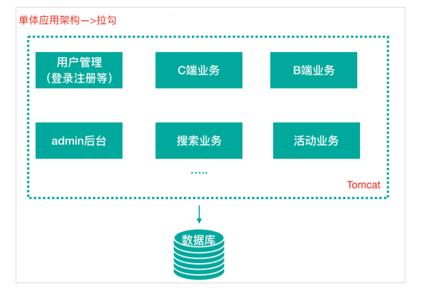
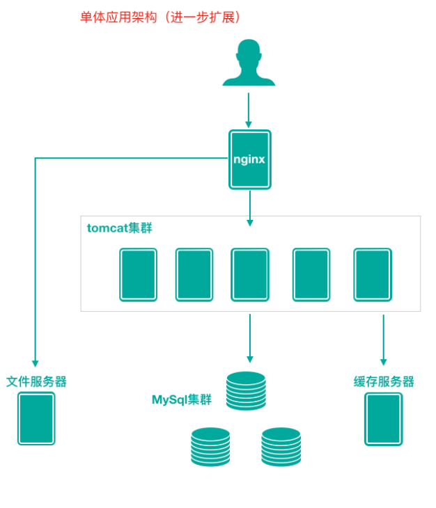
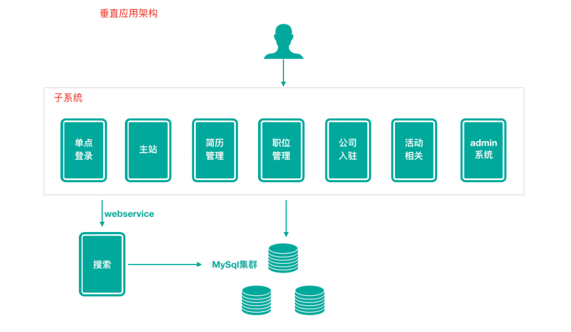
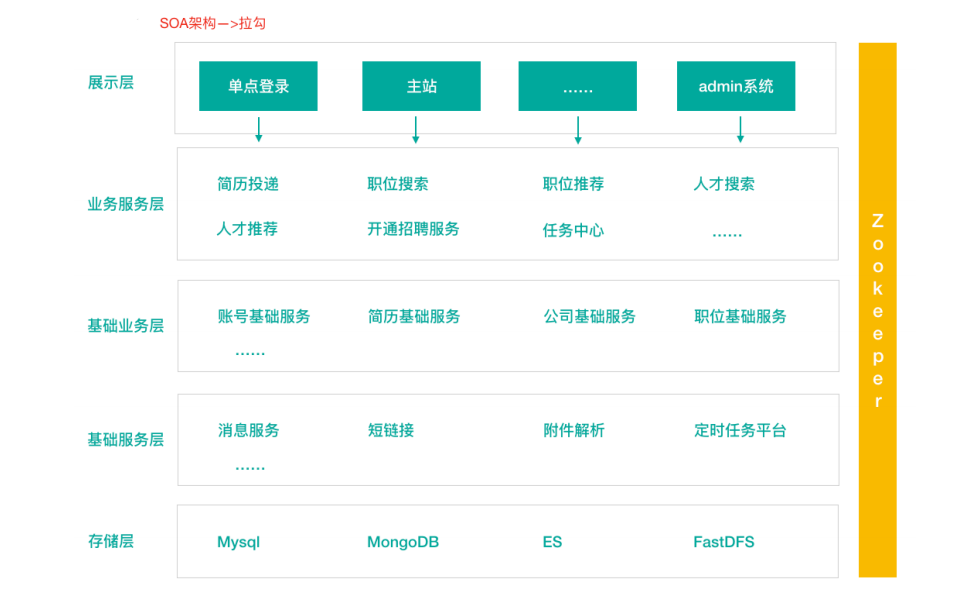
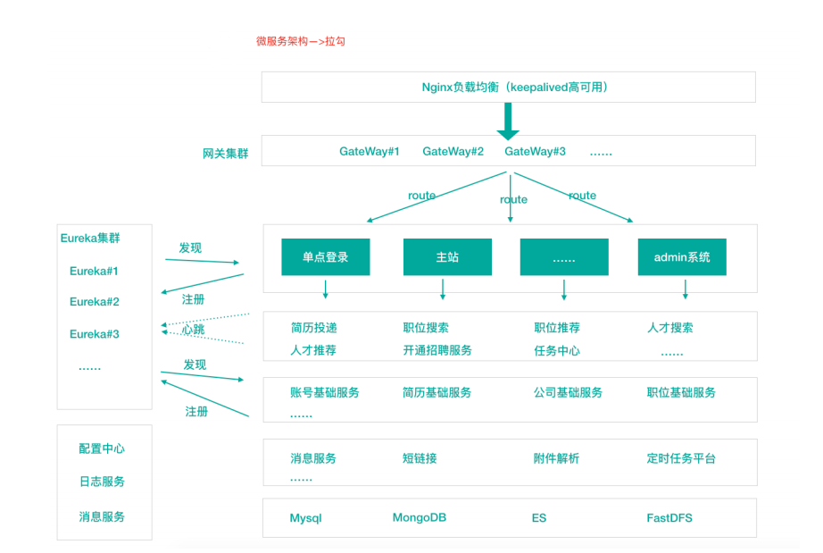

随着互联⽹的发展，⽤户群体逐渐扩⼤，⽹站的流量成倍增⻓，常规的单体架构已无法满⾜请求压⼒和业务的快速迭代，架构的变化势在必⾏。下⾯我们就以**拉勾⽹**的架构演进为例，从最开始的单体架构分析，⼀步步的到现在的微服务架构。 

## 1.单体应用架构

在诞⽣之初，拉勾的⽤户量、数据量规模都⽐较⼩，项⽬所有的功能模块都放在⼀个⼯程中编码、编译、打包并且部署在⼀个Tomcat容器中的架构模式就是单体应⽤架构，这样的架构既简单实 ⽤、便于维护，成本⼜低，成为了那个时代的主流架构⽅式。

**优点：** 

1. 项⽬前期开发节奏快，团队成员少的时候能够快速迭代 。
2. 架构简单：MVC架构，只需要借助IDE开发、调试即可 。
3. 易于测试：只需要通过单元测试或者浏览器完成 。
4. 易于部署：打包成单⼀可执⾏的jar或者打成war包放到容器内启动 。

**缺点：** 

1. 随着不断的功能迭代，单个项⽬过⼤，代码杂乱，耦合严重，开发团队逐渐壮⼤以后，沟通 成本变⾼， 如：代码从编译到启动耗时达到 3-5 分钟。
2. 新增业务困难：在已经乱如麻的系统中增加新业务，维护旧功能，⼀脚踩进去全是不可预测的问题。新⼈来了以后很难接⼿任务，学习成本⾼。
3. 核⼼业务与边缘业务混合在⼀块，出现问题互相影响，如：⼀个临时活动流量猛涨，机器负载升⾼就会影响正常的业务服务。

业务量上涨之后，单体应⽤架构进⼀步丰富变化，⽐如应⽤集群部署、使⽤Nginx进⾏负载均衡、增加缓存服务器、增加⽂件服务器、数据库集群并做读写分离等，通过以上措施增强应对⾼并发的能⼒、应对⼀定的复杂业务场景，但依然属于单体应⽤架构。

------

## 2.垂直应⽤架构 

为了避免上⾯提到的那些问题，开始做模块的垂直划分，做垂直划分的原则是基于拉勾现有的业 务特性来做，核⼼⽬标第⼀个是为了业务之间互不影响，第⼆个是在研发团队的壮⼤后为了提⾼ 效率，减少之间的依赖。

**优点** 

1. 系统拆分实现了流量分担，解决了并发问题 。
2. 可以针对不同模块进⾏优化 。
3. ⽅便⽔平扩展，负载均衡，容错率提⾼ 。
4. 系统间相互独⽴，互不影响，新的业务迭代时更加⾼效 。

**缺点** 

1. 服务之间相互调⽤，如果某个服务的端⼝或者ip地址发⽣改变，调⽤的系统得⼿ 动改变 。
2. 搭建集群之后，实现负载均衡⽐较复杂，如：内⽹负载，在迁移机器时会影响调 ⽤⽅的路 由，导致线上故障 。
3. 服务之间调⽤⽅式不统⼀，基于 httpclient 、 webservice ，接⼝协议不统⼀ 。
4. 服务监控不到位：除了依靠端⼝、进程的监控，调⽤的成功率、失败率、总耗时等等这些监 控指标是没有的。

------

## 3.SOA应⽤架构

在做了垂直划分以后，模块随之增多，维护的成本在也变⾼，⼀些通⽤的业务和模块重复的越来越多，为了解决上⾯提到的接⼝协议不统⼀、服务⽆法监控、服务的 负载均衡，引⼊了阿⾥巴巴开源的 Dubbo ，⼀款⾼性能、轻量级的开源Java RPC框架，它提供了三⼤核⼼能⼒：⾯向接⼝的远程⽅法调⽤，智能容错和负载均衡，以及服务⾃动注册和发现。

SOA (Service-Oriented Architecture)，即⾯向服务的架构。根据实际业务，把系统拆分成合适的、独⽴部署的模块，模块之间相互独⽴（通过Webservice/Dubbo等技术进⾏通信）。 

优点：分布式、松耦合、扩展灵活、可重⽤。 

缺点：服务抽取粒度较⼤、服务调⽤⽅和提供⽅耦合度较⾼（接⼝耦合度）。

------

## 4.微服务应用架构

微服务架构可以说是SOA架构的⼀种拓展，这种架构模式下它**拆分粒度更⼩**、服务更独⽴。把应⽤拆分成为⼀个个微⼩的服务，不同的服务可以使⽤不同的开发语⾔和存储，服务之间往往通过Restful等轻量级通信。微服务架构关键在于**微⼩、独⽴、轻量级通信**。 

微服务是在 SOA 上做的升华粒度更加细致，微服务架构强调的⼀个重点是“业务需要彻底的组件化 和服务化”

### 微服务架构和SOA架构相似⼜不同 

微服务架构和SOA架构很明显的⼀个区别就是**服务拆分粒度的不同**，但是对于拉勾的架构发展来说，我们所看到的SOA阶段其实服务拆分粒度相对来说已经⽐较细了（超前哦！），所以上述拉勾SOA到拉勾微服务，从服务拆分上来说变化并不⼤，只是引⼊了相对完整的新⼀代Spring Cloud微服务技术。⾃然，上述我们 看到的都是拉勾架构演变的阶段结果，每⼀个阶段其实都经历了很多变化，拉勾的服务拆分其实也是⾛过了从粗到细，并⾮绝对的⼀步到位。 

举个拉勾案例来说明SOA和微服务拆分粒度不同 

我们在SOA架构的初期，“简历投递模块”和“⼈才搜索模块”都有简历内容展示的需求，只不过说可能略有区别，⼀开始在两个模块中各维护了⼀套简历查询和展示的代码；后期我们将服务更细粒度拆分，拆分出简历基础服务，那么不同模块调⽤这个基础服务即可。 