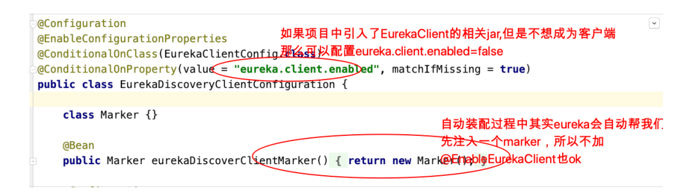

<Valine />

说明：上⾯提到⽹关组件Zuul性能⼀般，未来将退出Spring Cloud ⽣态圈，所以我们直接讲解GateWay，在课程章节规划时，我们就把GateWay划分到第⼀代Spring Cloud 核⼼组件这⼀部分了。 

各组件整体结构如下：


从形式上来说，Feign⼀个顶三，Feign = RestTemplate + Ribbon + Hystrix

------

# **第 1 节** Eureka 服务注册中心

## **1.1** **关于服务注册中心** 

**注意：服务注册中心本质上是为了解耦服务提供者和服务消费者。** 

对于任何⼀个微服务，原则上都应存在或者⽀持多个提供者（⽐如简历微服务部署多个实例），这是由微服务的**分布式属性**决定的。 

更进⼀步，为了⽀持弹性扩缩容特性，⼀个微服务的提供者的数量和分布往往是动态变化的，也是⽆法预先确定的。因此，原本在单体应⽤阶段常⽤的静态LB机制就 

不再适⽤了，需要引⼊额外的组件来管理微服务提供者的注册与发现，⽽这个组件就是服务注册中心。 

### **1.1.1** **服务注册中心⼀般原理**


分布式微服务架构中，服务注册中⼼⽤于存储服务提供者地址信息、服务发布相关的属性信息，消费者通过主动查询和被动通知的⽅式获取服务提供者的地址信息，而不再需要通过硬编码⽅式得到提供者的地址信息。消费者只需要知道当前系统发布了那些服务，而不需要知道服务具体存在于什么位置，这就是透明化路由。 

1）服务提供者启动 

2）服务提供者将相关服务信息主动注册到注册中⼼ 

3）服务消费者获取服务注册信息： 

pull模式：服务消费者可以主动拉取可⽤的服务提供者清单

push模式：服务消费者订阅服务（当服务提供者有变化时，注册中⼼也会主动推送更新后的服务清单给消费者 

4）服务消费者直接调⽤服务提供者 

另外，注册中⼼也需要完成服务提供者的健康监控，当发现服务提供者失效时需要及时剔除。

------

### **1.1.2** **主流服务中心对比** 

- **Zookeeper** 

​     Zookeeper它是⼀个分布式服务框架，是Apache Hadoop 的⼀个⼦项⽬，它主要是⽤来解决分布式应 ⽤中经常遇到的⼀些数据管理问题，如：统⼀命名服务、状态同步服务、集群管理、分布式应⽤配置项的管理等。 简单来说zookeeper本质=存储+监听通知。 

znode 

​     Zookeeper ⽤来做服务注册中⼼，主要是因为它具有节点变更通知功能，只要客户端监听相关服务节点，服务节点的所有变更，都能及时的通知到监听客户端，这样作为调⽤⽅只要使⽤ Zookeeper 的客户端就能实现服务节点的订阅和变更通知功能了，⾮常⽅便。另外，Zookeeper 可⽤性也可以，因为只要半数以上的选举节点存活，整个集群就是可⽤的。

- **Eureka** 

​     由Netflix开源，并被Pivatal集成到SpringCloud体系中，它是基于 RestfulAPI 风格开发的服务注册与发现组件。 

- **Consul** 

​     Consul是由HashiCorp基于Go语⾔开发的⽀持多数据中⼼分布式⾼可⽤的服务发布和注册服务软件， 采⽤Raft算法保证服务的⼀致性，且⽀持健康检查。 

- **Nacos** 

​     Nacos是⼀个更易于构建云原⽣应⽤的动态服务发现、配置管理和服务管理平台。简单来说 Nacos 就是 注册中⼼ + 配置中⼼的组合，帮助我们解决微服务开发必会涉及到的服务注册 与发现，服务配置，服务管理等问题。Nacos 是 Spring Cloud Alibaba 核⼼组件之⼀，负责服务注册与发现，还有配置。

|   组件    | 语言 |             CAP              | 对外暴漏接口 |
| :-------: | :--: | :--------------------------: | :----------: |
|  Eureka   | Java | AP（⾃我保护机制，保证可⽤） |     HTTP     |
|  Consul   |  Go  |              CP              |   HTTP/DNS   |
| Zookeeper | Java |              CP              |    客户端    |
|   Nacos   | Java |        ⽀持AP/CP切换         |     HTTP     |

> P：分区容错性（⼀定的要满⾜的） 
>
> C：数据⼀致性 
>
> A：⾼可⽤ 
>
> CAP不可能同时满⾜三个，要么是AP，要么是CP


## 1.2 **服务注册中心组件** **Eureka** 

服务注册中⼼的⼀般原理、对⽐了主流的服务注册中心方案 

⽬光聚焦Eureka 

- Eureka 基础架构


- Eureka 交互流程及原理 

> 下图是官⽹描述的⼀个架构图


Eureka 包含两个组件：Eureka Server 和 Eureka Client，Eureka Client是⼀个 Java客户端，⽤于简化与Eureka Server的交互；Eureka Server提供服务发现的能力，各个微服务启动时，会通过Eureka Client向Eureka Server 进⾏注册自己的信息（例如⽹络信息），Eureka Server会存储该服务的信息； 

1）图中us-east-1c、us-east-1d，us-east-1e代表不同的区也就是不同的机房

2）图中每⼀个Eureka Server都是⼀个集群。 

3）图中Application Service作为服务提供者向Eureka Server中注册服务， Eureka Server接受到注册事件会在集群和分区中进⾏数据同步，Application Client作为消费端（服务消费者）可以从Eureka Server中获取到服务注册信息，进⾏服务调⽤。 

4）微服务启动后，会周期性地向Eureka Server发送⼼跳（默认周期为30秒） 以续约⾃⼰的信息 

5）Eureka Server在⼀定时间内没有接收到某个微服务节点的⼼跳，Eureka Server将会注销该微服务节点（默认90秒） 

6）每个Eureka Server同时也是Eureka Client，多个Eureka Server之间通过复制的⽅式完成服务注册列表的同步 

7）Eureka Client会缓存Eureka Server中的信息。即使所有的Eureka Server节点都宕掉，服务消费者依然可以使⽤缓存中的信息找到服务提供者

**Eureka**通过⼼跳检测、健康检查和客户端缓存等机制，提⾼系统的灵活性、可伸缩性和可⽤性。

------

## 1.3 Eureka应⽤及高可用集群

1）单实例Eureka Server—>访问管理界⾯—>Eureka Server集群 

2）服务提供者（简历微服务注册到集群） 

3）服务消费者（⾃动投递微服务注册到集群/从Eureka Server集群获取服务信息） 

4）完成调⽤ 

------

### 1.3.1 搭建单例 Eureka Server服务注册中⼼

lagou-service-resume 8080----- 

lagou-service-autodeliver 8090---- 

lagou-cloud-eureka-server 8761---- 

基于Maven构建SpringBoot⼯程，在SpringBoot⼯程之上搭建EurekaServer服务 （lagou-cloud-eureka-server-8761) 

- lagou-parent中引⼊Spring Cloud 依赖 

Spring Cloud 是⼀个综合的项⽬，下⾯有很多⼦项⽬，⽐如eureka⼦项⽬（版本号 1.x.x）

```xml
<dependencyManagement>
 <dependencies>
 <dependency>
 <groupId>org.springframework.cloud</groupId>
 <artifactId>spring-cloud-dependencies</artifactId>
 <version>Greenwich.RELEASE</version>
 <type>pom</type>
 <scope>import</scope>
 </dependency>
 </dependencies>
</dependencyManagement>
```

- 当前⼯程pom.xml中引⼊依赖

```xml
<dependencies>
 <!--Eureka server依赖-->
 <dependency>
 <groupId>org.springframework.cloud</groupId>
 <artifactId>spring-cloud-starter-netflix-eurekaserver</artifactId>
 </dependency>
</dependencies>
```

注意：在⽗⼯程的pom⽂件中⼿动引⼊jaxb的jar，因为Jdk9之后默认没有加载该模块，EurekaServer 使⽤到，所以需要⼿动导⼊，否则 EurekaServer 服务⽆法启动。

- ⽗⼯程pom.xml

```xml
<!--引⼊Jaxb，开始-->
<dependency>
 <groupId>com.sun.xml.bind</groupId>
 <artifactId>jaxb-core</artifactId>
 <version>2.2.11</version>
</dependency>
<dependency>
 <groupId>javax.xml.bind</groupId>
 <artifactId>jaxb-api</artifactId>
</dependency>
<dependency>
 <groupId>com.sun.xml.bind</groupId>
 <artifactId>jaxb-impl</artifactId>
 <version>2.2.11</version>
 </dependency>
<dependency>
 <groupId>org.glassfish.jaxb</groupId>
 <artifactId>jaxb-runtime</artifactId>
 <version>2.2.10-b140310.1920</version>
</dependency>
<dependency>
 <groupId>javax.activation</groupId>
 <artifactId>activation</artifactId>
 <version>1.1.1</version>
</dependency>
<!--引⼊Jaxb，结束-->
```

- application.yml

```yml
#Eureka server服务端⼝
server:
 port: 8761
spring:
 application:
 name: lagou-cloud-eureka-server # 应⽤名称，会在Eureka中作为服务的id标识（serviceId）
eureka:
 instance:
 hostname: localhost
 client:
 service-url: # 客户端与EurekaServer交互的地址，如果是集群，也需要写其它Server的地址
 defaultZone: http://${eureka.instance.hostname}:${server.port}/eureka/
 register-with-eureka: false # ⾃⼰就是服务不需要注册⾃⼰
 fetch-registry: false #⾃⼰就是服务不需要从Eureka Server获取服务信息,默认为true，置为false
```

- SpringBoot启动类，使⽤@EnableEurekaServer声明当前项⽬为EurekaServer 服务

```java
package com.lagou.edu;
import org.springframework.boot.SpringApplication;
import org.springframework.boot.autoconfigure.SpringBootApplication;
import org.springframework.cloud.netflix.eureka.server.EnableEurekaServer;

@SpringBootApplication
// 声明本项⽬是⼀个Eureka服务
@EnableEurekaServer
public class LagouCloudEurekaServerApplication {
 public static void main(String[] args) {
 	SpringApplication.run(LagouCloudEurekaServerApplication.class,args);
 	}
}
```

- 执⾏启动类LagouCloudEurekaServerApplication的main函数 

- 访问http://127.0.0.1:8761，如果看到如下⻚⾯（Eureka注册中⼼后台），则表明EurekaServer发布成功


------

### 1.3.2 搭建Eureka Server HA ⾼可⽤集群

在互联⽹应⽤中，服务实例很少有单个的。 

即使微服务消费者会缓存服务列表，但是如果EurekaServer只有⼀个实例，该实例挂掉，正好微服务消费者本地缓存列表中的服务实例也不可⽤，那么这个时候整个系统都受影响。 

在⽣产环境中，我们会配置Eureka Server集群实现⾼可⽤。Eureka Server集群之中的节点通过点对点（P2P）通信的⽅式共享服务注册表。我们开启两台 Eureka Server 以搭建集群。


（1）修改本机host属性 

由于是在个⼈计算机中进⾏测试很难模拟多主机的情况，Eureka配置server集群时需要执⾏host地址。 所以需要修改个⼈电脑中host地址

```java
127.0.0.1 LagouCloudEurekaServerA
127.0.0.1 LagouCloudEurekaServerB
```

（2）修改 lagou-cloud-eureka-server ⼯程中的yml配置⽂件

```yaml
#指定应⽤名称
spring:
 application:
 name: lagou-cloud-eureka-server
---
#第⼀个profile,后期启动spring-boot项⽬时，可通过命令参数指定
spring:
 profiles: LagouCloudEurekaServerA
server:
 port: 8761
eureka:
 instance:
 hostname: LagouCloudEurekaServerA
 client:
 register-with-eureka: true
 fetch-registry: true
 serviceUrl:
 defaultZone: http://LagouCloudEurekaServerB:8762/eureka
---------------
#第⼆个profile,后期启动spring-boot项⽬时，可通过命令参数指定
spring:
 profiles: LagouCloudEurekaServerB
server:
 port: 8762
eureka:
 instance:
 hostname: LagouCloudEurekaServerB
 client:
 register-with-eureka: true
 fetch-registry: true
 serviceUrl:
 defaultZone: http://LagouCloudEurekaServerA:8761/eureka
```

**说明** 

- 在 ⼀个实例中，把另外的实例作为了集群中的镜像节点，那么这个http://LagouCloudEurekaServerB:8762/eureka URL 中的 LagouCloudEurekaServerB 就要和其它个profile 中的 eureka.instance.hostname 保持⼀致。 

- register-with-eureka 和 fetch-registry 在单节点时设置为了 false, 因为只有⼀台 Eureka Server，并不需要⾃⼰注册⾃⼰，⽽现在有了集群，可以在集群的其他节点中注册本服务 

（3）启动两次该SpringBoot项⽬，分别使⽤两个不同的profiles


（4）访问两个EurekaServer的管理台⻚⾯http://lagoucloudeurekaservera:8761/ 和http://lagoucloudeurekaserverb:8762/会发现注册中⼼ LAGOU-CLOUD-EUREKA-SERVER 已经有两个节点，并且 registered-replicas (相邻集群复制节点)中已经包含对⽅


除了上述在同⼀个⼯程基础上启动两次外，我们也可以配置两个⼯程，如同⽼师课堂上的⼀样


### 1.3.3 微服务提供者—>注册到Eureka Server 集群 

**注册简历微服务**（简历服务部署两个实例，分别占⽤8080、8081端⼝）

- ⽗⼯程中引⼊spring-cloud-commons依赖

```xml
<dependency>
 <groupId>org.springframework.cloud</groupId>
 <artifactId>spring-cloud-commons</artifactId>
</dependency>
```

- pom⽂件引⼊坐标，添加eureka client的相关坐标

```xml
<dependency>
 <groupId>org.springframework.cloud</groupId>
 <artifactId>spring-cloud-starter-netflix-eurekaclient</artifactId>
</dependency>
```

- 配置application.yml⽂件 

在application.yml 中添加Eureka Server⾼可⽤集群的地址及相关配置

```yaml
eureka:
 client:
 serviceUrl: # eureka server的路径
 defaultZone: http://lagoucloudeurekaservera:8761/eureka/,http://lagoucloudeurekaserverb:8762/eureka/ #把 eureka 集群中的所有 url 都填写了进来，也可以只写⼀台，因为各个 eureka server 可以同步注册表
 instance: #使⽤ip注册，否则会使⽤主机名注册了（此处考虑到对⽼版本的兼容，新版本经过实验都是ip）
 prefer-ip-address: true
 #⾃定义实例显示格式，加上版本号，便于多版本管理，注意是ip-address，早期版本是ipAddress
 instance-id: ${spring.cloud.client.ipaddress}:${spring.application.name}:${server.port}:@project.version@
```

**经验：⾃定义实例显示格式，加上版本号，便于多版本管理**

- 启动类添加注解


**注意：** 

1）从Spring Cloud Edgware版本开始，@EnableDiscoveryClient 或 @EnableEurekaClient 可省略。只需加上相关依赖，并进⾏相应配置，即可将微服务注册到服务发现组件上。 

2）@EnableDiscoveryClient和@EnableEurekaClient⼆者的功能是⼀样的。但是如果选⽤的是eureka服务器，那么就推荐@EnableEurekaClient，如果是其他的注册中⼼，那么推荐使⽤@EnableDiscoveryClient，考虑到通⽤性，后期我们可以使⽤@EnableDiscoveryClient 

- 启动类执⾏，在Eureka Server后台界⾯可以看到注册的服务实例


说明：其他微服务注册可参照执行


### 1.3.4 微服务消费者—>注册到Eureka Server 集群 

此处⾃动注册微服务是消费者 

- pom⽂件引⼊坐标，添加eureka client的相关坐标

```xml
<dependency>
 <groupId>org.springframework.cloud</groupId>
 <artifactId>spring-cloud-commons</artifactId>
</dependency>
<dependency>
 <groupId>org.springframework.cloud</groupId>
 <artifactId>spring-cloud-starter-netflix-eurekaclient</artifactId>
</dependency>
```

- 配置application.yml⽂件

```yaml
server:
 port: 8090
eureka:
 client:
 serviceUrl: # eureka server的路径
 defaultZone: http://lagoucloudeurekaservera:8761/eureka/,http://lagoucloudeurekaserverb:8762/eureka/ #把 eureka 集群中的所有 url 都填写了进来，也可以只写⼀台，因为各个 eureka server 可以同步注册表
 instance:
 #使⽤ip注册，否则会使⽤主机名注册了（此处考虑到对⽼版本的兼容，新版本经过实验都是ip）
 prefer-ip-address: true
 #⾃定义实例显示格式，加上版本号，便于多版本管理，注意是ip-address，早期版本是ipAddress
 instance-id: ${spring.cloud.client.ipaddress}:${spring.application.name}:${server.port}:@project.version@
 
spring:
 application:
 name: lagou-service-autodeliver 
```

- 在启动类添加注解@EnableDiscoveryClient，开启服务发现

```java
package com.lagou.edu;
import org.springframework.boot.SpringApplication;
import org.springframework.boot.autoconfigure.SpringBootApplication;
import org.springframework.boot.autoconfigure.domain.EntityScan;
import org.springframework.cloud.client.discovery.EnableDiscoveryClient;
import org.springframework.context.annotation.Bean;
import org.springframework.web.client.RestTemplate;

@SpringBootApplication
@EnableDiscoveryClient // 开启服务发现
public class AutodeliverApplication {
 public static void main(String[] args) {
 	SpringApplication.run(AutodeliverApplication.class,args);
 }
    
 /**
 * 注⼊RestTemplate
 * @return
 */
 @Bean
 public RestTemplate getRestTemplate() {
 	return new RestTemplate();
	 }
}
```

### **1.3.5** 服务消费者调用服务提供者（通过Eureka）


------

## 1.4 Eureka 细节详解

### 1.4.1 Eureka 元数据详解

Eureka的元数据有两种：标准元数据和⾃定义元数据。 

**标准元数据：**主机名、IP地址、端⼝号等信息，这些信息都会被发布在服务注册表中，⽤于服务之间的调⽤。 

**⾃定义元数据：**可以使⽤eureka.instance.metadata-map配置，符合KEY/VALUE的存储格式。这 些元数据可以在远程客户端中访问。 

类似于

```yaml
instance:
 prefer-ip-address: true
 metadata-map:
 # ⾃定义元数据(kv⾃定义)
 cluster: cl1
 region: rn1
```

我们可以在程序中可以使⽤DiscoveryClient 获取指定微服务的所有元数据信息

```java
import com.lagou.edu.AutodeliverApplication;
import org.junit.Test;
import org.junit.runner.RunWith;
import org.springframework.beans.factory.annotation.Autowired;
import org.springframework.boot.autoconfigure.SpringBootApplication;
import org.springframework.boot.test.context.SpringBootTest;
import org.springframework.cloud.client.ServiceInstance;
import org.springframework.cloud.client.discovery.DiscoveryClient;
import org.springframework.test.context.junit4.SpringJUnit4ClassRunner;
import java.util.List;
import java.util.Map;

@SpringBootTest(classes = {AutodeliverApplication.class})
@RunWith(SpringJUnit4ClassRunner.class)
public class AutodeliverApplicationTest {
 @Autowired
 private DiscoveryClient discoveryClient;
    
 @Test
 public void test() {
 // 从EurekaServer获取指定微服务实例
 List<ServiceInstance> serviceInstanceList = discoveryClient.getInstances("lagou-service-resume");
 // 循环打印每个微服务实例的元数据信息
 for (int i = 0; i < serviceInstanceList.size(); i++) {
 	ServiceInstance serviceInstance = serviceInstanceList.get(i);
 	System.out.println(serviceInstance);
 		}
 	}
}
```

元数据查看如下:


### 1.4.2 Eureka 客户端详解 

服务提供者（也是Eureka客户端）要向EurekaServer注册服务，并完成服务续约等⼯作 

**服务注册详解（服务提供者）** 

1）当我们导⼊了eureka-client依赖坐标，配置Eureka服务注册中⼼地址 

2）服务在启动时会向注册中⼼发起注册请求，携带服务元数据信息 

3）Eureka注册中⼼会把服务的信息保存在Map中。

**服务续约详解（服务提供者）** 

服务每隔30秒会向注册中⼼续约(⼼跳)⼀次（也称为报活），如果没有续约，租约在90秒后到期，然后服务会被失效。每隔30秒的续约操作我们称之为⼼跳检测 

往往不需要我们调整这两个配置:

```yaml
#向Eureka服务中⼼集群注册服务
eureka:
 instance:
   # 租约续约间隔时间，默认30秒
   lease-renewal-interval-in-seconds: 30
 	# 租约到期，服务时效时间，默认值90秒,服务超过90秒没有发⽣⼼跳，EurekaServer会将服务从列表移除
   lease-expiration-duration-in-seconds: 90
```

**获取服务列表详解（服务消费者）** 

每隔30秒服务会从注册中⼼中拉取⼀份服务列表，这个时间可以通过配置修改。往 

往不需要我们调整

```yaml
#向Eureka服务中⼼集群注册服务
eureka:
 client:
  # 每隔多久拉取⼀次服务列表
  registry-fetch-interval-seconds: 30
```

1）服务消费者启动时，从 EurekaServer服务列表获取只读备份，缓存到本地 

2）每隔30秒，会重新获取并更新数据 

3）每隔30秒的时间可以通过配置eureka.client.registry-fetch-interval-seconds修 

改 

### 1.4.3 Eureka 服务端详解 

**服务下线** 

1）当服务正常关闭操作时，会发送服务下线的REST请求给EurekaServer。 

2）服务中⼼接受到请求后，将该服务置为下线状态 

**失效剔除**

Eureka Server会定时（间隔值是eureka.server.eviction-interval-timer-in-ms，默认60s）进⾏检查，如果发现实例在在⼀定时间（此值由客户端设置的eureka.instance.lease-expiration-duration-in-seconds定义，默认值为90s）内没有收到⼼跳，则会注销此实例。 

**自我保护** 

服务提供者 —> 注册中⼼ 

定期的续约（服务提供者和注册中⼼通信），假如服务提供者和注册中⼼之间的网络有点问题，不代表服务提供者不可用，不代表服务消费者⽆法访问服务提供者如果在15分钟内超过85%的客户端节点都没有正常的⼼跳，那么Eureka就认为客户端与注册中⼼出现了⽹络故障，Eureka Server⾃动进⼊⾃我保护机制。 

- 为什么会有自我保护机制？ 

默认情况下，如果Eureka Server在⼀定时间内（默认90秒）没有接收到某个微服务实例的⼼跳，Eureka Server将会移除该实例。但是当⽹络分区故障发⽣时，微服务与Eureka Server之间⽆法正常通信，⽽微服务本身是正常运⾏的，此时不应该移除这个微服务，所以引⼊了⾃我保护机制。 

服务中心页面会显示如下提示信息


当处于⾃我保护模式时 

1）不会剔除任何服务实例（可能是服务提供者和EurekaServer之间⽹络问题），保证了⼤多数服务依然可⽤ 

2）Eureka Server仍然能够接受新服务的注册和查询请求，但是不会被同步到其它节点上，保证当前节点依然可⽤，当⽹络稳定时，当前Eureka Server新的注册信息会被同步到其它节点中。 

3）在Eureka Server⼯程中通过eureka.server.enable-self-preservation配置可用关停⾃我保护，默认值是打开

```yaml
eureka:
 server:
  enable-self-preservation: false # 关闭⾃我保护模式（缺省为打开）
```

## 1.5 Eureka 核心源码剖析

### 1.5.1 Eureka Server 启动过程

⼊⼝：SpringCloud充分利⽤了SpringBoot的⾃动装配的特点观察eureka-server的jar包，发现在META-INF下⾯有配置⽂件spring.factories


springboot应⽤启动时会加载EurekaServerAutoConfiguration⾃动配置类 

- EurekaServerAutoConfiguration类 

⾸先观察类头分析


**图中的1** ）需要有⼀个marker bean，才能装配Eureka Server，那么这个marker 其实是 @EnableEurekaServer注解决定的


也就是说只有添加了@EnableEurekaServer注解，才会有后续的动作，这是成为⼀ 

个EurekaServer的前提 

**图中的2**）关注EurekaServerAutoConfiguration


⽽在 com.netflix.eureka.cluster.PeerEurekaNodes#start⽅法中


回到主配置类中


回到主配置类中


**图中3）**关注EurekaServerInitializerConfiguration


重点关注，进⼊

org.springframework.cloud.netflix.eureka.server.EurekaServerBootstrap#conte xtInitialized


重点关注initEurekaServerContext()


研究⼀下上图中的syncUp⽅法


继续研究com.netflix.eureka.registry.AbstractInstanceRegistry#register（提供实例注册功能）


继续研究

com.netflix.eureka.registry.PeerAwareInstanceRegistryImpl#openForTraffic


进⼊postInit()⽅法查看


### 1.5.2 Eureka Server 服务接⼝暴露策略

在Eureka Server启动过程中主配置类注册了Jersey框架（是⼀个发布restful⻛格接⼝的框架，类似于我们的springmvc）


注⼊的Jersey细节


扫描classpath下的那些packages呢？已经定义好了


这些就是使⽤Jersey发布的供Eureka Client调⽤的Restful⻛格服务接⼝（完成服务注册、⼼跳续约等接⼝）

### 1.5.3 Eureka Server 服务注册接⼝（接受客户端注册服务）

ApplicationResource类的addInstance()⽅法中代码：registry.register(info, "true".equals(isReplication));


com.netflix.eureka.registry.PeerAwareInstanceRegistryImpl#register - 注册服务信息并同步到其它Eureka节点


AbstractInstanceRegistry#register()：注册，实例信息存储到注册表是⼀个 ConcurrentHashMap

```java
    /**
     * Registers a new instance with a given duration.
     *
     * @see com.netflix.eureka.lease.LeaseManager#register(java.lang.Object,
     * int, boolean)
     */

    public void register(InstanceInfo registrant, int leaseDuration, boolean isReplication) {
        try {
            read.lock(); //读锁
            // registry是保存所有应⽤实例信息的Map：ConcurrentHashMap<String, Map<String, Lease<InstanceInfo>>>
            // 从registry中获取当前appName的所有实例信息
            Map<String, Lease<InstanceInfo>> gMap = registry.get(registrant.getAppName());
            REGISTER.increment(isReplication); //注册统计+1

            // 如果当前appName实例信息为空，新建Map
            if (gMap == null) {
                final ConcurrentHashMap<String, Lease<InstanceInfo>> gNewMap = new ConcurrentHashMap<String, Lease<InstanceInfo>>();
                gMap = registry.putIfAbsent(registrant.getAppName(), gNewMap);
                if (gMap == null) {
                    gMap = gNewMap;
                }
            }

            // 获取实例的Lease租约信息
            Lease<InstanceInfo> existingLease = gMap.get(registrant.getId());
            // Retain the last dirty timestamp without overwriting it,if there is already a lease
            // 如果已经有租约，则保留最后⼀个脏时间戳⽽不覆盖它
            // （⽐较当前请求实例租约 和 已有租约 的LastDirtyTimestamp，选择靠后的）
            if (existingLease != null && (existingLease.getHolder() != null)) {
                Long existingLastDirtyTimestamp = existingLease.getHolder().getLastDirtyTimestamp();
                Long registrationLastDirtyTimestamp = registrant.getLastDirtyTimestamp();
                logger.debug("Existing lease found (existing={},provided={}", existingLastDirtyTimestamp, registrationLastDirtyTimestamp);
                if (existingLastDirtyTimestamp > registrationLastDirtyTimestamp) {
                    logger.warn("There is an existing lease and the existing lease's dirty timestamp {} is greater" + " than the one that is being registered { } ", existingLastDirtyTimestamp, registrationLastDirtyTimestamp);
                    logger.warn("Using the existing instanceInfoinstead of the new instanceInfo as the registrant");
                    registrant = existingLease.getHolder();
                }
            } else {
                // The lease does not exist and hence it is a new registration
                // 如果之前不存在实例的租约，说明是新实例注册
                // expectedNumberOfRenewsPerMin期待的每分钟续约数+2（因为 30s⼀个）
                // 并更新numberOfRenewsPerMinThreshold每分钟续约阀值（85%）
                synchronized (lock) {
                    if (this.expectedNumberOfRenewsPerMin > 0) {
                        // Since the client wants to cancel it, reduce the threshold
                        // (1 for 30 seconds, 2 for a minute)
                        this.expectedNumberOfRenewsPerMin = this.expectedNumberOfRenewsPerMin + 2;
                        this.numberOfRenewsPerMinThreshold = (int) (this.expectedNumberOfRenewsPerMin * serverConfig.getRenewalPercentThreshold());
                    }
                }
                logger.debug("No previous lease information found; it is new registration ");
            }

            Lease<InstanceInfo> lease = new Lease<InstanceInfo>(registrant, leaseDuration);
            if (existingLease != null) {
                lease.setServiceUpTimestamp(existingLease.getServiceUpTimestamp());
            }
            gMap.put(registrant.getId(), lease); //当前实例信息放到维护注册信息的Map

            // 同步维护最近注册队列
            synchronized (recentRegisteredQueue) {
                recentRegisteredQueue.add(new Pair<Long, String>(System.currentTimeMillis(), registrant.getAppName() + "(" + registrant.getId() + ")"));
            }
            // This is where the initial state transfer of overridden status happens
            // 如果当前实例已经维护了OverriddenStatus，将其也放到此Eureka Server的overriddenInstanceStatusMap中
            if (!InstanceStatus.UNKNOWN.equals(registrant.getOverriddenStatus())) {
                logger.debug("Found overridden status {} for instance {}.Checking to see if needs to be add to the " + "overrides",
                 registrant.getOverriddenStatus(), registrant.getId());
                if (!overriddenInstanceStatusMap.containsKey(registrant.getId())) {
                    logger.info("Not found overridden id {} and hence adding it", registrant.getId());
                    overriddenInstanceStatusMap.put(registrant.getId(), registrant.getOverriddenStatus());
                }
            }
            InstanceStatus overriddenStatusFromMap = overriddenInstanceStatusMap.get(registrant.getId());
            if (overriddenStatusFromMap != null) {
                logger.info("Storing overridden status {} from map", overriddenStatusFromMap);
                registrant.setOverriddenStatus(overriddenStatusFromMap);
            }
            // Set the status based on the overridden status rules
            // 根据overridden status规则，设置状态
            InstanceStatus overriddenInstanceStatus = getOverriddenInstanceStatus(registrant, existingLease, isReplication);
            registrant.setStatusWithoutDirty(overriddenInstanceStatus);
            // If the lease is registered with UP status, set lease service up timestamp
            // 如果租约以UP状态注册，设置租赁服务时间戳
            if (InstanceStatus.UP.equals(registrant.getStatus())) {
                lease.serviceUp();
            }

            registrant.setActionType(ActionType.ADDED); //ActionType为 ADD
            recentlyChangedQueue.add(new RecentlyChangedItem(lease));
            //维护recentlyChangedQueue
            registrant.setLastUpdatedTimestamp(); //更新最后更新时间

            // 使当前应⽤的ResponseCache失效
            invalidateCache(registrant.getAppName(), registrant.getVIPAddress(), registrant.getSecureVipAddress());
            logger.info("Registered instance {}/{} with status {}(replication={})", registrant.getAppName(), registrant.getId(), registrant.getStatus(), isReplication);
        } finally {
            read.unlock(); //读锁
        }
    }
```

PeerAwareInstanceRegistryImpl#replicateToPeers() ：复制到Eureka对等节点

```java
 private void replicateToPeers(Action action, String appName, String id, InstanceInfo info /*optional*/, InstanceStatus newStatus /*optional*/, boolean isReplication) {
        Stopwatch tracer = action.getTimer().start();
        try {
            // 如果是复制操作（针对当前节点，false）
            if (isReplication) {
                numberOfReplicationsLastMin.increment();
            }
            // 如果它已经是复制，请不要再次复制，直接return
            if (peerEurekaNodes == Collections.EMPTY_LIST || isReplication) {
                return;
            }
            // 遍历集群所有节点（除当前节点外）
            for (final PeerEurekaNode node : peerEurekaNodes.getPeerEurekaNodes()) {
                // If the url represents this host, do not replicate to yourself.
                if (peerEurekaNodes.isThisMyUrl(node.getServiceUrl())) {
                    continue;
                }
                // 复制Instance实例操作到某个node节点
                replicateInstanceActionsToPeers(action, appName, id, info, newStatus, node);
            }
        }
        finally {
            tracer.stop();
        }
    }
```

PeerAwareInstanceRegistryImpl#replicateInstanceActionsToPeers


### 1.5.4 Eureka Server 服务续约接口（接受客户端续约） 

InstanceResource的renewLease⽅法中完成客户端的⼼跳（续约）处理，关键代码：registry.renew(app.getName(), id, isFromReplicaNode);


com.netflix.eureka.registry.PeerAwareInstanceRegistryImpl#renew


replicateInstanceActionsToPeers() 复制Instance实例操作到其它节点

```java
    private void replicateInstanceActionsToPeers(Action action, String appName, String id, InstanceInfo info, InstanceStatus newStatus, PeerEurekaNode node) {
        try {
            InstanceInfo infoFromRegistry = null;
            CurrentRequestVersion.set(Version.V2);
            switch (action) {
                case Cancel: //取消
                    node.cancel(appName, id);
                    break;
                case Heartbeat: //⼼跳
                    InstanceStatus overriddenStatus = overriddenInstanceStatusMap.get(id);
                    infoFromRegistry = getInstanceByAppAndId(appName, id, false);
                    node.heartbeat(appName, id, infoFromRegistry, overriddenStatus, false);
                    break;
                case Register: //注册
                    node.register(info);
                    break;
                case StatusUpdate: //状态更新
                    infoFromRegistry = getInstanceByAppAndId(appName, id, false);
                    node.statusUpdate(appName, id, newStatus, infoFromRegistry);
                    break;
                case DeleteStatusOverride: //删除OverrideStatus
                    infoFromRegistry = getInstanceByAppAndId(appName, id, false);
                    node.deleteStatusOverride(appName, id, infoFromRegistry);
                    break;
            }
        } catch (Throwable t) {
            logger.error("Cannot replicate information to {} for action {}", node.getServiceUrl(), action.name(), t);
        }
    }
```

renew()⽅法中—>leaseToRenew.renew()—>对最后更新时间戳进⾏更新

### 1.5.5 Eureka Client 注册服务

启动过程：Eureka客户端在启动时也会装载很多配置类，我们通过spring-cloud-netflix-eureka-client-2.1.0.RELEASE.jar下的spring.factories⽂件可以看到加载的配置类


引⼊jar就会被⾃动装配，分析EurekaClientAutoConfiguration类头


如果不想作为客户端，可以设置eureka.client.enabled=false



回到主配置类EurekaClientAutoConfiguration 

思考：EurekaClient启动过程要做什么事情？？？？？？ 

1）读取配置⽂件 

2）启动时从EurekaServer获取服务实例信息 

3）注册⾃⼰到EurekaServer（addInstance） 

4）开启⼀些定时任务（⼼跳续约，刷新本地服务缓存列表）


**1.读取配置⽂件**


**2.启动时从Eureka Server 获取服务实例信息**


观察⽗类DiscoveryClient()


在另外⼀个构造器中


**3.注册⾃⼰到EurekaServer**


DiscoveryClient#register


**4.开启⼀些定时任务（⼼跳续约，刷新本地服务缓存列表）**

刷新本地缓存


⼼跳续约定时任务


- 读取配置⽂件


获取配置信息之外就开始获取⼀个Eureka客户端了


来到⽗类，super


- 初始化⼀些定时器（定时获取注册信息、发送⼼跳等）


刷新本地缓存定时任务


⼼跳


- 注册⾃⼰


服务下架，服务死掉的时候就会调⽤shutdown，就是shutdown


客户端注册服务，在 

com.netflix.discovery.DiscoveryClient类的构造函数中调⽤了 this.initScheduledTasks()⽅法，这个⽅法会启动定时任务调⽤EurekaServer的相关 Restful接⼝，那么这个DiscoveryClient构造函数是什么时候调⽤呢？右键—>Find Usages就能知道 

因此，我们看com.netflix.discovery.DiscoveryClient#register

### **1.5.6 Eureka Client 下架服务**


